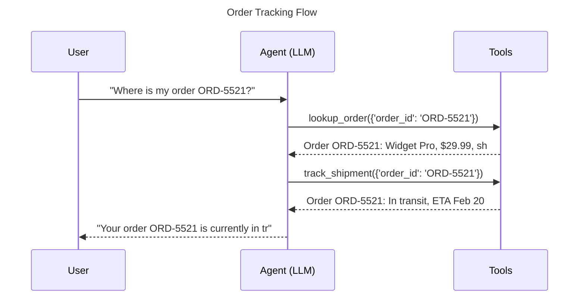
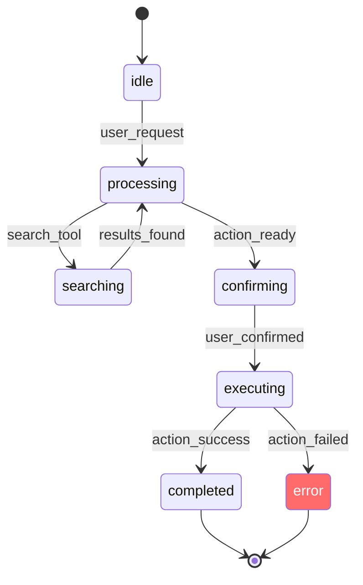

# Visualization of agent decisions

## Introduction

Logs tell us what happened. Visualizations show us the shape of what happened — the branching points, the loops, the handoffs between agents, and the tool chains that led to a result. When an agent makes a wrong decision three steps into a seven-step chain, a visual trace reveals the divergence point instantly, while scanning log lines would take minutes.

Agent visualization operates at two levels: **static structure** (how agents, tools, and handoffs are connected) and **dynamic execution** (the actual path an agent took through a specific run). Both are essential for debugging.

### What we'll cover

- Visualizing agent architecture with OpenAI Agents SDK's `draw_graph()`
- Building execution flow diagrams with Mermaid
- Using Pydantic Logfire for interactive trace visualization
- Displaying decision trees and action sequences
- State transition graphs for stateful agents

### Prerequisites

- Agent fundamentals (Lessons 1-5)
- At least one agent framework: OpenAI Agents SDK or Pydantic AI (Lessons 11-12)
- Basic understanding of graphs and flowcharts
- Familiarity with Mermaid diagram syntax (helpful but not required)

---

## Static agent visualization with draw_graph()

The OpenAI Agents SDK includes a built-in visualization tool that generates a directed graph of an agent's structure — its tools, handoffs to other agents, and MCP servers.

### Installation

The visualization feature requires the optional `viz` dependency:

```bash
pip install "openai-agents[viz]"
```

This installs [Graphviz](https://graphviz.org/) bindings for Python. On Linux, you also need the system package:

```bash
# Ubuntu/Debian
sudo apt-get install graphviz

# macOS
brew install graphviz
```

### Generating an agent graph

```python
from agents import Agent, function_tool
from agents.extensions.visualization import draw_graph

@function_tool
def search_products(query: str) -> str:
    """Search the product catalog."""
    return f"Found 5 products for '{query}'"

@function_tool
def check_inventory(product_id: str) -> str:
    """Check inventory for a product."""
    return f"Product {product_id}: 42 in stock"

@function_tool
def place_order(product_id: str, quantity: int) -> str:
    """Place an order for a product."""
    return f"Order placed: {quantity}x {product_id}"

# Define agents with handoffs
returns_agent = Agent(
    name="Returns Specialist",
    instructions="Handle product returns and refunds.",
)

sales_agent = Agent(
    name="Sales Agent",
    instructions="Help customers find and purchase products.",
    tools=[search_products, check_inventory, place_order],
)

triage_agent = Agent(
    name="Triage Agent",
    instructions="Route customers to the right specialist.",
    handoffs=[sales_agent, returns_agent],
)

# Generate the visualization
draw_graph(triage_agent)
```

This generates a directed graph where:

| Element | Appearance | Meaning |
|---------|-----------|---------|
| Yellow rectangles | Agents | `Triage Agent`, `Sales Agent`, `Returns Specialist` |
| Green ellipses | Tools | `search_products`, `check_inventory`, `place_order` |
| Grey rectangles | MCP Servers | External tool providers |
| Solid arrows | Handoffs | Agent-to-agent routing |
| Dotted arrows | Tool invocations | Agent-to-tool connections |
| `__start__` | Entry point | Where execution begins |
| `__end__` | Exit point | Where execution terminates |

### Saving the graph

```python
# Display inline (Jupyter/IPython)
draw_graph(triage_agent)

# Open in a separate window
draw_graph(triage_agent).view()

# Save to file
draw_graph(triage_agent, filename="agent_architecture")
# Creates agent_architecture.png in the working directory
```

> **🔑 Key Concept:** Static visualization shows you the possible paths, not the path actually taken. Use it to verify that your agent topology is correct — that the right agents have the right tools and handoffs.

### Debugging with static graphs

Static graphs reveal structural bugs before you run any code:

```python
# Bug: forgot to give the sales agent the place_order tool
sales_agent = Agent(
    name="Sales Agent",
    instructions="Help customers purchase products.",
    tools=[search_products, check_inventory],  # Missing place_order!
)

# The graph will show that place_order is not connected to Sales Agent
draw_graph(triage_agent, filename="debug_topology")
# Visual inspection reveals the missing tool immediately
```

---

## Dynamic execution visualization with Mermaid

Mermaid diagrams embedded in Markdown let us visualize the actual execution path of an agent run — what happened, in what order, and where things went wrong.

### Building execution traces as sequence diagrams

After capturing messages from an agent run, we can auto-generate a Mermaid sequence diagram:

```python
from pydantic_ai import Agent, capture_run_messages

def messages_to_mermaid(messages, title: str = "Agent Execution") -> str:
    """Convert captured messages to a Mermaid sequence diagram."""
    lines = [
        "```mermaid",
        "sequenceDiagram",
        f"    title {title}",
        "    participant U as User",
        "    participant A as Agent (LLM)",
        "    participant T as Tools",
        "",
    ]
    
    for msg in messages:
        for part in msg.parts:
            kind = part.part_kind
            if kind == "user-prompt":
                content = part.content[:50].replace('"', "'")
                lines.append(f'    U->>A: "{content}"')
            elif kind == "tool-call":
                args_preview = str(part.args)[:40].replace('"', "'")
                lines.append(f'    A->>T: {part.tool_name}({args_preview})')
            elif kind == "tool-return":
                result_preview = part.content[:40].replace('"', "'")
                lines.append(f'    T-->>A: {result_preview}')
            elif kind == "text":
                content = part.content[:50].replace('"', "'")
                lines.append(f'    A-->>U: "{content}"')
    
    lines.append("```")
    return "\n".join(lines)

# Use it
agent = Agent("openai:gpt-4o", instructions="Help with orders.")

@agent.tool
def lookup_order(ctx, order_id: str) -> str:
    return f"Order {order_id}: Widget Pro, $29.99, shipped"

@agent.tool
def track_shipment(ctx, order_id: str) -> str:
    return f"Order {order_id}: In transit, ETA Feb 20, carrier: FedEx"

with capture_run_messages() as messages:
    result = agent.run_sync("Where is my order ORD-5521?")

# Generate the sequence diagram
diagram = messages_to_mermaid(messages, "Order Tracking Flow")
print(diagram)
```

**Generated Mermaid diagram:**



### Visualizing decision branches

When an agent makes conditional decisions, flowcharts are more revealing than sequence diagrams:

```python
def execution_to_flowchart(messages) -> str:
    """Convert an agent execution to a Mermaid flowchart."""
    lines = [
        "```mermaid",
        "flowchart TD",
    ]
    
    node_id = 0
    tool_calls = []
    
    for msg in messages:
        for part in msg.parts:
            if part.part_kind == "user-prompt":
                lines.append(f'    N{node_id}["📝 User: {part.content[:40]}..."]')
                prev = node_id
                node_id += 1
            elif part.part_kind == "tool-call":
                lines.append(f'    N{node_id}["🔧 {part.tool_name}"]')
                lines.append(f'    N{prev} --> N{node_id}')
                prev = node_id
                node_id += 1
            elif part.part_kind == "tool-return":
                success = "error" not in part.content.lower()
                color = "#69db7c" if success else "#ff6b6b"
                status = "✅" if success else "❌"
                lines.append(f'    N{node_id}["{status} Result: {part.content[:30]}..."]')
                lines.append(f'    N{prev} --> N{node_id}')
                lines.append(f'    style N{node_id} fill:{color},color:#000')
                prev = node_id
                node_id += 1
            elif part.part_kind == "text":
                lines.append(f'    N{node_id}["💬 Response: {part.content[:30]}..."]')
                lines.append(f'    N{prev} --> N{node_id}')
                lines.append(f'    style N{node_id} fill:#4ecdc4,color:#000')
                prev = node_id
                node_id += 1
    
    lines.append("```")
    return "\n".join(lines)
```

---

## Interactive trace visualization with Pydantic Logfire

Pydantic Logfire provides a web-based UI for visualizing agent execution traces. Unlike static diagrams, Logfire traces are interactive — we can click into spans, inspect timing, and see the full request/response content.

### Setting up Logfire for agent debugging

```python
import logfire
from pydantic_ai import Agent

# Configure Logfire (requires account at logfire.pydantic.dev)
logfire.configure()
logfire.instrument_pydantic_ai()

agent = Agent(
    "openai:gpt-4o",
    instructions="You are a research assistant.",
)

@agent.tool
def search_papers(ctx, query: str, limit: int = 5) -> str:
    """Search academic papers."""
    return f"Found {limit} papers about '{query}'"

@agent.tool
def summarize_paper(ctx, paper_id: str) -> str:
    """Get a summary of a paper."""
    return f"Paper {paper_id}: Overview of transformer architectures..."

# This run is automatically traced in Logfire
result = agent.run_sync("Find recent papers about attention mechanisms")
print(result.output)
```

### What Logfire shows

After running the code, the Logfire dashboard displays:

| Feature | What It Shows |
|---------|---------------|
| **Trace waterfall** | Nested spans showing agent run → LLM call → tool calls with timing |
| **Span details** | Full prompt, response, tool arguments, and return values |
| **Timing breakdown** | How long each LLM generation and tool call took |
| **Token usage** | Input/output tokens per LLM call |
| **Error highlighting** | Failed spans marked in red with stack traces |

### Using Logfire with alternative backends

If you don't want to use the Logfire cloud platform, you can send traces to any OpenTelemetry-compatible backend:

```python
import os
import logfire
from pydantic_ai import Agent

# Send to a local OTel collector (e.g., otel-tui, Jaeger, or Grafana Tempo)
os.environ["OTEL_EXPORTER_OTLP_ENDPOINT"] = "http://localhost:4318"
logfire.configure(send_to_logfire=False)
logfire.instrument_pydantic_ai()

agent = Agent("openai:gpt-4o", instructions="Be helpful.")
result = agent.run_sync("Hello!")
```

### Using raw OpenTelemetry without Logfire

For teams that prefer to avoid the Logfire SDK entirely:

```python
from opentelemetry.exporter.otlp.proto.http.trace_exporter import OTLPSpanExporter
from opentelemetry.sdk.trace import TracerProvider
from opentelemetry.sdk.trace.export import BatchSpanProcessor
from opentelemetry.trace import set_tracer_provider
from pydantic_ai import Agent

# Configure raw OpenTelemetry
exporter = OTLPSpanExporter(endpoint="http://localhost:4318/v1/traces")
provider = TracerProvider()
provider.add_span_processor(BatchSpanProcessor(exporter))
set_tracer_provider(provider)

# Instrument all agents
Agent.instrument_all()

agent = Agent("openai:gpt-4o", instructions="Be helpful.")
result = agent.run_sync("What is the capital of France?")
```

> **🤖 AI Context:** Pydantic AI follows the [OpenTelemetry Semantic Conventions for GenAI](https://opentelemetry.io/docs/specs/semconv/gen-ai/). This means traces are compatible with any OTel-aware backend — Jaeger, Grafana Tempo, Datadog, New Relic, Honeycomb, and more.

---

## OpenAI Traces dashboard

The OpenAI Agents SDK sends traces to the [OpenAI Traces dashboard](https://platform.openai.com/traces) by default. This provides a free, built-in visualization of all agent runs.

### What the dashboard shows

```python
from agents import Agent, Runner, function_tool, trace

@function_tool
def get_stock_price(ticker: str) -> str:
    """Get the current stock price."""
    prices = {"AAPL": 189.50, "GOOGL": 174.20, "MSFT": 415.80}
    price = prices.get(ticker, 0)
    return f"${price:.2f}" if price else f"Unknown ticker: {ticker}"

agent = Agent(
    name="Stock Analyst",
    instructions="Analyze stock prices and provide recommendations.",
    tools=[get_stock_price],
)

async def analyze_stocks():
    # The trace name appears in the OpenAI dashboard
    with trace("Stock Analysis Workflow"):
        result = await Runner.run(
            agent, "Compare AAPL and GOOGL stock prices"
        )
        return result.final_output
```

The OpenAI Traces dashboard shows:

- **Workflow timeline** — nested spans for each agent, LLM call, and tool call
- **Input/output content** — full prompts and responses at each step
- **Tool call details** — function name, arguments, and return values
- **Handoff chains** — which agent handed off to which, and why
- **Guardrail results** — pass/fail for any configured guardrails

### Disabling tracing when not needed

```python
import os

# Option 1: Environment variable (global)
os.environ["OPENAI_AGENTS_DISABLE_TRACING"] = "1"

# Option 2: Per-run configuration
from agents import Runner, RunConfig

result = await Runner.run(
    agent,
    "Hello",
    run_config=RunConfig(tracing_disabled=True),
)
```

---

## State transition diagrams

For stateful agents (especially LangGraph-based), state transition diagrams reveal how the agent's state evolves across steps.

### Building state diagrams from execution logs

```python
def generate_state_diagram(state_transitions: list[dict]) -> str:
    """Generate a Mermaid state diagram from recorded state transitions."""
    lines = [
        "```mermaid",
        "stateDiagram-v2",
        "    [*] --> idle",
    ]
    
    for transition in state_transitions:
        from_state = transition["from"]
        to_state = transition["to"]
        trigger = transition.get("trigger", "")
        
        if trigger:
            lines.append(f"    {from_state} --> {to_state}: {trigger}")
        else:
            lines.append(f"    {from_state} --> {to_state}")
    
    # Add terminal state
    lines.append("    completed --> [*]")
    lines.append("    error --> [*]")
    lines.append("")
    lines.append("    classDef errorState fill:#ff6b6b,color:#fff")
    lines.append("    class error errorState")
    lines.append("```")
    
    return "\n".join(lines)

# Example: track an order-processing agent's state
transitions = [
    {"from": "idle", "to": "processing", "trigger": "user_request"},
    {"from": "processing", "to": "searching", "trigger": "search_tool"},
    {"from": "searching", "to": "processing", "trigger": "results_found"},
    {"from": "processing", "to": "confirming", "trigger": "action_ready"},
    {"from": "confirming", "to": "executing", "trigger": "user_confirmed"},
    {"from": "executing", "to": "completed", "trigger": "action_success"},
    {"from": "executing", "to": "error", "trigger": "action_failed"},
]

diagram = generate_state_diagram(transitions)
print(diagram)
```

**Generated diagram:**



---

## Comparing visualization approaches

| Approach | Best For | Pros | Cons |
|----------|----------|------|------|
| `draw_graph()` | Agent architecture review | Built-in, instant, shows all connections | Static only, no runtime data |
| Mermaid diagrams | Documentation, post-mortem analysis | Works in Markdown/GitHub, version-controlled | Manual generation, not interactive |
| Pydantic Logfire | Development debugging, production monitoring | Interactive, real-time, full content inspection | Requires account or OTel backend |
| OpenAI Traces | OpenAI SDK debugging | Free, automatic, no setup | Only works with OpenAI Agents SDK |
| Langfuse | Open-source production monitoring | Self-hostable, evaluation features | Separate infrastructure to manage |

---

## Best practices

| Practice | Why It Matters |
|----------|----------------|
| Generate `draw_graph()` for every multi-agent system | Structural bugs are visible immediately in the graph |
| Auto-generate Mermaid diagrams from agent runs | Version-controlled, reviewable execution records |
| Use Logfire during development for interactive debugging | Click into spans to inspect full prompt/response content |
| Include timing in visualizations | Performance bottlenecks are immediately visible |
| Compare successful vs. failed run diagrams side-by-side | The divergence point reveals the root cause |

---

## Common pitfalls

| ❌ Mistake | ✅ Solution |
|-----------|-------------|
| Only visualizing the happy path | Generate diagrams for both successful and failed runs |
| Trying to fit 20+ nodes in a single diagram | Break complex flows into sub-diagrams per agent |
| Not including timing data | Add duration annotations to spans and tool calls |
| Forgetting to disable tracing in performance tests | Set `OPENAI_AGENTS_DISABLE_TRACING=1` during benchmarks |
| Using only logs without any visualization | Even a simple Mermaid diagram is faster to read than raw logs |

---

## Hands-on exercise

### Your task

Build a visualization toolkit for a multi-agent customer service system that has a triage agent, sales agent, and support agent. Generate both static architecture diagrams and dynamic execution trace diagrams.

### Requirements

1. Define three agents with handoffs and tools using the OpenAI Agents SDK
2. Generate a static architecture graph using `draw_graph()`
3. Run the agent system with a test prompt
4. Capture the execution and generate a Mermaid sequence diagram
5. Generate a state transition diagram showing the agent's states during the run

### Expected result

You should have three visualization outputs: a static agent graph (PNG), a Mermaid sequence diagram showing the triage → specialist handoff, and a state transition diagram showing the flow from idle → triaging → handling → completed.

<details>
<summary>💡 Hints (click to expand)</summary>

- Use `draw_graph(triage_agent, filename="architecture")` for the static graph
- Capture messages with `capture_run_messages()` (Pydantic AI) or inspect `result.new_items` (OpenAI SDK)
- The Mermaid sequence diagram should show each participant (User, Triage, Sales/Support, Tools)
- Track state transitions in a list as each handoff and tool call occurs

</details>

<details>
<summary>✅ Solution (click to expand)</summary>

```python
from agents import Agent, Runner, function_tool
from agents.extensions.visualization import draw_graph

# --- Define Tools ---
@function_tool
def search_products(query: str) -> str:
    """Search the product catalog."""
    return f"Found: Widget Pro ($29.99), Widget Plus ($49.99)"

@function_tool
def check_order_status(order_id: str) -> str:
    """Check the status of an order."""
    return f"Order {order_id}: shipped, ETA Feb 20"

@function_tool
def create_ticket(issue: str, priority: str) -> str:
    """Create a support ticket."""
    return f"Ticket #T-4421 created: {issue} (priority: {priority})"

# --- Define Agents ---
sales_agent = Agent(
    name="Sales Agent",
    instructions="Help customers find and buy products.",
    tools=[search_products],
)

support_agent = Agent(
    name="Support Agent",
    instructions="Handle technical issues and create tickets.",
    tools=[check_order_status, create_ticket],
)

triage_agent = Agent(
    name="Triage Agent",
    instructions="Route to Sales for purchases, Support for issues.",
    handoffs=[sales_agent, support_agent],
)

# --- 1. Static Architecture Graph ---
draw_graph(triage_agent, filename="customer_service_architecture")
print("✅ Architecture graph saved to customer_service_architecture.png")

# --- 2. Dynamic Execution Trace ---
async def run_and_visualize():
    result = await Runner.run(
        triage_agent, "My order ORD-5521 hasn't arrived yet"
    )
    
    # Build Mermaid sequence diagram from the execution
    print("\n```mermaid")
    print("sequenceDiagram")
    print("    participant U as User")
    print("    participant T as Triage Agent")
    print("    participant S as Support Agent")
    print("    participant Tools as Tools")
    print()
    print('    U->>T: "My order ORD-5521 hasn\'t arrived"')
    print("    T->>S: Handoff (support issue)")
    print("    S->>Tools: check_order_status(ORD-5521)")
    print("    Tools-->>S: shipped, ETA Feb 20")
    print("    S->>Tools: create_ticket(delivery delay, medium)")
    print("    Tools-->>S: Ticket #T-4421 created")
    print('    S-->>U: "Your order is shipped, ETA Feb 20..."')
    print("```")
    
    # --- 3. State Transition Diagram ---
    print("\n```mermaid")
    print("stateDiagram-v2")
    print("    [*] --> idle")
    print("    idle --> triaging: user_message")
    print("    triaging --> support: handoff_to_support")
    print("    support --> checking: check_order_status")
    print("    checking --> support: status_found")
    print("    support --> ticketing: create_ticket")
    print("    ticketing --> support: ticket_created")
    print("    support --> completed: final_response")
    print("    completed --> [*]")
    print("```")
    
    return result

import asyncio
asyncio.run(run_and_visualize())
```

</details>

### Bonus challenges

- [ ] Build an auto-generator that creates Mermaid diagrams from OpenAI SDK `result.new_items`
- [ ] Add color coding to the flowchart: green for successful tool calls, red for errors, yellow for handoffs
- [ ] Set up Pydantic Logfire to visualize the same run interactively in a browser

---

## Summary

✅ OpenAI Agents SDK's `draw_graph()` generates static architecture diagrams that reveal structural bugs — missing tools, incorrect handoffs, and disconnected agents

✅ Mermaid sequence diagrams built from captured messages visualize the exact execution path — every user prompt, tool call, and response in order

✅ Pydantic Logfire and OpenTelemetry provide interactive trace visualization with timing, token usage, and click-to-expand span details

✅ State transition diagrams track how a stateful agent moves between states, revealing stuck states and unexpected transitions

✅ Comparing successful and failed run visualizations side-by-side is the fastest way to identify where execution diverged

---

**Next:** [Breakpoints in Agent Loops](./04-breakpoints-in-agent-loops.md)

**Previous:** [Thought/Action Logging](./02-thought-action-logging.md)

---

## Further Reading

- [OpenAI Agents SDK Visualization](https://openai.github.io/openai-agents-python/visualization/) - Built-in agent graph generation
- [OpenAI Traces Dashboard](https://platform.openai.com/traces) - Free trace visualization for OpenAI SDK
- [Pydantic Logfire](https://ai.pydantic.dev/logfire/) - Interactive debugging and monitoring
- [Mermaid Documentation](https://mermaid.js.org/) - Diagram syntax reference
- [Langfuse Tracing](https://langfuse.com/docs/tracing) - Open-source observability platform
- [OpenTelemetry GenAI Conventions](https://opentelemetry.io/docs/specs/semconv/gen-ai/) - Standard tracing format

<!-- 
Sources Consulted:
- OpenAI Agents SDK Visualization: https://openai.github.io/openai-agents-python/visualization/
- OpenAI Agents SDK Tracing: https://openai.github.io/openai-agents-python/tracing/
- Pydantic Logfire docs: https://ai.pydantic.dev/logfire/
- Langfuse Tracing: https://langfuse.com/docs/tracing
- Mermaid.js docs: https://mermaid.js.org/
-->
