# Replay and reproduce issues

## Introduction

The hardest agent bugs are the ones we can't reproduce. An agent handled a customer request incorrectly last Tuesday, but running the same prompt today produces a correct result. The LLM's non-determinism, evolving memory state, and external tool responses all contribute to the "it works on my machine" problem — except it's "it works on this run."

Replay debugging solves this by recording everything the agent did during a specific run — every LLM response, every tool call, every state transition — and replaying that exact sequence later. With a recorded session, we can reproduce the failure deterministically, step through it with breakpoints, and verify our fix against the original behavior.

### What we'll cover

- Recording agent sessions for later replay
- Building deterministic replay with mock models
- Using Pydantic AI's `FunctionModel` for controlled replay
- Restoring agent state from saved traces
- Systematic approaches to reproducing bugs from production

### Prerequisites

- Step-through debugging and logging (Lessons 22-01, 22-02)
- Agent testing with mock models (Lesson 21)
- Pydantic AI `TestModel` and `FunctionModel` concepts
- Understanding of agent message format

---

## Recording agent sessions

The first step in replay debugging is capturing a complete record of an agent run — inputs, outputs, and all intermediate steps.

### Capturing a complete session record

```python
import json
import time
from datetime import datetime, timezone
from dataclasses import dataclass, field, asdict
from pydantic_ai import Agent, RunContext, capture_run_messages

@dataclass
class SessionRecord:
    """Complete record of an agent session for replay."""
    session_id: str
    timestamp: str = field(default_factory=lambda: datetime.now(timezone.utc).isoformat())
    user_input: str = ""
    final_output: str = ""
    model: str = ""
    instructions: str = ""
    messages: list[dict] = field(default_factory=list)
    tool_calls: list[dict] = field(default_factory=list)
    duration_ms: float = 0
    
    def save(self, filepath: str):
        """Save session record to a JSON file."""
        with open(filepath, "w") as f:
            json.dump(asdict(self), f, indent=2, default=str)
        print(f"✅ Session saved to {filepath}")
    
    @classmethod
    def load(cls, filepath: str) -> "SessionRecord":
        """Load a session record from a JSON file."""
        with open(filepath) as f:
            data = json.load(f)
        return cls(**data)

def record_session(
    agent: Agent,
    user_input: str,
    session_id: str | None = None,
) -> tuple[str, SessionRecord]:
    """Run an agent and record the complete session."""
    import uuid
    session_id = session_id or str(uuid.uuid4())[:8]
    
    record = SessionRecord(
        session_id=session_id,
        user_input=user_input,
        model=str(agent.model),
        instructions=agent._instructions or "",
    )
    
    start = time.perf_counter()
    
    with capture_run_messages() as messages:
        result = agent.run_sync(user_input)
    
    record.duration_ms = (time.perf_counter() - start) * 1000
    record.final_output = result.output
    
    # Serialize all messages
    for msg in messages:
        msg_record = {"type": msg.__class__.__name__, "parts": []}
        for part in msg.parts:
            part_data = {"kind": part.part_kind}
            if part.part_kind == "user-prompt":
                part_data["content"] = part.content
            elif part.part_kind == "tool-call":
                part_data["tool_name"] = part.tool_name
                part_data["args"] = part.args
                part_data["tool_call_id"] = part.tool_call_id
                record.tool_calls.append({
                    "tool": part.tool_name,
                    "args": part.args,
                })
            elif part.part_kind == "tool-return":
                part_data["tool_name"] = part.tool_name
                part_data["content"] = part.content
                part_data["tool_call_id"] = part.tool_call_id
            elif part.part_kind == "text":
                part_data["content"] = part.content
            msg_record["parts"].append(part_data)
        record.messages.append(msg_record)
    
    return result.output, record

# Usage
agent = Agent(
    "openai:gpt-4o",
    instructions="You help customers with their orders.",
)

@agent.tool
def lookup_order(ctx: RunContext[None], order_id: str) -> str:
    return f"Order {order_id}: 2x Widget Pro, status: shipped"

@agent.tool
def cancel_order(ctx: RunContext[None], order_id: str, reason: str) -> str:
    return f"Order {order_id} cancelled. Reason: {reason}"

# Record the session
output, session = record_session(agent, "Cancel my order ORD-5521, wrong item")
session.save("sessions/session_abc123.json")
print(f"Output: {output}")
print(f"Tool calls: {session.tool_calls}")
```

**Output:**

```
✅ Session saved to sessions/session_abc123.json
Output: I've cancelled order ORD-5521 for you...
Tool calls: [{'tool': 'lookup_order', 'args': {'order_id': 'ORD-5521'}}, {'tool': 'cancel_order', 'args': {'order_id': 'ORD-5521', 'reason': 'wrong item'}}]
```

### Session record file format

The saved JSON file captures everything needed for replay:

```json
{
  "session_id": "abc123",
  "timestamp": "2026-02-17T14:23:01Z",
  "user_input": "Cancel my order ORD-5521, wrong item",
  "final_output": "I've cancelled order ORD-5521 for you...",
  "model": "openai:gpt-4o",
  "instructions": "You help customers with their orders.",
  "messages": [
    {
      "type": "ModelRequest",
      "parts": [{"kind": "user-prompt", "content": "Cancel my order ORD-5521, wrong item"}]
    },
    {
      "type": "ModelResponse",
      "parts": [{"kind": "tool-call", "tool_name": "lookup_order", "args": {"order_id": "ORD-5521"}, "tool_call_id": "call_1"}]
    },
    {
      "type": "ModelRequest",
      "parts": [{"kind": "tool-return", "tool_name": "lookup_order", "content": "Order ORD-5521: 2x Widget Pro, status: shipped", "tool_call_id": "call_1"}]
    },
    {
      "type": "ModelResponse",
      "parts": [{"kind": "tool-call", "tool_name": "cancel_order", "args": {"order_id": "ORD-5521", "reason": "wrong item"}, "tool_call_id": "call_2"}]
    },
    {
      "type": "ModelRequest",
      "parts": [{"kind": "tool-return", "tool_name": "cancel_order", "content": "Order ORD-5521 cancelled. Reason: wrong item", "tool_call_id": "call_2"}]
    },
    {
      "type": "ModelResponse",
      "parts": [{"kind": "text", "content": "I've cancelled order ORD-5521 for you..."}]
    }
  ],
  "tool_calls": [
    {"tool": "lookup_order", "args": {"order_id": "ORD-5521"}},
    {"tool": "cancel_order", "args": {"order_id": "ORD-5521", "reason": "wrong item"}}
  ],
  "duration_ms": 2341.5
}
```

---

## Deterministic replay with FunctionModel

Pydantic AI's `FunctionModel` lets us replay recorded sessions by feeding the exact LLM responses from the recording back into the agent — producing an identical execution trace.

### Replaying a recorded session

```python
import json
from pydantic_ai import Agent, RunContext, capture_run_messages
from pydantic_ai.models.function import FunctionModel, AgentInfo
from pydantic_ai import ModelMessage, ModelResponse, TextPart, ToolCallPart

def create_replay_model(session_record: dict):
    """Create a FunctionModel that replays recorded LLM responses."""
    
    # Extract all ModelResponse messages in order
    recorded_responses = []
    for msg in session_record["messages"]:
        if msg["type"] == "ModelResponse":
            parts = []
            for part in msg["parts"]:
                if part["kind"] == "tool-call":
                    parts.append(ToolCallPart(
                        tool_name=part["tool_name"],
                        args=part["args"],
                        tool_call_id=part.get("tool_call_id", "replay_call"),
                    ))
                elif part["kind"] == "text":
                    parts.append(TextPart(content=part["content"]))
            recorded_responses.append(ModelResponse(parts=parts))
    
    # Track which response to return next
    response_index = 0
    
    def replay_function(
        messages: list[ModelMessage], info: AgentInfo
    ) -> ModelResponse:
        nonlocal response_index
        
        if response_index >= len(recorded_responses):
            # Ran out of recorded responses — return a default
            return ModelResponse(parts=[TextPart(content="[REPLAY ENDED]")])
        
        response = recorded_responses[response_index]
        response_index += 1
        return response
    
    return FunctionModel(replay_function)

# Load and replay a session
session_data = json.load(open("sessions/session_abc123.json"))

# Create a replay model from the recorded session
replay_model = create_replay_model(session_data)

# Re-create the agent with the replay model
agent = Agent(
    "openai:gpt-4o",  # Original model (will be overridden)
    instructions=session_data["instructions"],
)

@agent.tool
def lookup_order(ctx: RunContext[None], order_id: str) -> str:
    return f"Order {order_id}: 2x Widget Pro, status: shipped"

@agent.tool
def cancel_order(ctx: RunContext[None], order_id: str, reason: str) -> str:
    return f"Order {order_id} cancelled. Reason: {reason}"

# Replay with the recorded responses
with agent.override(model=replay_model):
    with capture_run_messages() as replay_messages:
        replay_result = agent.run_sync(session_data["user_input"])

print(f"Original output: {session_data['final_output'][:80]}")
print(f"Replay output:   {replay_result.output[:80]}")
print(f"Match: {replay_result.output == session_data['final_output']}")
```

**Output:**

```
Original output: I've cancelled order ORD-5521 for you. The cancellation reason has been...
Replay output:   I've cancelled order ORD-5521 for you. The cancellation reason has been...
Match: True
```

> **🔑 Key Concept:** Deterministic replay replaces the LLM with recorded responses, but executes the real tool functions. This means we can debug tool logic while seeing the exact prompts and tool calls from the original run.

### Replay with debugging

The power of replay is combining it with breakpoints — we can step through the exact execution path that caused a bug:

```python
# Replay with breakpoints — step through the exact sequence that caused the bug
@agent.tool
def cancel_order(ctx: RunContext[None], order_id: str, reason: str) -> str:
    # During replay, we can inspect exactly what the LLM passed
    breakpoint()  # Pause here during replay
    
    # Now we can inspect:
    # - Was order_id correct? 
    # - Did reason match the user's actual reason?
    # - What was in the context at this point?
    
    return f"Order {order_id} cancelled. Reason: {reason}"

with agent.override(model=replay_model):
    replay_result = agent.run_sync(session_data["user_input"])
```

---

## Replaying OpenAI Agents SDK traces

The OpenAI Agents SDK traces can also be used for replay by recording the `RunResult` items:

```python
import json
from agents import Agent, Runner, function_tool

@function_tool
def get_weather(city: str) -> str:
    """Get weather for a city."""
    return f"{city}: 72°F, sunny"

agent = Agent(
    name="Weather Bot",
    instructions="Report weather conditions.",
    tools=[get_weather],
)

async def record_and_save():
    """Record an agent run for later replay."""
    result = await Runner.run(agent, "Weather in Paris and London")
    
    # Save the items for replay
    record = {
        "input": "Weather in Paris and London",
        "final_output": result.final_output,
        "items": [],
    }
    
    for item in result.new_items:
        item_data = {
            "type": type(item).__name__,
        }
        # Serialize based on item type
        if hasattr(item, "raw_item"):
            item_data["raw"] = str(item.raw_item)
        record["items"].append(item_data)
    
    with open("sessions/openai_session.json", "w") as f:
        json.dump(record, f, indent=2, default=str)
    
    return result

import asyncio
asyncio.run(record_and_save())
```

---

## State restoration from traces

For stateful agents, we need to restore not just the LLM responses but also the agent's accumulated state — memory, conversation history, and intermediate results.

### Saving and restoring agent state

```python
import json
from dataclasses import dataclass, field, asdict

@dataclass
class AgentStateSnapshot:
    """Snapshot of agent state at a specific point in time."""
    step_number: int
    memory: list[dict] = field(default_factory=list)
    context_variables: dict = field(default_factory=dict)
    tool_results: list[dict] = field(default_factory=list)
    iteration_count: int = 0
    
    def save(self, filepath: str):
        with open(filepath, "w") as f:
            json.dump(asdict(self), f, indent=2, default=str)
    
    @classmethod
    def load(cls, filepath: str) -> "AgentStateSnapshot":
        with open(filepath) as f:
            return cls(**json.load(f))

class StatefulAgent:
    """Agent with saveable and restorable state."""
    
    def __init__(self, agent, name: str = "agent"):
        self.agent = agent
        self.name = name
        self.memory: list[dict] = []
        self.context: dict = {}
        self.tool_results: list[dict] = []
        self.step = 0
        self.snapshots: list[AgentStateSnapshot] = []
    
    def take_snapshot(self) -> AgentStateSnapshot:
        """Capture current state for later restoration."""
        snapshot = AgentStateSnapshot(
            step_number=self.step,
            memory=self.memory.copy(),
            context_variables=self.context.copy(),
            tool_results=self.tool_results.copy(),
            iteration_count=self.step,
        )
        self.snapshots.append(snapshot)
        return snapshot
    
    def restore_snapshot(self, snapshot: AgentStateSnapshot):
        """Restore agent to a previous state."""
        self.memory = snapshot.memory.copy()
        self.context = snapshot.context_variables.copy()
        self.tool_results = snapshot.tool_results.copy()
        self.step = snapshot.step_number
        print(f"🔄 Restored to step {snapshot.step_number}")
    
    def add_tool_result(self, tool_name: str, args: dict, result: str):
        """Record a tool result and advance the step counter."""
        self.step += 1
        self.tool_results.append({
            "step": self.step,
            "tool": tool_name,
            "args": args,
            "result": result,
        })
        # Auto-snapshot every 5 steps
        if self.step % 5 == 0:
            self.take_snapshot()

# Usage: debug by restoring to a specific state
stateful = StatefulAgent(agent, "OrderBot")

# Simulate execution
stateful.add_tool_result("lookup_order", {"id": "ORD-5521"}, "Found: shipped")
stateful.add_tool_result("check_eligibility", {"id": "ORD-5521"}, "Eligible for cancel")
snapshot_before_cancel = stateful.take_snapshot()  # Save state before risky operation

stateful.add_tool_result("cancel_order", {"id": "ORD-5521"}, "ERROR: already delivered")

# Bug found! Restore to before the cancel and debug
stateful.restore_snapshot(snapshot_before_cancel)
print(f"Current step: {stateful.step}")
print(f"Tool results: {stateful.tool_results}")
# Now we can re-run from this point with different parameters
```

**Output:**

```
🔄 Restored to step 2
Current step: 2
Tool results: [
    {'step': 1, 'tool': 'lookup_order', 'args': {'id': 'ORD-5521'}, 'result': 'Found: shipped'},
    {'step': 2, 'tool': 'check_eligibility', 'args': {'id': 'ORD-5521'}, 'result': 'Eligible for cancel'}
]
```

---

## Systematic bug reproduction from production

When a bug report comes from production, we need a systematic approach to reproduce it.

### The reproduction workflow

```mermaid
flowchart TD
    A["🐛 Bug Report"] --> B["1. Gather Evidence"]
    B --> C["2. Extract Session Data"]
    C --> D["3. Build Replay Model"]
    D --> E["4. Run Deterministic Replay"]
    E --> F{Reproduces?}
    F -->|Yes| G["5. Debug with Breakpoints"]
    F -->|No| H["6. Check External Factors"]
    H --> I["Time-dependent data?<br/>API changes?<br/>Rate limits?"]
    I --> D
    G --> J["7. Fix and Write Regression Test"]

    style A fill:#ff6b6b,color:#fff
    style G fill:#ffd43b,color:#000
    style J fill:#69db7c,color:#000
```



### Step-by-step reproduction

```python
import json
from datetime import datetime

class BugReproducer:
    """Systematic bug reproduction from production traces."""
    
    def __init__(self, trace_file: str):
        with open(trace_file) as f:
            self.trace = json.load(f)
        self.reproduction_attempts = []
    
    def analyze_trace(self) -> dict:
        """Analyze the trace to understand what happened."""
        analysis = {
            "input": self.trace["user_input"],
            "output": self.trace["final_output"],
            "tool_calls": self.trace.get("tool_calls", []),
            "total_messages": len(self.trace.get("messages", [])),
            "timestamp": self.trace.get("timestamp"),
            "model": self.trace.get("model"),
        }
        
        # Detect anomalies
        analysis["anomalies"] = []
        
        # Check for excessive tool calls
        if len(analysis["tool_calls"]) > 10:
            analysis["anomalies"].append(
                f"High tool call count: {len(analysis['tool_calls'])}"
            )
        
        # Check for repeated tool calls with same args
        seen_calls = set()
        for call in analysis["tool_calls"]:
            key = f"{call['tool']}:{json.dumps(call['args'], sort_keys=True)}"
            if key in seen_calls:
                analysis["anomalies"].append(f"Duplicate call: {call['tool']}")
            seen_calls.add(key)
        
        # Check for error indicators in output
        error_keywords = ["error", "sorry", "unable", "failed", "can't"]
        for keyword in error_keywords:
            if keyword in analysis["output"].lower():
                analysis["anomalies"].append(
                    f"Possible error in output: contains '{keyword}'"
                )
        
        return analysis
    
    def attempt_reproduction(self, agent, replay_model=None) -> dict:
        """Attempt to reproduce the bug."""
        from pydantic_ai import capture_run_messages
        
        attempt = {
            "attempt_number": len(self.reproduction_attempts) + 1,
            "timestamp": datetime.now().isoformat(),
            "success": False,
        }
        
        try:
            if replay_model:
                with agent.override(model=replay_model):
                    with capture_run_messages() as messages:
                        result = agent.run_sync(self.trace["user_input"])
            else:
                with capture_run_messages() as messages:
                    result = agent.run_sync(self.trace["user_input"])
            
            attempt["output"] = result.output
            attempt["matches_original"] = result.output == self.trace["final_output"]
            attempt["tool_calls"] = len([
                m for m in messages
                for p in m.parts
                if p.part_kind == "tool-call"
            ])
            attempt["success"] = True
            
        except Exception as e:
            attempt["error"] = f"{type(e).__name__}: {e}"
        
        self.reproduction_attempts.append(attempt)
        return attempt
    
    def report(self) -> str:
        """Generate a reproduction report."""
        analysis = self.analyze_trace()
        lines = [
            "Bug Reproduction Report",
            "=" * 40,
            f"Input: {analysis['input'][:80]}...",
            f"Original output: {analysis['output'][:80]}...",
            f"Tool calls: {len(analysis['tool_calls'])}",
            f"Anomalies: {analysis['anomalies'] or 'None detected'}",
            "",
            f"Reproduction attempts: {len(self.reproduction_attempts)}",
        ]
        
        for attempt in self.reproduction_attempts:
            status = "✅ Reproduced" if attempt.get("matches_original") else "❌ Different"
            lines.append(f"  Attempt {attempt['attempt_number']}: {status}")
            if "error" in attempt:
                lines.append(f"    Error: {attempt['error']}")
        
        return "\n".join(lines)

# Usage
reproducer = BugReproducer("sessions/session_abc123.json")

# Step 1: Analyze
analysis = reproducer.analyze_trace()
print(f"Anomalies: {analysis['anomalies']}")

# Step 2: Attempt replay reproduction
replay_model = create_replay_model(reproducer.trace)
attempt = reproducer.attempt_reproduction(agent, replay_model=replay_model)

# Step 3: Report
print(reproducer.report())
```

**Output:**

```
Bug Reproduction Report
========================================
Input: Cancel my order ORD-5521, wrong item...
Original output: I've cancelled order ORD-5521 for you...
Tool calls: 2
Anomalies: None detected

Reproduction attempts: 1
  Attempt 1: ✅ Reproduced
```

---

## Best practices

| Practice | Why It Matters |
|----------|----------------|
| Record sessions automatically in staging | Build a library of reproducible cases without manual effort |
| Use `FunctionModel` for deterministic replay | Real LLM calls introduce non-determinism — mock them for exact replay |
| Save state snapshots at key checkpoints | Enables restoring to the exact state before a failure |
| Include tool results in session records | Tool responses affect subsequent LLM decisions |
| Compare replay output to original output | Confirms the replay is faithful to the original execution |
| Write regression tests from reproduced bugs | Each reproduced bug should become a permanent FunctionModel test |

---

## Common pitfalls

| ❌ Mistake | ✅ Solution |
|-----------|-------------|
| Replaying with real LLM calls | Use `FunctionModel` or `TestModel` — real LLMs give different responses |
| Not recording tool return values | Tool results influence subsequent LLM decisions — record them |
| Forgetting time-dependent data | If tools use `datetime.now()`, inject fixed timestamps during replay |
| Only saving the final output | Save all intermediate messages — the bug is usually in the middle |
| Not considering external API changes | Record the exact API responses tools received, not just their return values |
| Replaying without setting up the same state | Restore memory, context variables, and any accumulated state |

---

## Hands-on exercise

### Your task

Build a complete record-and-replay system for a customer service agent. Record a buggy session where the agent cancels an order without checking eligibility, then replay the session to debug and fix the issue.

### Requirements

1. Create a `SessionRecorder` that captures all messages, tool calls, and state changes
2. Record a session where the agent incorrectly cancels a non-cancellable order
3. Build a `FunctionModel` replay from the recorded session
4. Replay the session with breakpoints to identify the root cause
5. Fix the agent's instructions and tools, then verify the fix with another replay

### Expected result

The replay should show the exact conversation flow from the original buggy run. After adding a cancellation eligibility check, the replayed session should produce a different (correct) output.

<details>
<summary>💡 Hints (click to expand)</summary>

- Record both `ModelResponse` messages (LLM decisions) and `ModelRequest` messages (tool results)
- The replay `FunctionModel` needs to return responses in the same order as the original
- The bug is that the agent calls `cancel_order` without first calling `check_eligibility`
- Fix by adding eligibility checking in the cancel_order tool itself, not just in instructions

</details>

<details>
<summary>✅ Solution (click to expand)</summary>

```python
import json
from pydantic_ai import Agent, RunContext, capture_run_messages
from pydantic_ai.models.function import FunctionModel, AgentInfo
from pydantic_ai import ModelMessage, ModelResponse, TextPart, ToolCallPart

# --- 1. Buggy Agent ---
buggy_agent = Agent(
    "openai:gpt-4o",
    instructions="You help customers with order management.",
)

@buggy_agent.tool
def lookup_order(ctx: RunContext[None], order_id: str) -> str:
    return f"Order {order_id}: Widget Pro, status: delivered, non-cancellable"

@buggy_agent.tool
def cancel_order(ctx: RunContext[None], order_id: str, reason: str) -> str:
    # Bug: no eligibility check
    return f"Order {order_id} cancelled. Reason: {reason}"

# --- 2. Record the buggy session ---
with capture_run_messages() as messages:
    result = buggy_agent.run_sync("Cancel order ORD-5521, changed my mind")

# Save session (simplified)
session = {
    "input": "Cancel order ORD-5521, changed my mind",
    "output": result.output,
    "messages": [],
}
for msg in messages:
    msg_data = {"type": msg.__class__.__name__, "parts": []}
    for part in msg.parts:
        part_data = {"kind": part.part_kind}
        if part.part_kind == "text":
            part_data["content"] = part.content
        elif part.part_kind == "tool-call":
            part_data.update({"tool_name": part.tool_name, "args": part.args, "tool_call_id": part.tool_call_id})
        elif part.part_kind == "tool-return":
            part_data.update({"tool_name": part.tool_name, "content": part.content, "tool_call_id": part.tool_call_id})
        elif part.part_kind == "user-prompt":
            part_data["content"] = part.content
        msg_data["parts"].append(part_data)
    session["messages"].append(msg_data)

# --- 3. Replay ---
recorded_responses = [
    msg for msg in session["messages"] if msg["type"] == "ModelResponse"
]
idx = 0

def replay_fn(messages: list[ModelMessage], info: AgentInfo) -> ModelResponse:
    global idx
    resp = recorded_responses[idx]
    idx += 1
    parts = []
    for p in resp["parts"]:
        if p["kind"] == "tool-call":
            parts.append(ToolCallPart(p["tool_name"], p["args"], tool_call_id=p.get("tool_call_id", "")))
        elif p["kind"] == "text":
            parts.append(TextPart(p["content"]))
    return ModelResponse(parts=parts)

# --- 4. Debug via replay ---
with buggy_agent.override(model=FunctionModel(replay_fn)):
    with capture_run_messages() as replay_msgs:
        replay_result = buggy_agent.run_sync(session["input"])

# Inspect: The agent cancelled without checking eligibility
for msg in replay_msgs:
    for part in msg.parts:
        if part.part_kind == "tool-call":
            print(f"Tool called: {part.tool_name}({part.args})")

# --- 5. Fixed Agent ---
fixed_agent = Agent(
    "openai:gpt-4o",
    instructions="You help with orders. Always check eligibility before cancelling.",
)

@fixed_agent.tool
def lookup_order(ctx: RunContext[None], order_id: str) -> str:
    return f"Order {order_id}: Widget Pro, status: delivered, non-cancellable"

@fixed_agent.tool
def cancel_order(ctx: RunContext[None], order_id: str, reason: str) -> str:
    # Fixed: check eligibility
    order_info = lookup_order(ctx, order_id)
    if "non-cancellable" in order_info:
        return f"Error: Order {order_id} is not eligible for cancellation (status: delivered)"
    return f"Order {order_id} cancelled. Reason: {reason}"

# Verify the fix
result = fixed_agent.run_sync("Cancel order ORD-5521, changed my mind")
print(f"Fixed output: {result.output}")
# Should refuse to cancel the non-cancellable order
```

</details>

### Bonus challenges

- [ ] Add automatic session recording to all agent runs using a decorator
- [ ] Build a session comparison tool that highlights differences between two replays
- [ ] Create a "replay browser" that lists all recorded sessions and lets you select one to replay

---

## Summary

✅ Session recording captures every LLM response, tool call, and state change — creating a deterministic snapshot of a single agent run

✅ `FunctionModel` replay feeds recorded responses back into the agent, producing an identical execution path without any LLM calls

✅ Combining replay with breakpoints lets us step through the exact sequence that caused a production bug — the most powerful debugging technique for non-deterministic agents

✅ State snapshots at checkpoints enable restoring to the exact agent state before a failure, allowing re-execution from that point

✅ A systematic reproduction workflow — analyze trace, detect anomalies, replay with mock, debug with breakpoints — transforms "unreproducible" bugs into fixable issues

---

**Next:** [Common Debugging Patterns](./06-common-debugging-patterns.md)

**Previous:** [Breakpoints in Agent Loops](./04-breakpoints-in-agent-loops.md)

---

## Further Reading

- [Pydantic AI FunctionModel](https://ai.pydantic.dev/testing/#unit-testing-with-functionmodel) - Custom mock models for deterministic reproduction
- [Pydantic AI TestModel](https://ai.pydantic.dev/testing/#unit-testing-with-testmodel) - Zero-cost mock for quick testing
- [OpenAI Agents SDK Tracing](https://openai.github.io/openai-agents-python/tracing/) - Built-in session recording
- [OpenAI Traces Dashboard](https://platform.openai.com/traces) - View and analyze production traces
- [Langfuse Sessions](https://langfuse.com/docs/tracing) - Session recording and trace analysis

<!-- 
Sources Consulted:
- Pydantic AI Testing (TestModel, FunctionModel): https://ai.pydantic.dev/testing/
- OpenAI Agents SDK Tracing: https://openai.github.io/openai-agents-python/tracing/
- Langfuse Tracing: https://langfuse.com/docs/tracing
- Python json module: https://docs.python.org/3/library/json.html
-->
