# Common debugging patterns

## Introduction

After learning individual debugging techniques — breakpoints, logging, visualization, replay — we need to recognize the common failure patterns that agents exhibit. Experienced agent developers can look at a symptom and immediately narrow down the root cause because they've seen these patterns before.

This lesson catalogs the most frequent agent debugging scenarios, each with its symptoms, root cause, diagnostic approach, and fix. Consider this a troubleshooting reference we can return to whenever an agent misbehaves.

### What we'll cover

- Infinite loop and repetitive behavior detection
- Wrong tool selection diagnosis
- Parameter hallucination and malformation
- Context window overflow and memory loss
- Hallucinated tool names in multi-agent systems
- A systematic debugging checklist for any agent issue

### Prerequisites

- All previous lessons in this section (22-01 through 22-05)
- Experience running agents with tools
- Understanding of LLM context windows and token limits

---

## Pattern 1: Infinite loops and repetitive behavior

The agent calls the same tool with the same arguments repeatedly, never making progress toward the user's goal.

### Symptoms

- Token usage spikes unexpectedly
- Agent takes much longer than normal to respond
- Same tool appears many times in the trace log
- Agent output references information it already retrieved

### Diagnosis

```python
import json
from collections import Counter

def detect_loops(session_file: str, threshold: int = 3) -> list[dict]:
    """Detect repeated tool calls in a session trace."""
    with open(session_file) as f:
        session = json.load(f)
    
    # Build a list of tool calls with their arguments
    tool_calls = []
    for msg in session.get("messages", []):
        for part in msg.get("parts", []):
            if part.get("kind") == "tool-call":
                tool_calls.append({
                    "tool": part["tool_name"],
                    "args": json.dumps(part.get("args", {}), sort_keys=True),
                })
    
    # Find duplicates
    call_keys = [f"{tc['tool']}({tc['args']})" for tc in tool_calls]
    counts = Counter(call_keys)
    
    loops = []
    for call_key, count in counts.items():
        if count >= threshold:
            loops.append({"call": call_key, "count": count})
            print(f"⚠️ Loop detected: {call_key} called {count} times")
    
    if not loops:
        print("✅ No loops detected")
    
    return loops

# Usage
loops = detect_loops("sessions/problematic_session.json")
```

**Output:**

```
⚠️ Loop detected: search_database({"query": "user preferences"}) called 5 times
```

### Common causes and fixes

| Cause | Fix |
|-------|-----|
| Tool returns ambiguous "not found" response | Return actionable messages: "No results for 'X'. Try broader terms or different keywords." |
| No exit condition in agent instructions | Add: "If a tool returns no results after 2 attempts, inform the user and stop." |
| Agent doesn't recognize its own previous results | Include conversation history summary in tool results |
| Circular handoffs between agents | Add handoff guards: track which agents have already handled this request |

```python
from pydantic_ai import Agent, RunContext

agent = Agent(
    "openai:gpt-4o",
    instructions="""You help users find products.

IMPORTANT RULES:
- If search returns no results, try ONE alternative query
- If the second search also fails, tell the user no results were found
- NEVER search with the same query twice
""",
)

# Track previous searches to prevent loops
@agent.tool
def search_products(ctx: RunContext[None], query: str) -> str:
    """Search for products. Returns results or 'NO_RESULTS'."""
    # Simulate search
    results = []  # Empty for this example
    
    if not results:
        return (
            f"NO_RESULTS for '{query}'. "
            "This query returned zero matches. "
            "Try a different search term or inform the user."
        )
    return f"Found: {results}"
```

---

## Pattern 2: Wrong tool selection

The agent selects a tool that technically exists but is inappropriate for the current request.

### Symptoms

- Agent calls `delete_record` when the user asked to `update_record`
- A "search" request triggers a "create" tool
- Agent completes the wrong action with confidence

### Diagnosis

```python
def analyze_tool_selection(session_file: str, user_input: str) -> dict:
    """Analyze whether tool selections match user intent."""
    import json
    
    with open(session_file) as f:
        session = json.load(f)
    
    # Extract tool calls
    tool_calls = []
    for msg in session.get("messages", []):
        for part in msg.get("parts", []):
            if part.get("kind") == "tool-call":
                tool_calls.append({
                    "tool": part["tool_name"],
                    "args": part.get("args", {}),
                })
    
    # Intent keywords mapping (simple heuristic)
    intent_tool_map = {
        "search": ["search", "find", "lookup", "get", "list"],
        "create": ["create", "add", "insert", "new"],
        "update": ["update", "modify", "change", "edit"],
        "delete": ["delete", "remove", "cancel"],
    }
    
    # Detect user's likely intent from input
    input_lower = user_input.lower()
    detected_intents = []
    for intent, keywords in intent_tool_map.items():
        if any(kw in input_lower for kw in keywords):
            detected_intents.append(intent)
    
    # Check if tool calls align
    mismatches = []
    for tc in tool_calls:
        tool_lower = tc["tool"].lower()
        tool_category = None
        for intent, keywords in intent_tool_map.items():
            if any(kw in tool_lower for kw in keywords):
                tool_category = intent
                break
        
        if tool_category and tool_category not in detected_intents:
            mismatches.append({
                "tool": tc["tool"],
                "tool_category": tool_category,
                "expected_intents": detected_intents,
            })
    
    if mismatches:
        for m in mismatches:
            print(f"⚠️ Tool '{m['tool']}' ({m['tool_category']}) "
                  f"doesn't match user intent: {m['expected_intents']}")
    else:
        print("✅ Tool selections align with user intent")
    
    return {"tool_calls": tool_calls, "intents": detected_intents, "mismatches": mismatches}

# Usage
result = analyze_tool_selection(
    "sessions/wrong_tool.json",
    "I want to update my shipping address"
)
```

**Output:**

```
⚠️ Tool 'delete_address' (delete) doesn't match user intent: ['update']
```

### Common causes and fixes

| Cause | Fix |
|-------|-----|
| Tool names are ambiguous | Rename tools: `update_shipping_address` not `modify_record` |
| Tool descriptions are vague | Write detailed docstrings: "Update the shipping address for an existing order. Does NOT delete or create new orders." |
| Too many similar tools | Consolidate: one `manage_address` tool with an `action` parameter |
| Missing tool for the actual need | Add the missing tool — the LLM picked the closest available option |

```python
# ❌ Bad: Ambiguous tool descriptions
@agent.tool
def process_record(ctx: RunContext[None], record_id: str, data: str) -> str:
    """Process a record."""  # What does "process" mean?
    ...

# ✅ Good: Clear, specific tool descriptions
@agent.tool
def update_shipping_address(
    ctx: RunContext[None], order_id: str, new_address: str
) -> str:
    """Update the shipping address for an existing order.
    
    Use this when a customer wants to CHANGE their delivery address.
    This does NOT cancel the order or create a new one.
    The order must be in 'processing' or 'pending' status.
    """
    ...
```

---

## Pattern 3: Parameter hallucination

The agent calls the right tool but invents parameter values instead of extracting them from the conversation.

### Symptoms

- Tool receives plausible but incorrect IDs (e.g., `ORD-1234` when the user said `ORD-5521`)
- Email addresses or names are fabricated
- Numeric values are rounded or approximated

### Diagnosis

```python
def detect_hallucinated_params(
    session_file: str,
    known_values: dict[str, list[str]]
) -> list[dict]:
    """Detect parameters that don't appear in user input or tool results.
    
    Args:
        session_file: Path to session JSON
        known_values: Dict of param_name -> list of valid values
                      from user input and tool returns
    """
    import json
    
    with open(session_file) as f:
        session = json.load(f)
    
    # Collect all text that appeared in user input and tool returns
    known_text = session.get("user_input", "").lower()
    for msg in session.get("messages", []):
        for part in msg.get("parts", []):
            if part.get("kind") in ("user-prompt", "tool-return"):
                known_text += " " + str(part.get("content", "")).lower()
    
    hallucinations = []
    
    for msg in session.get("messages", []):
        for part in msg.get("parts", []):
            if part.get("kind") != "tool-call":
                continue
            
            for param_name, param_value in part.get("args", {}).items():
                str_value = str(param_value).lower()
                
                # Check if value appears in known sources
                if str_value not in known_text:
                    # Check against explicit known values
                    valid = known_values.get(param_name, [])
                    if valid and str_value not in [v.lower() for v in valid]:
                        hallucinations.append({
                            "tool": part["tool_name"],
                            "param": param_name,
                            "value": param_value,
                            "expected": valid,
                        })
                        print(
                            f"⚠️ Possible hallucination: {part['tool_name']}"
                            f".{param_name} = '{param_value}' "
                            f"(expected one of {valid})"
                        )
    
    if not hallucinations:
        print("✅ All parameters trace back to user input or tool results")
    
    return hallucinations

# Usage
hallucinations = detect_hallucinated_params(
    "sessions/wrong_params.json",
    known_values={
        "order_id": ["ORD-5521"],
        "email": ["user@example.com"],
    }
)
```

**Output:**

```
⚠️ Possible hallucination: cancel_order.order_id = 'ORD-1234' (expected one of ['ORD-5521'])
```

### Common causes and fixes

| Cause | Fix |
|-------|-----|
| Required info not in conversation | Add validation: reject tool calls with values not from the conversation |
| LLM "fills in" missing required fields | Make tools ask for missing info: `return "I need the order ID to proceed"` |
| Parameter type mismatch | Use strict Pydantic types: `OrderId` not `str` |
| Too many parameters on one tool | Split complex tools into simpler ones with fewer parameters |

```python
from pydantic import BaseModel, field_validator

class CancelOrderParams(BaseModel):
    """Validated parameters for order cancellation."""
    order_id: str
    reason: str
    
    @field_validator("order_id")
    @classmethod
    def validate_order_id(cls, v: str) -> str:
        if not v.startswith("ORD-") or not v[4:].isdigit():
            raise ValueError(
                f"Invalid order ID: '{v}'. "
                "Order IDs must be in format ORD-XXXXX. "
                "Ask the customer for their order ID."
            )
        return v

@agent.tool
def cancel_order(ctx: RunContext[None], order_id: str, reason: str) -> str:
    """Cancel an order. Order ID must be provided by the customer."""
    # Validate before executing
    try:
        params = CancelOrderParams(order_id=order_id, reason=reason)
    except ValueError as e:
        return str(e)  # LLM sees validation error and can correct
    
    # Proceed with validated params
    return f"Order {params.order_id} cancelled: {params.reason}"
```

---

## Pattern 4: Context window overflow

The agent loses important information because the conversation exceeded the model's context window and earlier messages were truncated.

### Symptoms

- Agent "forgets" information from earlier in the conversation
- Asks the user for information they already provided
- Tool calls reference outdated state
- Behavior changes after long conversations

### Diagnosis

```python
def check_context_usage(session_file: str, model_context_limit: int = 128_000) -> dict:
    """Estimate token usage and detect potential overflow."""
    import json
    
    with open(session_file) as f:
        session = json.load(f)
    
    # Rough token estimate: ~4 chars per token
    total_chars = 0
    message_sizes = []
    
    for i, msg in enumerate(session.get("messages", [])):
        msg_text = json.dumps(msg)
        msg_chars = len(msg_text)
        total_chars += msg_chars
        estimated_tokens = msg_chars // 4
        message_sizes.append({
            "index": i,
            "type": msg.get("type", "unknown"),
            "chars": msg_chars,
            "estimated_tokens": estimated_tokens,
            "cumulative_tokens": total_chars // 4,
        })
    
    total_estimated_tokens = total_chars // 4
    usage_percent = (total_estimated_tokens / model_context_limit) * 100
    
    report = {
        "total_messages": len(message_sizes),
        "total_estimated_tokens": total_estimated_tokens,
        "context_limit": model_context_limit,
        "usage_percent": round(usage_percent, 1),
        "at_risk": usage_percent > 75,
        "overflow": usage_percent > 100,
    }
    
    if report["overflow"]:
        print(f"🔴 OVERFLOW: ~{total_estimated_tokens:,} tokens "
              f"exceeds {model_context_limit:,} limit")
    elif report["at_risk"]:
        print(f"🟡 WARNING: ~{total_estimated_tokens:,} tokens "
              f"({usage_percent}% of {model_context_limit:,} limit)")
    else:
        print(f"🟢 OK: ~{total_estimated_tokens:,} tokens "
              f"({usage_percent}% of {model_context_limit:,} limit)")
    
    # Find the largest messages
    largest = sorted(message_sizes, key=lambda x: x["chars"], reverse=True)[:3]
    print("\nLargest messages:")
    for m in largest:
        print(f"  Message {m['index']} ({m['type']}): ~{m['estimated_tokens']:,} tokens")
    
    return report

# Usage
report = check_context_usage("sessions/long_conversation.json")
```

**Output:**

```
🟡 WARNING: ~98,000 tokens (76.6% of 128,000 limit)

Largest messages:
  Message 14 (ModelRequest): ~12,500 tokens
  Message 8 (ModelRequest): ~8,200 tokens
  Message 22 (ModelResponse): ~6,100 tokens
```

### Common causes and fixes

| Cause | Fix |
|-------|-----|
| Tool results are too large | Summarize or truncate large tool responses before returning them |
| No conversation summarization | Implement periodic conversation summarization for long sessions |
| Entire documents included in context | Use RAG — retrieve only relevant chunks, not full documents |
| System prompt is very large | Move reference content to tools that the agent can look up on demand |

```python
def truncate_tool_result(result: str, max_chars: int = 2000) -> str:
    """Truncate large tool results to prevent context overflow."""
    if len(result) <= max_chars:
        return result
    
    truncated = result[:max_chars]
    remaining = len(result) - max_chars
    return (
        f"{truncated}\n\n"
        f"[TRUNCATED: {remaining:,} characters omitted. "
        f"Use more specific queries to get targeted results.]"
    )

@agent.tool
def search_knowledge_base(ctx: RunContext[None], query: str) -> str:
    """Search the knowledge base."""
    # Raw results might be very large
    raw_results = perform_search(query)  # Could be 50,000+ chars
    
    # Always truncate before returning to the LLM
    return truncate_tool_result(raw_results, max_chars=3000)
```

---

## Pattern 5: Hallucinated tool names in multi-agent systems

In multi-agent setups, an agent tries to call a tool that belongs to a different agent or doesn't exist at all.

### Symptoms

- Error: "Tool 'xxx' not found"
- Agent references capabilities it doesn't have
- Works in single-agent mode but fails in multi-agent orchestration

### Diagnosis

```python
def check_tool_availability(session_file: str, available_tools: list[str]) -> list[str]:
    """Check if all called tools actually exist."""
    import json
    
    with open(session_file) as f:
        session = json.load(f)
    
    missing_tools = []
    available_set = set(available_tools)
    
    for msg in session.get("messages", []):
        for part in msg.get("parts", []):
            if part.get("kind") == "tool-call":
                tool_name = part["tool_name"]
                if tool_name not in available_set:
                    missing_tools.append(tool_name)
                    print(f"⚠️ Tool '{tool_name}' not available. "
                          f"Closest match: {find_closest(tool_name, available_tools)}")
    
    return missing_tools

def find_closest(name: str, candidates: list[str]) -> str:
    """Find the closest matching tool name."""
    from difflib import get_close_matches
    matches = get_close_matches(name, candidates, n=1, cutoff=0.4)
    return matches[0] if matches else "no match"

# Usage
missing = check_tool_availability(
    "sessions/multi_agent.json",
    available_tools=["search_products", "create_order", "get_status"]
)
```

**Output:**

```
⚠️ Tool 'search_inventory' not available. Closest match: search_products
```

### Common causes and fixes

| Cause | Fix |
|-------|-----|
| Agent instructions mention tools from another agent | Scope instructions to only reference available tools |
| Agent "remembers" tools from training data | List available tools explicitly in system prompt |
| Handoff doesn't transfer tool context | Include tool list in handoff instructions |
| Tool was renamed but instructions not updated | Keep tool names and instructions in sync |

---

## Systematic debugging checklist

When an agent misbehaves and none of the specific patterns above apply, follow this systematic checklist:

```mermaid
flowchart TD
    A["🐛 Agent Bug"] --> B{"1. Can you<br/>reproduce it?"}
    B -->|No| C["Record sessions<br/>Use replay debugging<br/>(Lesson 22-05)"]
    B -->|Yes| D{"2. Is the<br/>output wrong?"}
    D -->|No output| E["Check: timeout?<br/>infinite loop?<br/>exception?"]
    D -->|Wrong output| F{"3. Which step<br/>went wrong?"}
    F --> G["Add logging<br/>(Lesson 22-02)"]
    G --> H{"4. Wrong tool<br/>or wrong params?"}
    H -->|Wrong tool| I["Fix tool descriptions<br/>& instructions"]
    H -->|Wrong params| J["Add validation<br/>& better param types"]
    H -->|Wrong reasoning| K["Fix prompt /<br/>add examples"]
    E --> L["Add breakpoints<br/>(Lesson 22-04)"]

    style A fill:#ff6b6b,color:#fff
    style I fill:#69db7c,color:#000
    style J fill:#69db7c,color:#000
    style K fill:#69db7c,color:#000
```



### The checklist

```python
class AgentDebugChecklist:
    """Systematic debugging checklist for agent issues."""
    
    CHECKS = [
        {
            "step": 1,
            "name": "Reproduce",
            "question": "Can you reproduce the issue consistently?",
            "if_no": "Record sessions and use replay debugging (Lesson 22-05)",
            "if_yes": "Continue to step 2",
        },
        {
            "step": 2,
            "name": "Isolate",
            "question": "Is the problem in the LLM response or tool execution?",
            "if_no": "Check tool implementations independently",
            "if_yes": "If LLM: check prompt. If tool: check tool code.",
        },
        {
            "step": 3,
            "name": "Trace",
            "question": "At which step does the behavior diverge from expected?",
            "if_no": "Add thought-action logging (Lesson 22-02)",
            "if_yes": "Focus debugging on that specific step",
        },
        {
            "step": 4,
            "name": "Inspect",
            "question": "Are the tool call parameters correct?",
            "if_no": "Add parameter validation. Check for hallucinated values.",
            "if_yes": "Tool logic is the problem — debug with breakpoints",
        },
        {
            "step": 5,
            "name": "Context",
            "question": "Does the agent have all necessary information?",
            "if_no": "Check context window usage. Add missing context.",
            "if_yes": "The agent has the info but reasons incorrectly — fix prompt",
        },
        {
            "step": 6,
            "name": "Regression",
            "question": "Is the fix verified with a test?",
            "if_no": "Write a FunctionModel test from the replay (Lesson 21)",
            "if_yes": "Bug fixed. Move on.",
        },
    ]
    
    def run_checklist(self):
        """Print the debugging checklist."""
        print("Agent Debugging Checklist")
        print("=" * 40)
        for check in self.CHECKS:
            print(f"\nStep {check['step']}: {check['name']}")
            print(f"  ❓ {check['question']}")
            print(f"  → Yes: {check['if_yes']}")
            print(f"  → No:  {check['if_no']}")
    
    def quick_diagnosis(self, session_file: str) -> list[str]:
        """Run automated checks on a session file."""
        import json
        
        with open(session_file) as f:
            session = json.load(f)
        
        findings = []
        
        # Check 1: Loop detection
        tool_calls = []
        for msg in session.get("messages", []):
            for part in msg.get("parts", []):
                if part.get("kind") == "tool-call":
                    tool_calls.append(part["tool_name"])
        
        from collections import Counter
        counts = Counter(tool_calls)
        for tool, count in counts.items():
            if count > 3:
                findings.append(f"🔄 Possible loop: '{tool}' called {count} times")
        
        # Check 2: Message count
        if len(session.get("messages", [])) > 20:
            findings.append(
                f"📝 Long conversation: {len(session['messages'])} messages — "
                f"check for context overflow"
            )
        
        # Check 3: Error indicators in output
        output = session.get("final_output", "").lower()
        for keyword in ["error", "sorry", "cannot", "unable", "failed"]:
            if keyword in output:
                findings.append(f"⚠️ Output contains '{keyword}' — possible failure")
                break
        
        # Check 4: No tool calls at all
        if not tool_calls:
            findings.append("🔍 No tool calls made — agent may not have recognized the task")
        
        if findings:
            print("Automated Diagnosis:")
            for f in findings:
                print(f"  {f}")
        else:
            print("✅ No obvious issues detected — manual inspection recommended")
        
        return findings

# Usage
checklist = AgentDebugChecklist()
checklist.run_checklist()
```

**Output:**

```
Agent Debugging Checklist
========================================

Step 1: Reproduce
  ❓ Can you reproduce the issue consistently?
  → Yes: Continue to step 2
  → No:  Record sessions and use replay debugging (Lesson 22-05)

Step 2: Isolate
  ❓ Is the problem in the LLM response or tool execution?
  → Yes: If LLM: check prompt. If tool: check tool code.
  → No:  Check tool implementations independently

Step 3: Trace
  ❓ At which step does the behavior diverge from expected?
  → Yes: Focus debugging on that specific step
  → No:  Add thought-action logging (Lesson 22-02)

Step 4: Inspect
  ❓ Are the tool call parameters correct?
  → Yes: Tool logic is the problem — debug with breakpoints
  → No:  Add parameter validation. Check for hallucinated values.

Step 5: Context
  ❓ Does the agent have all necessary information?
  → Yes: The agent has the info but reasons incorrectly — fix prompt
  → No:  Check context window usage. Add missing context.

Step 6: Regression
  ❓ Is the fix verified with a test?
  → Yes: Bug fixed. Move on.
  → No:  Write a FunctionModel test from the replay (Lesson 21)
```

---

## Best practices

| Practice | Why It Matters |
|----------|----------------|
| Apply tool validation before execution | Catches hallucinated parameters before they cause side effects |
| Truncate large tool responses | Prevents context window overflow in long conversations |
| Write specific tool descriptions | LLMs select tools based on descriptions — vague descriptions cause wrong selections |
| Monitor loop iterations programmatically | Automated loop detection catches issues faster than manual review |
| Include available tools in system prompt | Prevents the LLM from inventing tool names it saw in training data |
| Build a bug pattern library | Each resolved bug teaches the team what to look for next time |

---

## Common pitfalls

| ❌ Mistake | ✅ Solution |
|-----------|-------------|
| Debugging the LLM when the tool is broken | Test tool functions independently first — call them directly with known inputs |
| Adding more instructions to fix every bug | Too many instructions confuse the LLM. Simplify and consolidate instead |
| Ignoring token usage during debugging | Always check context window usage — many bugs are caused by overflow |
| Treating every bug as a prompt issue | Some bugs are in tool code, tool descriptions, or parameter validation — check all layers |
| Not writing regression tests | Without tests, the same pattern will recur. Convert every fix to a `FunctionModel` test |
| Debugging in production | Always reproduce in a controlled environment with recorded sessions first |

---

## Hands-on exercise

### Your task

Build an `AgentHealthCheck` utility that takes a session recording and automatically detects all five patterns from this lesson. The utility should produce a diagnostic report with severity levels and specific fix recommendations.

### Requirements

1. Create a class that accepts a session recording JSON file
2. Implement detection methods for: loops, wrong tool selection, parameter hallucination, context overflow, and missing tools
3. Produce a formatted report with findings categorized by severity (🔴 Critical, 🟡 Warning, 🟢 OK)
4. Include specific fix recommendations for each finding
5. Test against a deliberately buggy session recording

### Expected result

Running the health check on a buggy session should produce a report like:

```
Agent Health Check Report
=========================
🔴 CRITICAL: Loop detected — search_db called 7 times with same args
   Fix: Add loop guard in instructions or max_retries parameter

🟡 WARNING: Context usage at 82% (105,000 / 128,000 tokens)
   Fix: Truncate tool responses, add conversation summarization

🟡 WARNING: Possible hallucinated parameter - order_id='ORD-9999' not found in conversation
   Fix: Add Pydantic validation on order_id format and source

🟢 OK: All called tools exist in the agent's tool list
🟢 OK: No wrong tool selection patterns detected
```

<details>
<summary>💡 Hints (click to expand)</summary>

- Reuse the detection functions from earlier in this lesson as methods of your class
- For wrong tool selection, use the intent-keyword mapping approach
- For context overflow, estimate 4 characters per token
- Store findings as a list of dictionaries with `severity`, `pattern`, `message`, and `fix` fields

</details>

<details>
<summary>✅ Solution (click to expand)</summary>

```python
import json
from collections import Counter
from dataclasses import dataclass, field

@dataclass
class Finding:
    severity: str  # "critical", "warning", "ok"
    pattern: str
    message: str
    fix: str

class AgentHealthCheck:
    """Comprehensive health check for agent session recordings."""
    
    def __init__(self, session_file: str, available_tools: list[str] | None = None,
                 context_limit: int = 128_000):
        with open(session_file) as f:
            self.session = json.load(f)
        self.available_tools = available_tools or []
        self.context_limit = context_limit
        self.findings: list[Finding] = []
    
    def _extract_tool_calls(self) -> list[dict]:
        calls = []
        for msg in self.session.get("messages", []):
            for part in msg.get("parts", []):
                if part.get("kind") == "tool-call":
                    calls.append({
                        "tool": part["tool_name"],
                        "args": part.get("args", {}),
                    })
        return calls
    
    def _extract_known_text(self) -> str:
        text = self.session.get("user_input", "").lower()
        for msg in self.session.get("messages", []):
            for part in msg.get("parts", []):
                if part.get("kind") in ("user-prompt", "tool-return"):
                    text += " " + str(part.get("content", "")).lower()
        return text
    
    def check_loops(self, threshold: int = 3):
        calls = self._extract_tool_calls()
        keys = [f"{c['tool']}({json.dumps(c['args'], sort_keys=True)})" for c in calls]
        counts = Counter(keys)
        
        for key, count in counts.items():
            if count >= threshold:
                self.findings.append(Finding(
                    severity="critical",
                    pattern="Infinite Loop",
                    message=f"'{key}' called {count} times",
                    fix="Add loop guard in instructions or max_retries parameter",
                ))
        
        if not any(f.pattern == "Infinite Loop" for f in self.findings):
            self.findings.append(Finding("ok", "Loop Detection", "No loops detected", ""))
    
    def check_context_usage(self):
        total_chars = len(json.dumps(self.session.get("messages", [])))
        estimated_tokens = total_chars // 4
        usage_pct = (estimated_tokens / self.context_limit) * 100
        
        if usage_pct > 100:
            severity = "critical"
            msg = f"Context OVERFLOW: ~{estimated_tokens:,} tokens ({usage_pct:.0f}%)"
            fix = "Implement conversation summarization and truncate tool responses"
        elif usage_pct > 75:
            severity = "warning"
            msg = f"Context usage at {usage_pct:.0f}% ({estimated_tokens:,} / {self.context_limit:,})"
            fix = "Truncate tool responses, add conversation summarization"
        else:
            severity = "ok"
            msg = f"Context usage at {usage_pct:.0f}%"
            fix = ""
        
        self.findings.append(Finding(severity, "Context Usage", msg, fix))
    
    def check_hallucinated_params(self):
        known_text = self._extract_known_text()
        calls = self._extract_tool_calls()
        
        for call in calls:
            for param, value in call["args"].items():
                str_val = str(value).lower()
                # Only flag string values that look like IDs or specific data
                if len(str_val) > 3 and str_val not in known_text:
                    self.findings.append(Finding(
                        severity="warning",
                        pattern="Parameter Hallucination",
                        message=f"{call['tool']}.{param}='{value}' not found in conversation",
                        fix=f"Add Pydantic validation on {param}",
                    ))
        
        if not any(f.pattern == "Parameter Hallucination" for f in self.findings):
            self.findings.append(Finding("ok", "Parameter Check", "All params trace to conversation", ""))
    
    def check_missing_tools(self):
        if not self.available_tools:
            return
        
        calls = self._extract_tool_calls()
        available_set = set(self.available_tools)
        
        for call in calls:
            if call["tool"] not in available_set:
                self.findings.append(Finding(
                    severity="critical",
                    pattern="Missing Tool",
                    message=f"Tool '{call['tool']}' not in available tools",
                    fix="Add tool or fix agent instructions to use available tools",
                ))
        
        if not any(f.pattern == "Missing Tool" for f in self.findings):
            self.findings.append(Finding("ok", "Tool Availability", "All tools exist", ""))
    
    def run_all_checks(self) -> str:
        self.findings = []
        self.check_loops()
        self.check_context_usage()
        self.check_hallucinated_params()
        self.check_missing_tools()
        
        # Format report
        icons = {"critical": "🔴 CRITICAL", "warning": "🟡 WARNING", "ok": "🟢 OK"}
        lines = ["Agent Health Check Report", "=" * 30]
        
        for f in sorted(self.findings, key=lambda x: ["critical", "warning", "ok"].index(x.severity)):
            lines.append(f"{icons[f.severity]}: {f.pattern} — {f.message}")
            if f.fix:
                lines.append(f"   Fix: {f.fix}")
        
        return "\n".join(lines)

# Test it
checker = AgentHealthCheck(
    "sessions/buggy_session.json",
    available_tools=["search_products", "create_order"],
    context_limit=128_000,
)
print(checker.run_all_checks())
```

</details>

### Bonus challenges

- [ ] Add a severity score (0-100) based on the number and severity of findings
- [ ] Create a `watch` mode that continuously monitors new session files in a directory
- [ ] Generate fix suggestions in the form of code patches (updated tool descriptions, instructions, etc.)

---

## Summary

✅ **Infinite loops** are the most common agent failure — detect them by counting repeated tool calls and fix with loop guards and clear exit conditions in instructions

✅ **Wrong tool selection** stems from ambiguous tool names and descriptions — write detailed docstrings that explain when to use (and when NOT to use) each tool

✅ **Parameter hallucination** happens when the LLM invents values instead of extracting them — add Pydantic validation and tool-level guards that reject suspicious inputs

✅ **Context overflow** causes agents to "forget" earlier information — truncate large tool responses, implement conversation summarization, and monitor token usage

✅ **A systematic checklist** (Reproduce → Isolate → Trace → Inspect → Context → Regression) provides a reliable path from any symptom to a fix

---

**Next:** [Agent Observability and Tracing](../23-agent-observability-tracing/00-agent-observability-tracing.md)

**Previous:** [Replay and Reproduce Issues](./05-replay-reproduce-issues.md)

---

## Further Reading

- [Pydantic AI Testing Guide](https://ai.pydantic.dev/testing/) - Writing tests that prevent pattern recurrence
- [OpenAI Agents SDK Tracing](https://openai.github.io/openai-agents-python/tracing/) - Built-in trace recording and analysis
- [Langfuse Debugging](https://langfuse.com/docs/tracing) - Production trace analysis and pattern detection
- [Python logging Best Practices](https://docs.python.org/3/howto/logging.html) - Structured logging for diagnostics

<!-- 
Sources Consulted:
- Pydantic AI Testing (TestModel, FunctionModel): https://ai.pydantic.dev/testing/
- OpenAI Agents SDK Tracing: https://openai.github.io/openai-agents-python/tracing/
- Pydantic AI capture_run_messages: https://ai.pydantic.dev/message-history/
- Langfuse Tracing: https://langfuse.com/docs/tracing
- Python collections.Counter: https://docs.python.org/3/library/collections.html#collections.Counter
-->
