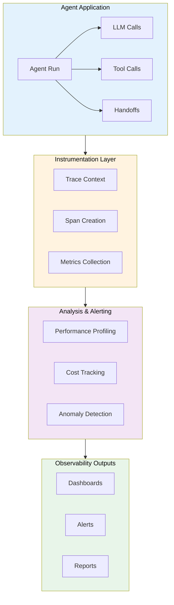

# Agent Observability & Tracing

## Overview

Production agents run autonomously — making decisions, calling tools, and chaining LLM requests across multiple steps. Without observability, a failing agent is a black box. We can't see why it chose a wrong tool, where latency spiked, or how much a single run cost. This lesson builds the engineering practices for full agent visibility: distributed tracing to follow requests across services, metrics collection to measure health, performance profiling to find bottlenecks, cost tracking to manage budgets, and anomaly detection to catch problems before users do.

> **🤖 AI Context:** Lesson 18 covered specific *platforms* (LangSmith, Langfuse, Helicone). This lesson focuses on the *engineering practices* — building custom tracing infrastructure, collecting your own metrics, implementing cost calculations, and creating anomaly detection systems. The techniques here are platform-agnostic and apply regardless of which observability tool you choose.

---

## What We'll Cover

This lesson explores agent observability across **6 sub-lessons**:

| # | Lesson | Focus |
|---|--------|-------|
| 01 | [Distributed Tracing for Agents](./01-distributed-tracing-for-agents.md) | Trace ID propagation, span creation, cross-service tracing, context management |
| 02 | [Trace Visualization Tools](./02-trace-visualization-tools.md) | LangSmith features, Helicone integration, Langfuse, custom visualization |
| 03 | [Metrics Collection](./03-metrics-collection.md) | Success rates, latency, tool usage, error rate tracking |
| 04 | [Performance Profiling](./04-performance-profiling.md) | Bottleneck identification, latency breakdown, resource usage, optimization |
| 05 | [Cost Tracking per Agent Run](./05-cost-tracking-per-agent-run.md) | Token usage, API cost calculation, per-task analysis, budget alerts |
| 06 | [Anomaly Detection](./06-anomaly-detection.md) | Unusual patterns, error spikes, performance degradation, automated alerts |

---

## Prerequisites

Before starting this lesson, you should be comfortable with:

- **Agent debugging techniques** — logging, breakpoints, replay (Lesson 22)
- **Agent observability platforms** — LangSmith, Langfuse, Helicone basics (Lesson 18)
- **OpenAI Agents SDK tracing** — `trace()`, `custom_span()`, `TracingProcessor` (Lesson 11)
- **Python fundamentals** — decorators, async/await, context managers (Unit 2)
- **OpenTelemetry concepts** — traces, spans, exporters (helpful but not required)

---

## Architecture Overview

---

## Key Concepts

| Concept | Definition |
|---------|------------|
| **Trace** | End-to-end record of a single agent workflow, composed of spans |
| **Span** | A unit of work within a trace (LLM call, tool call, handoff) |
| **Trace Context** | Metadata (trace ID, span ID) propagated across service boundaries |
| **Metric** | A numeric measurement collected over time (latency, error rate, cost) |
| **Profile** | Detailed breakdown of where time and resources are spent |
| **Anomaly** | A deviation from normal behavior that may indicate a problem |

---

## Tools & Frameworks

| Tool | Purpose | Open Source |
|------|---------|-------------|
| OpenTelemetry | Distributed tracing standard | ✅ |
| OpenAI Agents SDK Tracing | Built-in trace/span support | ✅ |
| Langfuse | LLM observability platform | ✅ |
| LangSmith | LangChain ecosystem tracing | ❌ |
| Helicone | AI gateway with analytics | ❌ |
| Arize Phoenix | Agent tracing & evaluation | ✅ |
| Prometheus + Grafana | Metrics collection & dashboards | ✅ |

---

**Next:** [Distributed Tracing for Agents](./01-distributed-tracing-for-agents.md)

**Previous:** [Agent Debugging Techniques](../22-agent-debugging-techniques/06-common-debugging-patterns.md)

---

## Further Reading

- [OpenTelemetry Traces](https://opentelemetry.io/docs/concepts/signals/traces/) - Distributed tracing standard
- [OpenAI Agents SDK Tracing](https://openai.github.io/openai-agents-python/tracing/) - Built-in tracing for agents
- [Langfuse Observability](https://langfuse.com/docs/observability/overview) - Open-source LLM observability
- [Arize Phoenix Tracing](https://arize.com/docs/phoenix/tracing/llm-traces) - LLM trace visualization
- [LangSmith Documentation](https://docs.smith.langchain.com/) - LangChain observability platform
