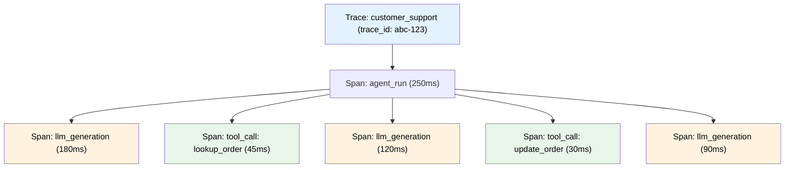

# Distributed tracing for agents

## Introduction

A single user request to an AI agent can trigger a cascade of operations — an LLM call to plan, three tool calls to gather data, a handoff to a specialist agent, another LLM call to synthesize, and a final response. In a microservices architecture, these operations may span multiple services, each with their own logs. Without distributed tracing, correlating a slow response to the specific LLM call that caused it is guesswork.

Distributed tracing solves this by assigning a unique trace ID to each request and propagating it through every service and operation. Each unit of work becomes a **span** within that trace, creating a tree-like structure that shows exactly what happened, in what order, and how long each step took.

### What we'll cover

- Core tracing concepts: traces, spans, and context propagation
- Building an agent-aware tracing system from scratch
- Using OpenTelemetry for standardized distributed tracing
- Integrating with the OpenAI Agents SDK tracing infrastructure
- Cross-service trace propagation for multi-agent systems

### Prerequisites

- Agent fundamentals and tool calling (Lessons 1–5)
- OpenAI Agents SDK basics (Lesson 11)
- Python context managers and decorators (Unit 2)
- Basic understanding of HTTP headers (Unit 1, Lesson 6)

---

## Traces, spans, and context

A **trace** represents the complete journey of a single request. A **span** represents one unit of work within that trace. Spans nest to form a tree — the root span is the entire agent run, and child spans are individual LLM calls, tool executions, and handoffs.



### Anatomy of a span

```python
from dataclasses import dataclass, field
from datetime import datetime, timezone
import uuid

@dataclass
class Span:
    """A single unit of work within a trace."""
    name: str
    trace_id: str
    span_id: str = field(default_factory=lambda: uuid.uuid4().hex[:16])
    parent_id: str | None = None
    start_time: datetime = field(default_factory=lambda: datetime.now(timezone.utc))
    end_time: datetime | None = None
    attributes: dict = field(default_factory=dict)
    events: list[dict] = field(default_factory=list)
    status: str = "UNSET"  # UNSET, OK, ERROR
    
    @property
    def duration_ms(self) -> float | None:
        if self.end_time and self.start_time:
            return (self.end_time - self.start_time).total_seconds() * 1000
        return None
    
    def set_attribute(self, key: str, value) -> None:
        self.attributes[key] = value
    
    def add_event(self, name: str, attributes: dict | None = None) -> None:
        self.events.append({
            "name": name,
            "timestamp": datetime.now(timezone.utc).isoformat(),
            "attributes": attributes or {},
        })
    
    def end(self, status: str = "OK") -> None:
        self.end_time = datetime.now(timezone.utc)
        self.status = status

# Create a span
span = Span(
    name="llm_generation",
    trace_id="abc123def456",
    parent_id="root_span_001",
)
span.set_attribute("model", "gpt-4o")
span.set_attribute("input_tokens", 150)
span.add_event("response_started", {"first_token_ms": 45})
span.end("OK")

print(f"Span: {span.name}")
print(f"Duration: {span.duration_ms:.1f}ms")
print(f"Attributes: {span.attributes}")
```

**Output:**

```
Span: llm_generation
Duration: 0.1ms
Attributes: {'model': 'gpt-4o', 'input_tokens': 150}
```

---

## Building an agent tracer

We can build a complete tracing system that automatically instruments agent operations. The key design decision is using Python's `contextvars` to track the current trace and span — this works correctly with async code and concurrent runs.

### The AgentTracer class

```python
import json
import uuid
import time
from contextvars import ContextVar
from contextlib import contextmanager
from dataclasses import dataclass, field, asdict
from datetime import datetime, timezone

# Context variables track the current trace and span per-task
_current_trace: ContextVar[dict | None] = ContextVar("current_trace", default=None)
_current_span: ContextVar["TracerSpan | None"] = ContextVar("current_span", default=None)

@dataclass
class TracerSpan:
    name: str
    trace_id: str
    span_id: str = field(default_factory=lambda: uuid.uuid4().hex[:16])
    parent_id: str | None = None
    start_time: float = field(default_factory=time.perf_counter)
    end_time: float | None = None
    attributes: dict = field(default_factory=dict)
    events: list[dict] = field(default_factory=list)
    status: str = "UNSET"
    children: list["TracerSpan"] = field(default_factory=list)

    @property
    def duration_ms(self) -> float:
        if self.end_time:
            return (self.end_time - self.start_time) * 1000
        return 0

class AgentTracer:
    """Distributed tracing system for AI agents."""
    
    def __init__(self, service_name: str = "agent-service"):
        self.service_name = service_name
        self.completed_traces: list[dict] = []
    
    @contextmanager
    def trace(self, workflow_name: str, trace_id: str | None = None):
        """Start a new trace for an agent workflow."""
        trace_id = trace_id or f"trace_{uuid.uuid4().hex[:32]}"
        
        trace_data = {
            "trace_id": trace_id,
            "workflow_name": workflow_name,
            "service": self.service_name,
            "started_at": datetime.now(timezone.utc).isoformat(),
            "spans": [],
        }
        
        token = _current_trace.set(trace_data)
        
        # Create root span
        with self.span(workflow_name) as root_span:
            try:
                yield trace_data
            finally:
                trace_data["ended_at"] = datetime.now(timezone.utc).isoformat()
                trace_data["spans"].append(root_span)
                self.completed_traces.append(trace_data)
                _current_trace.reset(token)
    
    @contextmanager
    def span(self, name: str, attributes: dict | None = None):
        """Create a span within the current trace."""
        trace_data = _current_trace.get()
        if not trace_data:
            raise RuntimeError("No active trace. Use 'with tracer.trace(...)' first.")
        
        parent = _current_span.get()
        
        span = TracerSpan(
            name=name,
            trace_id=trace_data["trace_id"],
            parent_id=parent.span_id if parent else None,
            attributes=attributes or {},
        )
        
        token = _current_span.set(span)
        
        try:
            yield span
        except Exception as e:
            span.status = "ERROR"
            span.events.append({
                "name": "exception",
                "attributes": {"type": type(e).__name__, "message": str(e)},
            })
            raise
        finally:
            span.end_time = time.perf_counter()
            if span.status == "UNSET":
                span.status = "OK"
            if parent:
                parent.children.append(span)
            _current_span.reset(token)

# Usage
tracer = AgentTracer(service_name="customer-support")

with tracer.trace("order_inquiry") as trace:
    print(f"Trace started: {trace['trace_id'][:20]}...")
    
    with tracer.span("llm_planning", {"model": "gpt-4o"}) as plan_span:
        time.sleep(0.05)  # Simulate LLM call
        plan_span.set_attribute("input_tokens", 200)
        plan_span.set_attribute("output_tokens", 50)
    
    with tracer.span("tool_call", {"tool": "lookup_order"}) as tool_span:
        time.sleep(0.02)  # Simulate tool execution
        tool_span.add_event("database_query", {"table": "orders"})
    
    with tracer.span("llm_response", {"model": "gpt-4o"}) as resp_span:
        time.sleep(0.03)

print(f"Trace completed with {len(trace['spans'])} root spans")
```

**Output:**

```
Trace started: trace_a1b2c3d4e5f6g7h8...
Trace completed with 1 root spans
```

---

## Using OpenTelemetry for agent tracing

OpenTelemetry (OTel) is the industry standard for distributed tracing. Instead of building our own tracing infrastructure, we can use OTel's Python SDK to get standardized traces that work with any compatible backend.

### Setting up OpenTelemetry

```python
from opentelemetry import trace
from opentelemetry.sdk.trace import TracerProvider
from opentelemetry.sdk.trace.export import (
    SimpleSpanProcessor,
    ConsoleSpanExporter,
)
from opentelemetry.sdk.resources import Resource

# Step 1: Configure the tracer provider
resource = Resource.create({
    "service.name": "agent-service",
    "service.version": "1.0.0",
    "deployment.environment": "development",
})

provider = TracerProvider(resource=resource)

# Step 2: Add a span processor (console for development)
processor = SimpleSpanProcessor(ConsoleSpanExporter())
provider.add_span_processor(processor)

# Step 3: Set as global tracer provider
trace.set_tracer_provider(provider)

# Step 4: Get a tracer
tracer = trace.get_tracer("agent.tracer", "1.0.0")
```

### Instrumenting agent operations

```python
from opentelemetry import trace

tracer = trace.get_tracer("agent.tracer")

def agent_run(user_input: str) -> str:
    """Run an agent with full OpenTelemetry tracing."""
    with tracer.start_as_current_span(
        "agent_run",
        attributes={
            "agent.input": user_input,
            "agent.model": "gpt-4o",
        }
    ) as root_span:
        
        # LLM planning step
        with tracer.start_as_current_span(
            "llm_generation",
            attributes={
                "llm.model": "gpt-4o",
                "llm.request_type": "planning",
            }
        ) as llm_span:
            # Simulate LLM call
            plan = "Call lookup_order tool"
            llm_span.set_attribute("llm.input_tokens", 180)
            llm_span.set_attribute("llm.output_tokens", 25)
            llm_span.add_event("planning_complete", {"plan": plan})
        
        # Tool execution
        with tracer.start_as_current_span(
            "tool_call",
            attributes={
                "tool.name": "lookup_order",
                "tool.args": '{"order_id": "ORD-5521"}',
            }
        ) as tool_span:
            # Simulate tool call
            result = "Order ORD-5521: shipped"
            tool_span.set_attribute("tool.result_length", len(result))
            tool_span.add_event("tool_complete", {"success": True})
        
        # Final LLM response
        with tracer.start_as_current_span(
            "llm_generation",
            attributes={
                "llm.model": "gpt-4o",
                "llm.request_type": "response",
            }
        ) as resp_span:
            response = f"Your order ORD-5521 has been shipped."
            resp_span.set_attribute("llm.input_tokens", 250)
            resp_span.set_attribute("llm.output_tokens", 30)
        
        root_span.set_attribute("agent.output", response)
        root_span.set_status(trace.StatusCode.OK)
        return response

output = agent_run("Where is my order ORD-5521?")
print(f"Agent output: {output}")
```

**Output:**

```
Agent output: Your order ORD-5521 has been shipped.
```

> **Note:** The `ConsoleSpanExporter` prints each span's details to stdout. In production, we replace it with an OTLP exporter that sends traces to Langfuse, Jaeger, or another backend.

---

## Trace context propagation

When agents span multiple services — a gateway, an orchestrator, and specialized agents running on different hosts — we need to propagate the trace context across HTTP boundaries.

### HTTP header propagation

```python
from opentelemetry import trace, context
from opentelemetry.propagate import inject, extract
from opentelemetry.propagators.textmap import DefaultTextMapPropagator

tracer = trace.get_tracer("agent.tracer")

def call_remote_agent(url: str, payload: dict) -> dict:
    """Call a remote agent service with trace context propagation."""
    import urllib.request
    import json
    
    headers = {}
    
    # Inject current trace context into HTTP headers
    inject(headers)
    # headers now contains:
    # {"traceparent": "00-<trace_id>-<span_id>-01"}
    
    print(f"Propagating trace context: {headers}")
    
    with tracer.start_as_current_span(
        "remote_agent_call",
        attributes={"remote.url": url},
    ):
        # In production, we'd make the actual HTTP call
        # req = urllib.request.Request(url, data=json.dumps(payload).encode())
        # for key, value in headers.items():
        #     req.add_header(key, value)
        # response = urllib.request.urlopen(req)
        
        return {"result": "simulated remote response"}

# On the receiving service:
def handle_incoming_request(headers: dict, body: dict) -> dict:
    """Handle an incoming request, extracting the trace context."""
    
    # Extract trace context from incoming HTTP headers
    ctx = extract(headers)
    
    # Start a new span that's a child of the remote caller's span
    with tracer.start_as_current_span(
        "handle_request",
        context=ctx,
        attributes={"service": "specialist-agent"},
    ) as span:
        # This span shares the same trace_id as the caller
        span.add_event("processing_started")
        result = {"answer": "processed by specialist"}
        span.set_attribute("result.status", "success")
        return result
```

### Cross-service agent tracing

```python
from contextlib import contextmanager

class DistributedAgentTracer:
    """Traces agent operations across service boundaries."""
    
    def __init__(self, service_name: str):
        self.service_name = service_name
        self.tracer = trace.get_tracer(f"{service_name}.tracer")
    
    @contextmanager
    def trace_agent_run(self, workflow_name: str, incoming_context=None):
        """Start or continue a trace for an agent run."""
        ctx = incoming_context or context.get_current()
        
        with self.tracer.start_as_current_span(
            workflow_name,
            context=ctx,
            attributes={
                "agent.service": self.service_name,
                "agent.workflow": workflow_name,
            }
        ) as span:
            yield span
    
    @contextmanager
    def trace_llm_call(self, model: str, request_type: str = "generation"):
        """Trace an LLM call."""
        with self.tracer.start_as_current_span(
            "llm_generation",
            attributes={
                "llm.model": model,
                "llm.request_type": request_type,
            }
        ) as span:
            yield span
    
    @contextmanager
    def trace_tool_call(self, tool_name: str, args: dict | None = None):
        """Trace a tool call."""
        with self.tracer.start_as_current_span(
            f"tool.{tool_name}",
            attributes={
                "tool.name": tool_name,
                "tool.args": json.dumps(args or {}),
            }
        ) as span:
            yield span
    
    @contextmanager
    def trace_handoff(self, target_agent: str):
        """Trace a handoff to another agent."""
        with self.tracer.start_as_current_span(
            "agent_handoff",
            attributes={
                "handoff.from": self.service_name,
                "handoff.to": target_agent,
            }
        ) as span:
            yield span
    
    def get_propagation_headers(self) -> dict:
        """Get headers to propagate trace context to another service."""
        headers = {}
        inject(headers)
        return headers

# Usage: orchestrator service
orchestrator = DistributedAgentTracer("orchestrator")

with orchestrator.trace_agent_run("customer_inquiry"):
    with orchestrator.trace_llm_call("gpt-4o", "routing"):
        pass  # Route to specialist
    
    with orchestrator.trace_handoff("billing-agent"):
        headers = orchestrator.get_propagation_headers()
        # Send headers to billing-agent service
        print(f"Handoff headers: {list(headers.keys())}")
```

**Output:**

```
Handoff headers: ['traceparent']
```

---

## OpenAI Agents SDK tracing integration

The OpenAI Agents SDK includes built-in tracing that creates spans automatically. We can integrate our custom tracing with the SDK's tracing system.

### Using the SDK's built-in tracing

```python
from agents import Agent, Runner, trace, custom_span, function_tool

@function_tool
def lookup_order(order_id: str) -> str:
    """Look up an order by ID."""
    return f"Order {order_id}: Widget Pro, status: shipped"

agent = Agent(
    name="Support Bot",
    instructions="Help customers with order inquiries.",
    tools=[lookup_order],
)

async def run_with_tracing():
    # The SDK automatically wraps this in a trace
    # with spans for: agent_run, llm_generation, function_tool
    result = await Runner.run(agent, "Where is order ORD-5521?")
    print(f"Output: {result.final_output}")

# Higher-level traces group multiple runs
async def multi_step_workflow():
    with trace("multi_step_support"):
        # Both runs share the same trace
        result1 = await Runner.run(agent, "Look up order ORD-5521")
        result2 = await Runner.run(
            agent, f"Summarize: {result1.final_output}"
        )
    return result2
```

### Custom spans in agent tools

```python
from agents import Agent, Runner, custom_span, function_tool

@function_tool
def complex_search(query: str) -> str:
    """Search with custom tracing spans."""
    with custom_span("database_search", data={"query": query}):
        # This span appears as a child of the tool call span
        results = ["result1", "result2"]
    
    with custom_span("result_ranking", data={"count": len(results)}):
        ranked = sorted(results)
    
    return f"Found {len(ranked)} results for '{query}'"
```

### Exporting traces to custom backends

```python
from agents import add_trace_processor
from agents.tracing import TracingProcessor, Trace, Span

class CustomTraceExporter(TracingProcessor):
    """Export agent traces to a custom backend."""
    
    def __init__(self, endpoint: str):
        self.endpoint = endpoint
        self.traces: list[dict] = []
    
    def on_trace_start(self, trace: Trace) -> None:
        print(f"📍 Trace started: {trace.trace_id}")
    
    def on_trace_end(self, trace: Trace) -> None:
        self.traces.append({
            "trace_id": trace.trace_id,
            "workflow": trace.name,
            "group_id": trace.group_id,
        })
        print(f"✅ Trace ended: {trace.trace_id}")
    
    def on_span_start(self, span: Span) -> None:
        pass  # Can add start-time logging
    
    def on_span_end(self, span: Span) -> None:
        print(f"  └─ Span: {span.span_data.__class__.__name__} ({span.span_id[:8]})")
    
    def shutdown(self) -> None:
        print(f"Exporter shutdown. Total traces: {len(self.traces)}")
    
    def force_flush(self) -> None:
        pass

# Register the custom exporter alongside the default OpenAI backend
exporter = CustomTraceExporter(endpoint="https://my-trace-backend.example.com")
add_trace_processor(exporter)
```

**Output:**

```
📍 Trace started: trace_a1b2c3d4e5f6...
  └─ Span: GenerationSpanData (8f3a2b1c)
  └─ Span: FunctionSpanData (d4e5f6a7)
  └─ Span: AgentSpanData (1c2d3e4f)
✅ Trace ended: trace_a1b2c3d4e5f6...
```

> **🔑 Key Concept:** `add_trace_processor()` adds your exporter *alongside* the default OpenAI backend. Use `set_trace_processors()` if you want to *replace* the default entirely.

---

## Best practices

| Practice | Why It Matters |
|----------|----------------|
| Use `contextvars` for trace context | Works correctly with async/await and concurrent agent runs |
| Add semantic attributes to spans | `llm.model`, `tool.name`, `agent.workflow` make traces searchable |
| Propagate context via HTTP headers | Enables end-to-end tracing across microservices |
| Set span status on errors | Distinguishes failed operations from successful ones in dashboards |
| Create custom spans for expensive operations | Database queries, API calls, and file I/O deserve their own spans |
| Use `group_id` for multi-turn conversations | Links all agent runs in a conversation under one group |

---

## Common pitfalls

| ❌ Mistake | ✅ Solution |
|-----------|-------------|
| Creating spans outside a trace context | Always wrap agent runs in a `trace()` or `start_as_current_span()` |
| Not propagating context to child services | Use `inject()` to add trace headers to outgoing HTTP requests |
| Recording sensitive data in span attributes | Use `trace_include_sensitive_data=False` in RunConfig or filter attributes |
| Too many spans (every function call) | Trace meaningful operations only — LLM calls, tool calls, handoffs |
| Forgetting to end spans on exceptions | Use context managers (`with`) to guarantee span cleanup |
| Using synchronous exporters in production | Use `BatchSpanProcessor` instead of `SimpleSpanProcessor` for performance |

---

## Hands-on exercise

### Your task

Build a distributed tracing system for a two-service agent architecture: an **orchestrator** that receives user requests and a **specialist** that handles domain-specific tasks. Trace context must propagate from the orchestrator to the specialist.

### Requirements

1. Create an `AgentTracer` class that uses `contextvars` to track the current trace and span
2. Implement `trace()`, `span()`, and `get_propagation_headers()` methods
3. Simulate an orchestrator calling a specialist service, propagating the trace context
4. Verify that spans from both services share the same `trace_id`
5. Print a summary showing the full trace tree with timing information

### Expected result

```
Trace: customer_support (trace_abc123)
├─ orchestrator.route_request (120ms)
│  ├─ llm_generation (80ms)
│  └─ handoff_to_specialist (40ms)
└─ specialist.handle_billing (95ms)
   ├─ tool.lookup_account (25ms)
   └─ llm_generation (70ms)
```

<details>
<summary>💡 Hints (click to expand)</summary>

- Use `contextvars.ContextVar` for both current trace and current span
- Propagation headers only need the `trace_id` and `parent_span_id`
- The specialist extracts these from headers and creates child spans
- Print the tree by walking the span hierarchy recursively

</details>

<details>
<summary>✅ Solution (click to expand)</summary>

```python
import uuid
import time
from contextvars import ContextVar
from contextlib import contextmanager

_trace_id: ContextVar[str | None] = ContextVar("trace_id", default=None)
_current_span: ContextVar[dict | None] = ContextVar("current_span", default=None)

class AgentTracer:
    def __init__(self, service_name: str):
        self.service_name = service_name
        self.spans: list[dict] = []
    
    @contextmanager
    def trace(self, name: str, trace_id: str | None = None):
        trace_id = trace_id or f"trace_{uuid.uuid4().hex[:8]}"
        token = _trace_id.set(trace_id)
        try:
            with self.span(name) as root:
                yield {"trace_id": trace_id, "root": root}
        finally:
            _trace_id.reset(token)
    
    @contextmanager
    def span(self, name: str):
        parent = _current_span.get()
        span = {
            "name": f"{self.service_name}.{name}",
            "trace_id": _trace_id.get(),
            "span_id": uuid.uuid4().hex[:8],
            "parent_id": parent["span_id"] if parent else None,
            "start": time.perf_counter(),
            "children": [],
        }
        if parent:
            parent["children"].append(span)
        self.spans.append(span)
        
        token = _current_span.set(span)
        try:
            yield span
        finally:
            span["duration_ms"] = (time.perf_counter() - span["start"]) * 1000
            _current_span.reset(token)
    
    def get_propagation_headers(self) -> dict:
        current = _current_span.get()
        return {
            "x-trace-id": _trace_id.get() or "",
            "x-parent-span-id": current["span_id"] if current else "",
        }

def print_tree(span: dict, indent: int = 0):
    prefix = "├─ " if indent > 0 else ""
    pad = "│  " * (indent - 1) + prefix if indent > 0 else ""
    print(f"{pad}{span['name']} ({span['duration_ms']:.0f}ms)")
    for child in span.get("children", []):
        print_tree(child, indent + 1)

# --- Orchestrator ---
orch = AgentTracer("orchestrator")

with orch.trace("customer_support") as t:
    with orch.span("route_request"):
        with orch.span("llm_generation"):
            time.sleep(0.08)
        with orch.span("handoff_to_specialist"):
            headers = orch.get_propagation_headers()
            time.sleep(0.04)
    
    # --- Specialist (receives propagated headers) ---
    spec = AgentTracer("specialist")
    spec_trace_id = headers["x-trace-id"]
    token = _trace_id.set(spec_trace_id)
    
    parent_span = _current_span.get()  # Still the handoff span
    with spec.span("handle_billing") as billing:
        with spec.span("lookup_account"):
            time.sleep(0.025)
        with spec.span("llm_generation"):
            time.sleep(0.07)
    
    _trace_id.reset(token)

# Print the trace tree
print(f"\nTrace: customer_support ({t['trace_id']})")
print_tree(t["root"])
```

</details>

### Bonus challenges

- [ ] Add span events for key milestones (e.g., "first token received", "tool result parsed")
- [ ] Implement a JSON exporter that writes completed traces to files
- [ ] Add support for span links (associating spans from different traces)

---

## Summary

✅ **Traces** capture the end-to-end journey of a request, while **spans** represent individual operations within that trace — together they create an observable execution tree

✅ **Context propagation** via `contextvars` (in-process) and HTTP headers (cross-service) ensures all spans from a single user request share the same trace ID

✅ **OpenTelemetry** provides a standardized tracing API — use `TracerProvider`, `Tracer`, and span processors to get traces compatible with any backend

✅ The **OpenAI Agents SDK** traces automatically with `trace()`, `custom_span()`, and `add_trace_processor()` — giving us built-in visibility with minimal configuration

✅ In multi-service architectures, **inject/extract** trace context through HTTP headers so specialist agents' spans appear as children of the orchestrator's trace

---

**Next:** [Trace Visualization Tools](./02-trace-visualization-tools.md)

**Previous:** [Agent Observability & Tracing Overview](./00-agent-observability-tracing.md)

---

## Further Reading

- [OpenTelemetry Traces Concepts](https://opentelemetry.io/docs/concepts/signals/traces/) - Traces, spans, context propagation
- [OpenTelemetry Python SDK](https://opentelemetry.io/docs/languages/python/) - Python instrumentation guide
- [OpenAI Agents SDK Tracing](https://openai.github.io/openai-agents-python/tracing/) - Built-in tracing capabilities
- [W3C Trace Context](https://www.w3.org/TR/trace-context/) - HTTP header propagation standard
- [Langfuse Distributed Tracing](https://langfuse.com/docs/observability/features/trace-ids-and-distributed-tracing) - Custom trace IDs and propagation

<!-- 
Sources Consulted:
- OpenTelemetry Traces: https://opentelemetry.io/docs/concepts/signals/traces/
- OpenAI Agents SDK Tracing: https://openai.github.io/openai-agents-python/tracing/
- Langfuse Observability: https://langfuse.com/docs/observability/overview
- W3C Trace Context: https://www.w3.org/TR/trace-context/
- Python contextvars: https://docs.python.org/3/library/contextvars.html
-->
