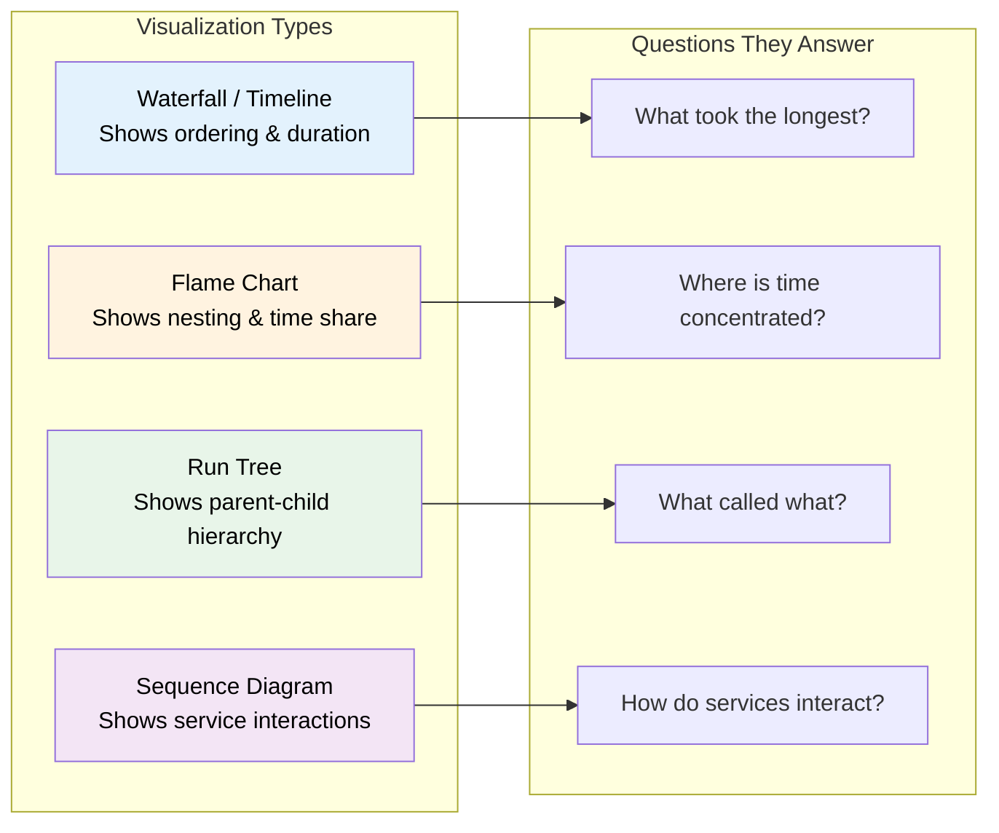

# Trace visualization tools

## Introduction

Raw trace data — JSON objects with span IDs, timestamps, and attributes — is hard to interpret without visualization. A trace with 15 nested spans across three services becomes clear the moment we see it as a waterfall timeline or a flame chart. The right visualization tool transforms trace data from an abstract log into an actionable debugging and monitoring interface.

This lesson covers how to visualize agent traces using existing platforms and how to build custom visualizations when the platforms don't fit our needs. We focus on the practical integration patterns rather than platform-specific setup (which is covered in Lesson 18).

### What we'll cover

- Waterfall views and flame charts for agent traces
- LangSmith run tree visualization
- Langfuse trace explorer and agent graphs
- Helicone request logging and analytics
- Building custom trace visualizations with Mermaid and HTML
- Choosing the right visualization for different debugging tasks

### Prerequisites

- Distributed tracing concepts — traces, spans, context (Lesson 23-01)
- Basic familiarity with LangSmith, Langfuse, or Helicone (Lesson 18)
- Python fundamentals — string formatting, file I/O (Unit 2)

---

## Understanding trace visualizations

Different visualization types reveal different aspects of agent behavior:



| Visualization | Best For | Shows |
|--------------|----------|-------|
| **Waterfall** | Finding latency bottlenecks | Time-ordered spans with duration bars |
| **Flame chart** | Understanding time distribution | Stacked spans where width = duration |
| **Run tree** | Understanding agent logic flow | Hierarchical parent-child span relationships |
| **Sequence diagram** | Multi-agent/multi-service debugging | Message flow between participants |

---

## Building waterfall visualizations

A waterfall view shows each span as a horizontal bar, positioned by start time and sized by duration. We can generate these from raw trace data.

### Text-based waterfall

```python
from dataclasses import dataclass
import time

@dataclass
class SpanRecord:
    name: str
    start_ms: float
    duration_ms: float
    depth: int = 0
    status: str = "OK"

def render_waterfall(spans: list[SpanRecord], width: int = 50) -> str:
    """Render a text-based waterfall chart from span records."""
    if not spans:
        return "No spans to display"
    
    # Find the time range
    min_start = min(s.start_ms for s in spans)
    max_end = max(s.start_ms + s.duration_ms for s in spans)
    total_duration = max_end - min_start
    
    if total_duration == 0:
        total_duration = 1  # Avoid division by zero
    
    lines = []
    lines.append(f"{'Span':<35} {'Timeline':>{width}}  Duration")
    lines.append("─" * (35 + width + 12))
    
    for span in spans:
        # Calculate bar position and width
        offset = int(((span.start_ms - min_start) / total_duration) * width)
        bar_width = max(1, int((span.duration_ms / total_duration) * width))
        
        # Build the timeline bar
        indent = "  " * span.depth
        name = f"{indent}{span.name}"[:34]
        bar = " " * offset + "█" * bar_width
        status_icon = "✅" if span.status == "OK" else "❌"
        
        lines.append(f"{name:<35} {bar:<{width}}  {span.duration_ms:6.1f}ms {status_icon}")
    
    lines.append("─" * (35 + width + 12))
    lines.append(f"{'Total:':<35} {'':>{width}}  {total_duration:6.1f}ms")
    
    return "\n".join(lines)

# Simulate an agent trace
spans = [
    SpanRecord("agent_run", 0, 350, depth=0),
    SpanRecord("llm_planning", 5, 120, depth=1),
    SpanRecord("tool: search_db", 130, 80, depth=1),
    SpanRecord("db_query", 135, 60, depth=2),
    SpanRecord("result_parse", 200, 15, depth=2),
    SpanRecord("tool: fetch_api", 215, 45, depth=1),
    SpanRecord("llm_response", 265, 80, depth=1),
]

print(render_waterfall(spans))
```

**Output:**

```
Span                                Timeline                                            Duration
───────────────────────────────────────────────────────────────────────────────────────────────────
agent_run                           ██████████████████████████████████████████████████   350.0ms ✅
  llm_planning                       █████████████████                                   120.0ms ✅
  tool: search_db                                     ███████████                         80.0ms ✅
    db_query                                           █████████                          60.0ms ✅
    result_parse                                                ██                        15.0ms ✅
  tool: fetch_api                                                 ██████                  45.0ms ✅
  llm_response                                                          ███████████       80.0ms ✅
───────────────────────────────────────────────────────────────────────────────────────────────────
Total:                                                                                   350.0ms
```

---

## LangSmith run tree visualization

LangSmith displays traces as **run trees** — hierarchical views of every step in an agent's execution. The run tree shows inputs, outputs, token counts, latency, and status at each level.

### Sending traces to LangSmith

```python
import os

# Configure LangSmith tracing (environment variables)
os.environ["LANGCHAIN_TRACING_V2"] = "true"
os.environ["LANGCHAIN_API_KEY"] = "ls-..."
os.environ["LANGCHAIN_PROJECT"] = "agent-observability"

# With LangGraph, tracing is automatic
from langgraph.graph import StateGraph, START, END
from typing import TypedDict

class AgentState(TypedDict):
    input: str
    plan: str
    result: str

def plan_step(state: AgentState) -> dict:
    # Automatically traced as a span in LangSmith
    return {"plan": f"Search for: {state['input']}"}

def execute_step(state: AgentState) -> dict:
    return {"result": f"Found info about {state['plan']}"}

graph = StateGraph(AgentState)
graph.add_node("plan", plan_step)
graph.add_node("execute", execute_step)
graph.add_edge(START, "plan")
graph.add_edge("plan", "execute")
graph.add_edge("execute", END)

app = graph.compile()

# Every invocation creates a trace visible in LangSmith
# result = app.invoke({"input": "order status", "plan": "", "result": ""})
```

### What LangSmith shows

LangSmith's run tree displays:

| Feature | What It Shows |
|---------|---------------|
| **Run hierarchy** | Parent-child span nesting (agent → LLM → tool → sub-tool) |
| **I/O pairs** | Exact input and output for each step |
| **Token counts** | Input/output tokens per LLM call |
| **Latency** | Duration of each span with visual bar |
| **Status** | Success/error with error details |
| **Feedback** | Thumbs up/down scores attached to runs |

> **🤖 AI Context:** LangSmith is tightly integrated with LangChain and LangGraph — tracing is automatic. For OpenAI Agents SDK or Pydantic AI, you'll need to use LangSmith's SDK or export via OpenTelemetry.

---

## Langfuse trace explorer

Langfuse provides an open-source trace explorer with agent graph visualization, cost tracking, and evaluation scoring.

### Instrumenting with Langfuse

```python
from langfuse import Langfuse
from langfuse.decorators import observe, langfuse_context

# Initialize Langfuse client
langfuse = Langfuse(
    public_key="pk-...",
    secret_key="sk-...",
    host="https://cloud.langfuse.com",  # or self-hosted URL
)

@observe()
def agent_workflow(user_input: str) -> str:
    """Traced agent workflow — each decorated function becomes a span."""
    plan = planning_step(user_input)
    result = tool_execution(plan)
    response = generate_response(result)
    return response

@observe()
def planning_step(user_input: str) -> str:
    """LLM planning — automatically traced."""
    # Update the current observation with metadata
    langfuse_context.update_current_observation(
        input=user_input,
        model="gpt-4o",
        metadata={"step": "planning"},
    )
    return f"Plan: search for '{user_input}'"

@observe()
def tool_execution(plan: str) -> str:
    """Tool call — automatically traced."""
    langfuse_context.update_current_observation(
        input=plan,
        metadata={"tool": "search_db"},
    )
    return f"Results for {plan}"

@observe()
def generate_response(data: str) -> str:
    """Final response generation — automatically traced."""
    langfuse_context.update_current_observation(
        model="gpt-4o",
        usage={"input": 250, "output": 80, "unit": "TOKENS"},
    )
    return f"Based on my research: {data}"

# Run — creates a trace visible in Langfuse UI
# output = agent_workflow("What's the status of order ORD-5521?")
```

### Langfuse features for agent tracing

| Feature | Description |
|---------|-------------|
| **Trace timeline** | Waterfall view of all observations (spans) in a trace |
| **Agent graphs** | Visual graph of agent node transitions |
| **Session grouping** | Group multi-turn conversations under one session |
| **Cost analytics** | Per-trace and per-model cost breakdown |
| **Environments** | Split traces between dev, staging, production |
| **Evaluation scores** | Attach quality scores via SDK or LLM-as-a-judge |
| **Custom dashboards** | Build charts from trace metrics |

---

## Helicone request analytics

Helicone operates as a proxy between your application and the LLM API, capturing every request and response for analysis.

### Integration pattern

```python
import openai

# Helicone integrates via a base URL proxy
client = openai.OpenAI(
    api_key="sk-...",
    base_url="https://oai.helicone.ai/v1",
    default_headers={
        "Helicone-Auth": "Bearer sk-helicone-...",
        # Custom properties for filtering
        "Helicone-Property-Agent": "support-bot",
        "Helicone-Property-Workflow": "order-inquiry",
        "Helicone-Property-UserId": "user-123",
    },
)

# All requests through this client are automatically logged
# response = client.chat.completions.create(
#     model="gpt-4o",
#     messages=[{"role": "user", "content": "Order status?"}],
# )
```

### What Helicone provides

| Feature | Agent Use Case |
|---------|---------------|
| **Request logging** | Every LLM call captured with full prompt/response |
| **Cost dashboard** | Real-time spend tracking per model, per agent |
| **Latency analytics** | P50/P95/P99 latency percentiles |
| **Rate limit tracking** | Alerts when approaching API rate limits |
| **User analytics** | Per-user cost and usage breakdowns |
| **Custom properties** | Filter by agent, workflow, task type |
| **Caching** | Detect and cache repeated identical requests |

> **Note:** Helicone sees individual LLM requests but doesn't automatically trace multi-step agent workflows. For full agent tracing, combine Helicone (for LLM-level metrics) with Langfuse or LangSmith (for workflow-level traces).

---

## Custom trace visualization

When existing platforms don't match our needs, we can build custom visualizations from trace data.

### Generating Mermaid sequence diagrams from traces

```python
import json

def trace_to_mermaid_sequence(trace_data: dict) -> str:
    """Convert a trace record into a Mermaid sequence diagram."""
    lines = ["sequenceDiagram"]
    
    participants = set()
    interactions = []
    
    for span in trace_data.get("spans", []):
        span_type = span.get("type", "unknown")
        
        if span_type == "llm_call":
            participants.add("Agent")
            participants.add("LLM")
            interactions.append(
                f"    Agent->>LLM: {span.get('model', 'model')} "
                f"({span.get('input_tokens', '?')} tokens)"
            )
            interactions.append(
                f"    LLM-->>Agent: Response "
                f"({span.get('output_tokens', '?')} tokens, "
                f"{span.get('duration_ms', '?')}ms)"
            )
        
        elif span_type == "tool_call":
            participants.add("Agent")
            tool_name = span.get("tool_name", "Tool")
            participants.add(tool_name)
            interactions.append(
                f"    Agent->>+{tool_name}: {json.dumps(span.get('args', {}))}"
            )
            interactions.append(
                f"    {tool_name}-->>-Agent: {span.get('result', 'result')[:40]}"
            )
        
        elif span_type == "handoff":
            source = span.get("from", "Agent")
            target = span.get("to", "Target")
            participants.update([source, target])
            interactions.append(
                f"    {source}->>>{target}: Handoff"
            )
    
    # Add participants
    for p in sorted(participants):
        lines.append(f"    participant {p}")
    
    lines.extend(interactions)
    return "\n".join(lines)

# Example trace data
trace = {
    "trace_id": "abc123",
    "spans": [
        {"type": "llm_call", "model": "gpt-4o", "input_tokens": 200, 
         "output_tokens": 50, "duration_ms": 120},
        {"type": "tool_call", "tool_name": "SearchDB", 
         "args": {"query": "ORD-5521"}, "result": "Order found: shipped",
         "duration_ms": 45},
        {"type": "llm_call", "model": "gpt-4o", "input_tokens": 350, 
         "output_tokens": 80, "duration_ms": 95},
    ]
}

mermaid = trace_to_mermaid_sequence(trace)
print(mermaid)
```

**Output:**

```
sequenceDiagram
    participant Agent
    participant LLM
    participant SearchDB
    Agent->>LLM: gpt-4o (200 tokens)
    LLM-->>Agent: Response (50 tokens, 120ms)
    Agent->>+SearchDB: {"query": "ORD-5521"}
    SearchDB-->>-Agent: Order found: shipped
    Agent->>LLM: gpt-4o (350 tokens)
    LLM-->>Agent: Response (80 tokens, 95ms)
```

### Generating HTML trace reports

```python
def trace_to_html(trace_data: dict, spans: list[dict]) -> str:
    """Generate an HTML trace report with timeline visualization."""
    if not spans:
        return "<p>No spans to visualize</p>"
    
    min_start = min(s["start_ms"] for s in spans)
    max_end = max(s["start_ms"] + s["duration_ms"] for s in spans)
    total = max_end - min_start or 1
    
    html = f"""<!DOCTYPE html>
<html>
<head>
    <title>Trace: {trace_data.get('trace_id', 'unknown')}</title>
    <style>
        body {{ font-family: monospace; padding: 20px; background: #1a1a2e; color: #e0e0e0; }}
        .trace-header {{ margin-bottom: 20px; }}
        .span-row {{ display: flex; align-items: center; margin: 4px 0; height: 28px; }}
        .span-label {{ width: 250px; font-size: 13px; padding-right: 10px; text-align: right; }}
        .span-timeline {{ flex: 1; position: relative; height: 20px; background: #16213e; border-radius: 3px; }}
        .span-bar {{ position: absolute; height: 100%; border-radius: 3px; min-width: 2px; }}
        .span-duration {{ width: 80px; font-size: 12px; text-align: right; padding-left: 10px; }}
        .llm {{ background: #e94560; }}
        .tool {{ background: #0f3460; }}
        .agent {{ background: #533483; }}
    </style>
</head>
<body>
    <div class="trace-header">
        <h2>Trace: {trace_data.get('trace_id', 'unknown')[:20]}...</h2>
        <p>Total Duration: {total:.0f}ms | Spans: {len(spans)}</p>
    </div>
"""
    
    for span in spans:
        left_pct = ((span["start_ms"] - min_start) / total) * 100
        width_pct = max(0.5, (span["duration_ms"] / total) * 100)
        indent = "  " * span.get("depth", 0)
        css_class = "llm" if "llm" in span["name"].lower() else (
            "tool" if "tool" in span["name"].lower() else "agent"
        )
        
        html += f"""    <div class="span-row">
        <div class="span-label">{indent}{span['name']}</div>
        <div class="span-timeline">
            <div class="span-bar {css_class}" style="left:{left_pct:.1f}%;width:{width_pct:.1f}%"></div>
        </div>
        <div class="span-duration">{span['duration_ms']:.0f}ms</div>
    </div>
"""
    
    html += "</body></html>"
    return html

# Generate HTML report
html = trace_to_html(
    {"trace_id": "trace_abc123"},
    [
        {"name": "agent_run", "start_ms": 0, "duration_ms": 350, "depth": 0},
        {"name": "llm_planning", "start_ms": 5, "duration_ms": 120, "depth": 1},
        {"name": "tool: search_db", "start_ms": 130, "duration_ms": 80, "depth": 1},
        {"name": "llm_response", "start_ms": 265, "duration_ms": 80, "depth": 1},
    ]
)

with open("trace_report.html", "w") as f:
    f.write(html)
print(f"Report written: {len(html)} chars")
```

**Output:**

```
Report written: 1842 chars
```

---

## Choosing the right visualization tool

| Scenario | Recommended Tool | Why |
|----------|-----------------|-----|
| LangGraph workflows | LangSmith | Native integration, automatic tracing |
| OpenAI Agents SDK | OpenAI Traces Dashboard | Built-in, free, zero-config |
| Multi-framework agents | Langfuse | Framework-agnostic, open-source |
| LLM cost monitoring | Helicone | Proxy-based, no code changes |
| Custom requirements | Build your own | Full control over presentation |
| Quick debugging | Text waterfall | No external tools needed |

---

## Best practices

| Practice | Why It Matters |
|----------|----------------|
| Use waterfall views for latency debugging | Immediately shows which span is the bottleneck |
| Use run trees for logic flow debugging | Shows what the agent decided and in what order |
| Use sequence diagrams for multi-service issues | Clarifies handoff and communication patterns |
| Include token counts in visualizations | Tokens correlate directly with cost and context usage |
| Save HTML reports for incident post-mortems | Permanent record that doesn't require platform access |
| Color-code span types consistently | LLM calls, tool calls, and handoffs should be instantly distinguishable |

---

## Common pitfalls

| ❌ Mistake | ✅ Solution |
|-----------|-------------|
| Visualizing every span in a large trace | Filter to show only spans above a duration threshold |
| Relying on one visualization type | Use waterfall for latency, run tree for logic, sequence for interactions |
| Not including error information | Color error spans differently and show error messages |
| Building custom tools when platforms suffice | Start with LangSmith/Langfuse; build custom only for specific needs |
| Ignoring span depth in displays | Indent child spans to show the hierarchy clearly |
| Generating diagrams manually | Automate diagram generation from trace data |

---

## Hands-on exercise

### Your task

Build a `TraceVisualizer` class that takes a list of span records and generates three different outputs: a text waterfall, a Mermaid sequence diagram, and a summary statistics table.

### Requirements

1. Accept a list of span dictionaries with `name`, `start_ms`, `duration_ms`, `depth`, and `type`
2. Generate a text-based waterfall chart showing timing bars
3. Generate a Mermaid sequence diagram showing agent-LLM-tool interactions
4. Generate a summary table showing total time per span type and percentage breakdown
5. Output all three in a single report

### Expected result

A multi-section report that shows the same trace data from three different perspectives, making it easy to identify both timing issues and logic flow problems.

<details>
<summary>💡 Hints (click to expand)</summary>

- Group spans by `type` for the summary statistics
- Calculate percentage as `(type_duration / total_duration) * 100`
- For the Mermaid diagram, only include spans that have interactions (LLM calls, tool calls)
- Use f-strings with alignment specifiers (`:<30`, `:>10`) for clean table formatting

</details>

<details>
<summary>✅ Solution (click to expand)</summary>

```python
from collections import defaultdict

class TraceVisualizer:
    def __init__(self, spans: list[dict]):
        self.spans = spans
    
    def waterfall(self, width: int = 40) -> str:
        if not self.spans:
            return "No spans"
        min_s = min(s["start_ms"] for s in self.spans)
        max_e = max(s["start_ms"] + s["duration_ms"] for s in self.spans)
        total = max_e - min_s or 1
        
        lines = [f"{'Span':<30} {'Timeline':<{width}}  {'Duration':>8}"]
        lines.append("─" * (30 + width + 10))
        
        for s in self.spans:
            indent = "  " * s.get("depth", 0)
            name = f"{indent}{s['name']}"[:29]
            offset = int(((s["start_ms"] - min_s) / total) * width)
            bar_w = max(1, int((s["duration_ms"] / total) * width))
            bar = " " * offset + "█" * bar_w
            lines.append(f"{name:<30} {bar:<{width}}  {s['duration_ms']:>6.0f}ms")
        
        return "\n".join(lines)
    
    def sequence_diagram(self) -> str:
        lines = ["sequenceDiagram", "    participant Agent", "    participant LLM"]
        tools = set()
        
        for s in self.spans:
            if s.get("type") == "tool":
                tool = s["name"].replace("tool: ", "")
                if tool not in tools:
                    lines.insert(3, f"    participant {tool}")
                    tools.add(tool)
        
        for s in self.spans:
            if s.get("type") == "llm":
                lines.append(f"    Agent->>LLM: {s['name']} ({s['duration_ms']:.0f}ms)")
                lines.append(f"    LLM-->>Agent: Response")
            elif s.get("type") == "tool":
                tool = s["name"].replace("tool: ", "")
                lines.append(f"    Agent->>+{tool}: Call ({s['duration_ms']:.0f}ms)")
                lines.append(f"    {tool}-->>-Agent: Result")
        
        return "\n".join(lines)
    
    def summary(self) -> str:
        by_type = defaultdict(float)
        for s in self.spans:
            by_type[s.get("type", "other")] += s["duration_ms"]
        
        total = sum(by_type.values())
        lines = [f"{'Type':<15} {'Duration':>10} {'Percentage':>10}"]
        lines.append("─" * 37)
        
        for t, dur in sorted(by_type.items(), key=lambda x: -x[1]):
            pct = (dur / total) * 100 if total else 0
            lines.append(f"{t:<15} {dur:>8.0f}ms {pct:>9.1f}%")
        
        lines.append("─" * 37)
        lines.append(f"{'TOTAL':<15} {total:>8.0f}ms {100.0:>9.1f}%")
        return "\n".join(lines)
    
    def full_report(self) -> str:
        return "\n\n".join([
            "=== WATERFALL ===", self.waterfall(),
            "=== SEQUENCE DIAGRAM ===", self.sequence_diagram(),
            "=== SUMMARY ===", self.summary(),
        ])

# Test
spans = [
    {"name": "agent_run", "start_ms": 0, "duration_ms": 350, "depth": 0, "type": "agent"},
    {"name": "llm_planning", "start_ms": 5, "duration_ms": 120, "depth": 1, "type": "llm"},
    {"name": "tool: search_db", "start_ms": 130, "duration_ms": 80, "depth": 1, "type": "tool"},
    {"name": "llm_response", "start_ms": 265, "duration_ms": 80, "depth": 1, "type": "llm"},
]

viz = TraceVisualizer(spans)
print(viz.full_report())
```

</details>

### Bonus challenges

- [ ] Add a Gantt chart output using Mermaid's `gantt` diagram type
- [ ] Generate an SVG waterfall that can be embedded in dashboards
- [ ] Implement interactive HTML with collapsible span details

---

## Summary

✅ **Waterfall views** show span timing along a horizontal axis — instantly revealing which operation is the bottleneck

✅ **LangSmith run trees** provide native LangChain/LangGraph tracing with full I/O capture, token counts, and feedback scoring

✅ **Langfuse** offers an open-source trace explorer with agent graphs, cost tracking, and evaluation scoring — works across all frameworks

✅ **Helicone** operates as an LLM proxy capturing every request — best for cost monitoring and rate limit tracking without code changes

✅ **Custom visualizations** (text waterfalls, Mermaid diagrams, HTML reports) fill gaps when platform tools don't match specific debugging needs

---

**Next:** [Metrics Collection](./03-metrics-collection.md)

**Previous:** [Distributed Tracing for Agents](./01-distributed-tracing-for-agents.md)

---

## Further Reading

- [LangSmith Documentation](https://docs.smith.langchain.com/) - Run trees and trace visualization
- [Langfuse Trace Explorer](https://langfuse.com/docs/observability/overview) - Open-source trace visualization
- [Helicone Documentation](https://docs.helicone.ai/) - LLM proxy and analytics
- [OpenAI Traces Dashboard](https://platform.openai.com/traces) - Built-in OpenAI SDK traces
- [Mermaid Sequence Diagrams](https://mermaid.js.org/syntax/sequenceDiagram.html) - Custom diagram generation

<!-- 
Sources Consulted:
- LangSmith Docs: https://docs.smith.langchain.com/
- Langfuse Observability: https://langfuse.com/docs/observability/overview
- Langfuse Agent Graphs: https://langfuse.com/docs/observability/features/agent-graphs
- Helicone Docs: https://docs.helicone.ai/
- OpenAI Agents SDK Tracing: https://openai.github.io/openai-agents-python/tracing/
- Mermaid Sequence Diagrams: https://mermaid.js.org/syntax/sequenceDiagram.html
-->
