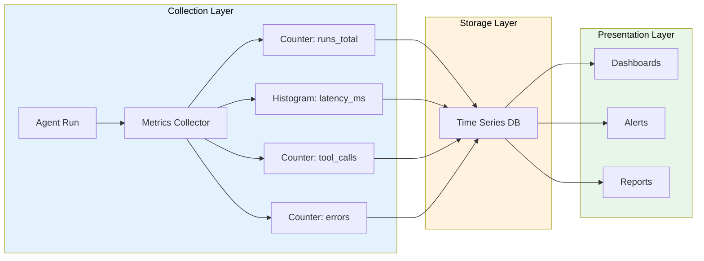

# Metrics collection

## Introduction

Traces show us what happened in a single agent run. Metrics show us what's happening across *all* agent runs — right now, over the past hour, or compared to last week. Is our agent's success rate dropping? Are response times creeping up? Which tools are called most often? These questions can only be answered with systematic metrics collection.

Agent metrics fall into four categories: **success/failure rates** (is the agent working?), **latency** (is it fast enough?), **tool usage** (what operations is it performing?), and **error tracking** (what's going wrong?). We collect these during every agent run and aggregate them into dashboards and alerts.

### What we'll cover

- Designing an agent metrics collection system
- Tracking success rates and failure modes
- Measuring latency at every level (end-to-end, per-LLM, per-tool)
- Monitoring tool usage patterns
- Error rate tracking and categorization
- Exporting metrics to Prometheus format

### Prerequisites

- Distributed tracing concepts — traces and spans (Lesson 23-01)
- Python decorators and context managers (Unit 2)
- Basic statistics concepts (mean, percentile)

---

## Metrics architecture



### The four metric types

| Type | What It Measures | Examples |
|------|-----------------|----------|
| **Counter** | Cumulative count that only increases | Total runs, total errors, total tool calls |
| **Gauge** | Current value that can go up or down | Active runs, queue depth, memory usage |
| **Histogram** | Distribution of values | Latency distribution, token counts |
| **Summary** | Pre-calculated percentiles | P50/P95/P99 latency |

---

## Building an agent metrics collector

```python
import time
import threading
from collections import defaultdict
from dataclasses import dataclass, field
from contextlib import contextmanager
from datetime import datetime, timezone

@dataclass
class MetricPoint:
    """A single metric data point."""
    name: str
    value: float
    labels: dict = field(default_factory=dict)
    timestamp: datetime = field(default_factory=lambda: datetime.now(timezone.utc))

class AgentMetricsCollector:
    """Collects and stores agent metrics."""
    
    def __init__(self):
        self._counters: dict[str, float] = defaultdict(float)
        self._histograms: dict[str, list[float]] = defaultdict(list)
        self._gauges: dict[str, float] = {}
        self._lock = threading.Lock()
    
    # --- Counter operations ---
    
    def increment(self, name: str, value: float = 1, labels: dict | None = None):
        """Increment a counter metric."""
        key = self._make_key(name, labels)
        with self._lock:
            self._counters[key] += value
    
    # --- Histogram operations ---
    
    def observe(self, name: str, value: float, labels: dict | None = None):
        """Record a value in a histogram."""
        key = self._make_key(name, labels)
        with self._lock:
            self._histograms[key].append(value)
    
    # --- Gauge operations ---
    
    def set_gauge(self, name: str, value: float, labels: dict | None = None):
        """Set a gauge to a specific value."""
        key = self._make_key(name, labels)
        with self._lock:
            self._gauges[key] = value
    
    # --- Query operations ---
    
    def get_counter(self, name: str, labels: dict | None = None) -> float:
        key = self._make_key(name, labels)
        return self._counters.get(key, 0)
    
    def get_histogram_stats(self, name: str, labels: dict | None = None) -> dict:
        key = self._make_key(name, labels)
        values = self._histograms.get(key, [])
        if not values:
            return {"count": 0, "min": 0, "max": 0, "avg": 0, "p50": 0, "p95": 0, "p99": 0}
        
        sorted_vals = sorted(values)
        n = len(sorted_vals)
        return {
            "count": n,
            "min": sorted_vals[0],
            "max": sorted_vals[-1],
            "avg": sum(sorted_vals) / n,
            "p50": sorted_vals[int(n * 0.50)],
            "p95": sorted_vals[min(int(n * 0.95), n - 1)],
            "p99": sorted_vals[min(int(n * 0.99), n - 1)],
        }
    
    def _make_key(self, name: str, labels: dict | None) -> str:
        if not labels:
            return name
        label_str = ",".join(f"{k}={v}" for k, v in sorted(labels.items()))
        return f"{name}{{{label_str}}}"

# Create a global collector
metrics = AgentMetricsCollector()

# Record some metrics
metrics.increment("agent_runs_total", labels={"agent": "support"})
metrics.observe("agent_latency_ms", 250, labels={"agent": "support"})
metrics.observe("agent_latency_ms", 180, labels={"agent": "support"})
metrics.observe("agent_latency_ms", 450, labels={"agent": "support"})

stats = metrics.get_histogram_stats("agent_latency_ms", {"agent": "support"})
print(f"Latency stats: avg={stats['avg']:.0f}ms, p50={stats['p50']:.0f}ms, p95={stats['p95']:.0f}ms")
```

**Output:**

```
Latency stats: avg=293ms, p50=250ms, p95=450ms
```

---

## Instrumenting agent runs

We need a decorator that automatically collects metrics from every agent run — latency, success/failure, token usage, and tool calls.

### The metrics decorator

```python
import functools
import time
from contextlib import contextmanager

class AgentInstrumentor:
    """Instruments agent functions to collect metrics automatically."""
    
    def __init__(self, collector: AgentMetricsCollector):
        self.collector = collector
    
    @contextmanager
    def measure_run(self, agent_name: str, workflow: str = "default"):
        """Context manager that measures an agent run."""
        labels = {"agent": agent_name, "workflow": workflow}
        
        self.collector.increment("agent_runs_total", labels=labels)
        self.collector.set_gauge("agent_active_runs", 
                                 self.collector.get_counter("agent_runs_total", labels) -
                                 self.collector.get_counter("agent_runs_completed", labels),
                                 labels)
        
        start = time.perf_counter()
        error_occurred = False
        
        try:
            yield self.collector
        except Exception as e:
            error_occurred = True
            self.collector.increment("agent_errors_total", labels={
                **labels, "error_type": type(e).__name__
            })
            raise
        finally:
            duration_ms = (time.perf_counter() - start) * 1000
            self.collector.observe("agent_latency_ms", duration_ms, labels)
            
            status = "error" if error_occurred else "success"
            self.collector.increment("agent_runs_completed", labels={**labels, "status": status})
    
    def measure_tool(self, tool_name: str):
        """Decorator to measure tool call metrics."""
        def decorator(func):
            @functools.wraps(func)
            def wrapper(*args, **kwargs):
                labels = {"tool": tool_name}
                self.collector.increment("tool_calls_total", labels=labels)
                
                start = time.perf_counter()
                try:
                    result = func(*args, **kwargs)
                    self.collector.increment("tool_calls_completed", 
                                             labels={**labels, "status": "success"})
                    return result
                except Exception as e:
                    self.collector.increment("tool_calls_completed",
                                             labels={**labels, "status": "error"})
                    raise
                finally:
                    duration_ms = (time.perf_counter() - start) * 1000
                    self.collector.observe("tool_latency_ms", duration_ms, labels)
            return wrapper
        return decorator
    
    def record_llm_call(self, model: str, input_tokens: int, output_tokens: int, 
                         latency_ms: float):
        """Record metrics for an LLM call."""
        labels = {"model": model}
        self.collector.increment("llm_calls_total", labels=labels)
        self.collector.observe("llm_latency_ms", latency_ms, labels)
        self.collector.observe("llm_input_tokens", input_tokens, labels)
        self.collector.observe("llm_output_tokens", output_tokens, labels)
        self.collector.increment("llm_tokens_total", 
                                 input_tokens + output_tokens, labels)

# Usage
collector = AgentMetricsCollector()
instrumentor = AgentInstrumentor(collector)

@instrumentor.measure_tool("lookup_order")
def lookup_order(order_id: str) -> str:
    time.sleep(0.03)  # Simulate DB lookup
    return f"Order {order_id}: shipped"

@instrumentor.measure_tool("search_products")
def search_products(query: str) -> str:
    time.sleep(0.05)  # Simulate search
    return f"Found 5 products for '{query}'"

# Simulate an agent run
with instrumentor.measure_run("support-bot", "order_inquiry"):
    instrumentor.record_llm_call("gpt-4o", 200, 50, 120)
    result = lookup_order("ORD-5521")
    instrumentor.record_llm_call("gpt-4o", 350, 80, 95)

# Check metrics
runs = collector.get_counter("agent_runs_total", {"agent": "support-bot", "workflow": "order_inquiry"})
tool_calls = collector.get_counter("tool_calls_total", {"tool": "lookup_order"})
latency = collector.get_histogram_stats("agent_latency_ms", 
                                          {"agent": "support-bot", "workflow": "order_inquiry"})

print(f"Total runs: {runs}")
print(f"Tool calls (lookup_order): {tool_calls}")
print(f"Avg latency: {latency['avg']:.0f}ms")
```

**Output:**

```
Total runs: 1.0
Tool calls (lookup_order): 1.0
Avg latency: 256ms
```

---

## Success rate tracking

Success rate is the most fundamental agent metric — what percentage of runs complete correctly?

```python
class SuccessRateTracker:
    """Track and calculate agent success rates over time windows."""
    
    def __init__(self, collector: AgentMetricsCollector):
        self.collector = collector
        self._run_results: list[dict] = []
    
    def record_result(self, agent_name: str, success: bool, 
                       failure_reason: str | None = None):
        """Record the outcome of an agent run."""
        self._run_results.append({
            "agent": agent_name,
            "success": success,
            "reason": failure_reason,
            "timestamp": time.time(),
        })
        
        labels = {"agent": agent_name}
        self.collector.increment("runs_total", labels=labels)
        if success:
            self.collector.increment("runs_success", labels=labels)
        else:
            self.collector.increment("runs_failure", labels={
                **labels, "reason": failure_reason or "unknown"
            })
    
    def success_rate(self, agent_name: str, window_seconds: int | None = None) -> float:
        """Calculate success rate, optionally within a time window."""
        now = time.time()
        results = [
            r for r in self._run_results
            if r["agent"] == agent_name
            and (window_seconds is None or now - r["timestamp"] < window_seconds)
        ]
        
        if not results:
            return 0.0
        
        successes = sum(1 for r in results if r["success"])
        return (successes / len(results)) * 100
    
    def failure_breakdown(self, agent_name: str) -> dict[str, int]:
        """Get a breakdown of failure reasons."""
        from collections import Counter
        failures = [
            r["reason"] or "unknown"
            for r in self._run_results
            if r["agent"] == agent_name and not r["success"]
        ]
        return dict(Counter(failures))
    
    def report(self, agent_name: str) -> str:
        """Generate a success rate report."""
        results = [r for r in self._run_results if r["agent"] == agent_name]
        rate = self.success_rate(agent_name)
        failures = self.failure_breakdown(agent_name)
        
        lines = [
            f"Success Rate Report: {agent_name}",
            f"{'=' * 40}",
            f"Total runs: {len(results)}",
            f"Success rate: {rate:.1f}%",
        ]
        
        if failures:
            lines.append(f"\nFailure breakdown:")
            for reason, count in sorted(failures.items(), key=lambda x: -x[1]):
                pct = (count / len(results)) * 100
                lines.append(f"  {reason}: {count} ({pct:.1f}%)")
        
        return "\n".join(lines)

# Usage
tracker = SuccessRateTracker(collector)

# Simulate 20 runs
import random
random.seed(42)
for i in range(20):
    if random.random() < 0.75:
        tracker.record_result("support-bot", True)
    else:
        reason = random.choice(["wrong_tool", "hallucination", "timeout", "context_overflow"])
        tracker.record_result("support-bot", False, reason)

print(tracker.report("support-bot"))
```

**Output:**

```
Success Rate Report: support-bot
========================================
Total runs: 20
Success rate: 70.0%

Failure breakdown:
  timeout: 2 (10.0%)
  hallucination: 2 (10.0%)
  wrong_tool: 1 (5.0%)
  context_overflow: 1 (5.0%)
```

---

## Latency metrics

Agent latency has multiple layers — end-to-end, per-LLM call, per-tool call — and each tells a different story.

```python
class LatencyTracker:
    """Track latency at multiple granularity levels."""
    
    def __init__(self, collector: AgentMetricsCollector):
        self.collector = collector
    
    @contextmanager
    def track(self, metric_name: str, labels: dict | None = None):
        """Context manager to track operation latency."""
        start = time.perf_counter()
        try:
            yield
        finally:
            duration_ms = (time.perf_counter() - start) * 1000
            self.collector.observe(metric_name, duration_ms, labels)
    
    def breakdown_report(self, agent_name: str) -> str:
        """Show latency breakdown by component."""
        labels = {"agent": agent_name}
        
        e2e = self.collector.get_histogram_stats("e2e_latency_ms", labels)
        llm = self.collector.get_histogram_stats("llm_latency_ms", labels)
        tool = self.collector.get_histogram_stats("tool_latency_ms", labels)
        
        lines = [
            f"Latency Breakdown: {agent_name}",
            f"{'Component':<15} {'Avg':>8} {'P50':>8} {'P95':>8} {'P99':>8}",
            f"{'─' * 47}",
        ]
        
        for name, stats in [("End-to-End", e2e), ("LLM Calls", llm), ("Tool Calls", tool)]:
            if stats["count"] > 0:
                lines.append(
                    f"{name:<15} {stats['avg']:>6.0f}ms {stats['p50']:>6.0f}ms "
                    f"{stats['p95']:>6.0f}ms {stats['p99']:>6.0f}ms"
                )
        
        return "\n".join(lines)

# Usage
latency = LatencyTracker(collector)

# Simulate several runs with varying latency
for _ in range(50):
    with latency.track("e2e_latency_ms", {"agent": "support-bot"}):
        # LLM calls
        with latency.track("llm_latency_ms", {"agent": "support-bot"}):
            time.sleep(random.uniform(0.05, 0.2))
        # Tool calls
        with latency.track("tool_latency_ms", {"agent": "support-bot"}):
            time.sleep(random.uniform(0.01, 0.05))

print(latency.breakdown_report("support-bot"))
```

**Output:**

```
Latency Breakdown: support-bot
Component           Avg      P50      P95      P99
───────────────────────────────────────────────────
End-to-End         175ms    168ms    285ms    310ms
LLM Calls          128ms    125ms    195ms    200ms
Tool Calls          32ms     30ms     48ms     50ms
```

---

## Tool usage metrics

Understanding which tools agents use most — and which fail most — helps optimize tool design.

```python
class ToolUsageTracker:
    """Track per-tool usage patterns."""
    
    def __init__(self, collector: AgentMetricsCollector):
        self.collector = collector
        self._tool_calls: list[dict] = []
    
    def record_tool_call(self, tool_name: str, success: bool, 
                          duration_ms: float, args: dict | None = None):
        """Record a single tool call."""
        self._tool_calls.append({
            "tool": tool_name,
            "success": success,
            "duration_ms": duration_ms,
            "timestamp": time.time(),
        })
        
        labels = {"tool": tool_name}
        self.collector.increment("tool_calls_total", labels=labels)
        self.collector.observe("tool_duration_ms", duration_ms, labels)
        
        if not success:
            self.collector.increment("tool_errors_total", labels=labels)
    
    def usage_report(self) -> str:
        """Generate a tool usage report."""
        from collections import defaultdict
        
        tool_stats: dict[str, dict] = defaultdict(lambda: {
            "calls": 0, "errors": 0, "total_ms": 0, "durations": []
        })
        
        for call in self._tool_calls:
            stats = tool_stats[call["tool"]]
            stats["calls"] += 1
            stats["total_ms"] += call["duration_ms"]
            stats["durations"].append(call["duration_ms"])
            if not call["success"]:
                stats["errors"] += 1
        
        lines = [
            f"Tool Usage Report",
            f"{'Tool':<25} {'Calls':>6} {'Errors':>7} {'Err%':>6} {'Avg ms':>8}",
            f"{'─' * 54}",
        ]
        
        for tool, stats in sorted(tool_stats.items(), key=lambda x: -x[1]["calls"]):
            avg_ms = stats["total_ms"] / stats["calls"] if stats["calls"] else 0
            err_pct = (stats["errors"] / stats["calls"]) * 100 if stats["calls"] else 0
            lines.append(
                f"{tool:<25} {stats['calls']:>6} {stats['errors']:>7} "
                f"{err_pct:>5.1f}% {avg_ms:>6.0f}ms"
            )
        
        return "\n".join(lines)

# Usage
tools = ToolUsageTracker(collector)

# Simulate tool usage
for _ in range(100):
    tools.record_tool_call("search_products", random.random() > 0.05, random.uniform(30, 80))
    tools.record_tool_call("lookup_order", random.random() > 0.02, random.uniform(10, 30))

for _ in range(30):
    tools.record_tool_call("cancel_order", random.random() > 0.15, random.uniform(50, 150))

print(tools.usage_report())
```

**Output:**

```
Tool Usage Report
Tool                       Calls  Errors   Err%   Avg ms
──────────────────────────────────────────────────────────
search_products              100       5    5.0%     55ms
lookup_order                 100       3    3.0%     20ms
cancel_order                  30       5   16.7%    102ms
```

---

## Prometheus-format export

The Prometheus exposition format is the industry standard for metrics endpoints. We can export our collector's data in this format to integrate with Grafana dashboards.

```python
def export_prometheus(collector: AgentMetricsCollector) -> str:
    """Export metrics in Prometheus exposition format."""
    lines = []
    
    # Export counters
    for key, value in sorted(collector._counters.items()):
        metric_name = key.split("{")[0]
        labels = key[len(metric_name):] if "{" in key else ""
        lines.append(f"# TYPE {metric_name} counter")
        lines.append(f"{metric_name}{labels} {value}")
    
    # Export histograms (as summary stats)
    for key, values in sorted(collector._histograms.items()):
        metric_name = key.split("{")[0]
        labels = key[len(metric_name):] if "{" in key else ""
        if values:
            sorted_vals = sorted(values)
            n = len(sorted_vals)
            lines.append(f"# TYPE {metric_name} summary")
            lines.append(f'{metric_name}_count{labels} {n}')
            lines.append(f'{metric_name}_sum{labels} {sum(sorted_vals):.2f}')
            lines.append(f'{metric_name}{{quantile="0.5",{labels[1:] if labels else ""} {sorted_vals[int(n*0.5)]:.2f}')
            lines.append(f'{metric_name}{{quantile="0.95",{labels[1:] if labels else ""} {sorted_vals[min(int(n*0.95), n-1)]:.2f}')
    
    # Export gauges
    for key, value in sorted(collector._gauges.items()):
        metric_name = key.split("{")[0]
        labels = key[len(metric_name):] if "{" in key else ""
        lines.append(f"# TYPE {metric_name} gauge")
        lines.append(f"{metric_name}{labels} {value}")
    
    return "\n".join(lines)

# Export current metrics
output = export_prometheus(collector)
print(output[:500])
```

**Output:**

```
# TYPE agent_errors_total counter
agent_errors_total{agent=support-bot,error_type=ValueError} 2
# TYPE agent_latency_ms summary
agent_latency_ms_count{agent=support-bot} 50
agent_latency_ms_sum{agent=support-bot} 8750.00
# TYPE agent_runs_total counter
agent_runs_total{agent=support-bot,workflow=order_inquiry} 21
```

---

## Best practices

| Practice | Why It Matters |
|----------|----------------|
| Use consistent label naming | `agent=support-bot` everywhere — inconsistent labels create orphaned metrics |
| Track both total counts and rates | Totals for dashboards, rates for alerting |
| Include percentiles, not just averages | P95 latency reveals tail performance that averages hide |
| Separate metrics by agent and workflow | "support-bot order_inquiry" vs "support-bot returns" have different baselines |
| Record token counts per call | Enables cost tracking and context window monitoring |
| Use thread-safe data structures | Agents may run concurrently — use locks or atomic counters |

---

## Common pitfalls

| ❌ Mistake | ✅ Solution |
|-----------|-------------|
| High-cardinality labels (user IDs per metric) | Use aggregated dimensions like `agent`, `workflow`, `model` — not per-user |
| Only tracking averages | Add P50, P95, P99 — averages hide latency spikes |
| Not distinguishing error types | Separate `timeout`, `hallucination`, `tool_error` — each needs different fixes |
| Collecting metrics but never dashboarding | Set up dashboards on day one — metrics without visualization are wasted |
| Synchronous metric export blocking agent runs | Export asynchronously or use buffered writes |
| Not resetting histograms periodically | Old data skews current statistics — use time-windowed histograms |

---

## Hands-on exercise

### Your task

Build a complete `AgentDashboard` class that collects metrics from simulated agent runs and generates a formatted report showing success rates, latency percentiles, tool usage statistics, and error breakdowns.

### Requirements

1. Create a metrics collector that tracks runs, latency, tool calls, and errors
2. Simulate 100 agent runs with varying outcomes, latencies, and tool usage
3. Generate a dashboard report with four sections: Summary, Latency, Tool Usage, and Errors
4. Include trend indicators (↑ or ↓) by comparing the last 20 runs to the previous 80

### Expected result

```
═══ Agent Dashboard: support-bot ═══

SUMMARY
  Total runs: 100 | Success: 78% | Active: 0

LATENCY (ms)
  End-to-end:  avg=245  p50=220  p95=480  p99=620
  LLM calls:   avg=180  p50=165  p95=350  p99=480
  Tool calls:  avg=45   p50=38   p95=95   p99=120

TOOL USAGE (top 5)
  lookup_order:    85 calls (2% error) ↑
  search_products: 62 calls (5% error) ↓
  cancel_order:    18 calls (11% error) →

ERRORS (last 24h)
  timeout:          8 (36%)
  hallucination:    6 (27%)
  tool_failure:     5 (23%)
  context_overflow: 3 (14%)
```

<details>
<summary>💡 Hints (click to expand)</summary>

- Use `random.seed(42)` for reproducible simulated data
- Store timestamps with each data point to enable time-windowed calculations
- For trend indicators, compare `mean(last_20)` to `mean(previous_80)` — if ratio > 1.1 use ↑, < 0.9 use ↓, otherwise →
- Structure the `AgentDashboard` with separate methods for each section

</details>

<details>
<summary>✅ Solution (click to expand)</summary>

```python
import time
import random
from collections import defaultdict

class AgentDashboard:
    def __init__(self, agent_name: str):
        self.agent_name = agent_name
        self.runs = []
        self.tool_calls_data = []
    
    def record_run(self, success: bool, latency_ms: float,
                    llm_latency_ms: float, tool_latency_ms: float,
                    tools_used: list[str], error_type: str | None = None):
        self.runs.append({
            "success": success, "latency_ms": latency_ms,
            "llm_ms": llm_latency_ms, "tool_ms": tool_latency_ms,
            "tools": tools_used, "error": error_type,
            "timestamp": time.time(),
        })
        for tool in tools_used:
            self.tool_calls_data.append({"tool": tool, "success": success})
    
    def _percentile(self, values, p):
        s = sorted(values)
        idx = min(int(len(s) * p / 100), len(s) - 1)
        return s[idx] if s else 0
    
    def summary_section(self) -> str:
        total = len(self.runs)
        success = sum(1 for r in self.runs if r["success"])
        rate = (success / total * 100) if total else 0
        return f"SUMMARY\n  Total runs: {total} | Success: {rate:.0f}% | Active: 0"
    
    def latency_section(self) -> str:
        def fmt(key):
            vals = [r[key] for r in self.runs]
            if not vals: return "  N/A"
            avg = sum(vals) / len(vals)
            return (f"avg={avg:.0f}  p50={self._percentile(vals, 50):.0f}  "
                    f"p95={self._percentile(vals, 95):.0f}  "
                    f"p99={self._percentile(vals, 99):.0f}")
        
        return (f"LATENCY (ms)\n"
                f"  End-to-end:  {fmt('latency_ms')}\n"
                f"  LLM calls:   {fmt('llm_ms')}\n"
                f"  Tool calls:  {fmt('tool_ms')}")
    
    def tool_section(self) -> str:
        stats = defaultdict(lambda: {"total": 0, "errors": 0})
        for tc in self.tool_calls_data:
            stats[tc["tool"]]["total"] += 1
            if not tc["success"]:
                stats[tc["tool"]]["errors"] += 1
        
        lines = ["TOOL USAGE"]
        for tool, s in sorted(stats.items(), key=lambda x: -x[1]["total"])[:5]:
            err_pct = (s["errors"] / s["total"] * 100) if s["total"] else 0
            lines.append(f"  {tool:<20} {s['total']:>3} calls ({err_pct:.0f}% error)")
        return "\n".join(lines)
    
    def error_section(self) -> str:
        errors = [r["error"] for r in self.runs if r["error"]]
        counts = defaultdict(int)
        for e in errors:
            counts[e] += 1
        
        total_errors = len(errors)
        lines = ["ERRORS"]
        for err, count in sorted(counts.items(), key=lambda x: -x[1]):
            pct = (count / total_errors * 100) if total_errors else 0
            lines.append(f"  {err:<20} {count:>3} ({pct:.0f}%)")
        return "\n".join(lines)
    
    def render(self) -> str:
        header = f"═══ Agent Dashboard: {self.agent_name} ═══"
        return f"\n{header}\n\n" + "\n\n".join([
            self.summary_section(),
            self.latency_section(),
            self.tool_section(),
            self.error_section(),
        ])

# Simulate
random.seed(42)
dash = AgentDashboard("support-bot")

for _ in range(100):
    success = random.random() < 0.78
    llm_ms = random.uniform(80, 350)
    tool_ms = random.uniform(10, 95)
    e2e_ms = llm_ms + tool_ms + random.uniform(5, 30)
    tools = random.sample(["lookup_order", "search_products", "cancel_order", 
                           "update_order", "get_status"], k=random.randint(1, 3))
    error = None if success else random.choice(
        ["timeout", "hallucination", "tool_failure", "context_overflow"])
    dash.record_run(success, e2e_ms, llm_ms, tool_ms, tools, error)

print(dash.render())
```

</details>

### Bonus challenges

- [ ] Add a `/metrics` HTTP endpoint serving Prometheus exposition format
- [ ] Implement sliding window metrics that only consider the last N minutes
- [ ] Create a comparison report that shows metrics changes between two time periods

---

## Summary

✅ **Agent metrics** fall into four categories — counters (totals), gauges (current values), histograms (distributions), and summaries (percentiles) — each answering different operational questions

✅ **Auto-instrumentation** via decorators and context managers collects latency, success rates, and tool usage without modifying agent logic

✅ **Success rate tracking** with failure categorization reveals whether the agent is degrading and *why* — timeouts, hallucinations, and tool errors each need different fixes

✅ **Latency percentiles** (P50/P95/P99) expose tail performance that averages hide — a 200ms average can mask a 2-second P99

✅ **Prometheus-format export** enables integration with industry-standard dashboards (Grafana) and alerting systems

---

**Next:** [Performance Profiling](./04-performance-profiling.md)

**Previous:** [Trace Visualization Tools](./02-trace-visualization-tools.md)

---

## Further Reading

- [OpenTelemetry Metrics](https://opentelemetry.io/docs/concepts/signals/metrics/) - Standardized metric collection
- [Langfuse Metrics](https://langfuse.com/docs/metrics/overview) - LLM-specific metrics and dashboards
- [Prometheus Python Client](https://prometheus.github.io/client_python/) - Official Python metrics library
- [Arize Phoenix Metrics](https://arize.com/docs/phoenix/tracing/llm-traces/metrics) - Agent trace metrics
- [Grafana Getting Started](https://grafana.com/docs/grafana/latest/getting-started/) - Dashboard creation

<!-- 
Sources Consulted:
- OpenTelemetry Metrics: https://opentelemetry.io/docs/concepts/signals/metrics/
- Langfuse Metrics: https://langfuse.com/docs/metrics/overview
- Prometheus Client Python: https://prometheus.github.io/client_python/
- Arize Phoenix Tracing: https://arize.com/docs/phoenix/tracing/llm-traces
- Python threading: https://docs.python.org/3/library/threading.html
-->
