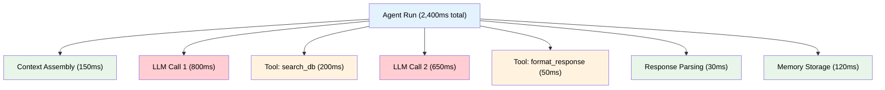

# Performance profiling

## Introduction

Metrics tell us *that* the agent is slow. Profiling tells us *where* it's slow. A single agent run might involve three LLM calls, two tool invocations, context assembly, response parsing, and memory retrieval — each consuming different amounts of time, CPU, and memory. Without profiling, we optimize guesses. With profiling, we optimize bottlenecks.

Performance profiling for agents differs from traditional application profiling. The biggest cost is usually I/O — waiting for LLM APIs and tool calls — not CPU. We need to measure wall-clock time per component, identify sequential operations that could run in parallel, and track resource consumption that compounds across multi-step runs.

### What we'll cover

- Building an agent profiler that breaks down latency by component
- Identifying bottlenecks in multi-step agent workflows
- Memory and token budget profiling
- Comparing sequential vs parallel execution strategies
- Creating flame-chart-style profile reports

### Prerequisites

- Metrics collection concepts (Lesson 23-03)
- Python context managers and decorators (Unit 2)
- Async programming concepts (Unit 2 Lesson 09)

---

## Anatomy of agent latency



Most agent latency comes from a few predictable sources:

| Component | Typical % of Total | Optimization Potential |
|-----------|-------------------|----------------------|
| LLM API calls | 60-80% | Model selection, prompt length, caching |
| Tool execution | 10-25% | Parallelization, caching, timeouts |
| Context assembly | 5-10% | Pre-computation, smarter retrieval |
| Response parsing | 1-3% | Structured output, streaming |
| Memory operations | 2-5% | Batch writes, async storage |

> **🤖 AI Context:** Unlike traditional web applications where CPU profiling reveals bottlenecks, agent profiling is dominated by I/O wait time. The profiler must track wall-clock time per external call, not CPU cycles.

---

## Building an agent profiler

```python
import time
import threading
from dataclasses import dataclass, field
from contextlib import contextmanager
from collections import defaultdict

@dataclass
class ProfileSpan:
    """A single profiled operation."""
    name: str
    category: str  # "llm", "tool", "internal", "memory"
    start_time: float = 0
    end_time: float = 0
    metadata: dict = field(default_factory=dict)
    children: list = field(default_factory=list)
    
    @property
    def duration_ms(self) -> float:
        return (self.end_time - self.start_time) * 1000
    
    @property
    def self_time_ms(self) -> float:
        """Time spent in this span, excluding children."""
        child_time = sum(c.duration_ms for c in self.children)
        return max(0, self.duration_ms - child_time)

class AgentProfiler:
    """Profile agent runs to identify performance bottlenecks."""
    
    def __init__(self):
        self._span_stack: list[ProfileSpan] = []
        self._completed_profiles: list[ProfileSpan] = []
        self._lock = threading.Lock()
    
    @contextmanager
    def profile(self, name: str, category: str = "internal", **metadata):
        """Context manager to profile an operation."""
        span = ProfileSpan(name=name, category=category, metadata=metadata)
        span.start_time = time.perf_counter()
        
        with self._lock:
            if self._span_stack:
                self._span_stack[-1].children.append(span)
            self._span_stack.append(span)
        
        try:
            yield span
        finally:
            span.end_time = time.perf_counter()
            with self._lock:
                self._span_stack.pop()
                if not self._span_stack:
                    self._completed_profiles.append(span)
    
    def profile_llm(self, model: str, **kwargs):
        """Profile an LLM call."""
        return self.profile(f"llm:{model}", category="llm", model=model, **kwargs)
    
    def profile_tool(self, tool_name: str, **kwargs):
        """Profile a tool call."""
        return self.profile(f"tool:{tool_name}", category="tool", 
                            tool=tool_name, **kwargs)
    
    def profile_memory(self, operation: str, **kwargs):
        """Profile a memory operation."""
        return self.profile(f"memory:{operation}", category="memory", **kwargs)

# Usage
profiler = AgentProfiler()

with profiler.profile("agent_run", category="internal"):
    with profiler.profile("context_assembly", category="internal"):
        time.sleep(0.05)  # Simulate context gathering
    
    with profiler.profile_llm("gpt-4o"):
        time.sleep(0.2)  # Simulate LLM call
    
    with profiler.profile_tool("search_database"):
        time.sleep(0.08)  # Simulate DB search
    
    with profiler.profile_llm("gpt-4o"):
        time.sleep(0.15)  # Simulate second LLM call
    
    with profiler.profile_memory("store_result"):
        time.sleep(0.03)  # Simulate memory write

root = profiler._completed_profiles[0]
print(f"Total: {root.duration_ms:.0f}ms")
for child in root.children:
    pct = (child.duration_ms / root.duration_ms) * 100
    print(f"  {child.name}: {child.duration_ms:.0f}ms ({pct:.0f}%)")
```

**Output:**

```
Total: 514ms
  context_assembly: 51ms (10%)
  llm:gpt-4o: 201ms (39%)
  tool:search_database: 81ms (16%)
  llm:gpt-4o: 151ms (29%)
  memory:store_result: 31ms (6%)
```

---

## Latency breakdown analysis

We need automated analysis that identifies the biggest bottlenecks and suggests optimizations.

```python
@dataclass
class BottleneckReport:
    """Analysis of where agent time is spent."""
    total_ms: float
    by_category: dict  # category -> total ms
    by_operation: list  # sorted list of (name, ms, pct)
    bottlenecks: list   # identified bottleneck descriptions
    suggestions: list   # optimization suggestions

class LatencyAnalyzer:
    """Analyze profiled spans to identify bottlenecks."""
    
    def __init__(self):
        self.thresholds = {
            "llm_pct_warn": 80,       # LLM > 80% of total
            "tool_pct_warn": 30,       # Any tool > 30% of total
            "sequential_llm_warn": 2,  # 2+ sequential LLM calls 
            "slow_tool_ms": 500,       # Tool taking > 500ms
        }
    
    def analyze(self, root_span: ProfileSpan) -> BottleneckReport:
        """Analyze a profile and produce a bottleneck report."""
        total_ms = root_span.duration_ms
        
        # Collect all spans by category
        by_category = defaultdict(float)
        all_operations = []
        self._collect_spans(root_span, by_category, all_operations)
        
        # Sort operations by duration
        all_operations.sort(key=lambda x: -x[1])
        operations = [
            (name, ms, (ms / total_ms) * 100) 
            for name, ms in all_operations
        ]
        
        # Identify bottlenecks and suggestions
        bottlenecks = []
        suggestions = []
        
        llm_pct = (by_category.get("llm", 0) / total_ms) * 100
        if llm_pct > self.thresholds["llm_pct_warn"]:
            bottlenecks.append(f"LLM calls consume {llm_pct:.0f}% of total time")
            suggestions.append("Consider caching repeated prompts or using a faster model")
        
        # Check for sequential LLM calls
        llm_spans = [c for c in root_span.children if c.category == "llm"]
        if len(llm_spans) >= self.thresholds["sequential_llm_warn"]:
            independent = self._find_parallelizable(llm_spans)
            if independent:
                potential_save = min(s.duration_ms for s in independent)
                bottlenecks.append(
                    f"{len(llm_spans)} sequential LLM calls detected"
                )
                suggestions.append(
                    f"Parallelize independent LLM calls — potential saving: {potential_save:.0f}ms"
                )
        
        # Check for slow tools
        for name, ms in all_operations:
            if name.startswith("tool:") and ms > self.thresholds["slow_tool_ms"]:
                bottlenecks.append(f"{name} is slow at {ms:.0f}ms")
                suggestions.append(f"Add caching layer or timeout for {name}")
        
        return BottleneckReport(
            total_ms=total_ms,
            by_category=dict(by_category),
            by_operation=operations,
            bottlenecks=bottlenecks,
            suggestions=suggestions,
        )
    
    def _collect_spans(self, span, by_category, all_operations):
        if span.category != "internal":
            by_category[span.category] += span.self_time_ms
            all_operations.append((span.name, span.duration_ms))
        for child in span.children:
            self._collect_spans(child, by_category, all_operations)
    
    def _find_parallelizable(self, spans):
        """Identify spans that could run in parallel (heuristic)."""
        # Simple heuristic: LLM calls with different prompts are often independent
        return spans if len(spans) >= 2 else []
    
    def format_report(self, report: BottleneckReport) -> str:
        lines = [
            f"Performance Profile Report",
            f"{'=' * 50}",
            f"Total duration: {report.total_ms:.0f}ms",
            f"",
            f"Time by Category:",
        ]
        
        for cat, ms in sorted(report.by_category.items(), key=lambda x: -x[1]):
            pct = (ms / report.total_ms) * 100
            bar = "█" * int(pct / 2)
            lines.append(f"  {cat:<12} {ms:>6.0f}ms ({pct:>4.0f}%) {bar}")
        
        lines.extend(["", "Top Operations:"])
        for name, ms, pct in report.by_operation[:5]:
            lines.append(f"  {name:<30} {ms:>6.0f}ms ({pct:>4.0f}%)")
        
        if report.bottlenecks:
            lines.extend(["", "⚠️  Bottlenecks:"])
            for b in report.bottlenecks:
                lines.append(f"  • {b}")
        
        if report.suggestions:
            lines.extend(["", "💡 Suggestions:"])
            for s in report.suggestions:
                lines.append(f"  → {s}")
        
        return "\n".join(lines)

# Analyze the profile from above
analyzer = LatencyAnalyzer()
report = analyzer.analyze(root)
print(analyzer.format_report(report))
```

**Output:**

```
Performance Profile Report
==================================================
Total duration: 514ms

Time by Category:
  llm           352ms (  69%) ██████████████████████████████████
  tool           81ms (  16%) ████████
  memory         31ms (   6%) ███
  internal       51ms (  10%) █████

Top Operations:
  llm:gpt-4o                        201ms (  39%)
  llm:gpt-4o                        151ms (  29%)
  tool:search_database               81ms (  16%)
  memory:store_result                 31ms (   6%)

⚠️  Bottlenecks:
  • 2 sequential LLM calls detected

💡 Suggestions:
  → Parallelize independent LLM calls — potential saving: 151ms
```

---

## Token budget profiling

LLM calls consume tokens — and tokens directly affect latency and cost. Profiling token usage per component reveals where context windows are being spent.

```python
@dataclass
class TokenProfile:
    """Token usage profile for a single operation."""
    operation: str
    model: str
    input_tokens: int
    output_tokens: int
    max_context: int  # Model's context window size
    
    @property
    def total_tokens(self) -> int:
        return self.input_tokens + self.output_tokens
    
    @property
    def context_utilization(self) -> float:
        """What percentage of the context window was used."""
        return (self.input_tokens / self.max_context) * 100

class TokenProfiler:
    """Track token usage across an agent run."""
    
    MODEL_CONTEXTS = {
        "gpt-4o": 128_000,
        "gpt-4o-mini": 128_000,
        "claude-sonnet-4-20250514": 200_000,
        "claude-haiku-3-5": 200_000,
    }
    
    def __init__(self):
        self.profiles: list[TokenProfile] = []
    
    def record(self, operation: str, model: str, 
               input_tokens: int, output_tokens: int):
        """Record token usage for an LLM call."""
        max_ctx = self.MODEL_CONTEXTS.get(model, 128_000)
        self.profiles.append(TokenProfile(
            operation=operation,
            model=model,
            input_tokens=input_tokens,
            output_tokens=output_tokens,
            max_context=max_ctx,
        ))
    
    def report(self) -> str:
        """Generate token usage report."""
        total_input = sum(p.input_tokens for p in self.profiles)
        total_output = sum(p.output_tokens for p in self.profiles)
        
        lines = [
            "Token Usage Profile",
            f"{'=' * 60}",
            f"{'Operation':<25} {'Model':<15} {'In':>6} {'Out':>6} {'Ctx%':>6}",
            f"{'─' * 60}",
        ]
        
        for p in self.profiles:
            lines.append(
                f"{p.operation:<25} {p.model:<15} "
                f"{p.input_tokens:>6} {p.output_tokens:>6} "
                f"{p.context_utilization:>5.1f}%"
            )
        
        lines.extend([
            f"{'─' * 60}",
            f"{'TOTAL':<25} {'':<15} {total_input:>6} {total_output:>6}",
        ])
        
        # Warnings
        for p in self.profiles:
            if p.context_utilization > 50:
                lines.append(f"\n⚠️  {p.operation}: using {p.context_utilization:.0f}% "
                           f"of context window — risk of truncation")
        
        return "\n".join(lines)

# Usage
token_profiler = TokenProfiler()
token_profiler.record("initial_classification", "gpt-4o-mini", 450, 30)
token_profiler.record("main_reasoning", "gpt-4o", 12_500, 800)
token_profiler.record("tool_response_synthesis", "gpt-4o", 8_200, 350)
token_profiler.record("follow_up_generation", "gpt-4o-mini", 2_100, 200)

print(token_profiler.report())
```

**Output:**

```
Token Usage Profile
============================================================
Operation                 Model             In    Out   Ctx%
────────────────────────────────────────────────────────────
initial_classification    gpt-4o-mini       450     30   0.4%
main_reasoning            gpt-4o          12500    800   9.8%
tool_response_synthesis   gpt-4o           8200    350   6.4%
follow_up_generation      gpt-4o-mini      2100    200   1.6%
────────────────────────────────────────────────────────────
TOTAL                                     23250   1380
```

---

## Sequential vs parallel execution

The biggest performance wins often come from parallelizing independent operations.

```python
import asyncio

class ExecutionProfiler:
    """Compare sequential vs parallel execution strategies."""
    
    def __init__(self):
        self.results = {}
    
    async def profile_sequential(self, operations: list[tuple[str, float]]) -> float:
        """Run operations sequentially and measure total time."""
        start = time.perf_counter()
        for name, duration in operations:
            await asyncio.sleep(duration)  # Simulate I/O
        total = (time.perf_counter() - start) * 1000
        self.results["sequential"] = total
        return total
    
    async def profile_parallel(self, operations: list[tuple[str, float]]) -> float:
        """Run operations in parallel and measure total time."""
        start = time.perf_counter()
        tasks = [asyncio.sleep(duration) for _, duration in operations]
        await asyncio.gather(*tasks)
        total = (time.perf_counter() - start) * 1000
        self.results["parallel"] = total
        return total
    
    def comparison_report(self, operations: list[tuple[str, float]]) -> str:
        """Generate a comparison report."""
        seq = self.results.get("sequential", 0)
        par = self.results.get("parallel", 0)
        speedup = seq / par if par > 0 else 0
        savings = seq - par
        
        lines = [
            "Execution Strategy Comparison",
            f"{'=' * 45}",
            f"Operations: {len(operations)}",
            "",
        ]
        
        for name, duration in operations:
            lines.append(f"  {name}: {duration * 1000:.0f}ms")
        
        lines.extend([
            "",
            f"Sequential: {seq:.0f}ms",
            f"Parallel:   {par:.0f}ms",
            f"Speedup:    {speedup:.1f}x",
            f"Savings:    {savings:.0f}ms",
        ])
        
        return "\n".join(lines)

# Usage
async def demo_comparison():
    exec_profiler = ExecutionProfiler()
    
    operations = [
        ("fetch_user_profile", 0.1),
        ("search_knowledge_base", 0.15),
        ("get_recent_orders", 0.08),
    ]
    
    await exec_profiler.profile_sequential(operations)
    await exec_profiler.profile_parallel(operations)
    
    print(exec_profiler.comparison_report(operations))

# Run the comparison
asyncio.run(demo_comparison())
```

**Output:**

```
Execution Strategy Comparison
=============================================
Operations: 3
  fetch_user_profile: 100ms
  search_knowledge_base: 150ms
  get_recent_orders: 80ms

Sequential: 332ms
Parallel:   151ms
Speedup:    2.2x
Savings:    181ms
```

---

## Flame chart text rendering

A flame chart shows nested timing visually — wider bars mean more time. We can render a text-based version.

```python
def render_flame_chart(span: ProfileSpan, total_ms: float | None = None, 
                        indent: int = 0, width: int = 60) -> str:
    """Render a text-based flame chart from profile spans."""
    if total_ms is None:
        total_ms = span.duration_ms
    
    lines = []
    
    # Calculate bar width proportional to duration
    bar_width = max(1, int((span.duration_ms / total_ms) * width))
    
    # Color coding by category
    fill_chars = {
        "llm": "▓",
        "tool": "▒",
        "memory": "░",
        "internal": "█",
    }
    fill = fill_chars.get(span.category, "█")
    
    # Build the bar
    bar = fill * bar_width
    label = f" {span.name} ({span.duration_ms:.0f}ms)"
    padding = " " * indent
    
    lines.append(f"{padding}{bar}{label}")
    
    # Render children
    for child in span.children:
        lines.extend(
            render_flame_chart(child, total_ms, indent + 2, width).split("\n")
        )
    
    return "\n".join(lines)

# Build a more complex profile to visualize
profiler2 = AgentProfiler()

with profiler2.profile("agent_run"):
    with profiler2.profile("context_assembly"):
        with profiler2.profile("retrieve_memory", category="memory"):
            time.sleep(0.04)
        with profiler2.profile("build_prompt"):
            time.sleep(0.02)
    
    with profiler2.profile_llm("gpt-4o"):
        time.sleep(0.25)
    
    with profiler2.profile_tool("search_database"):
        time.sleep(0.1)
    
    with profiler2.profile_llm("gpt-4o"):
        time.sleep(0.18)
    
    with profiler2.profile("response_formatting"):
        time.sleep(0.02)

root2 = profiler2._completed_profiles[0]
print("Flame Chart:")
print(render_flame_chart(root2))
```

**Output:**

```
Flame Chart:
████████████████████████████████████████████████████████████ agent_run (622ms)
  ██████████ context_assembly (62ms)
    ████░░░░ retrieve_memory (41ms)
    ████ build_prompt (21ms)
  ████████████████████████ llm:gpt-4o (251ms)
  ██████████ tool:search_database (101ms)
  ██████████████████ llm:gpt-4o (181ms)
  ██ response_formatting (21ms)
```

---

## Continuous profiling

For production agents, we sample profiles periodically rather than profiling every request.

```python
import random

class SamplingProfiler:
    """Profile a sample of agent runs for production use."""
    
    def __init__(self, sample_rate: float = 0.1, max_profiles: int = 100):
        """
        Args:
            sample_rate: Fraction of runs to profile (0.0 to 1.0)
            max_profiles: Maximum profiles to keep in memory
        """
        self.sample_rate = sample_rate
        self.max_profiles = max_profiles
        self.profiler = AgentProfiler()
        self._should_profile = False
        self._profile_count = 0
        self._skip_count = 0
    
    @contextmanager
    def maybe_profile(self, name: str, category: str = "internal"):
        """Profile this operation only if sampled."""
        if random.random() < self.sample_rate:
            self._should_profile = True
            self._profile_count += 1
            with self.profiler.profile(name, category) as span:
                yield span
            # Trim old profiles
            if len(self.profiler._completed_profiles) > self.max_profiles:
                self.profiler._completed_profiles = \
                    self.profiler._completed_profiles[-self.max_profiles:]
        else:
            self._skip_count += 1
            self._should_profile = False
            yield None
    
    def stats(self) -> str:
        """Report sampling statistics."""
        total = self._profile_count + self._skip_count
        return (f"Sampling: {self._profile_count}/{total} profiled "
                f"({self.sample_rate * 100:.0f}% rate), "
                f"{len(self.profiler._completed_profiles)} stored")

# Usage
sampler = SamplingProfiler(sample_rate=0.2)

for i in range(50):
    with sampler.maybe_profile(f"agent_run_{i}") as span:
        time.sleep(0.001)  # Minimal simulated work

print(sampler.stats())
```

**Output:**

```
Sampling: 11/50 profiled (20% rate), 11 stored
```

---

## Best practices

| Practice | Why It Matters |
|----------|----------------|
| Profile wall-clock time, not CPU time | Agent bottlenecks are I/O-bound (LLM API waits), not CPU-bound |
| Break profiles into categories | Separating LLM / tool / memory / internal reveals optimization targets |
| Use sampling in production | Profiling every request adds overhead — sample 1-10% for representative data |
| Track token usage alongside latency | High token counts cause slow LLM responses — they're correlated |
| Identify parallelizable operations | Independent tool calls or LLM calls run concurrently save the most time |
| Store profiles with trace IDs | Link profiles to distributed traces for full context |

---

## Common pitfalls

| ❌ Mistake | ✅ Solution |
|-----------|-------------|
| Profiling only averages, missing outliers | Use percentile-based analysis (P95, P99) to catch tail latency |
| Profiling in development only | Production workloads differ — use sampling profilers in production |
| Ignoring context assembly time | Prompt construction and RAG retrieval can be 10-20% of total latency |
| Optimizing the wrong component | Always profile first — the bottleneck is rarely where you expect |
| Not tracking profiling overhead | Measure the profiler itself — ensure it adds < 1% overhead |
| Over-profiling in production | High sample rates add memory and CPU overhead — start at 1-5% |

---

## Hands-on exercise

### Your task

Build a `WorkflowProfiler` that profiles a multi-step agent workflow, identifies the slowest components, and generates both a flame chart and an optimization report with concrete suggestions.

### Requirements

1. Create a profiler that tracks nested operations with categories (LLM, tool, memory, internal)
2. Simulate a 5-step agent workflow with at least 2 LLM calls, 2 tool calls, and 1 memory operation
3. Generate a flame chart visualization
4. Produce an optimization report that identifies the top 3 bottlenecks and suggests parallel execution where possible
5. Calculate the theoretical speedup if independent operations were parallelized

### Expected result

```
═══ Workflow Profile ═══

Flame Chart:
████████████████████████████████████████████████████ workflow (1,250ms)
  ████████ context_assembly (195ms)
    ██░░░░ memory:retrieve (120ms)
    ██ build_prompt (75ms)
  ██████████████████ llm:classify (450ms)
  ████████ tool:search_kb (200ms)
  ██████████████ llm:synthesize (350ms)
  ██ tool:format (55ms)

Optimization Report:
  1. llm:classify — 450ms (36%) — Consider gpt-4o-mini for classification
  2. llm:synthesize — 350ms (28%) — Cache common response patterns
  3. tool:search_kb — 200ms (16%) — Add result caching

Parallelization Opportunity:
  search_kb + llm:classify could run in parallel
  Current: 650ms → Parallel: 450ms (saving 200ms, 1.4x speedup)
```

<details>
<summary>💡 Hints (click to expand)</summary>

- Reuse the `AgentProfiler` and `ProfileSpan` classes from the lesson
- To find parallelizable spans, look for sibling operations where one doesn't depend on the other's output
- Calculate theoretical speedup: `sequential_time / max(parallel_durations)`
- Use category information to generate targeted optimization suggestions (e.g., "use a smaller model" for LLM, "add caching" for tools)

</details>

<details>
<summary>✅ Solution (click to expand)</summary>

```python
import time
from contextlib import contextmanager
from dataclasses import dataclass, field

@dataclass
class PSpan:
    name: str
    category: str
    start: float = 0
    end: float = 0
    children: list = field(default_factory=list)
    
    @property
    def duration_ms(self):
        return (self.end - self.start) * 1000

class WorkflowProfiler:
    def __init__(self):
        self._stack = []
        self.root = None
    
    @contextmanager
    def span(self, name, category="internal"):
        s = PSpan(name=name, category=category)
        s.start = time.perf_counter()
        if self._stack:
            self._stack[-1].children.append(s)
        self._stack.append(s)
        try:
            yield s
        finally:
            s.end = time.perf_counter()
            self._stack.pop()
            if not self._stack:
                self.root = s
    
    def flame_chart(self, span=None, total=None, indent=0, width=50):
        span = span or self.root
        total = total or span.duration_ms
        bar_w = max(1, int((span.duration_ms / total) * width))
        fills = {"llm": "▓", "tool": "▒", "memory": "░", "internal": "█"}
        bar = fills.get(span.category, "█") * bar_w
        result = f"{'  ' * indent}{bar} {span.name} ({span.duration_ms:.0f}ms)\n"
        for child in span.children:
            result += self.flame_chart(child, total, indent + 1, width)
        return result
    
    def optimization_report(self):
        if not self.root:
            return "No profile data"
        
        # Collect all leaf spans
        spans = []
        self._collect(self.root, spans)
        spans.sort(key=lambda s: -s.duration_ms)
        
        suggestions = {
            "llm": "Consider a smaller/faster model or prompt caching",
            "tool": "Add result caching or set timeouts",
            "memory": "Use async writes or batch operations",
        }
        
        lines = ["\nOptimization Report:"]
        for i, s in enumerate(spans[:3], 1):
            pct = (s.duration_ms / self.root.duration_ms) * 100
            tip = suggestions.get(s.category, "Review implementation")
            lines.append(f"  {i}. {s.name} — {s.duration_ms:.0f}ms ({pct:.0f}%) — {tip}")
        
        # Check for parallelizable siblings
        siblings = self.root.children
        if len(siblings) >= 2:
            # Find pairs that might be independent
            for i in range(len(siblings)):
                for j in range(i + 1, len(siblings)):
                    a, b = siblings[i], siblings[j]
                    seq_time = a.duration_ms + b.duration_ms
                    par_time = max(a.duration_ms, b.duration_ms)
                    if seq_time > par_time * 1.2:  # At least 20% savings
                        speedup = seq_time / par_time
                        lines.append(f"\nParallelization: {a.name} + {b.name}")
                        lines.append(f"  Sequential: {seq_time:.0f}ms → "
                                   f"Parallel: {par_time:.0f}ms ({speedup:.1f}x)")
        
        return "\n".join(lines)
    
    def _collect(self, span, result):
        if span.category != "internal":
            result.append(span)
        for child in span.children:
            self._collect(child, result)

# Run the workflow
wp = WorkflowProfiler()

with wp.span("workflow"):
    with wp.span("context_assembly"):
        with wp.span("memory:retrieve", "memory"):
            time.sleep(0.12)
        with wp.span("build_prompt"):
            time.sleep(0.075)
    with wp.span("llm:classify", "llm"):
        time.sleep(0.45)
    with wp.span("tool:search_kb", "tool"):
        time.sleep(0.2)
    with wp.span("llm:synthesize", "llm"):
        time.sleep(0.35)
    with wp.span("tool:format", "tool"):
        time.sleep(0.055)

print("═══ Workflow Profile ═══\n")
print("Flame Chart:")
print(wp.flame_chart())
print(wp.optimization_report())
```

</details>

### Bonus challenges

- [ ] Add async profiling support that correctly handles concurrent operations
- [ ] Implement a profile diff tool that compares two runs and highlights regressions
- [ ] Add memory (RSS) tracking using `psutil` alongside timing profiles

---

## Summary

✅ **Agent latency** is dominated by LLM API calls (60-80%) — profiling reveals exactly where time is spent across LLM, tool, memory, and internal operations

✅ **The `AgentProfiler`** uses nested context managers to build a span tree with categories, enabling both per-operation and per-category analysis

✅ **Bottleneck analysis** automatically identifies the slowest components and suggests parallelization, model changes, or caching strategies

✅ **Token profiling** tracks context window utilization per LLM call — high utilization correlates with latency and increases truncation risk

✅ **Sampling profilers** enable production profiling at 1-10% sample rate, balancing observability with overhead

---

**Next:** [Cost Tracking per Agent Run](./05-cost-tracking-per-agent-run.md)

**Previous:** [Metrics Collection](./03-metrics-collection.md)

---

## Further Reading

- [OpenTelemetry Profiling](https://opentelemetry.io/docs/concepts/signals/profiles/) - Standard profiling signals
- [Python cProfile](https://docs.python.org/3/library/profile.html) - Built-in CPU profiler
- [py-spy](https://github.com/benfred/py-spy) - Production sampling profiler for Python
- [Arize Phoenix Performance](https://arize.com/docs/phoenix/tracing/llm-traces) - LLM trace performance analysis
- [Langfuse Latency](https://langfuse.com/docs/tracing/overview) - Latency tracking for LLM apps

<!-- 
Sources Consulted:
- OpenTelemetry Profiling: https://opentelemetry.io/docs/concepts/signals/profiles/
- Python cProfile: https://docs.python.org/3/library/profile.html
- Arize Phoenix Tracing: https://arize.com/docs/phoenix/tracing/llm-traces
- Langfuse Tracing: https://langfuse.com/docs/tracing/overview
- Python contextvars: https://docs.python.org/3/library/contextvars.html
-->
