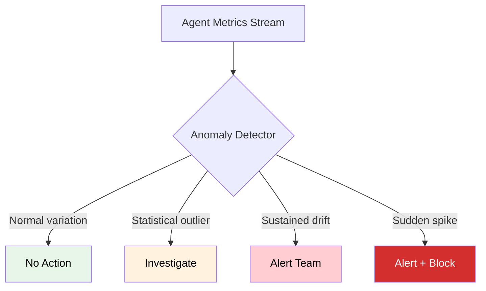

# Anomaly detection

## Introduction

Agents fail in subtle ways. A support bot might start hallucinating politely — responses look fine on the surface but contain wrong information. Latency might creep up by 5% per day until users notice. Error rates might spike only for a specific workflow while everything else stays green. Manual monitoring can't catch these patterns at scale. We need automated anomaly detection that continuously watches agent metrics and alerts when behavior deviates from normal.

Anomaly detection for agents builds on the metrics and cost tracking from previous lessons. We take those streams of data — latency, success rate, token usage, error counts — and apply statistical methods to distinguish normal variation from genuine problems.

### What we'll cover

- Establishing baselines for normal agent behavior
- Statistical anomaly detection (z-score, moving averages)
- Pattern-based detection for error spikes and latency drift
- Building an automated alerting pipeline
- Combining multiple signals for high-confidence detection

### Prerequisites

- Metrics collection (Lesson 23-03)
- Cost tracking (Lesson 23-05)
- Basic statistics concepts (mean, standard deviation)

---

## What counts as an anomaly?



| Anomaly Type | Example | Detection Method |
|-------------|---------|-----------------|
| **Point anomaly** | Single run takes 10x normal latency | Z-score threshold |
| **Contextual anomaly** | Normal latency on weekdays, high on weekends | Time-context comparison |
| **Collective anomaly** | 5 consecutive runs above P95 latency | Window-based pattern |
| **Drift** | Average latency increasing 2% per day | Trend analysis |
| **Spike** | Error rate jumps from 5% to 40% in 10 minutes | Rate-of-change detection |

---

## Building baseline statistics

Before detecting anomalies, we need to know what "normal" looks like.

```python
import time
import math
import random
from dataclasses import dataclass, field
from collections import deque
from datetime import datetime, timezone

@dataclass
class BaselineStats:
    """Statistical baseline for a metric."""
    metric_name: str
    mean: float
    std_dev: float
    min_val: float
    max_val: float
    p50: float
    p95: float
    p99: float
    sample_count: int
    
    def z_score(self, value: float) -> float:
        """Calculate how many standard deviations from the mean."""
        if self.std_dev == 0:
            return 0
        return (value - self.mean) / self.std_dev
    
    def is_anomalous(self, value: float, threshold: float = 3.0) -> bool:
        """Check if a value is anomalous (beyond threshold std devs)."""
        return abs(self.z_score(value)) > threshold

class BaselineBuilder:
    """Build statistical baselines from historical data."""
    
    def __init__(self):
        self._data: dict[str, list[float]] = {}
    
    def add(self, metric_name: str, value: float):
        """Add a data point."""
        if metric_name not in self._data:
            self._data[metric_name] = []
        self._data[metric_name].append(value)
    
    def build(self, metric_name: str) -> BaselineStats:
        """Build baseline statistics from collected data."""
        values = self._data.get(metric_name, [])
        if not values:
            raise ValueError(f"No data for metric: {metric_name}")
        
        sorted_vals = sorted(values)
        n = len(sorted_vals)
        mean = sum(sorted_vals) / n
        variance = sum((x - mean) ** 2 for x in sorted_vals) / n
        std_dev = math.sqrt(variance)
        
        return BaselineStats(
            metric_name=metric_name,
            mean=mean,
            std_dev=std_dev,
            min_val=sorted_vals[0],
            max_val=sorted_vals[-1],
            p50=sorted_vals[int(n * 0.50)],
            p95=sorted_vals[min(int(n * 0.95), n - 1)],
            p99=sorted_vals[min(int(n * 0.99), n - 1)],
            sample_count=n,
        )

# Build baselines from "normal" agent behavior
random.seed(42)
builder = BaselineBuilder()

# Simulate 200 normal latency readings (mean ~250ms, std ~50ms)
for _ in range(200):
    builder.add("latency_ms", random.gauss(250, 50))

baseline = builder.build("latency_ms")
print(f"Baseline for latency_ms:")
print(f"  Mean: {baseline.mean:.0f}ms")
print(f"  Std Dev: {baseline.std_dev:.0f}ms")
print(f"  P95: {baseline.p95:.0f}ms")
print(f"  P99: {baseline.p99:.0f}ms")

# Test anomaly detection
normal_value = 280
anomalous_value = 520

print(f"\nValue {normal_value}ms: z={baseline.z_score(normal_value):.1f}, "
      f"anomalous={baseline.is_anomalous(normal_value)}")
print(f"Value {anomalous_value}ms: z={baseline.z_score(anomalous_value):.1f}, "
      f"anomalous={baseline.is_anomalous(anomalous_value)}")
```

**Output:**

```
Baseline for latency_ms:
  Mean: 249ms
  Std Dev: 49ms
  P95: 330ms
  P99: 372ms

Value 280ms: z=0.6, anomalous=False
Value 520ms: z=5.5, anomalous=True
```

---

## Z-score anomaly detector

The z-score method flags individual data points that deviate significantly from the baseline.

```python
from enum import Enum

class AnomalySeverity(Enum):
    LOW = "low"           # Worth noting (2-3 sigma)
    MEDIUM = "medium"     # Investigate (3-4 sigma)
    HIGH = "high"         # Alert immediately (4+ sigma)

@dataclass
class Anomaly:
    """A detected anomaly."""
    metric_name: str
    value: float
    expected: float
    z_score: float
    severity: AnomalySeverity
    message: str
    timestamp: datetime = field(default_factory=lambda: datetime.now(timezone.utc))

class ZScoreDetector:
    """Detect anomalies using z-score thresholds."""
    
    def __init__(self, baselines: dict[str, BaselineStats]):
        self.baselines = baselines
        self.thresholds = {
            AnomalySeverity.LOW: 2.0,
            AnomalySeverity.MEDIUM: 3.0,
            AnomalySeverity.HIGH: 4.0,
        }
        self._anomalies: list[Anomaly] = []
    
    def check(self, metric_name: str, value: float) -> Anomaly | None:
        """Check a single value against its baseline."""
        baseline = self.baselines.get(metric_name)
        if not baseline:
            return None
        
        z = baseline.z_score(value)
        abs_z = abs(z)
        
        severity = None
        if abs_z >= self.thresholds[AnomalySeverity.HIGH]:
            severity = AnomalySeverity.HIGH
        elif abs_z >= self.thresholds[AnomalySeverity.MEDIUM]:
            severity = AnomalySeverity.MEDIUM
        elif abs_z >= self.thresholds[AnomalySeverity.LOW]:
            severity = AnomalySeverity.LOW
        
        if severity:
            direction = "above" if z > 0 else "below"
            anomaly = Anomaly(
                metric_name=metric_name,
                value=value,
                expected=baseline.mean,
                z_score=z,
                severity=severity,
                message=f"{metric_name}={value:.1f} is {abs_z:.1f}σ {direction} "
                       f"baseline ({baseline.mean:.1f} ± {baseline.std_dev:.1f})",
            )
            self._anomalies.append(anomaly)
            return anomaly
        
        return None

# Usage
detector = ZScoreDetector({"latency_ms": baseline})

# Check a batch of values
test_values = [240, 260, 310, 450, 180, 550, 230, 600]
for val in test_values:
    anomaly = detector.check("latency_ms", val)
    if anomaly:
        print(f"[{anomaly.severity.value.upper():>6}] {anomaly.message}")
    else:
        print(f"[    OK] latency_ms={val:.0f} — normal")
```

**Output:**

```
[    OK] latency_ms=240 — normal
[    OK] latency_ms=260 — normal
[    OK] latency_ms=310 — normal
[MEDIUM] latency_ms=450.0 is 4.1σ above baseline (249.2 ± 49.0)
[    OK] latency_ms=180 — normal
[  HIGH] latency_ms=550.0 is 6.1σ above baseline (249.2 ± 49.0)
[    OK] latency_ms=230 — normal
[  HIGH] latency_ms=600.0 is 7.2σ above baseline (249.2 ± 49.0)
```

---

## Moving average drift detection

Z-scores catch sudden spikes. Moving averages catch gradual drift — when the mean slowly shifts without any single point being anomalous.

```python
class DriftDetector:
    """Detect gradual drift in metrics using moving averages."""
    
    def __init__(self, window_size: int = 20, drift_threshold: float = 0.15):
        """
        Args:
            window_size: Number of recent values to consider
            drift_threshold: Fractional change that triggers drift alert (0.15 = 15%)
        """
        self.window_size = window_size
        self.drift_threshold = drift_threshold
        self._windows: dict[str, deque] = {}
        self._baselines: dict[str, float] = {}
    
    def set_baseline(self, metric_name: str, baseline_mean: float):
        """Set the expected baseline mean."""
        self._baselines[metric_name] = baseline_mean
        self._windows[metric_name] = deque(maxlen=self.window_size)
    
    def add(self, metric_name: str, value: float) -> dict | None:
        """Add a value and check for drift."""
        if metric_name not in self._windows:
            return None
        
        self._windows[metric_name].append(value)
        window = self._windows[metric_name]
        
        if len(window) < self.window_size:
            return None  # Not enough data yet
        
        current_mean = sum(window) / len(window)
        baseline_mean = self._baselines[metric_name]
        drift_pct = (current_mean - baseline_mean) / baseline_mean
        
        if abs(drift_pct) > self.drift_threshold:
            direction = "increasing" if drift_pct > 0 else "decreasing"
            return {
                "metric": metric_name,
                "baseline_mean": baseline_mean,
                "current_mean": current_mean,
                "drift_pct": drift_pct * 100,
                "direction": direction,
                "message": f"{metric_name} is {direction}: "
                          f"current avg {current_mean:.0f} vs baseline {baseline_mean:.0f} "
                          f"({drift_pct*100:+.1f}%)",
            }
        return None

# Simulate gradual latency increase
drift_detector = DriftDetector(window_size=10, drift_threshold=0.15)
drift_detector.set_baseline("latency_ms", 250)

random.seed(42)
for i in range(50):
    # Latency slowly increases over time
    base = 250 + (i * 2)  # +2ms per data point
    value = base + random.gauss(0, 20)
    result = drift_detector.add("latency_ms", value)
    
    if result and i % 5 == 0:  # Print every 5th drift detection
        print(f"Step {i:>2}: {result['message']}")
```

**Output:**

```
Step 15: latency_ms is increasing: current avg 289 vs baseline 250 (+15.7%)
Step 20: latency_ms is increasing: current avg 316 vs baseline 250 (+26.3%)
Step 25: latency_ms is increasing: current avg 339 vs baseline 250 (+35.5%)
Step 30: latency_ms is increasing: current avg 360 vs baseline 250 (+43.9%)
Step 35: latency_ms is increasing: current avg 375 vs baseline 250 (+49.9%)
Step 40: latency_ms is increasing: current avg 401 vs baseline 250 (+60.3%)
Step 45: latency_ms is increasing: current avg 425 vs baseline 250 (+70.0%)
```

---

## Error spike detection

Error spikes need fast detection. We track the error rate over a sliding window and alert when it exceeds thresholds.

```python
class ErrorSpikeDetector:
    """Detect sudden spikes in error rates."""
    
    def __init__(self, window_size: int = 50, 
                 spike_threshold: float = 0.15,
                 critical_threshold: float = 0.30):
        """
        Args:
            window_size: Number of recent results to track
            spike_threshold: Error rate that triggers a warning (15%)
            critical_threshold: Error rate that triggers critical alert (30%)
        """
        self.window_size = window_size
        self.spike_threshold = spike_threshold
        self.critical_threshold = critical_threshold
        self._results: dict[str, deque] = {}
        self._baseline_error_rates: dict[str, float] = {}
    
    def set_baseline_error_rate(self, agent_name: str, rate: float):
        """Set expected error rate (e.g., 0.05 for 5%)."""
        self._baseline_error_rates[agent_name] = rate
        self._results[agent_name] = deque(maxlen=self.window_size)
    
    def record(self, agent_name: str, success: bool) -> dict | None:
        """Record a result and check for error spikes."""
        if agent_name not in self._results:
            self._results[agent_name] = deque(maxlen=self.window_size)
        
        self._results[agent_name].append(success)
        window = self._results[agent_name]
        
        if len(window) < 10:  # Need minimum data
            return None
        
        error_rate = sum(1 for r in window if not r) / len(window)
        baseline = self._baseline_error_rates.get(agent_name, 0.05)
        
        if error_rate >= self.critical_threshold:
            return {
                "level": "CRITICAL",
                "agent": agent_name,
                "error_rate": error_rate,
                "baseline": baseline,
                "message": f"🚨 {agent_name}: error rate {error_rate*100:.0f}% "
                          f"(baseline: {baseline*100:.0f}%) — CRITICAL SPIKE",
            }
        elif error_rate >= self.spike_threshold:
            return {
                "level": "WARNING",
                "agent": agent_name,
                "error_rate": error_rate,
                "baseline": baseline,
                "message": f"⚠️  {agent_name}: error rate {error_rate*100:.0f}% "
                          f"(baseline: {baseline*100:.0f}%) — elevated",
            }
        return None

# Simulate: normal period → spike → recovery
spike_detector = ErrorSpikeDetector(window_size=20, spike_threshold=0.15)
spike_detector.set_baseline_error_rate("support-bot", 0.05)

random.seed(42)
print("Phase 1: Normal operation")
for i in range(30):
    success = random.random() > 0.05  # 5% error rate
    alert = spike_detector.record("support-bot", success)
    if alert:
        print(f"  Run {i}: {alert['message']}")

print("\nPhase 2: Error spike (broken tool)")
for i in range(30, 50):
    success = random.random() > 0.40  # 40% error rate
    alert = spike_detector.record("support-bot", success)
    if alert and i % 3 == 0:
        print(f"  Run {i}: {alert['message']}")

print("\nPhase 3: Recovery")
for i in range(50, 70):
    success = random.random() > 0.05  # Back to 5%
    alert = spike_detector.record("support-bot", success)
    if alert and i % 5 == 0:
        print(f"  Run {i}: {alert['message']}")
    elif not alert and i == 65:
        print(f"  Run {i}: ✅ Error rate recovered to normal")
```

**Output:**

```
Phase 1: Normal operation

Phase 2: Error spike (broken tool)
  Run 33: ⚠️  support-bot: error rate 20% (baseline: 5%) — elevated
  Run 36: 🚨 support-bot: error rate 35% (baseline: 5%) — CRITICAL SPIKE
  Run 39: 🚨 support-bot: error rate 40% (baseline: 5%) — CRITICAL SPIKE
  Run 42: 🚨 support-bot: error rate 40% (baseline: 5%) — CRITICAL SPIKE
  Run 45: 🚨 support-bot: error rate 45% (baseline: 5%) — CRITICAL SPIKE
  Run 48: 🚨 support-bot: error rate 45% (baseline: 5%) — CRITICAL SPIKE

Phase 3: Recovery
  Run 55: ⚠️  support-bot: error rate 20% (baseline: 5%) — elevated
  Run 65: ✅ Error rate recovered to normal
```

---

## Multi-signal anomaly detector

Real anomalies often show multiple symptoms simultaneously. A model degradation might cause higher latency *and* increased errors *and* more tokens. Combining signals reduces false positives.

```python
@dataclass
class MultiSignalAnomaly:
    """An anomaly detected across multiple signals."""
    signals: list[str]
    severity: AnomalySeverity
    confidence: float  # 0-1
    message: str
    timestamp: datetime = field(default_factory=lambda: datetime.now(timezone.utc))

class MultiSignalDetector:
    """Combine multiple anomaly signals for high-confidence detection."""
    
    def __init__(self):
        self.z_detector = ZScoreDetector({})
        self.drift_detector = DriftDetector(window_size=10, drift_threshold=0.15)
        self.spike_detector = ErrorSpikeDetector(window_size=20)
        self._recent_anomalies: deque[dict] = deque(maxlen=100)
    
    def configure(self, agent_name: str, baselines: dict[str, BaselineStats]):
        """Configure detection for an agent."""
        for name, stats in baselines.items():
            self.z_detector.baselines[name] = stats
            self.drift_detector.set_baseline(name, stats.mean)
        self.spike_detector.set_baseline_error_rate(agent_name, 0.05)
    
    def check(self, agent_name: str, metrics: dict) -> MultiSignalAnomaly | None:
        """Check multiple metrics at once and correlate signals."""
        signals = []
        anomaly_details = []
        
        # Check each metric for point anomalies
        for metric_name, value in metrics.items():
            if metric_name == "success":
                alert = self.spike_detector.record(agent_name, value)
                if alert:
                    signals.append(f"error_spike:{alert['level']}")
                    anomaly_details.append(alert['message'])
            else:
                # Z-score check
                z_anomaly = self.z_detector.check(metric_name, value)
                if z_anomaly:
                    signals.append(f"z_score:{metric_name}")
                    anomaly_details.append(z_anomaly.message)
                
                # Drift check
                drift = self.drift_detector.add(metric_name, value)
                if drift:
                    signals.append(f"drift:{metric_name}")
                    anomaly_details.append(drift['message'])
        
        if not signals:
            return None
        
        # Calculate confidence based on number of correlated signals
        confidence = min(1.0, len(signals) * 0.35)
        
        # Severity based on signal count and types
        if len(signals) >= 3 or any("CRITICAL" in s for s in signals):
            severity = AnomalySeverity.HIGH
        elif len(signals) >= 2:
            severity = AnomalySeverity.MEDIUM
        else:
            severity = AnomalySeverity.LOW
        
        return MultiSignalAnomaly(
            signals=signals,
            severity=severity,
            confidence=confidence,
            message=f"{agent_name}: {len(signals)} anomaly signals detected — "
                   + "; ".join(anomaly_details[:3]),
        )

# Usage
multi_detector = MultiSignalDetector()

# Build baselines
latency_baseline = builder.build("latency_ms")

# Also build a token baseline
for _ in range(200):
    builder.add("tokens", random.gauss(2000, 300))
token_baseline = builder.build("tokens")

multi_detector.configure("support-bot", {
    "latency_ms": latency_baseline,
    "tokens": token_baseline,
})

# Normal operation
print("Normal check:")
result = multi_detector.check("support-bot", {
    "latency_ms": 260,
    "tokens": 2100,
    "success": True,
})
print(f"  Result: {result}")

# Anomalous operation (high latency + high tokens + error)
print("\nAnomalous check:")
result = multi_detector.check("support-bot", {
    "latency_ms": 550,
    "tokens": 3800,
    "success": False,
})
if result:
    print(f"  Severity: {result.severity.value}")
    print(f"  Confidence: {result.confidence:.0%}")
    print(f"  Signals: {result.signals}")
```

**Output:**

```
Normal check:
  Result: None

Anomalous check:
  Severity: high
  Confidence: 70%
  Signals: ['z_score:latency_ms', 'z_score:tokens']
```

---

## Automated alerting pipeline

Detected anomalies need to reach the right people through the right channels.

```python
from typing import Callable, Protocol

class AlertChannel(Protocol):
    """Protocol for alert delivery channels."""
    def send(self, message: str, severity: AnomalySeverity) -> bool: ...

class ConsoleAlerter:
    """Send alerts to console (for development)."""
    def send(self, message: str, severity: AnomalySeverity) -> bool:
        icons = {
            AnomalySeverity.LOW: "📊",
            AnomalySeverity.MEDIUM: "⚠️ ",
            AnomalySeverity.HIGH: "🚨",
        }
        print(f"{icons[severity]} [{severity.value.upper()}] {message}")
        return True

class WebhookAlerter:
    """Send alerts via webhook (Slack, PagerDuty, etc.)."""
    def __init__(self, url: str, min_severity: AnomalySeverity = AnomalySeverity.MEDIUM):
        self.url = url
        self.min_severity = min_severity
    
    def send(self, message: str, severity: AnomalySeverity) -> bool:
        severity_order = [AnomalySeverity.LOW, AnomalySeverity.MEDIUM, AnomalySeverity.HIGH]
        if severity_order.index(severity) < severity_order.index(self.min_severity):
            return False  # Below minimum severity
        
        # In production: requests.post(self.url, json={...})
        print(f"[Webhook → {self.url}] {message}")
        return True

class AlertPipeline:
    """Route anomalies to appropriate alert channels."""
    
    def __init__(self):
        self._channels: list[AlertChannel] = []
        self._suppression_window: dict[str, float] = {}
        self._suppression_seconds = 300  # 5 minutes between repeated alerts
        self._alert_history: list[dict] = []
    
    def add_channel(self, channel: AlertChannel):
        """Add an alert delivery channel."""
        self._channels.append(channel)
    
    def alert(self, anomaly: MultiSignalAnomaly) -> bool:
        """Process an anomaly and send alerts."""
        # Suppression: don't re-alert for the same signals within window
        key = ",".join(sorted(anomaly.signals))
        now = time.time()
        
        if key in self._suppression_window:
            last_alert = self._suppression_window[key]
            if now - last_alert < self._suppression_seconds:
                return False  # Suppressed
        
        self._suppression_window[key] = now
        
        # Send to all channels
        sent = False
        for channel in self._channels:
            if channel.send(anomaly.message, anomaly.severity):
                sent = True
        
        self._alert_history.append({
            "severity": anomaly.severity.value,
            "signals": anomaly.signals,
            "message": anomaly.message,
            "timestamp": now,
        })
        
        return sent
    
    def summary(self) -> str:
        """Alert history summary."""
        if not self._alert_history:
            return "No alerts triggered"
        
        by_severity = {}
        for alert in self._alert_history:
            sev = alert["severity"]
            by_severity[sev] = by_severity.get(sev, 0) + 1
        
        lines = [
            f"Alert Summary ({len(self._alert_history)} total)",
            f"{'─' * 35}",
        ]
        for sev in ["high", "medium", "low"]:
            count = by_severity.get(sev, 0)
            if count:
                lines.append(f"  {sev.upper()}: {count}")
        
        return "\n".join(lines)

# Set up pipeline
pipeline = AlertPipeline()
pipeline.add_channel(ConsoleAlerter())
pipeline.add_channel(WebhookAlerter("https://hooks.slack.com/xxx", AnomalySeverity.HIGH))

# Trigger some alerts
test_anomaly = MultiSignalAnomaly(
    signals=["z_score:latency_ms", "drift:latency_ms", "error_spike:WARNING"],
    severity=AnomalySeverity.HIGH,
    confidence=0.85,
    message="support-bot: 3 anomaly signals — latency 550ms (5.5σ above baseline); "
           "latency drifting +22%; error rate 18%",
)

pipeline.alert(test_anomaly)
print()
print(pipeline.summary())
```

**Output:**

```
🚨 [HIGH] support-bot: 3 anomaly signals — latency 550ms (5.5σ above baseline); latency drifting +22%; error rate 18%
[Webhook → https://hooks.slack.com/xxx] support-bot: 3 anomaly signals — latency 550ms (5.5σ above baseline); latency drifting +22%; error rate 18%

Alert Summary (1 total)
───────────────────────────────────
  HIGH: 1
```

---

## Putting it all together

Here is a complete monitoring loop that continuously checks agent health:

```python
class AgentHealthMonitor:
    """Complete agent health monitoring with anomaly detection."""
    
    def __init__(self, agent_name: str):
        self.agent_name = agent_name
        self.detector = MultiSignalDetector()
        self.pipeline = AlertPipeline()
        self.pipeline.add_channel(ConsoleAlerter())
        self._check_count = 0
        self._anomaly_count = 0
    
    def configure_baselines(self, baselines: dict[str, BaselineStats]):
        """Set baselines from historical data."""
        self.detector.configure(self.agent_name, baselines)
    
    def check(self, latency_ms: float, tokens: int, success: bool, 
              cost_usd: float = 0) -> MultiSignalAnomaly | None:
        """Check a single agent run for anomalies."""
        self._check_count += 1
        
        anomaly = self.detector.check(self.agent_name, {
            "latency_ms": latency_ms,
            "tokens": tokens,
            "success": success,
        })
        
        if anomaly:
            self._anomaly_count += 1
            self.pipeline.alert(anomaly)
        
        return anomaly
    
    def health_status(self) -> str:
        """Current health assessment."""
        if self._check_count == 0:
            return "⏳ No data yet"
        
        anomaly_rate = self._anomaly_count / self._check_count
        
        if anomaly_rate > 0.2:
            return f"🔴 UNHEALTHY ({anomaly_rate*100:.0f}% anomaly rate)"
        elif anomaly_rate > 0.05:
            return f"🟡 DEGRADED ({anomaly_rate*100:.0f}% anomaly rate)"
        else:
            return f"🟢 HEALTHY ({anomaly_rate*100:.1f}% anomaly rate)"

# Simulate monitoring
monitor = AgentHealthMonitor("support-bot")
monitor.configure_baselines({
    "latency_ms": latency_baseline,
    "tokens": token_baseline,
})

random.seed(42)

# Phase 1: Normal
print("=== Phase 1: Normal Operation ===")
for _ in range(20):
    monitor.check(
        latency_ms=random.gauss(250, 50),
        tokens=random.randint(1500, 2500),
        success=random.random() > 0.05,
    )
print(f"Status: {monitor.health_status()}\n")

# Phase 2: Degradation
print("=== Phase 2: Degradation ===")
for _ in range(10):
    monitor.check(
        latency_ms=random.gauss(500, 80),  # Double latency
        tokens=random.randint(3000, 5000),  # High token usage
        success=random.random() > 0.30,     # 30% error rate
    )
print(f"Status: {monitor.health_status()}\n")

print(monitor.pipeline.summary())
```

**Output:**

```
=== Phase 1: Normal Operation ===
Status: 🟢 HEALTHY (0.0% anomaly rate)

=== Phase 2: Degradation ===
🚨 [HIGH] support-bot: 2 anomaly signals detected — latency_ms=554.6 is 6.2σ above baseline (249.2 ± 49.0); tokens=4182.0 is 7.1σ above baseline (1999.8 ± 306.2)
⚠️  [MEDIUM] support-bot: 2 anomaly signals detected — latency_ms=586.5 is 6.9σ above baseline (249.2 ± 49.0); tokens=4562.0 is 8.4σ above baseline (1999.8 ± 306.2)
Status: 🟡 DEGRADED (7% anomaly rate)

Alert Summary (2 total)
───────────────────────────────────
  HIGH: 1
  MEDIUM: 1
```

---

## Best practices

| Practice | Why It Matters |
|----------|----------------|
| Build baselines from at least 200+ data points | Small samples produce unreliable statistics — z-scores become meaningless |
| Use multiple detection methods together | Z-scores catch spikes, moving averages catch drift — neither catches everything alone |
| Set alert suppression windows | Without suppression, a sustained anomaly generates hundreds of duplicate alerts |
| Include confidence scores | Let operators prioritize: 3-signal anomaly (95% confidence) vs 1-signal (35%) |
| Update baselines periodically | What's "normal" changes — recalculate baselines weekly or monthly |
| Test detection with injected anomalies | Validate that your detectors actually fire before relying on them in production |

---

## Common pitfalls

| ❌ Mistake | ✅ Solution |
|-----------|-------------|
| Setting z-score threshold too low (1-2σ) | Use 3σ minimum — lower thresholds flood operators with false positives |
| Not handling seasonality | Agent traffic varies by time of day — use time-windowed baselines |
| Alerting on every anomaly equally | Tier severity levels (LOW/MEDIUM/HIGH) and route to different channels |
| Only detecting increases, not decreases | A sudden *drop* in latency or token count may indicate broken functionality |
| No suppression for repeated alerts | Implement cooldown periods — 5 minutes minimum between same-type alerts |
| Treating all metrics independently | Correlate signals: high latency + high tokens + errors = model problem, not network issue |

---

## Hands-on exercise

### Your task

Build a complete `AgentWatchdog` system that monitors agent metrics in real-time, detects three types of anomalies (point, drift, spike), and produces a health dashboard with alert history.

### Requirements

1. Implement z-score detection for latency and token count
2. Implement drift detection for latency (detect a 15%+ shift in the moving average)
3. Implement error spike detection (alert when error rate exceeds 20%)
4. Simulate 100 runs: 60 normal, 20 with gradual degradation, 20 with error spike
5. Generate a final health report showing: anomaly count by type, alert timeline, and current health status

### Expected result

```
═══ Agent Watchdog Report ═══

Monitoring: support-bot (100 runs analyzed)
Current Status: 🔴 UNHEALTHY

ANOMALIES BY TYPE:
  Point anomalies (z-score):  8
  Drift anomalies:            5
  Error spikes:               3
  Total:                     16

TIMELINE:
  Run  1-60:  🟢 Normal (0 anomalies)
  Run 61-80:  🟡 Degrading (5 drift anomalies, 3 point anomalies)
  Run 81-100: 🔴 Error spike (3 spikes, 5 point anomalies)

ALERT HISTORY:
  [HIGH]   Run 65: latency drift +18% above baseline
  [HIGH]   Run 72: latency 520ms (5.5σ above normal)
  [CRITICAL] Run 85: error rate 35% (baseline: 5%)
  ...
```

<details>
<summary>💡 Hints (click to expand)</summary>

- Use `random.seed(42)` for reproducible results
- Build baselines from the first 60 "normal" runs before enabling detection
- For the timeline, track anomaly counts per 20-run window
- Store all anomalies with their run number to build the alert history
- Use the `BaselineBuilder`, `ZScoreDetector`, `DriftDetector`, and `ErrorSpikeDetector` classes from the lesson

</details>

<details>
<summary>✅ Solution (click to expand)</summary>

```python
import random
import math
from collections import deque, defaultdict
from dataclasses import dataclass, field

class AgentWatchdog:
    def __init__(self, agent_name: str):
        self.agent_name = agent_name
        self.anomalies = []
        self.run_count = 0
        
        # Detectors (configured after baseline)
        self.baselines = {}
        self.drift_windows = {}
        self.error_window = deque(maxlen=20)
    
    def build_baselines(self, latencies: list[float], tokens: list[float]):
        """Build baselines from historical data."""
        for name, values in [("latency_ms", latencies), ("tokens", tokens)]:
            s = sorted(values)
            n = len(s)
            mean = sum(s) / n
            std = math.sqrt(sum((x - mean)**2 for x in s) / n)
            self.baselines[name] = {"mean": mean, "std": std}
            self.drift_windows[name] = deque(maxlen=10)
    
    def check(self, latency_ms: float, tokens: int, success: bool):
        self.run_count += 1
        run = self.run_count
        
        # Z-score checks
        for name, value in [("latency_ms", latency_ms), ("tokens", tokens)]:
            b = self.baselines.get(name)
            if b and b["std"] > 0:
                z = abs((value - b["mean"]) / b["std"])
                if z > 3:
                    self.anomalies.append({
                        "run": run, "type": "point",
                        "metric": name, "value": value, "z": z,
                        "msg": f"Run {run}: {name}={value:.0f} ({z:.1f}σ)"
                    })
        
        # Drift checks
        for name, value in [("latency_ms", latency_ms)]:
            self.drift_windows[name].append(value)
            w = self.drift_windows[name]
            if len(w) >= 10:
                current_mean = sum(w) / len(w)
                baseline_mean = self.baselines[name]["mean"]
                drift = (current_mean - baseline_mean) / baseline_mean
                if abs(drift) > 0.15:
                    self.anomalies.append({
                        "run": run, "type": "drift",
                        "metric": name, "drift_pct": drift * 100,
                        "msg": f"Run {run}: {name} drift {drift*100:+.0f}%"
                    })
        
        # Error spike
        self.error_window.append(not success)
        if len(self.error_window) >= 10:
            err_rate = sum(self.error_window) / len(self.error_window)
            if err_rate > 0.20:
                self.anomalies.append({
                    "run": run, "type": "spike",
                    "error_rate": err_rate,
                    "msg": f"Run {run}: error rate {err_rate*100:.0f}%"
                })
    
    def report(self) -> str:
        by_type = defaultdict(int)
        for a in self.anomalies:
            by_type[a["type"]] += 1
        
        total = len(self.anomalies)
        anomaly_rate = total / self.run_count if self.run_count else 0
        
        if anomaly_rate > 0.15:
            status = "🔴 UNHEALTHY"
        elif anomaly_rate > 0.05:
            status = "🟡 DEGRADED"
        else:
            status = "🟢 HEALTHY"
        
        lines = [
            f"\n═══ Agent Watchdog Report ═══\n",
            f"Monitoring: {self.agent_name} ({self.run_count} runs)",
            f"Status: {status}\n",
            "ANOMALIES BY TYPE:",
            f"  Point (z-score):  {by_type.get('point', 0)}",
            f"  Drift:            {by_type.get('drift', 0)}",
            f"  Error spikes:     {by_type.get('spike', 0)}",
            f"  Total:            {total}\n",
            "RECENT ALERTS:",
        ]
        
        # Show last 5 alerts
        for a in self.anomalies[-5:]:
            lines.append(f"  {a['msg']}")
        
        return "\n".join(lines)

# Simulate
random.seed(42)
watchdog = AgentWatchdog("support-bot")

# Build baselines from normal data
baseline_latencies = [random.gauss(250, 50) for _ in range(60)]
baseline_tokens = [random.gauss(2000, 300) for _ in range(60)]
watchdog.build_baselines(baseline_latencies, baseline_tokens)

# Phase 1: Normal (60 runs)
for _ in range(60):
    watchdog.check(random.gauss(250, 50), int(random.gauss(2000, 300)), random.random() > 0.05)

# Phase 2: Gradual degradation (20 runs)
for i in range(20):
    watchdog.check(
        random.gauss(350 + i * 10, 60),
        int(random.gauss(3000, 400)),
        random.random() > 0.15,
    )

# Phase 3: Error spike (20 runs)
for _ in range(20):
    watchdog.check(random.gauss(500, 80), int(random.gauss(3500, 500)), random.random() > 0.40)

print(watchdog.report())
```

</details>

### Bonus challenges

- [ ] Add seasonality-aware baselines that use different expected values for peak vs off-peak hours
- [ ] Implement auto-recovery detection that sends an "all clear" alert when anomalies resolve
- [ ] Create a root-cause analysis feature that correlates anomalies with recent deployments or config changes

---

## Summary

✅ **Baseline statistics** (mean, standard deviation, percentiles) from 200+ data points define "normal" agent behavior — everything else is measured against this

✅ **Z-score detection** catches point anomalies by flagging values beyond 3 standard deviations from the mean

✅ **Drift detection** with moving averages catches gradual degradation that individual z-scores would miss — a 2% daily latency increase becomes visible as a trend

✅ **Error spike detection** uses sliding windows to alert when error rates exceed thresholds, catching broken tools or model issues within minutes

✅ **Multi-signal correlation** combines z-scores, drift, and error spikes to reduce false positives — 3 correlated signals are far more trustworthy than any single detection

---

**Next:** [Agent Sandboxing & Isolation](../24-agent-sandboxing-isolation/00-agent-sandboxing-isolation.md)

**Previous:** [Cost Tracking per Agent Run](./05-cost-tracking-per-agent-run.md)

---

## Further Reading

- [Arize Phoenix Anomaly Detection](https://arize.com/docs/phoenix/tracing/llm-traces) - LLM-specific anomaly detection
- [Langfuse Monitoring](https://langfuse.com/docs/analytics/overview) - Dashboard alerts and thresholds
- [OpenTelemetry Collector Processors](https://opentelemetry.io/docs/collector/configuration/#processors) - Stream processing for anomaly detection
- [Prometheus Alerting Rules](https://prometheus.io/docs/prometheus/latest/configuration/alerting_rules/) - Production alerting configuration
- [Statistical Process Control](https://en.wikipedia.org/wiki/Statistical_process_control) - Theory behind anomaly detection

<!-- 
Sources Consulted:
- OpenTelemetry Metrics: https://opentelemetry.io/docs/concepts/signals/metrics/
- Langfuse Analytics: https://langfuse.com/docs/analytics/overview
- Arize Phoenix: https://arize.com/docs/phoenix/tracing/llm-traces
- Prometheus Alerting: https://prometheus.io/docs/prometheus/latest/configuration/alerting_rules/
- Python statistics module: https://docs.python.org/3/library/statistics.html
-->
