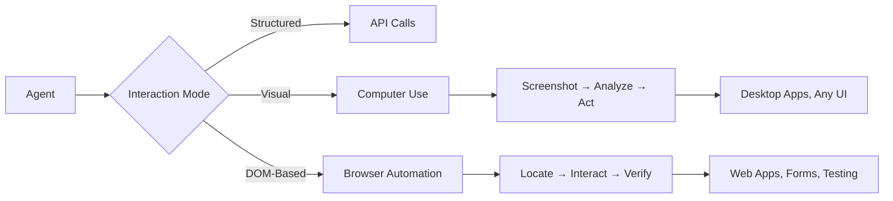

# Computer Use & Browser Automation

## Introduction

Computer use and browser automation represent one of the most powerful — and most sensitive — capabilities of AI agents. Rather than working through structured APIs, agents interact directly with graphical interfaces: clicking buttons, reading screens, filling forms, and navigating websites just like a human user would.

This lesson covers the full spectrum — from Anthropic's Computer Use tool that gives Claude direct screen control, to Playwright-based browser automation for structured web tasks, to the ethical guardrails that keep these systems responsible.

## Lesson Overview

| # | Lesson | Focus |
|---|--------|-------|
| 01 | [AI-Controlled Browser Interactions](./01-ai-controlled-browser-interactions.md) | Playwright setup, navigation, page interaction, session management |
| 02 | [Screen Understanding Capabilities](./02-screen-understanding-capabilities.md) | Screenshot analysis, element identification, layout understanding with vision models |
| 03 | [Click, Type, Scroll Automation](./03-click-type-scroll-automation.md) | Mouse actions, text input, scrolling, keyboard shortcuts with Playwright |
| 04 | [Visual Element Identification](./04-visual-element-identification.md) | Locator strategies, AI-based detection, accessibility selectors, dynamic elements |
| 05 | [Web Scraping with AI](./05-web-scraping-with-ai.md) | Content extraction, structured data, pattern recognition, anti-bot handling |
| 06 | [Form Filling Automation](./06-form-filling-automation.md) | Form field detection, value population, validation handling, submission |
| 07 | [Testing with AI Agents](./07-testing-with-ai-agents.md) | End-to-end testing, visual regression, self-healing tests, user journeys |
| 08 | [Ethical Considerations](./08-ethical-considerations.md) | Terms of service, rate limiting, user consent, transparency requirements |

## Two Approaches to Computer Use

### 1. Vision-based computer use (Anthropic Computer Use Tool)

Claude interacts with a desktop environment through screenshots and coordinate-based actions. The agent sees what's on screen, reasons about it, and performs mouse/keyboard actions.

**Best for:** Desktop applications, any GUI, situations where no DOM access exists.

**Key components:**
- Screenshot capture and analysis
- Coordinate-based clicking and typing
- Agent loop: screenshot → reason → act → screenshot → verify
- Runs in a sandboxed Docker container

### 2. DOM-based browser automation (Playwright)

Agents interact with web pages through the DOM — locating elements by role, text, label, or test ID, then performing structured actions.

**Best for:** Web applications, form filling, testing, scraping structured content.

**Key components:**
- Semantic locators (`get_by_role`, `get_by_text`, `get_by_label`)
- Auto-waiting and retry logic
- Multi-browser support (Chromium, Firefox, WebKit)
- Screenshot and trace capture

## Comparison

| Feature | Computer Use (Anthropic) | Browser Automation (Playwright) |
|---------|-------------------------|--------------------------------|
| **Target** | Any desktop UI | Web pages only |
| **Element finding** | Visual (coordinates from screenshots) | DOM (locators, selectors) |
| **Precision** | Moderate (depends on resolution) | High (exact element targeting) |
| **Speed** | Slower (screenshot per action) | Faster (direct DOM manipulation) |
| **Reliability** | Lower (visual recognition varies) | Higher (stable locators) |
| **Setup** | Docker container + virtual display | pip install + browser binaries |
| **Cost** | Higher (vision tokens per screenshot) | Lower (no LLM needed for actions) |
| **Use case** | General GUI automation | Web testing, scraping, form filling |

## Key Technologies

| Tool | Purpose | Documentation |
|------|---------|---------------|
| **Anthropic Computer Use** | Vision-based desktop control | [Docs](https://docs.anthropic.com/en/docs/computer-use) |
| **Playwright (Python)** | DOM-based browser automation | [Docs](https://playwright.dev/python/) |
| **Puppeteer** | Chrome DevTools Protocol automation | [Docs](https://pptr.dev/) |
| **Browserbase** | Cloud browser infrastructure | [Docs](https://www.browserbase.com/) |
| **Beautiful Soup** | HTML parsing and extraction | [Docs](https://www.crummy.com/software/BeautifulSoup/) |

## Security Reminder

> **Warning:** Computer use and browser automation carry significant risks. Agents that can click, type, and navigate can also be exploited through prompt injection — malicious content on a webpage can trick an agent into performing unintended actions. Always:
> - Run agents in sandboxed environments (Docker containers, VMs)
> - Use allowlisted domains and network isolation (Lesson 24)
> - Require human confirmation for sensitive actions
> - Never give agents access to authentication credentials in production without strict controls

---

**Next:** [AI-Controlled Browser Interactions](./01-ai-controlled-browser-interactions.md)

**Previous:** [Containerized Agent Execution](../24-agent-sandboxing-isolation/06-containerized-agent-execution.md)

---

## Further Reading

- [Anthropic Computer Use](https://docs.anthropic.com/en/docs/computer-use) - Claude computer control documentation
- [Playwright for Python](https://playwright.dev/python/) - Browser automation framework
- [Puppeteer](https://pptr.dev/) - Chrome DevTools Protocol
- [Browserbase](https://www.browserbase.com/) - Cloud browser infrastructure

<!-- 
Sources Consulted:
- Anthropic Computer Use: https://platform.claude.com/docs/en/docs/agents-and-tools/computer-use
- Playwright Python: https://playwright.dev/python/docs/intro
- Playwright Locators: https://playwright.dev/python/docs/locators
- Playwright Actions: https://playwright.dev/python/docs/input
-->
