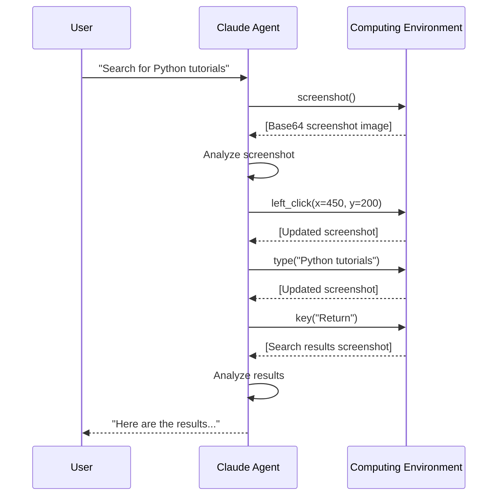

# AI-Controlled Browser Interactions

## Introduction

Browser automation is one of the most practical capabilities we can give AI agents. Instead of relying on APIs that may not exist, agents can navigate websites, click buttons, fill forms, and extract information — just like a human user.

In this lesson, we explore two complementary approaches: **Playwright** for DOM-based browser control (fast, reliable, structured) and **Anthropic's Computer Use tool** for vision-based desktop interaction (flexible, works with any UI). We'll set up both, navigate pages, interact with elements, and manage sessions.

### What We'll Cover
- Launching and controlling browsers with Playwright
- Navigating pages and waiting for content
- Anthropic's Computer Use agent loop
- Session management with cookies and storage state

### Prerequisites
- Python 3.10+ installed
- Familiarity with async/await in Python
- Understanding of agent tool-use patterns (Lessons 19-21)
- Basic HTML/DOM knowledge (Unit 1)

---

## Setting Up Playwright

Playwright is a browser automation framework that controls Chromium, Firefox, and WebKit through a single API. Unlike Selenium, it was built from the ground up for modern web applications with auto-waiting, network interception, and multi-context support.

### Installation

```bash
# Install Playwright and browser binaries
pip install playwright
playwright install
```

The `playwright install` command downloads browser binaries (~400MB total). For CI environments, install only what you need:

```bash
# Install only Chromium
playwright install chromium
```

### Launching a Browser

Playwright offers both synchronous and asynchronous APIs. We use the synchronous API for simpler scripts and the async API for production agents.

```python
from playwright.sync_api import sync_playwright

with sync_playwright() as p:
    # Launch a browser (headless by default)
    browser = p.chromium.launch(headless=True)
    
    # Create a new browser context (isolated session)
    context = browser.new_context()
    
    # Open a new page (tab)
    page = context.new_page()
    
    # Navigate to a URL
    page.goto("https://example.com")
    
    # Get the page title
    title = page.title()
    print(f"Page title: {title}")
    
    # Clean up
    context.close()
    browser.close()
```

**Output:**
```
Page title: Example Domain
```

> **Note:** The `headless=True` setting runs the browser without a visible window — ideal for servers and automation. Set `headless=False` during development to see what the browser is doing.

### The Async API

For agents that run multiple browser tasks or integrate with async frameworks:

```python
import asyncio
from playwright.async_api import async_playwright

async def browse():
    async with async_playwright() as p:
        browser = await p.chromium.launch(headless=True)
        context = await browser.new_context()
        page = await context.new_page()
        
        await page.goto("https://example.com")
        title = await page.title()
        print(f"Page title: {title}")
        
        await context.close()
        await browser.close()

asyncio.run(browse())
```

**Output:**
```
Page title: Example Domain
```

> **🤖 AI Context:** Most AI agent frameworks (LangChain, custom loops) run async. Use the async Playwright API when integrating browser automation as an agent tool.

---

## Navigation and Page Interaction

### Navigating to Pages

The `goto()` method navigates to a URL and waits for the page to reach a specific load state:

```python
from playwright.sync_api import sync_playwright

with sync_playwright() as p:
    browser = p.chromium.launch(headless=True)
    page = browser.new_page()
    
    # Navigate and wait for 'load' event (default)
    page.goto("https://example.com")
    
    # Navigate and wait for network to be idle
    page.goto(
        "https://example.com",
        wait_until="networkidle"
    )
    
    # Navigate and wait for DOM content to load (faster)
    page.goto(
        "https://example.com",
        wait_until="domcontentloaded"
    )
    
    print(f"URL: {page.url}")
    browser.close()
```

**Output:**
```
URL: https://example.com/
```

### Wait Strategies

| Strategy | Waits Until | Best For |
|----------|-------------|----------|
| `load` (default) | `load` event fires | Standard pages |
| `domcontentloaded` | DOM is parsed | Fast checks, no images needed |
| `networkidle` | No network requests for 500ms | SPAs, dynamic content |
| `commit` | Response received | Fastest, minimal waiting |

### Waiting for Specific Elements

Rather than guessing load times, wait for the specific element you need:

```python
from playwright.sync_api import sync_playwright

with sync_playwright() as p:
    browser = p.chromium.launch(headless=True)
    page = browser.new_page()
    page.goto("https://example.com")
    
    # Wait for an element to appear
    page.wait_for_selector("h1")
    heading = page.inner_text("h1")
    print(f"Heading: {heading}")
    
    # Wait for a specific URL pattern after navigation
    page.get_by_role("link", name="More information").click()
    page.wait_for_url("**/iana.org/**")
    print(f"Navigated to: {page.url}")
    
    browser.close()
```

**Output:**
```
Heading: Example Domain
Navigated to: https://www.iana.org/help/example-domains
```

### Reading Page Content

```python
from playwright.sync_api import sync_playwright

with sync_playwright() as p:
    browser = p.chromium.launch(headless=True)
    page = browser.new_page()
    page.goto("https://example.com")
    
    # Get visible text from the page
    body_text = page.inner_text("body")
    print(f"Visible text:\n{body_text[:200]}")
    
    # Get full HTML
    html = page.content()
    print(f"\nHTML length: {len(html)} characters")
    
    # Evaluate JavaScript in the page
    link_count = page.evaluate("document.querySelectorAll('a').length")
    print(f"Number of links: {link_count}")
    
    browser.close()
```

**Output:**
```
Visible text:
Example Domain
This domain is for use in illustrative examples in documents. You may use this domain in literature without prior coordination or asking for permission.
More information...

HTML length: 1256 characters
Number of links: 1
```

---

## Anthropic's Computer Use Tool

Anthropic's Computer Use tool takes a fundamentally different approach. Instead of manipulating the DOM, Claude **sees the screen** through screenshots and **acts** through coordinate-based mouse and keyboard commands.

### How It Works



### Setting Up the Agent Loop

The Computer Use tool requires a loop: send a message → Claude requests a tool action → execute it → return the result → repeat until Claude is done.

```python
import anthropic
import base64
import subprocess

client = anthropic.Anthropic()

# Define the computer use tool
computer_tool = {
    "type": "computer_20251124",
    "name": "computer",
    "display_width_px": 1024,
    "display_height_px": 768,
    "display_number": 1
}

def execute_computer_action(action, **params):
    """Execute a computer use action and return a screenshot."""
    if action == "screenshot":
        # Capture screenshot using scrot or similar
        subprocess.run(["scrot", "/tmp/screenshot.png"], check=True)
    elif action == "left_click":
        x, y = params["coordinate"]
        subprocess.run(
            ["xdotool", "mousemove", str(x), str(y), "click", "1"],
            check=True
        )
    elif action == "type":
        subprocess.run(
            ["xdotool", "type", "--", params["text"]],
            check=True
        )
    elif action == "key":
        subprocess.run(
            ["xdotool", "key", params["key"]],
            check=True
        )
    
    # Always return a screenshot after the action
    subprocess.run(["scrot", "/tmp/screenshot.png"], check=True)
    with open("/tmp/screenshot.png", "rb") as f:
        return base64.standard_b64encode(f.read()).decode()

def run_computer_use_agent(task: str):
    """Run an agent loop with computer use."""
    messages = [{"role": "user", "content": task}]
    
    while True:
        response = client.beta.messages.create(
            model="claude-sonnet-4-20250514",
            max_tokens=4096,
            tools=[computer_tool],
            messages=messages,
            betas=["computer-use-2025-01-24"]
        )
        
        # Check if Claude wants to use a tool
        if response.stop_reason == "tool_use":
            # Process each tool use block
            tool_results = []
            for block in response.content:
                if block.type == "tool_use":
                    action = block.input.get("action")
                    print(f"Action: {action}")
                    
                    # Execute the action
                    screenshot_b64 = execute_computer_action(
                        action, **block.input
                    )
                    
                    tool_results.append({
                        "type": "tool_result",
                        "tool_use_id": block.id,
                        "content": [{
                            "type": "image",
                            "source": {
                                "type": "base64",
                                "media_type": "image/png",
                                "data": screenshot_b64
                            }
                        }]
                    })
            
            # Add assistant response and tool results
            messages.append({"role": "assistant", "content": response.content})
            messages.append({"role": "user", "content": tool_results})
        else:
            # Claude is done — extract the text response
            for block in response.content:
                if hasattr(block, "text"):
                    print(f"Agent: {block.text}")
            break

# Example usage (requires a desktop environment)
# run_computer_use_agent("Open Firefox and search for 'Python tutorials'")
```

> **Warning:** Computer Use requires a desktop environment (Xvfb virtual display or real desktop). Anthropic provides a Docker reference implementation with Ubuntu, Firefox, and LibreOffice pre-installed. See [Lesson 24](../24-agent-sandboxing-isolation/06-containerized-agent-execution.md) for containerized setup.

### Available Actions

| Action | Description | Parameters |
|--------|-------------|------------|
| `screenshot` | Capture the current screen | — |
| `left_click` | Click at coordinates | `coordinate: [x, y]` |
| `type` | Type text | `text: "string"` |
| `key` | Press a key or key combination | `key: "Return"`, `"ctrl+c"` |
| `mouse_move` | Move cursor without clicking | `coordinate: [x, y]` |
| `scroll` | Scroll up or down | `coordinate: [x, y]`, `delta_x`, `delta_y` |
| `right_click` | Right-click at coordinates | `coordinate: [x, y]` |
| `double_click` | Double-click at coordinates | `coordinate: [x, y]` |
| `drag` | Click-drag from start to end | `start_coordinate`, `end_coordinate` |
| `wait` | Pause for a duration | `duration: seconds` |

---

## Session Management

Browser sessions contain cookies, localStorage, authentication tokens, and other state. Managing this state is critical for agents that need to stay logged in, remember preferences, or operate across multiple tasks.

### Storage State with Playwright

Playwright can save and restore a full browser context — cookies, localStorage, and sessionStorage:

```python
from playwright.sync_api import sync_playwright
import json

def save_session(page, path="session.json"):
    """Save browser session to a file."""
    storage = page.context.storage_state()
    with open(path, "w") as f:
        json.dump(storage, f, indent=2)
    print(f"Session saved to {path}")

def load_session(browser, path="session.json"):
    """Create a browser context with saved session."""
    context = browser.new_context(storage_state=path)
    return context

with sync_playwright() as p:
    browser = p.chromium.launch(headless=True)
    
    # First run: create session
    context = browser.new_context()
    page = context.new_page()
    page.goto("https://example.com")
    
    # Manually set a cookie for demonstration
    context.add_cookies([{
        "name": "session_id",
        "value": "abc123",
        "domain": "example.com",
        "path": "/"
    }])
    
    # Save the session
    save_session(page, "my_session.json")
    
    # Verify cookie was saved
    cookies = context.cookies()
    print(f"Cookies: {[c['name'] for c in cookies]}")
    
    context.close()
    
    # Second run: restore session
    restored_context = load_session(browser, "my_session.json")
    restored_page = restored_context.new_page()
    restored_page.goto("https://example.com")
    
    restored_cookies = restored_context.cookies()
    print(f"Restored cookies: {[c['name'] for c in restored_cookies]}")
    
    restored_context.close()
    browser.close()
```

**Output:**
```
Session saved to my_session.json
Cookies: ['session_id']
Restored cookies: ['session_id']
```

### Browser Contexts for Isolation

Each browser context acts as an independent session — separate cookies, cache, and storage. This is essential for agents that handle multiple users or tasks:

```python
from playwright.sync_api import sync_playwright

with sync_playwright() as p:
    browser = p.chromium.launch(headless=True)
    
    # Context 1: User A's session
    context_a = browser.new_context()
    page_a = context_a.new_page()
    page_a.goto("https://example.com")
    context_a.add_cookies([{
        "name": "user", "value": "alice",
        "domain": "example.com", "path": "/"
    }])
    
    # Context 2: User B's session (completely isolated)
    context_b = browser.new_context()
    page_b = context_b.new_page()
    page_b.goto("https://example.com")
    context_b.add_cookies([{
        "name": "user", "value": "bob",
        "domain": "example.com", "path": "/"
    }])
    
    # Verify isolation
    cookies_a = context_a.cookies()
    cookies_b = context_b.cookies()
    print(f"Context A user: {cookies_a[0]['value']}")
    print(f"Context B user: {cookies_b[0]['value']}")
    
    context_a.close()
    context_b.close()
    browser.close()
```

**Output:**
```
Context A user: alice
Context B user: bob
```

> **🤖 AI Context:** When building AI agents that browse on behalf of multiple users, always use separate browser contexts. This prevents session leakage — one user's cookies should never be visible to another user's agent session.

---

## Integrating Browser Control as an Agent Tool

Here's a practical example: a browser tool that an AI agent can use to navigate and extract information:

```python
from playwright.sync_api import sync_playwright
import json

class BrowserTool:
    """A browser automation tool for AI agents."""
    
    def __init__(self):
        self.playwright = sync_playwright().start()
        self.browser = self.playwright.chromium.launch(headless=True)
        self.context = self.browser.new_context(
            viewport={"width": 1280, "height": 720},
            user_agent=(
                "Mozilla/5.0 (Windows NT 10.0; Win64; x64) "
                "AppleWebKit/537.36 (KHTML, like Gecko) "
                "Chrome/120.0.0.0 Safari/537.36"
            )
        )
        self.page = self.context.new_page()
    
    def navigate(self, url: str) -> dict:
        """Navigate to a URL and return page info."""
        response = self.page.goto(url, wait_until="domcontentloaded")
        return {
            "url": self.page.url,
            "title": self.page.title(),
            "status": response.status if response else None
        }
    
    def get_text(self) -> str:
        """Get visible text content from the current page."""
        return self.page.inner_text("body")
    
    def screenshot(self, path: str = "page.png") -> str:
        """Take a screenshot and return the file path."""
        self.page.screenshot(path=path)
        return path
    
    def click_link(self, text: str) -> dict:
        """Click a link by its visible text."""
        self.page.get_by_role("link", name=text).click()
        self.page.wait_for_load_state("domcontentloaded")
        return {
            "url": self.page.url,
            "title": self.page.title()
        }
    
    def close(self):
        """Clean up browser resources."""
        self.context.close()
        self.browser.close()
        self.playwright.stop()

# Usage
tool = BrowserTool()
try:
    result = tool.navigate("https://example.com")
    print(f"Navigated: {json.dumps(result, indent=2)}")
    
    text = tool.get_text()
    print(f"Page text: {text[:100]}...")
    
    result = tool.click_link("More information")
    print(f"After click: {json.dumps(result, indent=2)}")
finally:
    tool.close()
```

**Output:**
```json
{
  "url": "https://example.com/",
  "title": "Example Domain",
  "status": 200
}
```
```
Page text: Example Domain
This domain is for use in illustrative examples in documents. You may use thi...
```
```json
{
  "url": "https://www.iana.org/help/example-domains",
  "title": "IANA — Example Domains"
}
```

---

## Best Practices

| Practice | Why It Matters |
|----------|----------------|
| Use `headless=True` in production | Reduces resource usage — no GPU rendering needed |
| Always close contexts and browsers | Prevents memory leaks and orphaned processes |
| Set explicit timeouts | Avoids infinite waits on slow pages |
| Use browser contexts, not new browsers | Faster and lighter than launching separate browser instances |
| Set a realistic user agent | Some sites block default Playwright user agents |
| Use `wait_until="domcontentloaded"` for speed | Faster than waiting for all resources to load |

---

## Common Pitfalls

| ❌ Mistake | ✅ Solution |
|-----------|-------------|
| Using `time.sleep()` for waits | Use `page.wait_for_selector()` or `wait_for_url()` |
| Not handling navigation errors | Wrap `goto()` in try/except, check response status |
| Sharing browser contexts between users | Create separate contexts for each user/session |
| Forgetting to install browser binaries | Run `playwright install` after `pip install playwright` |
| Running headed browsers on servers | Use `headless=True` — servers have no display |
| Ignoring page load states | Always specify `wait_until` for reliable automation |

---

## Hands-on Exercise

### Your Task

Build a simple web research tool that an AI agent could use. The tool should navigate to a URL, extract the page title and visible text, take a screenshot, and follow a link.

### Requirements
1. Create a `WebResearcher` class using Playwright
2. Implement `visit(url)` — navigate and return title + status code
3. Implement `extract_text()` — return visible text content (first 500 chars)
4. Implement `take_screenshot(filename)` — save a screenshot
5. Implement `follow_link(text)` — click a link by visible text
6. Test with `https://example.com`: visit → extract → screenshot → follow "More information" link

### Expected Result
Your tool visits example.com, extracts "Example Domain" as the title, saves a screenshot, and navigates to the IANA page after clicking the link.

<details>
<summary>💡 Hints (click to expand)</summary>

- Use `sync_playwright()` as a context manager in `__init__` / `close` pattern
- The `page.goto()` method returns a `Response` object with a `.status` property
- `page.inner_text("body")` gives you all visible text
- `page.get_by_role("link", name=text)` locates links by visible text
- Remember to call `page.wait_for_load_state()` after clicking a link

</details>

<details>
<summary>✅ Solution (click to expand)</summary>

```python
from playwright.sync_api import sync_playwright

class WebResearcher:
    """A web research tool for AI agents."""
    
    def __init__(self):
        self._pw = sync_playwright().start()
        self._browser = self._pw.chromium.launch(headless=True)
        self._context = self._browser.new_context(
            viewport={"width": 1280, "height": 720}
        )
        self._page = self._context.new_page()
    
    def visit(self, url: str) -> dict:
        """Navigate to URL, return title and status."""
        response = self._page.goto(url, wait_until="domcontentloaded")
        return {
            "title": self._page.title(),
            "url": self._page.url,
            "status": response.status if response else None
        }
    
    def extract_text(self, max_chars: int = 500) -> str:
        """Extract visible text from the current page."""
        text = self._page.inner_text("body")
        return text[:max_chars]
    
    def take_screenshot(self, filename: str = "screenshot.png") -> str:
        """Save a screenshot and return the filename."""
        self._page.screenshot(path=filename)
        return filename
    
    def follow_link(self, text: str) -> dict:
        """Click a link by its visible text and return new page info."""
        self._page.get_by_role("link", name=text).click()
        self._page.wait_for_load_state("domcontentloaded")
        return {
            "title": self._page.title(),
            "url": self._page.url
        }
    
    def close(self):
        """Release all browser resources."""
        self._context.close()
        self._browser.close()
        self._pw.stop()

# Test the tool
researcher = WebResearcher()
try:
    # Step 1: Visit
    info = researcher.visit("https://example.com")
    print(f"Visited: {info['title']} ({info['status']})")
    
    # Step 2: Extract text
    text = researcher.extract_text()
    print(f"Text: {text[:80]}...")
    
    # Step 3: Screenshot
    path = researcher.take_screenshot("example.png")
    print(f"Screenshot saved: {path}")
    
    # Step 4: Follow link
    link_info = researcher.follow_link("More information")
    print(f"Followed link to: {link_info['title']}")
finally:
    researcher.close()
```

**Output:**
```
Visited: Example Domain (200)
Text: Example Domain
This domain is for use in illustrative examples in documents. Yo...
Screenshot saved: example.png
Followed link to: IANA — Example Domains
```

</details>

### Bonus Challenges
- [ ] Add a `search(query)` method that navigates to a search engine, types the query, and submits
- [ ] Add error handling for timeouts and missing elements
- [ ] Save and restore sessions between runs using `storage_state()`

---

## Summary

✅ Playwright provides reliable, DOM-based browser control with auto-waiting and multi-browser support

✅ Anthropic's Computer Use tool enables vision-based interaction with any desktop UI through a screenshot-action loop

✅ Browser contexts provide isolated sessions — essential for multi-user agents

✅ Session persistence through `storage_state()` lets agents maintain login state across runs

✅ Always close browser resources and use headless mode in production

**Next:** [Screen Understanding Capabilities](./02-screen-understanding-capabilities.md)

**Previous:** [Computer Use & Browser Automation Overview](./00-computer-use-browser-automation.md)

---

## Further Reading

- [Playwright Python — Getting Started](https://playwright.dev/python/docs/intro) - Installation and first test
- [Playwright Python — Browser Contexts](https://playwright.dev/python/docs/browser-contexts) - Session isolation
- [Anthropic Computer Use](https://docs.anthropic.com/en/docs/computer-use) - Computer use tool documentation
- [Playwright vs Selenium](https://playwright.dev/python/docs/library) - Why Playwright for modern web automation

<!-- 
Sources Consulted:
- Playwright Python Intro: https://playwright.dev/python/docs/intro
- Playwright Locators: https://playwright.dev/python/docs/locators
- Playwright Input/Actions: https://playwright.dev/python/docs/input
- Anthropic Computer Use: https://docs.anthropic.com/en/docs/computer-use
-->
