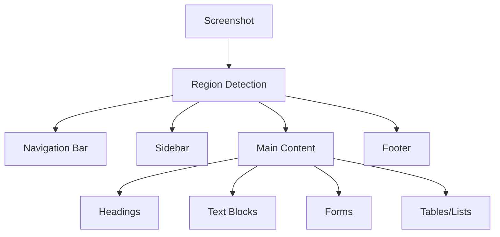

# Screen Understanding Capabilities

## Introduction

When an AI agent controls a browser or desktop through vision, it needs to **understand what it sees**. This goes beyond OCR — the agent must identify interactive elements, understand layout structure, recognize page states, and determine what actions are available.

In this lesson, we explore how agents capture and analyze screenshots, identify elements using vision models, understand page layouts, and detect state changes — the foundation for any vision-based computer use workflow.

### What We'll Cover
- Capturing screenshots with Playwright and the Computer Use tool
- Analyzing screenshots with vision models
- Understanding page layout and element hierarchy
- Detecting page state and dynamic content changes

### Prerequisites
- Playwright basics (Lesson 01)
- Understanding of Anthropic's Computer Use tool loop (Lesson 01)
- Familiarity with multimodal AI (Unit 13)
- Basic understanding of HTML structure (Unit 1)

---

## Capturing Screenshots

Screenshots are the primary input for vision-based agents. The quality, timing, and scope of a screenshot directly affect the agent's ability to understand and interact with the screen.

### Full-Page vs Viewport Screenshots

```python
from playwright.sync_api import sync_playwright
import base64

with sync_playwright() as p:
    browser = p.chromium.launch(headless=True)
    page = browser.new_page(viewport={"width": 1280, "height": 720})
    page.goto("https://example.com", wait_until="networkidle")
    
    # Viewport screenshot (what the user sees)
    page.screenshot(path="viewport.png")
    print("Viewport screenshot saved")
    
    # Full-page screenshot (entire scrollable content)
    page.screenshot(path="fullpage.png", full_page=True)
    print("Full-page screenshot saved")
    
    # Screenshot as base64 (for sending to vision models)
    screenshot_bytes = page.screenshot()
    screenshot_b64 = base64.b64encode(screenshot_bytes).decode()
    print(f"Base64 length: {len(screenshot_b64)} characters")
    
    browser.close()
```

**Output:**
```
Viewport screenshot saved
Full-page screenshot saved
Base64 length: 12480 characters
```

> **Note:** Full-page screenshots can be very large on content-heavy pages. For vision models, viewport screenshots (what a user actually sees) are usually more useful — they match the resolution the model was trained on and keep token costs manageable.

### Element-Specific Screenshots

When you know which element matters, capture just that element:

```python
from playwright.sync_api import sync_playwright

with sync_playwright() as p:
    browser = p.chromium.launch(headless=True)
    page = browser.new_page()
    page.goto("https://example.com")
    
    # Screenshot of a specific element
    heading = page.locator("h1")
    heading.screenshot(path="heading.png")
    print(f"Heading text: {heading.inner_text()}")
    print("Element screenshot saved")
    
    browser.close()
```

**Output:**
```
Heading text: Example Domain
Element screenshot saved
```

### Screenshot Timing

Capturing a screenshot too early produces blank or partially loaded pages. Capture at the right moment:

```python
from playwright.sync_api import sync_playwright

with sync_playwright() as p:
    browser = p.chromium.launch(headless=True)
    page = browser.new_page()
    page.goto("https://example.com")
    
    # Wait for content before capturing
    page.wait_for_selector("h1")
    page.screenshot(path="after_load.png")
    
    # Wait for network to settle (good for SPAs)
    page.wait_for_load_state("networkidle")
    page.screenshot(path="after_idle.png")
    
    print("Screenshots captured at correct timing")
    browser.close()
```

**Output:**
```
Screenshots captured at correct timing
```

| Timing Strategy | When to Use | Trade-off |
|-----------------|-------------|-----------|
| After `goto()` returns | Simple static pages | May miss lazy-loaded content |
| `wait_for_selector("target")` | Known element expected | Fast, targeted |
| `wait_for_load_state("networkidle")` | SPAs, dynamic pages | Slower but more reliable |
| After a specific action | Verify action result | Most accurate for verification |

---

## Analyzing Screenshots with Vision Models

The real power of screen understanding comes from sending screenshots to vision-capable models. The model can identify elements, read text, understand layout, and decide what to do next.

### Sending Screenshots to Claude

```python
import anthropic
import base64
from playwright.sync_api import sync_playwright

def capture_and_analyze(url: str, question: str) -> str:
    """Capture a screenshot and ask Claude to analyze it."""
    # Capture screenshot
    with sync_playwright() as p:
        browser = p.chromium.launch(headless=True)
        page = browser.new_page(viewport={"width": 1280, "height": 720})
        page.goto(url, wait_until="networkidle")
        screenshot_bytes = page.screenshot()
        browser.close()
    
    screenshot_b64 = base64.b64encode(screenshot_bytes).decode()
    
    # Send to Claude for analysis
    client = anthropic.Anthropic()
    response = client.messages.create(
        model="claude-sonnet-4-20250514",
        max_tokens=1024,
        messages=[{
            "role": "user",
            "content": [
                {
                    "type": "image",
                    "source": {
                        "type": "base64",
                        "media_type": "image/png",
                        "data": screenshot_b64
                    }
                },
                {
                    "type": "text",
                    "text": question
                }
            ]
        }]
    )
    
    return response.content[0].text

# Example usage
# analysis = capture_and_analyze(
#     "https://example.com",
#     "What interactive elements do you see on this page? List each one with its approximate position."
# )
# print(analysis)
```

> **🤖 AI Context:** This "screenshot + question" pattern is the foundation of vision-based screen understanding. The agent captures what it sees, sends it to a vision model, and uses the response to plan its next action. The Computer Use tool automates this loop — Claude both analyzes and acts in the same turn.

### Structured Screen Analysis

For reliable automation, ask the model to return structured data rather than free-form text:

```python
import anthropic
import base64
import json

def analyze_screen_elements(screenshot_b64: str) -> dict:
    """Ask Claude to identify all interactive elements on screen."""
    client = anthropic.Anthropic()
    
    response = client.messages.create(
        model="claude-sonnet-4-20250514",
        max_tokens=2048,
        messages=[{
            "role": "user",
            "content": [
                {
                    "type": "image",
                    "source": {
                        "type": "base64",
                        "media_type": "image/png",
                        "data": screenshot_b64
                    }
                },
                {
                    "type": "text",
                    "text": """Analyze this screenshot and identify all interactive elements.
Return a JSON object with this structure:
{
    "page_title": "string",
    "page_type": "form|article|dashboard|search|list|other",
    "interactive_elements": [
        {
            "type": "button|link|input|select|checkbox",
            "label": "visible text or description",
            "position": "top-left|top-center|top-right|center|bottom-left|bottom-center|bottom-right",
            "state": "enabled|disabled|checked|unchecked"
        }
    ],
    "main_content": "brief description of the page content"
}
Return ONLY the JSON, no other text."""
                }
            ]
        }]
    )
    
    return json.loads(response.content[0].text)

# Example response structure:
example_analysis = {
    "page_title": "Example Domain",
    "page_type": "article",
    "interactive_elements": [
        {
            "type": "link",
            "label": "More information...",
            "position": "center",
            "state": "enabled"
        }
    ],
    "main_content": "A simple page with the heading 'Example Domain' and a paragraph about using this domain for illustrative examples."
}
print(json.dumps(example_analysis, indent=2))
```

**Output:**
```json
{
  "page_title": "Example Domain",
  "page_type": "article",
  "interactive_elements": [
    {
      "type": "link",
      "label": "More information...",
      "position": "center",
      "state": "enabled"
    }
  ],
  "main_content": "A simple page with the heading 'Example Domain' and a paragraph about using this domain for illustrative examples."
}
```

---

## Understanding Page Layout

Beyond individual elements, agents need to understand **spatial relationships** — where elements are relative to each other, what's the navigation vs content area, and how the page is structured.

### DOM-Based Layout Analysis

When you have DOM access (Playwright), extract layout information directly:

```python
from playwright.sync_api import sync_playwright

def analyze_page_layout(url: str) -> dict:
    """Extract layout information from a web page."""
    with sync_playwright() as p:
        browser = p.chromium.launch(headless=True)
        page = browser.new_page(viewport={"width": 1280, "height": 720})
        page.goto(url, wait_until="domcontentloaded")
        
        # Get all headings to understand content structure
        headings = page.evaluate("""
            () => {
                const result = [];
                document.querySelectorAll('h1, h2, h3').forEach(h => {
                    const rect = h.getBoundingClientRect();
                    result.push({
                        tag: h.tagName,
                        text: h.textContent.trim(),
                        x: Math.round(rect.x),
                        y: Math.round(rect.y),
                        width: Math.round(rect.width),
                        height: Math.round(rect.height)
                    });
                });
                return result;
            }
        """)
        
        # Get all interactive elements with positions
        interactive = page.evaluate("""
            () => {
                const result = [];
                const selectors = 'a, button, input, select, textarea';
                document.querySelectorAll(selectors).forEach(el => {
                    const rect = el.getBoundingClientRect();
                    if (rect.width > 0 && rect.height > 0) {
                        result.push({
                            tag: el.tagName,
                            type: el.type || null,
                            text: el.textContent.trim().substring(0, 50),
                            href: el.href || null,
                            x: Math.round(rect.x),
                            y: Math.round(rect.y),
                            width: Math.round(rect.width),
                            height: Math.round(rect.height),
                            visible: rect.top < window.innerHeight
                        });
                    }
                });
                return result;
            }
        """)
        
        # Get page dimensions
        dimensions = page.evaluate("""
            () => ({
                viewportWidth: window.innerWidth,
                viewportHeight: window.innerHeight,
                scrollHeight: document.documentElement.scrollHeight,
                scrollWidth: document.documentElement.scrollWidth,
                isScrollable: document.documentElement.scrollHeight > window.innerHeight
            })
        """)
        
        browser.close()
        
        return {
            "headings": headings,
            "interactive_elements": interactive,
            "dimensions": dimensions
        }

layout = analyze_page_layout("https://example.com")
print(f"Headings found: {len(layout['headings'])}")
for h in layout["headings"]:
    print(f"  {h['tag']}: '{h['text']}' at ({h['x']}, {h['y']})")

print(f"\nInteractive elements: {len(layout['interactive_elements'])}")
for el in layout["interactive_elements"]:
    label = el["text"] or el["href"] or el["type"]
    print(f"  {el['tag']}: '{label}' at ({el['x']}, {el['y']})")

print(f"\nPage dimensions: {layout['dimensions']}")
```

**Output:**
```
Headings found: 1
  H1: 'Example Domain' at (186, 60)

Interactive elements: 1
  A: 'More information...' at (186, 186)

Page dimensions: {'viewportWidth': 1280, 'viewportHeight': 720, 'scrollHeight': 310, 'scrollWidth': 1280, 'isScrollable': False}
```

### Visual Region Detection

For vision-based agents, understanding layout means identifying **regions** on screen:



```python
def identify_page_regions(screenshot_b64: str) -> dict:
    """
    Ask a vision model to identify page regions.
    Returns structured layout information.
    """
    import anthropic
    
    client = anthropic.Anthropic()
    response = client.messages.create(
        model="claude-sonnet-4-20250514",
        max_tokens=1024,
        messages=[{
            "role": "user",
            "content": [
                {
                    "type": "image",
                    "source": {
                        "type": "base64",
                        "media_type": "image/png",
                        "data": screenshot_b64
                    }
                },
                {
                    "type": "text",
                    "text": """Identify the major regions on this page.
Return JSON:
{
    "regions": [
        {
            "name": "header|navigation|sidebar|main_content|footer|form|modal",
            "description": "what this region contains",
            "approximate_bounds": {"top": 0, "left": 0, "bottom": 100, "right": 1280}
        }
    ],
    "layout_type": "single_column|two_column|dashboard|form_layout"
}
Return ONLY JSON."""
                }
            ]
        }]
    )
    
    import json
    return json.loads(response.content[0].text)
```

> **Tip:** Combining DOM-based layout analysis (fast, precise) with vision-based analysis (understands visual context) gives agents the most complete picture of a page.

---

## Detecting Page State

Agents need to recognize **what state a page is in** — loading, error, success, or waiting for input. This is critical for deciding the next action.

### DOM-Based State Detection

```python
from playwright.sync_api import sync_playwright

def detect_page_state(page) -> dict:
    """Detect the current state of a web page."""
    state = {
        "url": page.url,
        "title": page.title(),
        "loading": False,
        "has_errors": False,
        "has_forms": False,
        "has_modal": False,
        "is_scrollable": False,
        "indicators": []
    }
    
    # Check for loading indicators
    loading_selectors = [
        "[class*='loading']",
        "[class*='spinner']",
        "[class*='skeleton']",
        "[aria-busy='true']"
    ]
    for selector in loading_selectors:
        if page.locator(selector).count() > 0:
            state["loading"] = True
            state["indicators"].append(f"Loading indicator: {selector}")
    
    # Check for error states
    error_selectors = [
        "[class*='error']",
        "[role='alert']",
        ".alert-danger",
        ".error-message"
    ]
    for selector in error_selectors:
        if page.locator(selector).count() > 0:
            state["has_errors"] = True
            state["indicators"].append(f"Error found: {selector}")
    
    # Check for forms
    form_count = page.locator("form").count()
    if form_count > 0:
        state["has_forms"] = True
        state["indicators"].append(f"{form_count} form(s) found")
    
    # Check for modals/dialogs
    modal_selectors = [
        "[role='dialog']",
        "[class*='modal']",
        "dialog[open]"
    ]
    for selector in modal_selectors:
        if page.locator(selector).count() > 0:
            state["has_modal"] = True
            state["indicators"].append(f"Modal found: {selector}")
    
    # Check scrollability
    is_scrollable = page.evaluate(
        "document.documentElement.scrollHeight > window.innerHeight"
    )
    state["is_scrollable"] = is_scrollable
    
    return state

# Usage
with sync_playwright() as p:
    browser = p.chromium.launch(headless=True)
    page = browser.new_page()
    page.goto("https://example.com")
    
    state = detect_page_state(page)
    print(f"Page: {state['title']}")
    print(f"Loading: {state['loading']}")
    print(f"Has errors: {state['has_errors']}")
    print(f"Has forms: {state['has_forms']}")
    print(f"Scrollable: {state['is_scrollable']}")
    if state["indicators"]:
        print(f"Indicators: {state['indicators']}")
    
    browser.close()
```

**Output:**
```
Page: Example Domain
Loading: False
Has errors: False
Has forms: False
Scrollable: False
```

### Detecting Dynamic Content Changes

For SPAs and pages that update without navigation, watch for mutations:

```python
from playwright.sync_api import sync_playwright

with sync_playwright() as p:
    browser = p.chromium.launch(headless=True)
    page = browser.new_page()
    page.goto("https://example.com")
    
    # Set up a mutation observer to track DOM changes
    page.evaluate("""
        () => {
            window.__mutations = [];
            const observer = new MutationObserver(mutations => {
                mutations.forEach(m => {
                    window.__mutations.push({
                        type: m.type,
                        target: m.target.tagName,
                        timestamp: Date.now()
                    });
                });
            });
            observer.observe(document.body, {
                childList: true,
                subtree: true,
                attributes: true
            });
        }
    """)
    
    # Simulate some action that causes changes
    page.evaluate("""
        () => {
            const p = document.createElement('p');
            p.textContent = 'Dynamic content added';
            document.body.appendChild(p);
        }
    """)
    
    # Check what changed
    mutations = page.evaluate("() => window.__mutations")
    print(f"Mutations detected: {len(mutations)}")
    for m in mutations:
        print(f"  {m['type']} on {m['target']}")
    
    browser.close()
```

**Output:**
```
Mutations detected: 1
  childList on BODY
```

---

## Combining DOM and Vision Understanding

The most robust agents combine both approaches:

```python
from playwright.sync_api import sync_playwright
import base64
import json

class PageUnderstanding:
    """Combines DOM analysis with vision understanding."""
    
    def __init__(self, page):
        self.page = page
    
    def get_dom_context(self) -> dict:
        """Extract structured DOM information."""
        return {
            "title": self.page.title(),
            "url": self.page.url,
            "headings": self.page.evaluate("""
                () => Array.from(document.querySelectorAll('h1,h2,h3'))
                    .map(h => ({tag: h.tagName, text: h.textContent.trim()}))
            """),
            "links": self.page.evaluate("""
                () => Array.from(document.querySelectorAll('a[href]'))
                    .slice(0, 20)
                    .map(a => ({text: a.textContent.trim(), href: a.href}))
            """),
            "inputs": self.page.evaluate("""
                () => Array.from(document.querySelectorAll('input,select,textarea'))
                    .map(el => ({
                        type: el.type, 
                        name: el.name, 
                        placeholder: el.placeholder,
                        label: el.labels?.[0]?.textContent?.trim() || null
                    }))
            """),
            "visible_text_preview": self.page.inner_text("body")[:500]
        }
    
    def get_screenshot_b64(self) -> str:
        """Capture screenshot as base64."""
        return base64.b64encode(self.page.screenshot()).decode()
    
    def full_analysis(self) -> dict:
        """Get complete page understanding from both sources."""
        dom_context = self.get_dom_context()
        screenshot = self.get_screenshot_b64()
        
        return {
            "dom": dom_context,
            "screenshot_b64": screenshot,
            "screenshot_size": len(screenshot),
            "strategy_recommendation": self._recommend_strategy(dom_context)
        }
    
    def _recommend_strategy(self, dom: dict) -> str:
        """Recommend interaction strategy based on DOM structure."""
        if dom["inputs"]:
            return "dom_based"  # Forms work better with DOM
        if not dom["headings"] and not dom["links"]:
            return "vision_based"  # Complex UI, use vision
        return "dom_based"  # Default to faster DOM approach

# Usage
with sync_playwright() as p:
    browser = p.chromium.launch(headless=True)
    page = browser.new_page()
    page.goto("https://example.com")
    
    understanding = PageUnderstanding(page)
    analysis = understanding.full_analysis()
    
    print(f"Title: {analysis['dom']['title']}")
    print(f"Headings: {len(analysis['dom']['headings'])}")
    print(f"Links: {len(analysis['dom']['links'])}")
    print(f"Inputs: {len(analysis['dom']['inputs'])}")
    print(f"Strategy: {analysis['strategy_recommendation']}")
    print(f"Screenshot size: {analysis['screenshot_size']} chars")
    
    browser.close()
```

**Output:**
```
Title: Example Domain
Headings: 1
Links: 1
Inputs: 0
Strategy: dom_based
Screenshot size: 12480 chars
```

---

## Best Practices

| Practice | Why It Matters |
|----------|----------------|
| Capture viewport-sized screenshots for vision models | Matches training data resolution and reduces token cost |
| Wait for content before capturing | Avoids blank or partially-loaded screenshots |
| Use DOM analysis first, vision as fallback | DOM is faster, more precise, and cheaper |
| Extract structured JSON from vision analysis | Makes results machine-actionable, not just readable |
| Track page mutations for dynamic content | SPAs update without navigation — watch for DOM changes |
| Cache layout analysis between actions | Avoid redundant analysis when the page hasn't changed |

---

## Common Pitfalls

| ❌ Mistake | ✅ Solution |
|-----------|-------------|
| Sending huge full-page screenshots to vision models | Use viewport screenshots; crop to relevant regions |
| Relying only on vision for web pages | Use DOM analysis first — it's faster and more reliable |
| Not waiting for load before screenshot | Use `wait_for_selector()` or `wait_for_load_state()` |
| Ignoring scrollable content | Check `scrollHeight > innerHeight` and scroll to find all content |
| Assuming static pages | Use mutation observers or periodic state checks for dynamic content |
| Parsing free-form vision model output | Always request structured JSON from vision models |

---

## Hands-on Exercise

### Your Task

Build a `PageAnalyzer` class that combines DOM and screenshot analysis to give an AI agent a complete understanding of any web page.

### Requirements
1. Create a `PageAnalyzer` class that takes a Playwright `page` object
2. Implement `get_structure()` — return headings, links, forms, and page dimensions
3. Implement `get_screenshot(format="base64")` — return screenshot as base64 string
4. Implement `detect_state()` — return whether the page is loading, has errors, has modals, or is scrollable
5. Implement `summary()` — combine all analysis into a single dict
6. Test with `https://example.com`

### Expected Result
A complete page analysis showing the heading "Example Domain", one link, no forms, no errors, and a base64 screenshot.

<details>
<summary>💡 Hints (click to expand)</summary>

- Use `page.evaluate()` to run JavaScript that extracts DOM information
- `document.querySelectorAll()` finds elements; `.getBoundingClientRect()` gets positions
- `page.screenshot()` returns bytes; use `base64.b64encode()` to convert
- Check for loading spinners with `[class*='loading']` or `[aria-busy='true']`
- Combine results into a single dict with keys: `structure`, `screenshot`, `state`

</details>

<details>
<summary>✅ Solution (click to expand)</summary>

```python
from playwright.sync_api import sync_playwright
import base64

class PageAnalyzer:
    """Complete page analysis for AI agents."""
    
    def __init__(self, page):
        self.page = page
    
    def get_structure(self) -> dict:
        """Extract page structure from the DOM."""
        return self.page.evaluate("""
            () => ({
                headings: Array.from(document.querySelectorAll('h1,h2,h3,h4'))
                    .map(h => ({
                        level: parseInt(h.tagName[1]),
                        text: h.textContent.trim()
                    })),
                links: Array.from(document.querySelectorAll('a[href]'))
                    .map(a => ({
                        text: a.textContent.trim(),
                        href: a.href,
                        visible: a.getBoundingClientRect().height > 0
                    })),
                forms: Array.from(document.querySelectorAll('form'))
                    .map(f => ({
                        action: f.action,
                        method: f.method,
                        fields: Array.from(f.querySelectorAll('input,select,textarea'))
                            .map(el => ({type: el.type, name: el.name}))
                    })),
                dimensions: {
                    viewport: {
                        width: window.innerWidth,
                        height: window.innerHeight
                    },
                    page: {
                        width: document.documentElement.scrollWidth,
                        height: document.documentElement.scrollHeight
                    }
                }
            })
        """)
    
    def get_screenshot(self, format="base64") -> str:
        """Capture screenshot as base64 string."""
        screenshot_bytes = self.page.screenshot()
        if format == "base64":
            return base64.b64encode(screenshot_bytes).decode()
        return screenshot_bytes
    
    def detect_state(self) -> dict:
        """Detect current page state."""
        return {
            "url": self.page.url,
            "title": self.page.title(),
            "loading": self.page.locator(
                "[class*='loading'], [class*='spinner'], [aria-busy='true']"
            ).count() > 0,
            "has_errors": self.page.locator(
                "[class*='error'], [role='alert']"
            ).count() > 0,
            "has_modal": self.page.locator(
                "[role='dialog'], dialog[open]"
            ).count() > 0,
            "is_scrollable": self.page.evaluate(
                "document.documentElement.scrollHeight > window.innerHeight"
            )
        }
    
    def summary(self) -> dict:
        """Complete page analysis."""
        return {
            "structure": self.get_structure(),
            "state": self.detect_state(),
            "screenshot_b64_length": len(self.get_screenshot())
        }

# Test
with sync_playwright() as p:
    browser = p.chromium.launch(headless=True)
    page = browser.new_page(viewport={"width": 1280, "height": 720})
    page.goto("https://example.com")
    
    analyzer = PageAnalyzer(page)
    result = analyzer.summary()
    
    print(f"Title: {result['state']['title']}")
    print(f"Headings: {result['structure']['headings']}")
    print(f"Links: {len(result['structure']['links'])}")
    print(f"Forms: {len(result['structure']['forms'])}")
    print(f"Loading: {result['state']['loading']}")
    print(f"Errors: {result['state']['has_errors']}")
    print(f"Screenshot size: {result['screenshot_b64_length']} chars")
    
    browser.close()
```

**Output:**
```
Title: Example Domain
Headings: [{'level': 1, 'text': 'Example Domain'}]
Links: 1
Forms: 0
Loading: False
Errors: False
Screenshot size: 12480 chars
```

</details>

### Bonus Challenges
- [ ] Add accessibility tree extraction (`page.accessibility.snapshot()`)
- [ ] Implement `watch_for_changes()` using mutation observers to detect dynamic updates
- [ ] Add comparative analysis — take two screenshots and detect what changed between them

---

## Summary

✅ Playwright captures viewport, full-page, and element-specific screenshots with precise timing control

✅ Vision models analyze screenshots to identify interactive elements, understand layout, and determine page state

✅ DOM-based analysis is faster and more precise — use it first, with vision as a fallback

✅ Structured JSON responses from vision models make screen analysis machine-actionable

✅ State detection (loading, errors, modals, scrollability) guides what the agent does next

**Next:** [Click, Type, Scroll Automation](./03-click-type-scroll-automation.md)

**Previous:** [AI-Controlled Browser Interactions](./01-ai-controlled-browser-interactions.md)

---

## Further Reading

- [Playwright Screenshots](https://playwright.dev/python/docs/screenshots) - Screenshot capture options
- [Anthropic Vision](https://docs.anthropic.com/en/docs/build-with-claude/vision) - Image analysis capabilities
- [Playwright Evaluating JavaScript](https://playwright.dev/python/docs/evaluating) - Running JS in page context

<!-- 
Sources Consulted:
- Playwright Screenshots: https://playwright.dev/python/docs/screenshots
- Playwright Input/Actions: https://playwright.dev/python/docs/input
- Anthropic Computer Use: https://docs.anthropic.com/en/docs/computer-use
- Anthropic Vision: https://docs.anthropic.com/en/docs/build-with-claude/vision
-->
