# Ethical Considerations

## Introduction

Browser automation agents are powerful tools — they can fill forms, scrape data, navigate complex workflows, and interact with web services at scale. But power demands responsibility. An automation agent that ignores terms of service, hammers servers with requests, or impersonates users without consent crosses ethical and legal lines.

This lesson covers the ethical framework for responsible browser automation: respecting website policies, implementing rate limits, obtaining user consent, maintaining transparency, and understanding the legal landscape.

### What We'll Cover
- Terms of service and acceptable use
- Robots.txt compliance
- Rate limiting and server respect
- User consent and delegation
- Transparency and disclosure
- Data privacy and handling
- Legal considerations
- Building an ethical automation framework

### Prerequisites
- Web scraping concepts (Lesson 05)
- HTTP communication basics
- Understanding of browser automation fundamentals (Lessons 01-06)

---

## Terms of Service Compliance

Most websites have Terms of Service (ToS) that govern automated access. Violating them can result in IP bans, account termination, or legal action.

### Common ToS Restrictions

| Restriction | What It Means |
|-------------|---------------|
| No automated access | Bots/scrapers explicitly prohibited |
| Rate limits | Maximum requests per time period |
| No data resale | Scraped data cannot be sold |
| Personal use only | Automation for personal/internal use only |
| API required | Must use the official API instead of scraping |
| No account sharing | Automated login with shared credentials prohibited |

### Checking Terms Before Automating

```python
import anthropic

def analyze_tos(tos_text: str) -> dict:
    """Use AI to analyze terms of service for automation restrictions."""
    client = anthropic.Anthropic()
    
    response = client.messages.create(
        model="claude-sonnet-4-20250514",
        max_tokens=1024,
        messages=[{
            "role": "user",
            "content": f"""Analyze this Terms of Service text and identify:
1. Is automated access explicitly prohibited?
2. Are there rate limit requirements?
3. What data usage restrictions exist?
4. Is there a required API for programmatic access?
5. Any other relevant restrictions for web automation?

Respond as JSON with keys: automated_access_allowed (bool or "unclear"),
rate_limits (string), data_restrictions (list of strings),
api_required (bool), other_restrictions (list of strings).

Terms of Service:
{tos_text}"""
        }]
    )
    
    return response.content[0].text

# Example (simulated):
print("""Example analysis result:
{
  "automated_access_allowed": false,
  "rate_limits": "100 requests per minute",
  "data_restrictions": [
    "No redistribution of scraped content",
    "Personal use only"
  ],
  "api_required": true,
  "other_restrictions": [
    "Must attribute content to source",
    "No deep linking to media assets"
  ]
}""")
```

**Output:**
```
Example analysis result:
{
  "automated_access_allowed": false,
  "rate_limits": "100 requests per minute",
  "data_restrictions": [
    "No redistribution of scraped content",
    "Personal use only"
  ],
  "api_required": true,
  "other_restrictions": [
    "Must attribute content to source",
    "No deep linking to media assets"
  ]
}
```

> **Important:** When a site offers an official API, use it instead of scraping. APIs are designed for programmatic access, are more reliable, and are explicitly permitted.

---

## Robots.txt Compliance

The `robots.txt` file is a standard protocol that websites use to communicate which paths automated agents may and may not access.

### Parsing robots.txt

```python
from urllib.robotparser import RobotFileParser
from urllib.parse import urljoin

class RobotsChecker:
    """Check robots.txt compliance before accessing pages."""
    
    def __init__(self, base_url: str, user_agent: str = "*"):
        self.base_url = base_url.rstrip("/")
        self.user_agent = user_agent
        self.parser = RobotFileParser()
        self._loaded = False
    
    def load(self):
        """Fetch and parse robots.txt."""
        robots_url = f"{self.base_url}/robots.txt"
        self.parser.set_url(robots_url)
        try:
            self.parser.read()
            self._loaded = True
        except Exception as e:
            print(f"Could not fetch robots.txt: {e}")
            self._loaded = False
    
    def can_fetch(self, path: str) -> bool:
        """Check if a path is allowed for our user agent."""
        if not self._loaded:
            self.load()
        
        url = urljoin(self.base_url + "/", path)
        return self.parser.can_fetch(self.user_agent, url)
    
    def crawl_delay(self) -> float:
        """Get the recommended crawl delay in seconds."""
        if not self._loaded:
            self.load()
        
        delay = self.parser.crawl_delay(self.user_agent)
        return delay if delay else 0.0
    
    def check_url(self, url: str) -> dict:
        """Full compliance check for a URL."""
        if not self._loaded:
            self.load()
        
        allowed = self.parser.can_fetch(self.user_agent, url)
        delay = self.crawl_delay()
        
        return {
            "url": url,
            "allowed": allowed,
            "crawl_delay": delay,
            "recommendation": (
                f"Allowed. Wait {delay}s between requests."
                if allowed
                else "Blocked by robots.txt. Do NOT access."
            )
        }

# Example
checker = RobotsChecker("https://example.com")
checker.load()

# Check different paths
paths = ["/", "/about", "/admin", "/api/data"]
for path in paths:
    allowed = checker.can_fetch(path)
    status = "✅ Allowed" if allowed else "❌ Blocked"
    print(f"{status}: {path}")
```

**Output:**
```
✅ Allowed: /
✅ Allowed: /about
✅ Allowed: /admin
✅ Allowed: /api/data
```

> **Note:** `example.com` allows everything. Real sites like Google, Amazon, and LinkedIn have extensive robots.txt files blocking many paths. Always check before automating.

### Robots.txt Is Advisory, Not Enforcement

Robots.txt is a **voluntary protocol**. Nothing technically prevents your bot from ignoring it. But:

1. **Legal precedent**: Courts have considered robots.txt violations in unfair access cases
2. **Industry standard**: Respecting it demonstrates good faith
3. **Practical benefit**: Sites that detect violations may block your IP or take legal action

---

## Rate Limiting and Server Respect

Even if a site allows automation, flooding it with rapid requests is harmful and unethical.

### Implementing Responsible Rate Limiting

```python
import time
import asyncio
from collections import deque

class EthicalRateLimiter:
    """Rate limiter that respects server capacity."""
    
    def __init__(self, requests_per_minute: int = 30, 
                 min_delay: float = 1.0):
        self.rpm = requests_per_minute
        self.min_delay = min_delay
        self.request_times = deque()
    
    def wait(self):
        """Wait if necessary to stay within rate limits."""
        now = time.time()
        
        # Remove requests older than 60 seconds
        while self.request_times and (now - self.request_times[0]) > 60:
            self.request_times.popleft()
        
        # If at rate limit, wait
        if len(self.request_times) >= self.rpm:
            wait_time = 60 - (now - self.request_times[0])
            if wait_time > 0:
                print(f"  Rate limit: waiting {wait_time:.1f}s")
                time.sleep(wait_time)
        
        # Enforce minimum delay between requests
        if self.request_times:
            elapsed = now - self.request_times[-1]
            if elapsed < self.min_delay:
                time.sleep(self.min_delay - elapsed)
        
        self.request_times.append(time.time())
    
    def status(self) -> dict:
        """Current rate limiter status."""
        now = time.time()
        recent = sum(
            1 for t in self.request_times if (now - t) < 60
        )
        return {
            "requests_last_minute": recent,
            "limit": self.rpm,
            "remaining": self.rpm - recent,
            "min_delay": self.min_delay
        }

# Demo
limiter = EthicalRateLimiter(requests_per_minute=60, min_delay=0.5)

for i in range(5):
    limiter.wait()
    print(f"Request {i+1}: {limiter.status()['remaining']} remaining")

print(f"\nFinal status: {limiter.status()}")
```

**Output:**
```
Request 1: 59 remaining
Request 2: 58 remaining
Request 3: 57 remaining
Request 4: 56 remaining
Request 5: 55 remaining

Final status: {'requests_last_minute': 5, 'limit': 60, 'remaining': 55, 'min_delay': 0.5}
```

### Detecting and Respecting Server Signals

```python
def check_response_headers(headers: dict) -> dict:
    """Parse rate-limit information from HTTP response headers."""
    info = {}
    
    # Standard rate limit headers
    if "x-ratelimit-limit" in headers:
        info["limit"] = int(headers["x-ratelimit-limit"])
    
    if "x-ratelimit-remaining" in headers:
        info["remaining"] = int(headers["x-ratelimit-remaining"])
    
    if "x-ratelimit-reset" in headers:
        info["reset_at"] = int(headers["x-ratelimit-reset"])
    
    if "retry-after" in headers:
        info["retry_after"] = int(headers["retry-after"])
        info["action"] = "STOP and wait"
    
    return info

# Example
headers = {
    "x-ratelimit-limit": "100",
    "x-ratelimit-remaining": "3",
    "x-ratelimit-reset": "1700000000"
}

info = check_response_headers(headers)
print(f"Rate limit info: {info}")

if info.get("remaining", 100) < 5:
    print("⚠️ Approaching rate limit — slow down")
```

**Output:**
```
Rate limit info: {'limit': 100, 'remaining': 3, 'reset_at': 1700000000}
⚠️ Approaching rate limit — slow down
```

---

## User Consent and Delegation

When an AI agent acts on behalf of a user, clear consent is essential. The agent must only do what the user explicitly authorized.

### Consent Framework

```python
class ConsentManager:
    """Manage user consent for automated actions."""
    
    def __init__(self):
        self.consents = {}
    
    def request_consent(self, action: str, scope: str, 
                        details: str) -> bool:
        """Request user consent for an action."""
        print(f"\n🔒 Consent Required:")
        print(f"   Action: {action}")
        print(f"   Scope:  {scope}")
        print(f"   Detail: {details}")
        
        # In production: prompt user via UI
        # For demo: auto-approve
        approved = True  # Simulated user approval
        
        self.consents[action] = {
            "scope": scope,
            "approved": approved,
            "timestamp": "2025-01-15T10:00:00Z"
        }
        
        status = "✅ Granted" if approved else "❌ Denied"
        print(f"   Status: {status}")
        return approved
    
    def has_consent(self, action: str) -> bool:
        """Check if consent was granted for an action."""
        return self.consents.get(action, {}).get("approved", False)
    
    def revoke(self, action: str):
        """Revoke previously granted consent."""
        if action in self.consents:
            self.consents[action]["approved"] = False
            print(f"🔓 Consent revoked: {action}")

# Usage
consent = ConsentManager()

# Request consent for specific actions
consent.request_consent(
    action="form_submission",
    scope="Submit job application on careers.example.com",
    details="Will fill name, email, resume fields and click Submit"
)

consent.request_consent(
    action="data_collection",
    scope="Collect product prices from shop.example.com",
    details="Will visit 50 product pages and extract prices"
)

# Check before acting
if consent.has_consent("form_submission"):
    print("\n✅ Proceeding with form submission")
```

**Output:**
```
🔒 Consent Required:
   Action: form_submission
   Scope:  Submit job application on careers.example.com
   Detail: Will fill name, email, resume fields and click Submit
   Status: ✅ Granted

🔒 Consent Required:
   Action: data_collection
   Scope:  Collect product prices from shop.example.com
   Detail: Will visit 50 product pages and extract prices
   Status: ✅ Granted

✅ Proceeding with form submission
```

### Key Consent Principles

1. **Informed**: User knows exactly what the agent will do
2. **Specific**: Consent is per-action, not blanket authorization
3. **Revocable**: User can withdraw consent at any time
4. **Logged**: All consent decisions are recorded for audit

---

## Transparency and Disclosure

### Identifying Your Bot

```python
def create_ethical_browser_context(playwright):
    """Create a browser context that identifies itself honestly."""
    browser = playwright.chromium.launch(headless=True)
    
    # Use a descriptive user agent
    context = browser.new_context(
        user_agent=(
            "AutomationBot/1.0 "
            "(+https://yoursite.com/bot-info; "
            "contact@yoursite.com)"
        )
    )
    
    return browser, context

# What your user agent communicates:
print("User-Agent: AutomationBot/1.0")
print("  ├─ Bot name and version")
print("  ├─ Info page URL (explains what the bot does)")
print("  └─ Contact email (for site owners to reach you)")
```

**Output:**
```
User-Agent: AutomationBot/1.0
  ├─ Bot name and version
  ├─ Info page URL (explains what the bot does)
  └─ Contact email (for site owners to reach you)
```

> **Warning:** Some argue bots should be "stealth" to avoid detection. For ethical automation, transparency is the correct approach. If a site blocks your bot after seeing its user agent, that's the site exercising its right — respect it.

### Logging All Actions

```python
from datetime import datetime
import json

class ActionLogger:
    """Log all automated actions for transparency and audit."""
    
    def __init__(self, log_file: str = "automation_log.jsonl"):
        self.log_file = log_file
        self.actions = []
    
    def log(self, action: str, target: str, details: dict = None):
        """Log an action with timestamp."""
        entry = {
            "timestamp": datetime.now().isoformat(),
            "action": action,
            "target": target,
            "details": details or {}
        }
        self.actions.append(entry)
        # In production: append to file
        # with open(self.log_file, "a") as f:
        #     f.write(json.dumps(entry) + "\n")
    
    def summary(self) -> str:
        """Generate a human-readable summary."""
        if not self.actions:
            return "No actions logged."
        
        lines = [f"Session: {len(self.actions)} actions"]
        for a in self.actions:
            lines.append(
                f"  [{a['timestamp'][-8:]}] {a['action']} → {a['target']}"
            )
        return "\n".join(lines)

# Demo
logger = ActionLogger()
logger.log("navigate", "https://shop.example.com")
logger.log("click", "Search button")
logger.log("fill", "Search box", {"value": "laptop"})
logger.log("scrape", "Product list", {"items_found": 24})

print(logger.summary())
```

**Output:**
```
Session: 4 actions
  [10:00:00] navigate → https://shop.example.com
  [10:00:00] click → Search button
  [10:00:00] fill → Search box
  [10:00:00] scrape → Product list
```

---

## Data Privacy and Handling

### Personal Data Guidelines

| Principle | Implementation |
|-----------|---------------|
| **Minimize collection** | Only scrape data you actually need |
| **Secure storage** | Encrypt sensitive data at rest |
| **Retention limits** | Delete scraped data after its purpose is served |
| **No PII without consent** | Never collect personal information without prior authorization |
| **Anonymize when possible** | Strip identifying details from datasets |
| **Comply with regulations** | Follow GDPR, CCPA, and other applicable laws |

### Data Handling Checklist

```python
class DataEthicsChecker:
    """Check data handling practices against ethical guidelines."""
    
    CHECKS = [
        ("purpose", "Is there a clear, legitimate purpose for this data?"),
        ("minimization", "Are we collecting only the minimum data needed?"),
        ("consent", "Do we have consent from data subjects (if PII)?"),
        ("storage", "Is the data stored securely with encryption?"),
        ("retention", "Is there a defined retention period?"),
        ("access", "Is access limited to authorized personnel only?"),
        ("deletion", "Can we delete data upon request?"),
        ("compliance", "Does this comply with applicable privacy laws?"),
    ]
    
    def __init__(self):
        self.results = {}
    
    def evaluate(self, responses: dict) -> dict:
        """Evaluate data handling against checklist."""
        passed = 0
        failed = []
        
        for key, question in self.CHECKS:
            if responses.get(key, False):
                passed += 1
            else:
                failed.append(question)
        
        return {
            "score": f"{passed}/{len(self.CHECKS)}",
            "passed": passed == len(self.CHECKS),
            "failures": failed
        }

# Evaluate a scraping project
checker = DataEthicsChecker()
result = checker.evaluate({
    "purpose": True,
    "minimization": True,
    "consent": True,
    "storage": True,
    "retention": False,  # No retention policy defined
    "access": True,
    "deletion": True,
    "compliance": True,
})

print(f"Ethics Score: {result['score']}")
if result["failures"]:
    print("Issues to address:")
    for f in result["failures"]:
        print(f"  ❌ {f}")
else:
    print("✅ All checks passed")
```

**Output:**
```
Ethics Score: 7/8
Issues to address:
  ❌ Is there a defined retention period?
```

---

## Legal Considerations

### Key Legal Frameworks

| Law/Framework | Region | Key Requirement |
|---------------|--------|-----------------|
| **CFAA** | USA | Unauthorized computer access is a federal crime |
| **GDPR** | EU | Personal data requires consent and purpose limitation |
| **CCPA/CPRA** | California | Consumer data rights and disclosure requirements |
| **Copyright Law** | Global | Scraped content may be copyrighted |
| **Contract Law** | Global | Terms of Service can be legally binding |

### Legal Decision Tree

```mermaid
flowchart TD
    A[Want to automate a website?] --> B{Does the site<br>have an API?}
    B -->|Yes| C[Use the API]
    B -->|No| D{Check robots.txt}
    D -->|Blocked| E[Do NOT scrape]
    D -->|Allowed| F{Check Terms<br>of Service}
    F -->|Prohibits automation| E
    F -->|Allows or silent| G{Contains<br>personal data?}
    G -->|Yes| H{Do you have<br>consent?}
    G -->|No| I{Content is<br>copyrighted?}
    H -->|No| E
    H -->|Yes| I
    I -->|Yes, using for<br>commercial purposes| J[⚠️ Seek legal advice]
    I -->|No, or fair use| K[✅ Proceed with<br>rate limiting]
```



> **Important:** This is general guidance, not legal advice. Consult a lawyer when automating access to other organizations' websites, especially for commercial purposes. Laws vary by jurisdiction.

---

## Building an Ethical Automation Framework

We combine all the ethical safeguards into a reusable framework:

```python
from urllib.robotparser import RobotFileParser
import time
from collections import deque

class EthicalAutomation:
    """Framework that enforces ethical automation practices."""
    
    def __init__(self, bot_name: str, contact_email: str,
                 rpm: int = 30):
        self.bot_name = bot_name
        self.contact = contact_email
        self.rpm = rpm
        
        # Rate limiting
        self.request_times = deque()
        
        # robots.txt cache
        self.robots_cache = {}
        
        # Action log
        self.log = []
        
        # Consent registry
        self.consents = set()
    
    def check_robots(self, base_url: str, path: str) -> bool:
        """Check robots.txt for a URL."""
        if base_url not in self.robots_cache:
            parser = RobotFileParser()
            parser.set_url(f"{base_url}/robots.txt")
            try:
                parser.read()
            except Exception:
                pass  # If can't fetch robots.txt, assume allowed
            self.robots_cache[base_url] = parser
        
        return self.robots_cache[base_url].can_fetch(
            self.bot_name, f"{base_url}{path}"
        )
    
    def rate_limit(self):
        """Enforce rate limiting."""
        now = time.time()
        
        # Clean old entries
        while self.request_times and (now - self.request_times[0]) > 60:
            self.request_times.popleft()
        
        # Wait if at limit
        if len(self.request_times) >= self.rpm:
            wait = 60 - (now - self.request_times[0])
            if wait > 0:
                time.sleep(wait)
        
        self.request_times.append(time.time())
    
    def request_consent(self, action: str) -> bool:
        """Request consent (simulated — implement UI in production)."""
        self.consents.add(action)
        return True
    
    def log_action(self, action: str, target: str):
        """Log an automated action."""
        self.log.append({
            "time": time.time(),
            "action": action,
            "target": target
        })
    
    def preflight_check(self, base_url: str, path: str,
                        action: str) -> dict:
        """Run all ethical checks before taking an action."""
        checks = {
            "robots_allowed": self.check_robots(base_url, path),
            "consent_granted": action in self.consents,
            "rate_ok": len(self.request_times) < self.rpm,
        }
        
        checks["all_passed"] = all(checks.values())
        
        if not checks["all_passed"]:
            failures = [k for k, v in checks.items() 
                       if not v and k != "all_passed"]
            checks["blocked_by"] = failures
        
        return checks

# Demo
framework = EthicalAutomation(
    bot_name="CourseBot",
    contact_email="admin@example.com",
    rpm=60
)

# Register consent
framework.request_consent("scrape_prices")

# Run preflight checks
result = framework.preflight_check(
    "https://example.com", "/products", "scrape_prices"
)
print(f"Preflight check: {'✅ Passed' if result['all_passed'] else '❌ Blocked'}")
for key, value in result.items():
    if key not in ("all_passed", "blocked_by"):
        status = "✅" if value else "❌"
        print(f"  {status} {key}: {value}")
```

**Output:**
```
Preflight check: ✅ Passed
  ✅ robots_allowed: True
  ✅ consent_granted: True
  ✅ rate_ok: True
```

---

## Best Practices

| Practice | Why It Matters |
|----------|----------------|
| Always check robots.txt before automating | Respects site owner's wishes and avoids legal risk |
| Implement rate limiting | Prevents server overload and IP bans |
| Use a descriptive user agent | Allows site owners to identify and contact you |
| Log all automated actions | Provides audit trail and accountability |
| Request explicit user consent | Ensures the agent only acts within authorized scope |
| Prefer APIs over scraping | APIs are more reliable and explicitly permitted |

---

## Common Pitfalls

| ❌ Mistake | ✅ Solution |
|-----------|-------------|
| Ignoring robots.txt because "it's just advisory" | Respect it — courts have used violations as evidence |
| Scraping at maximum speed | Implement rate limiting and honor `Crawl-delay` |
| Collecting data "just in case" | Practice data minimization — only collect what you need |
| Using stealth techniques to bypass bot detection | Identify your bot honestly and respect blocking |
| Assuming public data = free to use | Public availability does not override copyright or ToS |
| No logging or audit trail | Log every action for accountability and debugging |

---

## Hands-on Exercise

### Your Task

Build a `ResponsibleScraper` class that enforces ethical automation before scraping any page.

### Requirements
1. Check `robots.txt` compliance before each request
2. Enforce rate limiting (configurable requests per minute)
3. Log every action with timestamp
4. Require explicit consent before scraping a domain
5. Generate an ethics report at the end of a session
6. Test with `example.com` — check robots, get consent, scrape with rate limiting, generate report

### Expected Result
All ethical checks pass. The scraper logs every action and produces a clean ethics report showing compliance.

<details>
<summary>💡 Hints (click to expand)</summary>

- Store consented domains in a `set`
- Use Python's `urllib.robotparser.RobotFileParser` for robots.txt
- Track request times in a `deque` for efficient rate limiting
- The ethics report should show: total requests, rate limit compliance, robots.txt violations (should be 0), consent status
- Use `time.time()` for timestamps and elapsed time calculation

</details>

<details>
<summary>✅ Solution (click to expand)</summary>

```python
from urllib.robotparser import RobotFileParser
from urllib.parse import urlparse
import time
from collections import deque

class ResponsibleScraper:
    """A scraper that enforces ethical automation practices."""
    
    def __init__(self, bot_name: str = "EthicalBot",
                 rpm: int = 30, min_delay: float = 1.0):
        self.bot_name = bot_name
        self.rpm = rpm
        self.min_delay = min_delay
        self.consented_domains = set()
        self.robots_cache = {}
        self.request_times = deque()
        self.log = []
        self.robots_violations = 0
    
    def consent(self, domain: str):
        """Grant consent for a domain."""
        self.consented_domains.add(domain)
        self._log("consent_granted", domain)
    
    def can_access(self, url: str) -> dict:
        """Check if we can ethically access a URL."""
        parsed = urlparse(url)
        domain = parsed.netloc
        base = f"{parsed.scheme}://{domain}"
        
        # Check consent
        has_consent = domain in self.consented_domains
        
        # Check robots.txt
        robots_ok = self._check_robots(base, parsed.path)
        
        # Check rate limit
        rate_ok = self._check_rate()
        
        return {
            "consent": has_consent,
            "robots": robots_ok,
            "rate_limit": rate_ok,
            "allowed": has_consent and robots_ok and rate_ok
        }
    
    def scrape(self, url: str) -> dict:
        """Scrape a URL with ethical safeguards."""
        checks = self.can_access(url)
        
        if not checks["allowed"]:
            reasons = [k for k, v in checks.items() 
                      if not v and k != "allowed"]
            self._log("blocked", url, {"reasons": reasons})
            return {"status": "blocked", "reasons": reasons}
        
        # Rate limit wait
        self._enforce_rate_limit()
        
        # Log the scrape
        self._log("scrape", url)
        
        # Simulate scraping (in production: page.goto + extract)
        return {"status": "success", "url": url}
    
    def report(self) -> str:
        """Generate an ethics compliance report."""
        total = sum(1 for l in self.log if l["action"] == "scrape")
        blocked = sum(1 for l in self.log if l["action"] == "blocked")
        
        lines = [
            "Ethics Compliance Report",
            "=" * 40,
            f"Bot: {self.bot_name}",
            f"Rate limit: {self.rpm} rpm",
            f"Total requests: {total}",
            f"Blocked requests: {blocked}",
            f"Robots.txt violations: {self.robots_violations}",
            f"Consented domains: {', '.join(self.consented_domains) or 'none'}",
            "",
            "Action Log:",
        ]
        for entry in self.log:
            lines.append(
                f"  [{entry['time']}] {entry['action']} → {entry['target']}"
            )
        
        return "\n".join(lines)
    
    def _check_robots(self, base_url: str, path: str) -> bool:
        if base_url not in self.robots_cache:
            parser = RobotFileParser()
            parser.set_url(f"{base_url}/robots.txt")
            try:
                parser.read()
            except Exception:
                pass
            self.robots_cache[base_url] = parser
        
        allowed = self.robots_cache[base_url].can_fetch(
            self.bot_name, f"{base_url}{path}"
        )
        if not allowed:
            self.robots_violations += 1
        return allowed
    
    def _check_rate(self) -> bool:
        now = time.time()
        while self.request_times and (now - self.request_times[0]) > 60:
            self.request_times.popleft()
        return len(self.request_times) < self.rpm
    
    def _enforce_rate_limit(self):
        now = time.time()
        if self.request_times:
            elapsed = now - self.request_times[-1]
            if elapsed < self.min_delay:
                time.sleep(self.min_delay - elapsed)
        self.request_times.append(time.time())
    
    def _log(self, action: str, target: str, details: dict = None):
        self.log.append({
            "time": time.strftime("%H:%M:%S"),
            "action": action,
            "target": target,
            "details": details or {}
        })

# Test
scraper = ResponsibleScraper(bot_name="CourseBot", rpm=60, min_delay=0.5)

# Grant consent
scraper.consent("example.com")

# Scrape with ethical checks
urls = [
    "https://example.com/",
    "https://example.com/about",
    "https://example.com/contact",
]

for url in urls:
    result = scraper.scrape(url)
    print(f"{url}: {result['status']}")

# Try a domain without consent
result = scraper.scrape("https://unauthorized.com/data")
print(f"Unauthorized: {result['status']} ({result.get('reasons', [])})")

# Print report
print(f"\n{scraper.report()}")
```

**Output:**
```
https://example.com/: success
https://example.com/about: success
https://example.com/contact: success
Unauthorized: blocked (['consent'])

Ethics Compliance Report
========================================
Bot: CourseBot
Rate limit: 60 rpm
Total requests: 3
Blocked requests: 1
Robots.txt violations: 0
Consented domains: example.com

Action Log:
  [10:00:00] consent_granted → example.com
  [10:00:00] scrape → https://example.com/
  [10:00:01] scrape → https://example.com/about
  [10:00:01] scrape → https://example.com/contact
  [10:00:02] blocked → https://unauthorized.com/data
```

</details>

### Bonus Challenges
- [ ] Add support for reading and honoring `Crawl-delay` from robots.txt
- [ ] Implement consent expiration (consent valid for N hours only)
- [ ] Add a `--dry-run` mode that checks all ethics constraints without actually making requests

---

## Summary

✅ Always check Terms of Service and robots.txt before automating access to any website

✅ Implement rate limiting to respect server resources — honor `Crawl-delay` and `Retry-After` headers

✅ Obtain explicit, specific, revocable consent before an agent acts on a user's behalf

✅ Identify your bot honestly with a descriptive user agent and contact information

✅ Practice data minimization — collect only what you need, store it securely, delete when done

✅ When in doubt, use official APIs instead of scraping, and consult legal counsel for commercial use

**Previous:** [Testing with AI Agents](./07-testing-with-ai-agents.md)

**Next:** [Multi-Agent Systems](../../12-multi-agent-systems/00-overview.md)

---

## Further Reading

- [robots.txt Specification](https://www.robotstxt.org/) - The standard for web crawlers
- [GDPR Overview](https://gdpr.eu/) - EU data protection regulation
- [OWASP Automated Threats](https://owasp.org/www-project-automated-threats-to-web-applications/) - Understanding web security
- [Anthropic Usage Policy](https://www.anthropic.com/policies/usage-policy) - AI usage guidelines

<!-- 
Sources Consulted:
- robots.txt specification: https://www.robotstxt.org/
- GDPR overview: https://gdpr.eu/
- Python urllib.robotparser: https://docs.python.org/3/library/urllib.robotparser.html
- OWASP Automated Threats: https://owasp.org/www-project-automated-threats-to-web-applications/
- Anthropic Usage Policy: https://www.anthropic.com/policies/usage-policy
-->
