# Multi-Agent Concepts

## Overview

A single AI agent with a handful of tools can accomplish impressive tasks. But as problems grow in complexity — research that requires multiple perspectives, workflows that span different domains, tasks that benefit from parallel execution — a single agent hits its limits. **Multi-agent systems** solve this by dividing work among specialized agents that collaborate, delegate, and coordinate.

This lesson introduces the foundational concepts behind multi-agent systems: why we use them, how we architect them, what roles agents play, how they communicate, how they manage shared state, and what design trade-offs to consider.

---

## What We'll Cover

| # | Lesson | Focus |
|---|--------|-------|
| 01 | [Why Multiple Agents](./01-why-multiple-agents.md) | Single agent limitations, specialization, divide & conquer, parallelism, fault tolerance |
| 02 | [Multi-Agent Architectures](./02-multi-agent-architectures.md) | Peer-to-peer, hierarchical, supervisor-worker, pipeline, mesh |
| 03 | [Agent Roles](./03-agent-roles.md) | Coordinator, worker, specialist, validator, human proxy |
| 04 | [Communication Patterns](./04-communication-patterns.md) | Direct messaging, broadcast, pub/sub, request-response, event-driven |
| 05 | [State Management](./05-state-management.md) | Shared state, local state, synchronization, conflict resolution, persistence |
| 06 | [Design Considerations](./06-design-considerations.md) | Granularity, coupling vs cohesion, scalability, error propagation, debugging |

---

## Prerequisites

- Agent fundamentals: what agents are, how they reason, and how they use tools (Unit 11, Lessons 1-5)
- Python async/await basics (Unit 2, Lesson 9)
- Familiarity with at least one agent framework (Unit 11, Lessons 11-16)

---

## The Big Picture

```mermaid
flowchart TD
    User[👤 User] --> Coord[🎯 Coordinator Agent]
    
    Coord --> W1[🔧 Worker Agent 1<br/>Research]
    Coord --> W2[🔧 Worker Agent 2<br/>Analysis]
    Coord --> W3[🔧 Worker Agent 3<br/>Writing]
    
    W1 -->|results| Coord
    W2 -->|results| Coord
    W3 -->|results| Coord
    
    Coord --> Val[✅ Validator Agent]
    Val -->|approved| Coord
    Val -->|rejected| Coord
    
    Coord -->|final output| User
```

In a multi-agent system, a **coordinator** breaks tasks into subtasks, **workers** execute them in parallel or sequence, and a **validator** checks quality before returning the result. This is just one pattern — we explore several architectures in this lesson.

---

## Framework Landscape (2025-2026)

Every major AI framework now supports multi-agent patterns:

| Framework | Multi-Agent Approach | Key Pattern |
|-----------|---------------------|-------------|
| **LangGraph** | Graph-based agent orchestration | Nodes as agents, edges as transitions |
| **AutoGen 0.4+** | Async runtime with topic-based messaging | SelectorGroupChat, Swarm, GraphFlow |
| **CrewAI** | Role-based crews with sequential/hierarchical process | Agents, Tasks, Crews |
| **OpenAI Agents SDK** | Handoffs between specialized agents | LLM-orchestrated or code-orchestrated |
| **Magentic-One** | 5-agent architecture with ledger-based orchestrator | Orchestrator + 4 specialized workers |

> **🤖 AI Context:** This lesson focuses on **concepts** — the architectural patterns, roles, and communication strategies that apply regardless of which framework you choose. Framework-specific implementations are covered in detail in Lessons 3-10 of this unit.

---

**Next:** [Why Multiple Agents](./01-why-multiple-agents.md)

**Previous:** [Unit 12 Overview](../00-overview.md)
