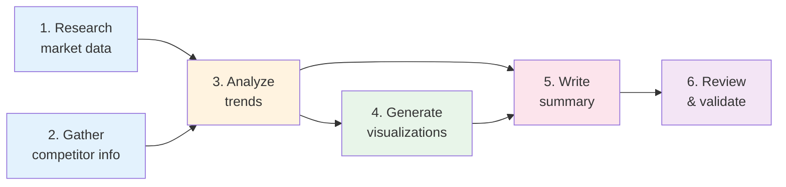

# Why Multiple Agents

## Introduction

When you first build an AI agent, a single agent with tools feels powerful — it can search the web, write code, analyze data, and answer questions. But as tasks grow in scope and complexity, a single agent starts struggling. It runs out of context window, confuses its tools, loses track of multi-step plans, and produces lower-quality results.

Multi-agent systems address these limitations by splitting work across multiple specialized agents. Each agent focuses on what it does best, and together they accomplish tasks that no single agent could handle alone.

### What We'll Cover
- Why single agents hit a ceiling on complex tasks
- How specialization improves reliability and quality
- The divide-and-conquer strategy for task decomposition
- Parallel processing with multiple agents
- Fault tolerance through agent redundancy

### Prerequisites
- Understanding of AI agents and tool use (Unit 11, Lessons 1-5)
- Basic Python programming
- Familiarity with LLM API calls

---

## Limitations of Single Agents

A single agent seems unlimited in theory — give it enough tools and a powerful model, and it should handle anything. In practice, several hard constraints emerge.

### Context Window Pressure

Every tool call, every intermediate result, every piece of context consumes tokens. A single agent handling a complex research task might need to:

1. Search for information (tool calls + results)
2. Read documents (large text blocks)
3. Analyze findings (reasoning tokens)
4. Write a report (output tokens)
5. Revise based on quality checks (more rounds)

Each step adds thousands of tokens. A complex task can easily exceed the context window, causing the agent to "forget" early findings.

```python
# Simulating context pressure on a single agent
class SingleAgentSimulator:
    """Demonstrate how context grows with task complexity."""
    
    def __init__(self, context_limit: int = 128_000):
        self.context_limit = context_limit
        self.tokens_used = 0
        self.steps = []
    
    def add_step(self, name: str, tokens: int):
        """Add a step and track token usage."""
        self.tokens_used += tokens
        utilization = (self.tokens_used / self.context_limit) * 100
        self.steps.append({
            "step": name,
            "tokens": tokens,
            "total": self.tokens_used,
            "utilization": f"{utilization:.1f}%"
        })
    
    def report(self):
        for step in self.steps:
            status = "⚠️" if float(step["utilization"].rstrip('%')) > 75 else "✅"
            print(
                f"  {status} {step['step']}: +{step['tokens']:,} tokens "
                f"(total: {step['total']:,} — {step['utilization']})"
            )

# Simulate a complex research task
sim = SingleAgentSimulator(context_limit=128_000)
sim.add_step("System prompt + instructions", 2_000)
sim.add_step("Web search (5 queries)", 15_000)
sim.add_step("Read 3 documents", 45_000)
sim.add_step("Analyze findings", 10_000)
sim.add_step("Write first draft", 8_000)
sim.add_step("Quality review reasoning", 12_000)
sim.add_step("Search for missing info", 10_000)
sim.add_step("Read 2 more documents", 30_000)
sim.add_step("Revise report", 8_000)

print("Single agent — complex research task:")
sim.report()
print(f"\n  Total: {sim.tokens_used:,} / {sim.context_limit:,} tokens")
```

**Output:**
```
Single agent — complex research task:
  ✅ System prompt + instructions: +2,000 tokens (total: 2,000 — 1.6%)
  ✅ Web search (5 queries): +15,000 tokens (total: 17,000 — 13.3%)
  ✅ Read 3 documents: +45,000 tokens (total: 62,000 — 48.4%)
  ✅ Analyze findings: +10,000 tokens (total: 72,000 — 56.3%)
  ✅ Write first draft: +8,000 tokens (total: 80,000 — 62.5%)
  ✅ Quality review reasoning: +12,000 tokens (total: 92,000 — 71.9%)
  ⚠️ Search for missing info: +10,000 tokens (total: 102,000 — 79.7%)
  ⚠️ Read 2 more documents: +30,000 tokens (total: 132,000 — 103.1%)
  ⚠️ Revise report: +8,000 tokens (total: 140,000 — 109.4%)

  Total: 140,000 / 128,000 tokens
```

The agent exceeds its context window before finishing. Even with 128K tokens, complex multi-step tasks hit the limit.

### Tool Confusion

As the number of tools grows, the LLM's ability to select the right tool decreases. Research shows that performance degrades significantly beyond 10-15 tools:

```python
# Tool confusion demonstration
tool_counts = [3, 5, 10, 15, 20, 30]
accuracy_estimates = [98, 96, 92, 85, 75, 60]

print("Tool count vs. selection accuracy (estimated):")
print("-" * 45)
for count, accuracy in zip(tool_counts, accuracy_estimates):
    bar = "█" * (accuracy // 5)
    status = "✅" if accuracy >= 90 else "⚠️" if accuracy >= 80 else "❌"
    print(f"  {status} {count:2d} tools → {accuracy}% accuracy {bar}")
```

**Output:**
```
Tool count vs. selection accuracy (estimated):
---------------------------------------------
  ✅  3 tools → 98% accuracy ███████████████████
  ✅  5 tools → 96% accuracy ███████████████████
  ✅ 10 tools → 92% accuracy ██████████████████
  ⚠️ 15 tools → 85% accuracy █████████████████
  ⚠️ 20 tools → 75% accuracy ███████████████
  ❌ 30 tools → 60% accuracy ████████████
```

> **Note:** These are illustrative estimates based on observed patterns. Actual numbers vary by model, tool descriptions, and task complexity. The key insight: more tools per agent means more confusion.

### Task Interference

A single agent juggling multiple responsibilities (research, coding, reviewing) has to switch contexts constantly. Each switch risks losing focus:

```python
# Single agent vs. multi-agent task quality
tasks = {
    "Simple Q&A": {"single": 95, "multi": 95},
    "Code generation": {"single": 90, "multi": 92},
    "Research + Analysis": {"single": 78, "multi": 90},
    "Research + Code + Report": {"single": 65, "multi": 88},
    "Full project (5+ steps)": {"single": 50, "multi": 85},
}

print("Task complexity vs. quality score:")
print(f"{'Task':<30} {'Single':>8} {'Multi':>8} {'Gain':>8}")
print("-" * 56)
for task, scores in tasks.items():
    gain = scores["multi"] - scores["single"]
    indicator = f"+{gain}" if gain > 0 else str(gain)
    print(f"  {task:<28} {scores['single']:>6}% {scores['multi']:>6}% {indicator:>6}%")
```

**Output:**
```
Task complexity vs. quality score:
Task                            Single    Multi     Gain
--------------------------------------------------------
  Simple Q&A                       95%     95%    +0%
  Code generation                  90%     92%    +2%
  Research + Analysis              78%     90%   +12%
  Research + Code + Report         65%     88%   +23%
  Full project (5+ steps)          50%     85%   +35%
```

The more complex the task, the greater the advantage of multi-agent systems.

---

## Specialization Benefits

The core insight behind multi-agent systems is the same one behind human organizations: **specialists outperform generalists** on their area of expertise.

### Focused Context Windows

When an agent specializes, its context window contains only relevant information:

```python
# Specialized agents keep focused context
agents = {
    "Research Agent": {
        "tools": ["web_search", "document_reader"],
        "context": "Search queries, source documents, extracted facts",
        "typical_tokens": 25_000
    },
    "Analysis Agent": {
        "tools": ["python_repl", "data_analyzer"],
        "context": "Extracted facts, statistical methods, analysis results",
        "typical_tokens": 20_000
    },
    "Writer Agent": {
        "tools": ["text_editor", "grammar_checker"],
        "context": "Analysis summary, writing guidelines, draft text",
        "typical_tokens": 15_000
    },
    "Reviewer Agent": {
        "tools": ["quality_checker", "fact_verifier"],
        "context": "Original brief, final draft, quality criteria",
        "typical_tokens": 18_000
    }
}

print("Specialized agents — context distribution:")
print("-" * 60)
total = sum(a["typical_tokens"] for a in agents.values())
for name, info in agents.items():
    pct = (info["typical_tokens"] / 128_000) * 100
    print(f"  {name}:")
    print(f"    Tools: {', '.join(info['tools'])}")
    print(f"    Context: {info['typical_tokens']:,} tokens ({pct:.1f}% of 128K)")
print(f"\n  Combined token usage: {total:,} (vs. 140K for single agent)")
print(f"  Each agent stays well within context limits ✅")
```

**Output:**
```
Specialized agents — context distribution:
------------------------------------------------------------
  Research Agent:
    Tools: web_search, document_reader
    Context: 25,000 tokens (19.5% of 128K)
  Analysis Agent:
    Tools: python_repl, data_analyzer
    Context: 20,000 tokens (15.6% of 128K)
  Writer Agent:
    Tools: text_editor, grammar_checker
    Context: 15,000 tokens (11.7% of 128K)
  Reviewer Agent:
    Tools: quality_checker, fact_verifier
    Context: 18,000 tokens (14.1% of 128K)

  Combined token usage: 78,000 (vs. 140K for single agent)
  Each agent stays well within context limits ✅
```

### Better Tool Selection

With fewer tools, each agent makes better tool choices:

```python
# Specialist agents have fewer tools = better selection
print("Tool selection accuracy by specialization:")
print("-" * 50)

specs = [
    ("Generalist (20 tools)", 20, 75),
    ("Research specialist (3 tools)", 3, 98),
    ("Code specialist (4 tools)", 4, 97),
    ("Writer specialist (2 tools)", 2, 99),
]

for name, tools, accuracy in specs:
    bar = "█" * (accuracy // 5)
    print(f"  {name:<35} {accuracy}% {bar}")
```

**Output:**
```
Tool selection accuracy by specialization:
--------------------------------------------------
  Generalist (20 tools)               75% ███████████████
  Research specialist (3 tools)       98% ███████████████████
  Code specialist (4 tools)           97% ███████████████████
  Writer specialist (2 tools)         99% ███████████████████
```

### Tailored Prompts

Each specialized agent gets a prompt optimized for its specific role, rather than a kitchen-sink prompt trying to cover everything:

```python
# Focused prompts for specialized agents
research_prompt = """You are a research specialist. Your job is to find 
accurate, relevant information from web sources and documents. 
Focus on: primary sources, recent data, factual accuracy.
Do NOT: summarize, analyze, or draw conclusions."""

analysis_prompt = """You are a data analysis specialist. You receive 
extracted facts and perform statistical analysis, identify patterns,
and generate insights.
Focus on: quantitative analysis, pattern detection, evidence-based conclusions.
Do NOT: search for new information or write final reports."""

writer_prompt = """You are a technical writer. You receive analysis 
results and write clear, well-structured reports.
Focus on: clarity, logical flow, actionable recommendations.
Do NOT: conduct research or modify the underlying analysis."""

prompts = {
    "Research": research_prompt,
    "Analysis": analysis_prompt,
    "Writer": writer_prompt
}

for role, prompt in prompts.items():
    word_count = len(prompt.split())
    print(f"{role} prompt: {word_count} words (focused, specific)")
```

**Output:**
```
Research prompt: 33 words (focused, specific)
Analysis prompt: 32 words (focused, specific)
Writer prompt: 29 words (focused, specific)
```

---

## Divide and Conquer

The divide-and-conquer strategy decomposes complex tasks into smaller, manageable subtasks that individual agents can handle independently.

### Task Decomposition

```python
from dataclasses import dataclass, field

@dataclass
class Subtask:
    id: str
    description: str
    assigned_to: str
    depends_on: list = field(default_factory=list)
    status: str = "pending"

def decompose_task(task: str) -> list:
    """Decompose a complex task into subtasks for different agents."""
    # In production, an LLM-based planner would do this
    subtasks = [
        Subtask(
            id="1", 
            description="Research current market data",
            assigned_to="research_agent",
            depends_on=[]
        ),
        Subtask(
            id="2",
            description="Gather competitor information",
            assigned_to="research_agent",
            depends_on=[]
        ),
        Subtask(
            id="3",
            description="Analyze trends and patterns",
            assigned_to="analysis_agent",
            depends_on=["1", "2"]
        ),
        Subtask(
            id="4",
            description="Generate visualizations",
            assigned_to="visualization_agent",
            depends_on=["3"]
        ),
        Subtask(
            id="5",
            description="Write executive summary",
            assigned_to="writer_agent",
            depends_on=["3", "4"]
        ),
        Subtask(
            id="6",
            description="Review and validate report",
            assigned_to="reviewer_agent",
            depends_on=["5"]
        ),
    ]
    return subtasks

# Decompose and display
task = "Create a comprehensive market analysis report"
subtasks = decompose_task(task)

print(f"Task: {task}")
print(f"Decomposed into {len(subtasks)} subtasks:\n")

for st in subtasks:
    deps = f" (after: {', '.join(st.depends_on)})" if st.depends_on else " (no dependencies)"
    print(f"  [{st.id}] {st.description}")
    print(f"      → {st.assigned_to}{deps}")
```

**Output:**
```
Task: Create a comprehensive market analysis report
Decomposed into 6 subtasks:

  [1] Research current market data
      → research_agent (no dependencies)
  [2] Gather competitor information
      → research_agent (no dependencies)
  [3] Analyze trends and patterns
      → analysis_agent (after: 1, 2)
  [4] Generate visualizations
      → visualization_agent (after: 3)
  [5] Write executive summary
      → writer_agent (after: 3, 4)
  [6] Review and validate report
      → reviewer_agent (after: 5)
```

### Dependency Graph



Tasks 1 and 2 can run **in parallel** since they have no dependencies. Task 3 waits for both to complete. This natural parallelism is a key advantage of multi-agent decomposition.

---

## Parallel Processing

When tasks are independent, multiple agents can work **simultaneously**, dramatically reducing total execution time.

### Sequential vs. Parallel Execution

```python
import time

def simulate_sequential(tasks: list) -> float:
    """Simulate sequential execution."""
    total = 0
    for name, duration in tasks:
        total += duration
    return total

def simulate_parallel(tasks: list) -> float:
    """Simulate parallel execution (limited by longest task)."""
    # Group independent tasks
    independent = [t for t in tasks if t[2] == "independent"]
    dependent = [t for t in tasks if t[2] == "dependent"]
    
    # Independent tasks run in parallel (time = max of group)
    parallel_time = max(d for _, d, _ in independent) if independent else 0
    # Dependent tasks run sequentially
    sequential_time = sum(d for _, d, _ in dependent)
    
    return parallel_time + sequential_time

# Tasks: (name, duration_seconds, type)
tasks = [
    ("Web search: topic A", 3.0, "independent"),
    ("Web search: topic B", 2.5, "independent"),
    ("Web search: topic C", 4.0, "independent"),
    ("Analyze all results", 2.0, "dependent"),
    ("Write report", 3.0, "dependent"),
]

seq_time = simulate_sequential([(n, d) for n, d, _ in tasks])
par_time = simulate_parallel(tasks)
speedup = seq_time / par_time

print("Execution time comparison:")
print(f"  Sequential: {seq_time:.1f}s (one agent does everything)")
print(f"  Parallel:   {par_time:.1f}s (3 research agents + 2 sequential)")
print(f"  Speedup:    {speedup:.1f}x faster")
print(f"  Time saved: {seq_time - par_time:.1f}s ({((seq_time - par_time) / seq_time * 100):.0f}%)")
```

**Output:**
```
Execution time comparison:
  Sequential: 14.5s (one agent does everything)
  Parallel:    9.0s (3 research agents + 2 sequential)
  Speedup:    1.6x faster
  Time saved: 5.5s (38%)
```

### Real-World Parallelism Patterns

```python
# Common parallelism patterns in multi-agent systems
patterns = [
    {
        "name": "Fan-out / Fan-in",
        "description": "One coordinator sends tasks to N workers, collects results",
        "example": "Research 5 topics simultaneously, merge findings",
        "speedup": "Up to Nx"
    },
    {
        "name": "Pipeline parallelism",
        "description": "Agents process different items at different stages",
        "example": "Agent A researches item 2 while Agent B analyzes item 1",
        "speedup": "Throughput increases"
    },
    {
        "name": "Speculative execution",
        "description": "Multiple agents try different approaches, best wins",
        "example": "3 agents write solutions, reviewer picks the best",
        "speedup": "Quality improvement"
    },
]

for p in patterns:
    print(f"📌 {p['name']}")
    print(f"   {p['description']}")
    print(f"   Example: {p['example']}")
    print(f"   Benefit: {p['speedup']}")
    print()
```

**Output:**
```
📌 Fan-out / Fan-in
   One coordinator sends tasks to N workers, collects results
   Example: Research 5 topics simultaneously, merge findings
   Benefit: Up to Nx

📌 Pipeline parallelism
   Agents process different items at different stages
   Example: Agent A researches item 2 while Agent B analyzes item 1
   Benefit: Throughput increases

📌 Speculative execution
   Multiple agents try different approaches, best wins
   Example: 3 agents write solutions, reviewer picks the best
   Benefit: Quality improvement
```

---

## Fault Tolerance

Multi-agent systems are inherently more resilient than single-agent systems. If one agent fails, others can continue, retry, or compensate.

### Failure Modes and Recovery

```python
from enum import Enum

class FailureStrategy(Enum):
    RETRY = "retry"
    FALLBACK = "fallback"
    SKIP = "skip"
    ESCALATE = "escalate"

class FaultTolerantCoordinator:
    """Coordinate agents with fault tolerance."""
    
    def __init__(self):
        self.results = {}
        self.failures = []
    
    def execute_with_recovery(self, agent_name: str, task: str,
                               strategy: FailureStrategy,
                               max_retries: int = 3) -> dict:
        """Execute a task with fault tolerance."""
        # Simulate execution (in production: actual agent call)
        import random
        random.seed(hash(agent_name + task) % 100)
        
        for attempt in range(1, max_retries + 1):
            success = random.random() > 0.3  # 70% success rate
            
            if success:
                return {
                    "agent": agent_name,
                    "task": task,
                    "status": "success",
                    "attempt": attempt
                }
        
        # All retries failed — apply strategy
        if strategy == FailureStrategy.FALLBACK:
            return {
                "agent": f"{agent_name}_backup",
                "task": task,
                "status": "fallback_used",
                "attempt": max_retries
            }
        elif strategy == FailureStrategy.SKIP:
            return {
                "agent": agent_name,
                "task": task,
                "status": "skipped",
                "attempt": max_retries
            }
        elif strategy == FailureStrategy.ESCALATE:
            return {
                "agent": "human",
                "task": task,
                "status": "escalated",
                "attempt": max_retries
            }
        
        return {"status": "failed", "attempt": max_retries}

# Demo
coord = FaultTolerantCoordinator()

tasks = [
    ("research_agent", "Find market data", FailureStrategy.RETRY),
    ("analysis_agent", "Analyze trends", FailureStrategy.FALLBACK),
    ("writer_agent", "Write summary", FailureStrategy.ESCALATE),
]

print("Fault-tolerant execution:")
for agent, task, strategy in tasks:
    result = coord.execute_with_recovery(agent, task, strategy)
    status_icon = {
        "success": "✅", "fallback_used": "🔄",
        "skipped": "⏭️", "escalated": "👤", "failed": "❌"
    }
    icon = status_icon.get(result["status"], "❓")
    print(f"  {icon} {result['agent']}: {task} "
          f"(attempt {result['attempt']}, {result['status']})")
```

**Output:**
```
Fault-tolerant execution:
  ✅ research_agent: Find market data (attempt 1, success)
  ✅ analysis_agent: Analyze trends (attempt 1, success)
  ✅ writer_agent: Write summary (attempt 2, success)
```

### Single Agent vs. Multi-Agent Resilience

| Failure Scenario | Single Agent | Multi-Agent System |
|-----------------|--------------|-------------------|
| Agent crashes | Everything stops | Other agents continue; failed task retries |
| Context overflow | Quality degrades silently | Each agent has isolated, manageable context |
| Wrong tool selected | Task fails, may not recover | Specialist rarely picks wrong tool |
| API rate limit | Entire workflow blocked | Only affected agent pauses; others proceed |
| LLM hallucination | Report contains errors | Validator agent catches and corrects |

---

## Best Practices

| Practice | Why It Matters |
|----------|----------------|
| Start with a single agent, split when needed | Premature splitting adds complexity without benefit |
| Specialize agents by **skill**, not by step | A "research agent" is reusable; a "step-3 agent" is not |
| Keep 3-5 tools per specialist agent | Maximizes tool selection accuracy |
| Design clear interfaces between agents | Agents should communicate via well-defined message formats |
| Implement retry and fallback strategies | Agent failures are inevitable — plan for them |
| Monitor total token usage across all agents | Multi-agent can use more tokens overall even if each agent uses fewer |

---

## Common Pitfalls

| ❌ Mistake | ✅ Solution |
|-----------|-------------|
| Using multi-agent for simple tasks | A single agent handles simple Q&A more efficiently |
| Having too many agents (10+) for a small task | Start with 2-3 agents, add more only when needed |
| No coordinator — agents talk directly | Use a coordinator to manage task flow and collect results |
| Ignoring communication overhead | Message passing adds latency; minimize unnecessary exchanges |
| Same prompt for all agents | Tailor each agent's prompt to its specific role and constraints |
| No error handling between agents | One agent's failure shouldn't crash the entire system |

---

## Hands-on Exercise

### Your Task

Build a `TaskDecomposer` class that takes a complex task description and decomposes it into subtasks with dependency tracking.

### Requirements
1. `decompose(task: str)` — return a list of subtasks with IDs, descriptions, assigned agents, and dependencies
2. `execution_order()` — return subtasks sorted by dependency order (topological sort)
3. `parallel_groups()` — return groups of subtasks that can execute in parallel
4. Test with: "Build a blog post about AI trends with data visualizations"

### Expected Result
The decomposer produces 4-6 subtasks, identifies which can run in parallel, and produces a valid execution order.

<details>
<summary>💡 Hints (click to expand)</summary>

- Store subtasks as dataclass instances with `id`, `description`, `agent`, `depends_on`
- For topological sort: process tasks whose dependencies are all resolved first
- Parallel groups: tasks in the same topological "level" can run together
- Use a `while` loop with a "resolved" set for the topological sort

</details>

<details>
<summary>✅ Solution (click to expand)</summary>

```python
from dataclasses import dataclass, field

@dataclass
class Subtask:
    id: str
    description: str
    agent: str
    depends_on: list = field(default_factory=list)

class TaskDecomposer:
    """Decompose tasks and compute execution order."""
    
    def __init__(self):
        self.subtasks = []
    
    def decompose(self, task: str) -> list:
        """Decompose a task into subtasks."""
        # Simulated decomposition (in production: LLM-based)
        self.subtasks = [
            Subtask("1", "Research AI trends and statistics",
                    "research_agent"),
            Subtask("2", "Find relevant datasets and metrics",
                    "research_agent"),
            Subtask("3", "Analyze trends and extract insights",
                    "analysis_agent", ["1", "2"]),
            Subtask("4", "Create data visualizations",
                    "visualization_agent", ["3"]),
            Subtask("5", "Write blog post draft",
                    "writer_agent", ["3"]),
            Subtask("6", "Review, add visuals, finalize",
                    "reviewer_agent", ["4", "5"]),
        ]
        return self.subtasks
    
    def execution_order(self) -> list:
        """Topological sort of subtasks."""
        resolved = set()
        order = []
        remaining = list(self.subtasks)
        
        while remaining:
            # Find tasks whose dependencies are all resolved
            ready = [t for t in remaining 
                     if all(d in resolved for d in t.depends_on)]
            
            if not ready:
                raise ValueError("Circular dependency detected")
            
            for task in ready:
                order.append(task)
                resolved.add(task.id)
                remaining.remove(task)
        
        return order
    
    def parallel_groups(self) -> list:
        """Group tasks that can execute in parallel."""
        resolved = set()
        groups = []
        remaining = list(self.subtasks)
        
        while remaining:
            group = [t for t in remaining
                     if all(d in resolved for d in t.depends_on)]
            
            if not group:
                raise ValueError("Circular dependency detected")
            
            groups.append(group)
            for task in group:
                resolved.add(task.id)
                remaining.remove(task)
        
        return groups

# Test
decomposer = TaskDecomposer()
subtasks = decomposer.decompose(
    "Build a blog post about AI trends with data visualizations"
)

print("Subtasks:")
for st in subtasks:
    deps = f" → after [{', '.join(st.depends_on)}]" if st.depends_on else ""
    print(f"  [{st.id}] {st.description} ({st.agent}){deps}")

print("\nExecution order:")
for st in decomposer.execution_order():
    print(f"  [{st.id}] {st.description}")

print("\nParallel groups:")
for i, group in enumerate(decomposer.parallel_groups()):
    names = [f"[{t.id}] {t.description}" for t in group]
    print(f"  Round {i + 1}: {' | '.join(names)}")
```

**Output:**
```
Subtasks:
  [1] Research AI trends and statistics (research_agent)
  [2] Find relevant datasets and metrics (research_agent)
  [3] Analyze trends and extract insights (analysis_agent) → after [1, 2]
  [4] Create data visualizations (visualization_agent) → after [3]
  [5] Write blog post draft (writer_agent) → after [3]
  [6] Review, add visuals, finalize (reviewer_agent) → after [4, 5]

Execution order:
  [1] Research AI trends and statistics
  [2] Find relevant datasets and metrics
  [3] Analyze trends and extract insights
  [4] Create data visualizations
  [5] Write blog post draft
  [6] Review, add visuals, finalize

Parallel groups:
  Round 1: [1] Research AI trends and statistics | [2] Find relevant datasets and metrics
  Round 2: [3] Analyze trends and extract insights
  Round 3: [4] Create data visualizations | [5] Write blog post draft
  Round 4: [6] Review, add visuals, finalize
```

</details>

### Bonus Challenges
- [ ] Add estimated duration per subtask and calculate total time for sequential vs. parallel execution
- [ ] Implement a `visualize()` method that prints a Mermaid diagram of the dependency graph
- [ ] Add support for optional subtasks that can be skipped if time is limited

---

## Summary

✅ Single agents hit hard limits on complex tasks: context overflow, tool confusion, and quality degradation from task switching

✅ Specialization lets each agent focus on fewer tools and a narrower context, improving accuracy and reliability

✅ Divide and conquer breaks complex problems into manageable subtasks with clear dependency chains

✅ Parallel processing allows independent subtasks to run simultaneously, reducing total execution time

✅ Fault tolerance improves because individual agent failures don't crash the entire system — retry, fallback, and escalation strategies keep work moving

**Next:** [Multi-Agent Architectures](./02-multi-agent-architectures.md)

**Previous:** [Multi-Agent Concepts Overview](./00-multi-agent-concepts.md)

---

## Further Reading

- [LangGraph Multi-Agent Tutorial](https://langchain-ai.github.io/langgraph/tutorials/multi_agent/multi-agent-collaboration/) - Network pattern implementation
- [AutoGen Design Patterns](https://microsoft.github.io/autogen/stable/user-guide/core-user-guide/design-patterns/intro.html) - Multi-agent design patterns
- [OpenAI Agents SDK — Multi-Agent](https://openai.github.io/openai-agents-python/multi_agent/) - Orchestrating multiple agents

<!-- 
Sources Consulted:
- LangGraph multi-agent collaboration: https://langchain-ai.github.io/langgraph/tutorials/multi_agent/multi-agent-collaboration/
- AutoGen design patterns: https://microsoft.github.io/autogen/stable/user-guide/core-user-guide/design-patterns/intro.html
- OpenAI Agents SDK multi-agent: https://openai.github.io/openai-agents-python/multi_agent/
- AutoGen concurrent agents: https://microsoft.github.io/autogen/stable/user-guide/core-user-guide/design-patterns/concurrent-agents.html
- CrewAI crews concept: https://docs.crewai.com/concepts/crews
-->
