# Multi-Agent Architectures

## Introduction

Choosing how agents are organized is one of the most consequential design decisions in a multi-agent system. The architecture determines who talks to whom, how decisions get made, where bottlenecks form, and how the system scales. Pick the wrong architecture and you get chaos — agents duplicating work, messages lost, no clear decision authority. Pick the right one and the system feels elegant: tasks flow naturally, agents collaborate efficiently, and the whole is greater than the sum of its parts.

In this lesson, we examine five foundational multi-agent architectures — from flat peer-to-peer networks to structured hierarchies, pipelines, and mesh topologies.

### What We'll Cover
- Peer-to-peer (network) architecture
- Hierarchical (tree) architecture
- Supervisor-worker pattern
- Pipeline architecture
- Mesh architecture
- When to choose each architecture

### Prerequisites
- Why multiple agents matter (Lesson 01)
- Basic understanding of graph structures
- Familiarity with agent concepts

---

## Peer-to-Peer Architecture

In a peer-to-peer (P2P) system, agents communicate directly with each other without a central coordinator. Every agent is equal — any agent can send messages to any other agent.


### Implementation

```python
from dataclasses import dataclass, field

@dataclass
class Message:
    sender: str
    receiver: str
    content: str
    msg_type: str = "task"

class PeerAgent:
    """An agent in a peer-to-peer network."""
    
    def __init__(self, name: str, role: str):
        self.name = name
        self.role = role
        self.inbox = []
        self.peers = {}
    
    def register_peer(self, peer: "PeerAgent"):
        """Register another agent as a peer."""
        self.peers[peer.name] = peer
    
    def send(self, to: str, content: str, msg_type: str = "task"):
        """Send a message to a peer."""
        if to not in self.peers:
            print(f"  ❌ {self.name}: Unknown peer '{to}'")
            return
        
        msg = Message(self.name, to, content, msg_type)
        self.peers[to].receive(msg)
    
    def receive(self, msg: Message):
        """Receive a message from a peer."""
        self.inbox.append(msg)
    
    def process_inbox(self):
        """Process all received messages."""
        results = []
        for msg in self.inbox:
            result = f"{self.name} ({self.role}): processed '{msg.content}' from {msg.sender}"
            results.append(result)
        self.inbox.clear()
        return results

# Create peer-to-peer network
researcher = PeerAgent("researcher", "research")
analyst = PeerAgent("analyst", "analysis")
writer = PeerAgent("writer", "writing")

# Register all peers with each other
for agent in [researcher, analyst, writer]:
    for peer in [researcher, analyst, writer]:
        if agent != peer:
            agent.register_peer(peer)

# Direct communication
researcher.send("analyst", "Here are the research findings on AI trends")
analyst.send("writer", "Analysis complete: 3 key trends identified")
writer.send("researcher", "Need more data on trend #2")

# Process messages
for agent in [researcher, analyst, writer]:
    results = agent.process_inbox()
    for r in results:
        print(f"  ✅ {r}")
```

**Output:**
```
  ✅ analyst (analysis): processed 'Here are the research findings on AI trends' from researcher
  ✅ writer (writing): processed 'Analysis complete: 3 key trends identified' from analyst
  ✅ researcher (research): processed 'Need more data on trend #2' from writer
```

### When to Use Peer-to-Peer

| Strength | Weakness |
|----------|----------|
| No single point of failure | Difficult to coordinate complex flows |
| Agents can collaborate freely | Message traffic grows quadratically |
| Easy to add new agents | No authority to resolve disagreements |
| Good for brainstorming tasks | Hard to track overall progress |

> **🤖 AI Context:** LangGraph's "multi-agent network" tutorial uses this pattern — agents pass `Command` objects to route work to specific peers.

---

## Hierarchical Architecture

In a hierarchical system, agents are organized in a tree structure. Decisions flow downward, results flow upward. Each level delegates to the level below.

```mermaid
flowchart TD
    CEO[🎯 CEO Agent<br/>Strategic decisions]
    
    CEO --> M1[📊 Manager: Research]
    CEO --> M2[📊 Manager: Engineering]
    
    M1 --> W1[🔧 Web Searcher]
    M1 --> W2[🔧 Doc Reader]
    M2 --> W3[🔧 Code Writer]
    M2 --> W4[🔧 Code Reviewer]
```



### Implementation

```python
class HierarchicalAgent:
    """An agent in a hierarchical system."""
    
    def __init__(self, name: str, role: str, level: int):
        self.name = name
        self.role = role
        self.level = level  # 0 = top, higher = lower
        self.subordinates = []
        self.superior = None
    
    def add_subordinate(self, agent: "HierarchicalAgent"):
        """Add a subordinate agent."""
        self.subordinates.append(agent)
        agent.superior = self
    
    def delegate(self, task: str) -> list:
        """Delegate a task down the hierarchy."""
        indent = "  " * self.level
        results = []
        
        if not self.subordinates:
            # Leaf node — execute the task
            result = f"{indent}🔧 {self.name}: Executing '{task}'"
            results.append(result)
        else:
            # Manager — delegate to subordinates
            results.append(f"{indent}📊 {self.name}: Delegating '{task}'")
            for sub in self.subordinates:
                sub_results = sub.delegate(task)
                results.extend(sub_results)
        
        return results
    
    def report_up(self, result: str):
        """Send results up the hierarchy."""
        if self.superior:
            return f"{self.name} → {self.superior.name}: {result}"
        return f"{self.name}: {result} (top level)"

# Build hierarchy
ceo = HierarchicalAgent("CEO", "strategic", level=0)
research_mgr = HierarchicalAgent("ResearchMgr", "research management", level=1)
eng_mgr = HierarchicalAgent("EngMgr", "engineering management", level=1)

web_searcher = HierarchicalAgent("WebSearcher", "web research", level=2)
doc_reader = HierarchicalAgent("DocReader", "document analysis", level=2)
coder = HierarchicalAgent("Coder", "code generation", level=2)
reviewer = HierarchicalAgent("Reviewer", "code review", level=2)

ceo.add_subordinate(research_mgr)
ceo.add_subordinate(eng_mgr)
research_mgr.add_subordinate(web_searcher)
research_mgr.add_subordinate(doc_reader)
eng_mgr.add_subordinate(coder)
eng_mgr.add_subordinate(reviewer)

# Delegate from top
results = ceo.delegate("Build AI-powered search feature")
for r in results:
    print(r)

# Report up
print()
print(web_searcher.report_up("Found 5 relevant APIs"))
print(coder.report_up("Implementation complete"))
```

**Output:**
```
📊 CEO: Delegating 'Build AI-powered search feature'
  📊 ResearchMgr: Delegating 'Build AI-powered search feature'
    🔧 WebSearcher: Executing 'Build AI-powered search feature'
    🔧 DocReader: Executing 'Build AI-powered search feature'
  📊 EngMgr: Delegating 'Build AI-powered search feature'
    🔧 Coder: Executing 'Build AI-powered search feature'
    🔧 Reviewer: Executing 'Build AI-powered search feature'

WebSearcher → ResearchMgr: Found 5 relevant APIs
Coder → EngMgr: Implementation complete
```

### When to Use Hierarchical

| Strength | Weakness |
|----------|----------|
| Clear chain of command | Bottleneck at top-level agent |
| Easy to reason about task flow | More levels = more latency |
| Natural for organizational tasks | Rigid — hard to adapt mid-task |
| Managers can aggregate results | Top agent needs broad understanding |

> **🤖 AI Context:** CrewAI's `Process.hierarchical` mode uses this pattern — a `manager_llm` coordinates agents and delegates tasks.

---

## Supervisor-Worker Pattern

The most popular multi-agent pattern. A single **supervisor** agent decides which worker to activate next based on the current state. Unlike a hierarchy, the supervisor directly manages all workers with no middle managers.

```mermaid
flowchart TD
    S[🎯 Supervisor<br/>Routes tasks, checks progress]
    
    S -->|"assign task"| W1[🔧 Worker: Research]
    S -->|"assign task"| W2[🔧 Worker: Code]
    S -->|"assign task"| W3[🔧 Worker: Write]
    
    W1 -->|"results"| S
    W2 -->|"results"| S
    W3 -->|"results"| S
    
    S -->|"done"| F[✅ Final Output]
```



### Implementation

```python
class SupervisorWorkerSystem:
    """Supervisor-worker multi-agent system."""
    
    def __init__(self):
        self.workers = {}
        self.task_log = []
    
    def register_worker(self, name: str, capabilities: list):
        """Register a worker with its capabilities."""
        self.workers[name] = {
            "capabilities": capabilities,
            "status": "idle"
        }
    
    def route_task(self, task: str) -> str:
        """Supervisor decides which worker handles a task."""
        task_lower = task.lower()
        
        for name, info in self.workers.items():
            for cap in info["capabilities"]:
                if cap in task_lower:
                    return name
        
        return list(self.workers.keys())[0]  # Default to first
    
    def execute(self, tasks: list) -> list:
        """Execute a sequence of tasks."""
        results = []
        
        for task in tasks:
            worker = self.route_task(task)
            self.workers[worker]["status"] = "busy"
            
            # Simulate execution
            result = {
                "task": task,
                "worker": worker,
                "status": "completed",
                "output": f"{worker} completed: {task}"
            }
            
            self.workers[worker]["status"] = "idle"
            results.append(result)
            self.task_log.append(result)
        
        return results

# Build system
system = SupervisorWorkerSystem()
system.register_worker("researcher", ["research", "search", "find"])
system.register_worker("coder", ["code", "implement", "build", "fix"])
system.register_worker("writer", ["write", "document", "summarize"])
system.register_worker("reviewer", ["review", "check", "validate"])

# Execute task sequence (supervisor routes each)
tasks = [
    "Research best practices for API design",
    "Implement the REST API endpoints",
    "Write API documentation",
    "Review the code for security issues",
    "Fix any issues found in review",
]

print("Supervisor routing tasks:\n")
results = system.execute(tasks)
for r in results:
    print(f"  📋 '{r['task']}'")
    print(f"     → Routed to: {r['worker']} ✅")
    print()
```

**Output:**
```
Supervisor routing tasks:

  📋 'Research best practices for API design'
     → Routed to: researcher ✅

  📋 'Implement the REST API endpoints'
     → Routed to: coder ✅

  📋 'Write API documentation'
     → Routed to: writer ✅

  📋 'Review the code for security issues'
     → Routed to: reviewer ✅

  📋 'Fix any issues found in review'
     → Routed to: coder ✅
```

### When to Use Supervisor-Worker

| Strength | Weakness |
|----------|----------|
| Clear routing logic | Supervisor is a single point of failure |
| Easy to add/remove workers | Supervisor context grows with task complexity |
| Supervisor tracks overall progress | Workers can't communicate directly |
| Natural fit for most AI tasks | Supervisor must understand all worker capabilities |

> **🤖 AI Context:** LangGraph's supervisor tutorial, AutoGen's `SelectorGroupChat`, and OpenAI's handoff-based orchestration all implement this pattern.

---

## Pipeline Architecture

In a pipeline, agents process data in a fixed sequence. Each agent's output becomes the next agent's input. There is no backtracking or routing — data flows in one direction.

```mermaid
flowchart LR
    I[📥 Input] --> A1[Agent 1<br/>Extract]
    A1 --> A2[Agent 2<br/>Transform]
    A2 --> A3[Agent 3<br/>Analyze]
    A3 --> A4[Agent 4<br/>Format]
    A4 --> O[📤 Output]
```



### Implementation

```python
class PipelineAgent:
    """An agent in a pipeline."""
    
    def __init__(self, name: str, transform_fn):
        self.name = name
        self.transform = transform_fn

class Pipeline:
    """Sequential pipeline of agents."""
    
    def __init__(self):
        self.stages = []
    
    def add_stage(self, agent: PipelineAgent):
        """Add an agent as the next pipeline stage."""
        self.stages.append(agent)
        return self  # Allow chaining
    
    def run(self, input_data: dict) -> dict:
        """Run data through all pipeline stages."""
        data = input_data.copy()
        
        print("Pipeline execution:")
        for i, stage in enumerate(self.stages):
            print(f"  Stage {i + 1}: {stage.name}")
            data = stage.transform(data)
            print(f"    Output keys: {list(data.keys())}")
        
        return data

# Define pipeline stages
def extract(data):
    data["extracted"] = f"Extracted content from: {data['source']}"
    data["word_count"] = 1500
    return data

def analyze(data):
    data["sentiment"] = "positive"
    data["topics"] = ["AI", "automation", "productivity"]
    return data

def summarize(data):
    data["summary"] = (
        f"Document from {data['source']}: {data['sentiment']} sentiment, "
        f"covering {', '.join(data['topics'])}. "
        f"Original length: {data['word_count']} words."
    )
    return data

def format_output(data):
    data["formatted"] = {
        "title": f"Analysis of {data['source']}",
        "summary": data["summary"],
        "metadata": {
            "sentiment": data["sentiment"],
            "topics": data["topics"],
            "word_count": data["word_count"]
        }
    }
    return data

# Build and run pipeline
pipeline = Pipeline()
pipeline.add_stage(PipelineAgent("Extractor", extract))
pipeline.add_stage(PipelineAgent("Analyzer", analyze))
pipeline.add_stage(PipelineAgent("Summarizer", summarize))
pipeline.add_stage(PipelineAgent("Formatter", format_output))

result = pipeline.run({"source": "Q3 earnings report"})
print(f"\nFinal output:")
print(f"  Title: {result['formatted']['title']}")
print(f"  Summary: {result['formatted']['summary']}")
```

**Output:**
```
Pipeline execution:
  Stage 1: Extractor
    Output keys: ['source', 'extracted', 'word_count']
  Stage 2: Analyzer
    Output keys: ['source', 'extracted', 'word_count', 'sentiment', 'topics']
  Stage 3: Summarizer
    Output keys: ['source', 'extracted', 'word_count', 'sentiment', 'topics', 'summary']
  Stage 4: Formatter
    Output keys: ['source', 'extracted', 'word_count', 'sentiment', 'topics', 'summary', 'formatted']

Final output:
  Title: Analysis of Q3 earnings report
  Summary: Document from Q3 earnings report: positive sentiment, covering AI, automation, productivity. Original length: 1500 words.
```

### When to Use Pipeline

| Strength | Weakness |
|----------|----------|
| Simple, predictable flow | No flexibility — every item goes through every stage |
| Easy to test each stage | Can't skip stages or backtrack |
| Clear data transformation path | One slow stage blocks everything |
| Great for ETL-style workflows | Not suitable for interactive tasks |

---

## Mesh Architecture

A mesh combines elements of all architectures. Agents can communicate with specific peers (not all), form temporary sub-groups, and dynamically reconfigure based on the task.


### Implementation

```python
class MeshAgent:
    """An agent in a mesh network with selective connectivity."""
    
    def __init__(self, name: str, group: str):
        self.name = name
        self.group = group
        self.connections = {}  # name -> agent
        self.messages = []
    
    def connect(self, agent: "MeshAgent"):
        """Create a bidirectional connection."""
        self.connections[agent.name] = agent
        agent.connections[self.name] = self
    
    def send(self, to: str, content: str):
        """Send a message to a connected agent."""
        if to in self.connections:
            self.connections[to].messages.append(
                {"from": self.name, "content": content}
            )
            return True
        return False
    
    def broadcast_group(self, content: str, all_agents: list):
        """Broadcast to all agents in the same group."""
        for agent in all_agents:
            if agent.group == self.group and agent.name != self.name:
                self.send(agent.name, content)

# Build mesh
orchestrator = MeshAgent("orchestrator", "management")
web_search = MeshAgent("web_search", "research")
doc_analysis = MeshAgent("doc_analysis", "research")
backend = MeshAgent("backend", "engineering")
frontend = MeshAgent("frontend", "engineering")

# Selective connections
orchestrator.connect(web_search)
orchestrator.connect(doc_analysis)
orchestrator.connect(backend)
orchestrator.connect(frontend)
web_search.connect(doc_analysis)  # Same group
backend.connect(frontend)          # Same group
doc_analysis.connect(backend)      # Cross-group

# Communication
orchestrator.send("web_search", "Find API documentation")
orchestrator.send("backend", "Prepare API endpoints")
web_search.send("doc_analysis", "Sharing search results")
doc_analysis.send("backend", "Requirements extracted from docs")
backend.send("frontend", "API contract: GET /api/data")

# Display messages
all_agents = [orchestrator, web_search, doc_analysis, backend, frontend]
print("Mesh network messages:\n")
for agent in all_agents:
    if agent.messages:
        print(f"  📬 {agent.name} ({agent.group}):")
        for msg in agent.messages:
            print(f"     ← {msg['from']}: {msg['content']}")
        print()
```

**Output:**
```
Mesh network messages:

  📬 web_search (research):
     ← orchestrator: Find API documentation

  📬 doc_analysis (research):
     ← web_search: Sharing search results

  📬 backend (engineering):
     ← orchestrator: Prepare API endpoints
     ← doc_analysis: Requirements extracted from docs

  📬 frontend (engineering):
     ← backend: API contract: GET /api/data
```

### When to Use Mesh

| Strength | Weakness |
|----------|----------|
| Flexible — adapts to task needs | Complex to implement and debug |
| Supports both within-team and cross-team communication | Message routing logic can be intricate |
| Models real-world organization structures | Harder to track overall task progress |
| Scales well with clear group boundaries | Requires careful access control |

---

## Architecture Comparison

| Architecture | Coordination | Flexibility | Debugging | Best For |
|-------------|-------------|-------------|-----------|----------|
| **Peer-to-peer** | Decentralized | High | Hard | Brainstorming, open-ended collaboration |
| **Hierarchical** | Top-down | Low | Easy | Large teams, clear delegation chains |
| **Supervisor-worker** | Centralized | Medium | Medium | Most AI tasks, tool routing |
| **Pipeline** | Sequential | Low | Easy | Data processing, ETL, content pipelines |
| **Mesh** | Mixed | High | Hard | Complex projects with team structures |


---

## Best Practices

| Practice | Why It Matters |
|----------|----------------|
| Start with supervisor-worker | Simplest effective pattern for most AI tasks |
| Match architecture to task structure | Pipeline for linear flows, hierarchy for delegation |
| Keep communication paths explicit | Implicit connections lead to debugging nightmares |
| Design for the common case | Optimize for 80% of tasks, handle 20% as exceptions |
| Add monitoring at connection points | Track messages between agents to find bottlenecks |
| Plan for architecture evolution | Start simple, refactor to mesh when complexity demands it |

---

## Common Pitfalls

| ❌ Mistake | ✅ Solution |
|-----------|-------------|
| Choosing mesh architecture for a simple task | Use supervisor-worker or pipeline instead |
| Building a deep hierarchy (4+ levels) | Flatten to 2-3 levels; deeper hierarchies add latency |
| Pipeline without error handling between stages | Add validation between stages and a retry mechanism |
| Peer-to-peer with no termination condition | Add a shared flag or coordinator to signal completion |
| Mixing architectures without clear boundaries | Pick one primary pattern and layer others carefully |
| No message logging between agents | Always log inter-agent messages for debugging |

---

## Hands-on Exercise

### Your Task

Build a `MultiArchitectureDemo` that implements both supervisor-worker and pipeline patterns, then compares their execution on the same task.

### Requirements
1. Implement a `SupervisorWorker` class with `add_worker()` and `execute(task_list)`
2. Implement a `Pipeline` class with `add_stage()` and `run(input_data)`
3. Run both on a content creation task: research → analyze → write → review
4. Compare: which produces output faster? Which is more flexible?

### Expected Result
Both systems complete the task. Supervisor-worker allows dynamic routing; pipeline provides predictable, sequential execution.

<details>
<summary>💡 Hints (click to expand)</summary>

- Supervisor-worker: store workers in a dict, route by keyword matching
- Pipeline: store stages in a list, chain output → input
- For comparison: track the number of "decisions" each system makes
- Supervisor must decide routing for each task; pipeline has zero decisions

</details>

<details>
<summary>✅ Solution (click to expand)</summary>

```python
class SupervisorWorker:
    def __init__(self):
        self.workers = {}
        self.decisions = 0
    
    def add_worker(self, name, keywords):
        self.workers[name] = keywords
    
    def route(self, task):
        self.decisions += 1
        task_lower = task.lower()
        for name, keywords in self.workers.items():
            if any(k in task_lower for k in keywords):
                return name
        return list(self.workers.keys())[0]
    
    def execute(self, tasks):
        results = []
        for task in tasks:
            worker = self.route(task)
            results.append(f"{worker} → {task}")
        return results

class SimplePipeline:
    def __init__(self):
        self.stages = []
        self.decisions = 0
    
    def add_stage(self, name, fn):
        self.stages.append((name, fn))
    
    def run(self, data):
        for name, fn in self.stages:
            data = fn(data)
            # No decisions needed — fixed order
        return data

# Test supervisor-worker
sw = SupervisorWorker()
sw.add_worker("researcher", ["research", "find", "search"])
sw.add_worker("analyst", ["analyze", "compare", "evaluate"])
sw.add_worker("writer", ["write", "draft", "compose"])
sw.add_worker("reviewer", ["review", "check", "validate"])

tasks = [
    "Research AI market trends",
    "Analyze the competitive landscape",
    "Write an executive summary",
    "Review the final document"
]

print("=== Supervisor-Worker ===")
for result in sw.execute(tasks):
    print(f"  ✅ {result}")
print(f"  Routing decisions: {sw.decisions}")

# Test pipeline
pipe = SimplePipeline()
pipe.add_stage("research", lambda d: {**d, "research": "findings"})
pipe.add_stage("analyze", lambda d: {**d, "analysis": "insights"})
pipe.add_stage("write", lambda d: {**d, "draft": "summary"})
pipe.add_stage("review", lambda d: {**d, "reviewed": True})

print("\n=== Pipeline ===")
result = pipe.run({"topic": "AI market trends"})
print(f"  ✅ Output keys: {list(result.keys())}")
print(f"  Routing decisions: {pipe.decisions}")

print("\n=== Comparison ===")
print(f"  Supervisor-Worker: Flexible routing, {sw.decisions} decisions")
print(f"  Pipeline: Fixed order, {pipe.decisions} decisions")
```

**Output:**
```
=== Supervisor-Worker ===
  ✅ researcher → Research AI market trends
  ✅ analyst → Analyze the competitive landscape
  ✅ writer → Write an executive summary
  ✅ reviewer → Review the final document
  Routing decisions: 4

=== Pipeline ===
  ✅ Output keys: ['topic', 'research', 'analysis', 'draft', 'reviewed']
  Routing decisions: 0

=== Comparison ===
  Supervisor-Worker: Flexible routing, 4 decisions
  Pipeline: Fixed order, 0 decisions
```

</details>

### Bonus Challenges
- [ ] Add a third architecture (hierarchical) to the comparison
- [ ] Implement fault tolerance: what happens when a pipeline stage or a worker fails?
- [ ] Add execution time tracking to compare latency between architectures

---

## Summary

✅ **Peer-to-peer** gives agents equal authority and free communication — best for brainstorming and open-ended collaboration, but hard to coordinate

✅ **Hierarchical** organizes agents in a tree with clear delegation chains — natural for large teams but adds latency at each level

✅ **Supervisor-worker** is the most common pattern: a central supervisor routes tasks to specialized workers — simple, effective, and well-supported by all major frameworks

✅ **Pipeline** processes data through a fixed sequence of stages — predictable and easy to test, ideal for ETL and content processing workflows

✅ **Mesh** combines selective connectivity with group structures — powerful for complex projects but requires careful design

**Next:** [Agent Roles](./03-agent-roles.md)

**Previous:** [Why Multiple Agents](./01-why-multiple-agents.md)

---

## Further Reading

- [LangGraph Multi-Agent Network](https://langchain-ai.github.io/langgraph/tutorials/multi_agent/multi-agent-collaboration/) - Peer-to-peer implementation
- [AutoGen Concurrent Agents](https://microsoft.github.io/autogen/stable/user-guide/core-user-guide/design-patterns/concurrent-agents.html) - Parallel processing patterns
- [CrewAI Crews](https://docs.crewai.com/concepts/crews) - Sequential and hierarchical process modes

<!-- 
Sources Consulted:
- LangGraph multi-agent network: https://langchain-ai.github.io/langgraph/tutorials/multi_agent/multi-agent-collaboration/
- AutoGen concurrent agents: https://microsoft.github.io/autogen/stable/user-guide/core-user-guide/design-patterns/concurrent-agents.html
- OpenAI Agents SDK multi-agent: https://openai.github.io/openai-agents-python/multi_agent/
- CrewAI crews: https://docs.crewai.com/concepts/crews
-->
