# Agent Roles and Responsibilities

## Introduction

Every successful multi-agent system assigns clear roles to its agents. Without defined roles, agents overlap, duplicate work, and conflict with each other. With well-designed roles, each agent knows its purpose, understands its boundaries, and contributes a distinct capability to the system.

We explore five essential agent roles in this lesson: coordinators that manage workflow, workers that execute tasks, specialists with deep domain knowledge, validators that ensure quality, and human proxies that bridge the gap between automation and human judgment.

### What We'll Cover
- Coordinator agents and orchestration responsibilities
- Worker agents and task execution
- Specialist agents with domain expertise
- Validator agents for quality assurance
- Human proxy agents for human-in-the-loop integration

### Prerequisites
- Multi-agent architectures (Lesson 02)
- Understanding of supervisor-worker and hierarchical patterns

---

## Coordinator Agents

A coordinator manages the flow of work through the system. It does not execute tasks itself. Instead, it plans, delegates, monitors progress, and aggregates results.

### Responsibilities

```mermaid
flowchart TD
    C[🎯 Coordinator]
    
    C --> P[📋 Plan<br/>Break task into steps]
    C --> D[📤 Delegate<br/>Assign steps to agents]
    C --> M[📊 Monitor<br/>Track progress]
    C --> A[📥 Aggregate<br/>Combine results]
    
    P --> D --> M --> A
```



### Implementation

```python
from dataclasses import dataclass, field
from enum import Enum

class TaskStatus(Enum):
    PENDING = "pending"
    ASSIGNED = "assigned"
    IN_PROGRESS = "in_progress"
    COMPLETED = "completed"
    FAILED = "failed"

@dataclass
class Task:
    id: str
    description: str
    assigned_to: str = ""
    status: TaskStatus = TaskStatus.PENDING
    result: str = ""

class CoordinatorAgent:
    """Manages task planning, delegation, and result aggregation."""
    
    def __init__(self, name: str):
        self.name = name
        self.task_queue = []
        self.workers = {}
        self.completed = []
    
    def register_worker(self, name: str, capabilities: list):
        """Register an available worker."""
        self.workers[name] = {
            "capabilities": capabilities,
            "current_task": None
        }
    
    def plan(self, objective: str) -> list:
        """Break an objective into tasks."""
        # In production, an LLM would generate this plan
        steps = [
            f"Research background on: {objective}",
            f"Analyze key requirements for: {objective}",
            f"Draft implementation plan for: {objective}",
            f"Review and validate plan for: {objective}",
        ]
        
        self.task_queue = [
            Task(id=f"task-{i+1}", description=step)
            for i, step in enumerate(steps)
        ]
        
        print(f"📋 {self.name} planned {len(self.task_queue)} tasks:")
        for task in self.task_queue:
            print(f"   {task.id}: {task.description}")
        
        return self.task_queue
    
    def delegate(self) -> list:
        """Assign pending tasks to available workers."""
        assignments = []
        
        for task in self.task_queue:
            if task.status != TaskStatus.PENDING:
                continue
            
            worker = self._find_best_worker(task)
            if worker:
                task.assigned_to = worker
                task.status = TaskStatus.ASSIGNED
                self.workers[worker]["current_task"] = task.id
                assignments.append((task.id, worker))
        
        print(f"\n📤 {self.name} delegated {len(assignments)} tasks:")
        for task_id, worker in assignments:
            print(f"   {task_id} → {worker}")
        
        return assignments
    
    def _find_best_worker(self, task: Task) -> str:
        """Find the best available worker for a task."""
        task_lower = task.description.lower()
        
        for name, info in self.workers.items():
            if info["current_task"] is None:
                for cap in info["capabilities"]:
                    if cap in task_lower:
                        return name
        
        # Return any idle worker
        for name, info in self.workers.items():
            if info["current_task"] is None:
                return name
        
        return ""
    
    def collect_results(self, task_id: str, result: str):
        """Collect results from a completed task."""
        for task in self.task_queue:
            if task.id == task_id:
                task.status = TaskStatus.COMPLETED
                task.result = result
                worker = task.assigned_to
                self.workers[worker]["current_task"] = None
                self.completed.append(task)
                break
    
    def summarize(self) -> str:
        """Aggregate all results into a final summary."""
        completed = len(self.completed)
        total = len(self.task_queue)
        print(f"\n📊 Progress: {completed}/{total} tasks completed")
        
        for task in self.completed:
            print(f"   ✅ {task.id}: {task.result}")
        
        return f"Completed {completed}/{total} tasks"

# Usage
coordinator = CoordinatorAgent("ProjectManager")
coordinator.register_worker("researcher", ["research", "background"])
coordinator.register_worker("analyst", ["analyze", "requirements"])
coordinator.register_worker("writer", ["draft", "implementation"])
coordinator.register_worker("reviewer", ["review", "validate"])

# Plan → Delegate → Execute → Collect
coordinator.plan("Build an AI-powered search feature")
coordinator.delegate()

# Simulate workers returning results
coordinator.collect_results("task-1", "Found 5 relevant approaches")
coordinator.collect_results("task-2", "3 key requirements identified")
coordinator.collect_results("task-3", "Implementation plan drafted")
coordinator.collect_results("task-4", "Plan validated, ready to proceed")

coordinator.summarize()
```

**Output:**
```
📋 ProjectManager planned 4 tasks:
   task-1: Research background on: Build an AI-powered search feature
   task-2: Analyze key requirements for: Build an AI-powered search feature
   task-3: Draft implementation plan for: Build an AI-powered search feature
   task-4: Review and validate plan for: Build an AI-powered search feature

📤 ProjectManager delegated 4 tasks:
   task-1 → researcher
   task-2 → analyst
   task-3 → writer
   task-4 → reviewer

📊 Progress: 4/4 tasks completed
   ✅ task-1: Found 5 relevant approaches
   ✅ task-2: 3 key requirements identified
   ✅ task-3: Implementation plan drafted
   ✅ task-4: Plan validated, ready to proceed
```

### Coordinator Design Guidelines

| Guideline | Rationale |
|-----------|-----------|
| Never execute tasks yourself | Coordinator handles flow, not work |
| Maintain a clear task queue | Track what's done, what's pending, what's blocked |
| Log every delegation decision | Essential for debugging |
| Have a fallback for unassignable tasks | Not every task matches a worker |

---

## Worker Agents

Workers are the "hands" of the system. They receive tasks, execute them, and return results. A worker should do one thing well and nothing else.

### Implementation

```python
class WorkerAgent:
    """Executes assigned tasks using specific tools or skills."""
    
    def __init__(self, name: str, role: str, tools: list):
        self.name = name
        self.role = role
        self.tools = tools
        self.tasks_completed = 0
    
    def can_handle(self, task_description: str) -> bool:
        """Check if this worker can handle a task."""
        desc_lower = task_description.lower()
        return any(tool in desc_lower for tool in self.tools)
    
    def execute(self, task: str) -> dict:
        """Execute a task and return results."""
        self.tasks_completed += 1
        
        # Select the right tool
        tool_used = "general"
        for tool in self.tools:
            if tool in task.lower():
                tool_used = tool
                break
        
        return {
            "worker": self.name,
            "task": task,
            "tool_used": tool_used,
            "result": f"{self.name} completed using {tool_used}: {task}",
            "tasks_so_far": self.tasks_completed
        }
    
    def status(self) -> str:
        return f"{self.name} ({self.role}): {self.tasks_completed} tasks completed"

# Create specialized workers
search_worker = WorkerAgent(
    "WebSearcher", "research",
    tools=["search", "browse", "scrape"]
)
code_worker = WorkerAgent(
    "Coder", "engineering",
    tools=["write code", "debug", "refactor", "test"]
)
data_worker = WorkerAgent(
    "DataProcessor", "data",
    tools=["analyze", "transform", "visualize", "aggregate"]
)

# Execute tasks
tasks = [
    ("Search for Python best practices", search_worker),
    ("Analyze the dataset for anomalies", data_worker),
    ("Write code for the API endpoint", code_worker),
    ("Search for security guidelines", search_worker),
]

print("Worker execution:\n")
for task, worker in tasks:
    result = worker.execute(task)
    print(f"  🔧 {result['result']}")

print("\nWorker status:")
for w in [search_worker, code_worker, data_worker]:
    print(f"  {w.status()}")
```

**Output:**
```
Worker execution:

  🔧 WebSearcher completed using search: Search for Python best practices
  🔧 DataProcessor completed using analyze: Analyze the dataset for anomalies
  🔧 Coder completed using write code: Write code for the API endpoint
  🔧 WebSearcher completed using search: Search for security guidelines

Worker status:
  WebSearcher (research): 2 tasks completed
  Coder (engineering): 1 tasks completed
  DataProcessor (data): 1 tasks completed
```

> **🤖 AI Context:** In LangGraph, each worker is a graph node wrapping a `create_react_agent` with specific tools. In AutoGen, workers are `AssistantAgent` instances with tailored system prompts.

---

## Specialist Agents

Specialists are workers with deep domain knowledge. While a generic worker follows instructions, a specialist brings expertise — industry terminology, domain-specific validation rules, and nuanced understanding.

### Specialist vs Worker

| Aspect | Worker | Specialist |
|--------|--------|-----------|
| **Knowledge** | General purpose | Deep domain expertise |
| **System prompt** | Brief instructions | Detailed domain context |
| **Tools** | Generic (search, code) | Domain-specific (medical DB, legal search) |
| **Output** | Task completion | Expert-level artifacts |
| **Example** | "Search the web" | "Search PubMed for clinical trials on drug X" |

### Implementation

```python
class SpecialistAgent:
    """Agent with deep domain expertise."""
    
    def __init__(self, name: str, domain: str, expertise: dict):
        self.name = name
        self.domain = domain
        self.expertise = expertise  # Maps sub-domains to knowledge
    
    def consult(self, question: str) -> dict:
        """Provide expert consultation on a question."""
        # Find relevant sub-domain
        relevant_areas = []
        question_lower = question.lower()
        
        for area, knowledge in self.expertise.items():
            if area.lower() in question_lower:
                relevant_areas.append({
                    "area": area,
                    "knowledge": knowledge
                })
        
        return {
            "specialist": self.name,
            "domain": self.domain,
            "question": question,
            "relevant_expertise": relevant_areas,
            "confidence": "high" if relevant_areas else "low",
            "recommendation": (
                f"Based on {self.domain} expertise: "
                f"Found {len(relevant_areas)} relevant area(s)."
            )
        }

# Create domain specialists
security_specialist = SpecialistAgent(
    "SecurityExpert", "cybersecurity",
    expertise={
        "authentication": "Use OAuth 2.0 + PKCE for SPAs. JWT for stateless auth.",
        "encryption": "AES-256 for data at rest, TLS 1.3 for data in transit.",
        "injection": "Parameterized queries only. Never concatenate user input.",
        "rate limiting": "Implement token bucket algorithm. 100 req/min default.",
    }
)

compliance_specialist = SpecialistAgent(
    "ComplianceExpert", "regulatory",
    expertise={
        "GDPR": "Right to erasure, data portability, consent management required.",
        "HIPAA": "PHI encryption mandatory. Access logs retained 6 years.",
        "SOC2": "Type II audit covers security, availability, confidentiality.",
    }
)

# Consult specialists
print("Security consultation:")
result = security_specialist.consult("How should we handle authentication?")
print(f"  Domain: {result['domain']}")
print(f"  Confidence: {result['confidence']}")
for area in result["relevant_expertise"]:
    print(f"  📚 {area['area']}: {area['knowledge']}")

print("\nCompliance consultation:")
result = compliance_specialist.consult("What GDPR requirements apply?")
print(f"  Domain: {result['domain']}")
print(f"  Confidence: {result['confidence']}")
for area in result["relevant_expertise"]:
    print(f"  📚 {area['area']}: {area['knowledge']}")
```

**Output:**
```
Security consultation:
  Domain: cybersecurity
  Confidence: high
  📚 authentication: Use OAuth 2.0 + PKCE for SPAs. JWT for stateless auth.

Compliance consultation:
  Domain: regulatory
  Confidence: high
  📚 GDPR: Right to erasure, data portability, consent management required.
```

---

## Validator Agents

Validators check the work of other agents. They do not create — they verify. A validator enforces quality standards, catches errors, and decides whether output is acceptable.

### Implementation

```python
from dataclasses import dataclass

@dataclass
class ValidationResult:
    is_valid: bool
    score: float  # 0.0 to 1.0
    issues: list
    suggestions: list

class ValidatorAgent:
    """Validates output from other agents."""
    
    def __init__(self, name: str, rules: dict):
        self.name = name
        self.rules = rules  # criteria -> checker function
        self.validations_performed = 0
    
    def validate(self, content: str, context: str = "") -> ValidationResult:
        """Validate content against all rules."""
        self.validations_performed += 1
        issues = []
        suggestions = []
        passed = 0
        
        for criterion, check_fn in self.rules.items():
            result = check_fn(content)
            if result["passed"]:
                passed += 1
            else:
                issues.append(f"{criterion}: {result['issue']}")
                if "suggestion" in result:
                    suggestions.append(result["suggestion"])
        
        score = passed / len(self.rules) if self.rules else 0.0
        
        return ValidationResult(
            is_valid=score >= 0.8,
            score=score,
            issues=issues,
            suggestions=suggestions
        )

# Define validation rules
def check_length(content):
    word_count = len(content.split())
    if word_count < 50:
        return {
            "passed": False,
            "issue": f"Too short ({word_count} words, minimum 50)",
            "suggestion": "Expand the content with more detail"
        }
    return {"passed": True}

def check_no_placeholder(content):
    placeholders = ["TODO", "FIXME", "TBD", "INSERT HERE"]
    found = [p for p in placeholders if p in content.upper()]
    if found:
        return {
            "passed": False,
            "issue": f"Contains placeholders: {found}",
            "suggestion": "Replace all placeholders with actual content"
        }
    return {"passed": True}

def check_has_examples(content):
    if "```" not in content and "example" not in content.lower():
        return {
            "passed": False,
            "issue": "No code examples found",
            "suggestion": "Add at least one code example"
        }
    return {"passed": True}

def check_professional_tone(content):
    casual = ["btw", "gonna", "wanna", "lol", "omg"]
    found = [w for w in casual if w in content.lower().split()]
    if found:
        return {
            "passed": False,
            "issue": f"Casual language: {found}",
            "suggestion": "Use professional language throughout"
        }
    return {"passed": True}

# Create validator
quality_validator = ValidatorAgent("QualityChecker", {
    "minimum_length": check_length,
    "no_placeholders": check_no_placeholder,
    "has_examples": check_has_examples,
    "professional_tone": check_professional_tone,
})

# Test with good content
good_content = """
This is a comprehensive guide to building REST APIs with Python.
We cover authentication, data validation, error handling, and testing.
The following code demonstrates a basic Flask endpoint that processes
JSON data and returns structured responses. Security best practices
include input sanitization, rate limiting, and proper CORS configuration.
Here is an example implementation using Flask:
```python
@app.route('/api/data')
def get_data():
    return jsonify({"status": "ok"})
```
"""

print("Validating good content:")
result = quality_validator.validate(good_content)
print(f"  Valid: {result.is_valid}")
print(f"  Score: {result.score:.0%}")
print(f"  Issues: {result.issues if result.issues else 'None'}")

# Test with poor content
poor_content = "TODO: write this section. btw gonna add examples later lol"

print("\nValidating poor content:")
result = quality_validator.validate(poor_content)
print(f"  Valid: {result.is_valid}")
print(f"  Score: {result.score:.0%}")
for issue in result.issues:
    print(f"  ❌ {issue}")
for suggestion in result.suggestions:
    print(f"  💡 {suggestion}")
```

**Output:**
```
Validating good content:
  Valid: True
  Score: 100%
  Issues: None

Validating poor content:
  Valid: False
  Score: 25%
  ❌ minimum_length: Too short (10 words, minimum 50)
  ❌ no_placeholders: Contains placeholders: ['TODO']
  ❌ has_examples: No code examples found
  💡 Expand the content with more detail
  💡 Replace all placeholders with actual content
  💡 Add at least one code example
```

### Validation-Rewrite Loop

Validators are most powerful in a loop — the validator checks output, sends feedback, and the worker revises:

```python
def validation_loop(worker, validator, task, max_attempts=3):
    """Run a validation loop until content passes or max attempts reached."""
    print(f"Starting validation loop (max {max_attempts} attempts):\n")
    
    for attempt in range(1, max_attempts + 1):
        # Worker produces output
        result = worker.execute(task)
        content = result["result"]
        
        # Validator checks output
        validation = validator.validate(content)
        
        print(f"  Attempt {attempt}: Score {validation.score:.0%}", end="")
        
        if validation.is_valid:
            print(" ✅ Passed")
            return content
        
        print(f" ❌ ({len(validation.issues)} issues)")
        # In production: feed issues back to worker's prompt
        task = f"{task} (Fix: {'; '.join(validation.suggestions)})"
    
    print(f"\n  ⚠️ Max attempts reached.")
    return content
```

---

## Human Proxy Agents

A human proxy acts as an agent-facing interface for human decision-making. When the system encounters a decision that requires human judgment — ethical considerations, ambiguous requirements, high-stakes approvals — the human proxy pauses the workflow and presents the decision to a human.

### Implementation

```python
class HumanProxyAgent:
    """Bridges between agent system and human decision-makers."""
    
    def __init__(self, name: str, auto_approve_threshold: float = 0.9):
        self.name = name
        self.auto_approve_threshold = auto_approve_threshold
        self.decisions_log = []
    
    def request_decision(
        self,
        question: str,
        options: list,
        confidence: float,
        context: str = ""
    ) -> dict:
        """Request a decision — auto-approve if confidence is high."""
        
        decision = {
            "question": question,
            "options": options,
            "confidence": confidence,
            "context": context,
        }
        
        if confidence >= self.auto_approve_threshold:
            # High confidence — auto-approve
            decision["result"] = options[0]  # Take first (recommended)
            decision["method"] = "auto-approved"
            print(f"  🤖 Auto-approved (confidence: {confidence:.0%}): {options[0]}")
        else:
            # Low confidence — needs human input
            decision["result"] = None
            decision["method"] = "human-required"
            print(f"  🙋 Human decision needed (confidence: {confidence:.0%}):")
            print(f"     Question: {question}")
            for i, option in enumerate(options):
                print(f"     {i + 1}. {option}")
            
            # In production: send notification, wait for response
            # Simulating human choosing option 2
            decision["result"] = options[1] if len(options) > 1 else options[0]
            print(f"     → Human selected: {decision['result']}")
        
        self.decisions_log.append(decision)
        return decision

# Usage
proxy = HumanProxyAgent("HumanGateway", auto_approve_threshold=0.85)

# High confidence — auto-approved
proxy.request_decision(
    question="Should we use GPT-4o for this task?",
    options=["Yes, use GPT-4o", "No, use GPT-4o-mini instead"],
    confidence=0.95,
    context="Task is simple text classification"
)

# Low confidence — needs human
proxy.request_decision(
    question="The generated content references a competitor negatively. Publish?",
    options=["Publish as is", "Remove competitor reference", "Rewrite entirely"],
    confidence=0.4,
    context="Blog post about AI products"
)

# Medium confidence — still needs human
proxy.request_decision(
    question="User data matches two profiles. Which is correct?",
    options=["Profile A (John Smith, NYC)", "Profile B (John Smith, LA)"],
    confidence=0.6,
    context="Customer support lookup"
)

print(f"\nDecision summary:")
print(f"  Total decisions: {len(proxy.decisions_log)}")
auto = sum(1 for d in proxy.decisions_log if d["method"] == "auto-approved")
human = sum(1 for d in proxy.decisions_log if d["method"] == "human-required")
print(f"  Auto-approved: {auto}")
print(f"  Human-required: {human}")
```

**Output:**
```
  🤖 Auto-approved (confidence: 95%): Yes, use GPT-4o
  🙋 Human decision needed (confidence: 40%):
     Question: The generated content references a competitor negatively. Publish?
     1. Publish as is
     2. Remove competitor reference
     3. Rewrite entirely
     → Human selected: Remove competitor reference
  🙋 Human decision needed (confidence: 60%):
     Question: User data matches two profiles. Which is correct?
     1. Profile A (John Smith, NYC)
     2. Profile B (John Smith, LA)
     → Human selected: Profile B (John Smith, LA)

Decision summary:
  Total decisions: 3
  Auto-approved: 1
  Human-required: 2
```

---

## Combining Roles in Practice

Real systems use all five roles together. Here is how they fit:

```mermaid
flowchart TD
    U[👤 User] --> HP[Human Proxy<br/>Approval gate]
    HP --> C[🎯 Coordinator<br/>Plan & delegate]
    
    C --> W1[🔧 Worker<br/>General tasks]
    C --> S1[🧠 Specialist<br/>Domain expert]
    
    W1 --> V[✅ Validator<br/>Quality check]
    S1 --> V
    
    V -->|"pass"| C
    V -->|"fail"| W1
    V -->|"uncertain"| HP
```



| Role | Count in Typical System | Notes |
|------|------------------------|-------|
| Coordinator | 1-2 | One primary, maybe a fallback |
| Workers | 3-10 | Scale based on task variety |
| Specialists | 1-3 | Only when domain expertise is needed |
| Validators | 1-2 | One per quality dimension |
| Human Proxies | 0-1 | Only for high-stakes or ambiguous decisions |

---

## Best Practices

| Practice | Why It Matters |
|----------|----------------|
| Give each agent ONE clear role | Agents with multiple roles create confusion |
| Define role boundaries explicitly | Prevent overlap and duplicate work |
| Match role complexity to task needs | A simple task does not need a specialist |
| Validate before delivering to humans | Catch obvious errors before escalation |
| Log all inter-role interactions | Essential for debugging multi-agent flows |
| Design human proxy as a last resort | Auto-approve whenever confidence is high enough |

---

## Common Pitfalls

| ❌ Mistake | ✅ Solution |
|-----------|-------------|
| Coordinator also executes tasks | Keep coordination and execution separate |
| Workers with overlapping capabilities | Define clear boundaries for each worker |
| No validator in the system | Always include at least one quality gate |
| Human proxy for every decision | Set confidence thresholds for auto-approval |
| Specialist with no domain-specific tools | Give specialists tools that match their expertise |
| Ignoring the coordinator's planning phase | Invest in good task decomposition upfront |

---

## Hands-on Exercise

### Your Task

Build a mini multi-agent system with all five roles that processes a "write a blog post" request.

### Requirements
1. **Coordinator** breaks the request into 3 tasks: research, write, validate
2. **Worker** handles the research task
3. **Specialist** handles the writing task (content specialist)
4. **Validator** checks the final output against 3 rules
5. **Human Proxy** approves or rejects the final result

### Expected Result
The task flows through all five roles, with the validator catching issues and the human proxy making the final call.

<details>
<summary>💡 Hints (click to expand)</summary>

- Start by defining the five agent classes with minimal logic
- Coordinator's `plan()` returns a list of task dicts
- Validator should check length, tone, and completeness
- Human proxy can auto-approve if validator score is above 90%

</details>

<details>
<summary>✅ Solution (click to expand)</summary>

```python
class MiniCoordinator:
    def plan(self, request):
        return [
            {"id": 1, "type": "research", "desc": f"Research: {request}"},
            {"id": 2, "type": "write", "desc": f"Write: {request}"},
            {"id": 3, "type": "validate", "desc": f"Validate: {request}"},
        ]

class MiniWorker:
    def execute(self, task):
        return f"Research completed: found 5 key points about {task['desc']}"

class MiniSpecialist:
    def execute(self, task, research):
        return (
            f"Blog post: Based on {research}, here is a comprehensive "
            f"analysis with expert insights, code examples, and practical "
            f"recommendations for developers building modern applications. "
            f"This covers architecture, implementation, testing, and deployment."
        )

class MiniValidator:
    def validate(self, content):
        score = 0
        issues = []
        if len(content.split()) > 20:
            score += 1
        else:
            issues.append("too short")
        if "expert" in content.lower() or "comprehensive" in content.lower():
            score += 1
        else:
            issues.append("missing depth")
        if "code" in content.lower() or "example" in content.lower():
            score += 1
        else:
            issues.append("no examples mentioned")
        return {"score": score / 3, "issues": issues}

class MiniHumanProxy:
    def decide(self, content, validation):
        if validation["score"] >= 0.9:
            return "auto-approved"
        return "human-review-needed"

# Run the system
coord = MiniCoordinator()
worker = MiniWorker()
specialist = MiniSpecialist()
validator = MiniValidator()
proxy = MiniHumanProxy()

tasks = coord.plan("AI-powered search features")
print("📋 Planned tasks:", [t["desc"] for t in tasks])

research = worker.execute(tasks[0])
print(f"🔧 {research}")

content = specialist.execute(tasks[1], research)
print(f"🧠 {content[:80]}...")

validation = validator.validate(content)
print(f"✅ Validation: {validation['score']:.0%}, issues: {validation['issues']}")

decision = proxy.decide(content, validation)
print(f"👤 Decision: {decision}")
```

**Output:**
```
📋 Planned tasks: ['Research: AI-powered search features', 'Write: AI-powered search features', 'Validate: AI-powered search features']
🔧 Research completed: found 5 key points about Research: AI-powered search features
🧠 Blog post: Based on Research completed: found 5 key points about Research: AI-po...
✅ Validation: 100%, issues: []
👤 Decision: auto-approved
```

</details>

### Bonus Challenges
- [ ] Add a feedback loop: if validation fails, send content back to the specialist
- [ ] Track execution time for each role to identify bottlenecks
- [ ] Add a second specialist (editor) who refines the writer's output

---

## Summary

✅ **Coordinator agents** plan, delegate, monitor, and aggregate — they manage workflow without executing tasks themselves

✅ **Worker agents** execute tasks using specific tools — one worker, one responsibility

✅ **Specialist agents** bring deep domain knowledge that generic workers lack — they provide expert-level output for domain-specific tasks

✅ **Validator agents** enforce quality standards through rule-based or LLM-based checking — pair them with rewrite loops for iterative improvement

✅ **Human proxy agents** bridge automation and human judgment — set confidence thresholds to minimize human interruptions while preserving oversight

**Next:** [Communication Patterns](./04-communication-patterns.md)

**Previous:** [Multi-Agent Architectures](./02-multi-agent-architectures.md)

---

## Further Reading

- [AutoGen Agent Design Patterns](https://microsoft.github.io/autogen/stable/user-guide/core-user-guide/design-patterns/) - Core patterns for agent roles
- [CrewAI Agents](https://docs.crewai.com/concepts/agents) - Agent configuration with roles and backstories
- [OpenAI Agents SDK](https://openai.github.io/openai-agents-python/) - Agent and handoff patterns

<!-- 
Sources Consulted:
- AutoGen design patterns: https://microsoft.github.io/autogen/stable/user-guide/core-user-guide/design-patterns/
- CrewAI agents: https://docs.crewai.com/concepts/agents
- OpenAI Agents SDK: https://openai.github.io/openai-agents-python/
- LangGraph multi-agent: https://langchain-ai.github.io/langgraph/tutorials/multi_agent/multi-agent-collaboration/
-->
