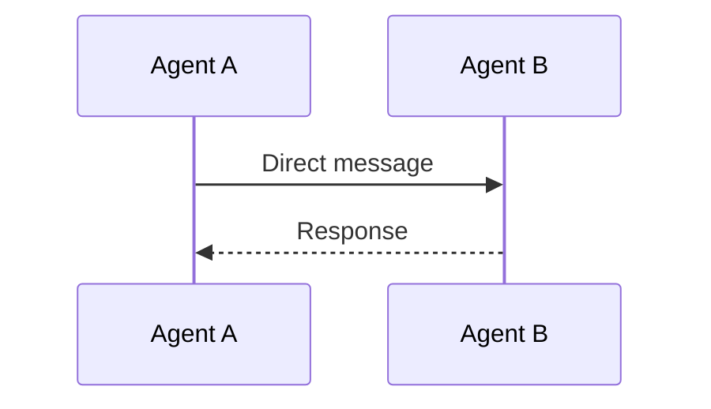
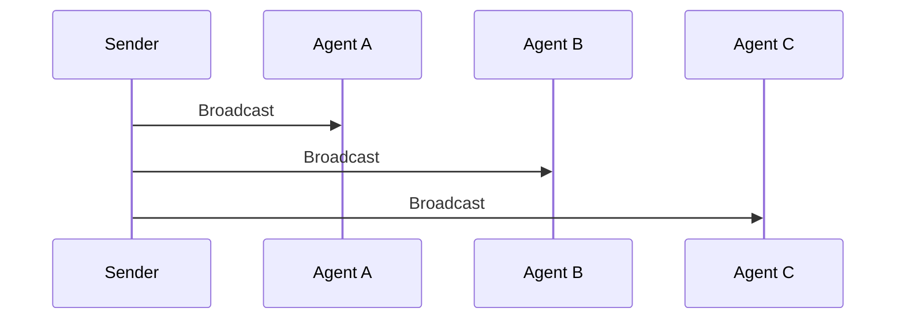
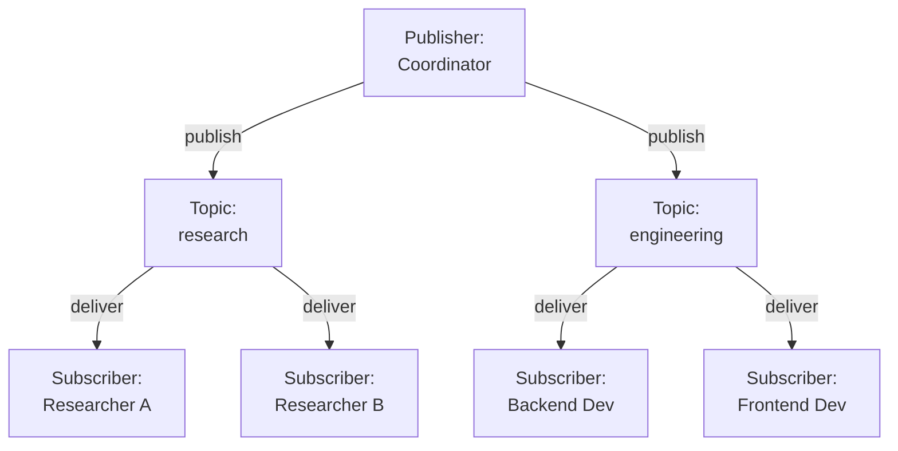
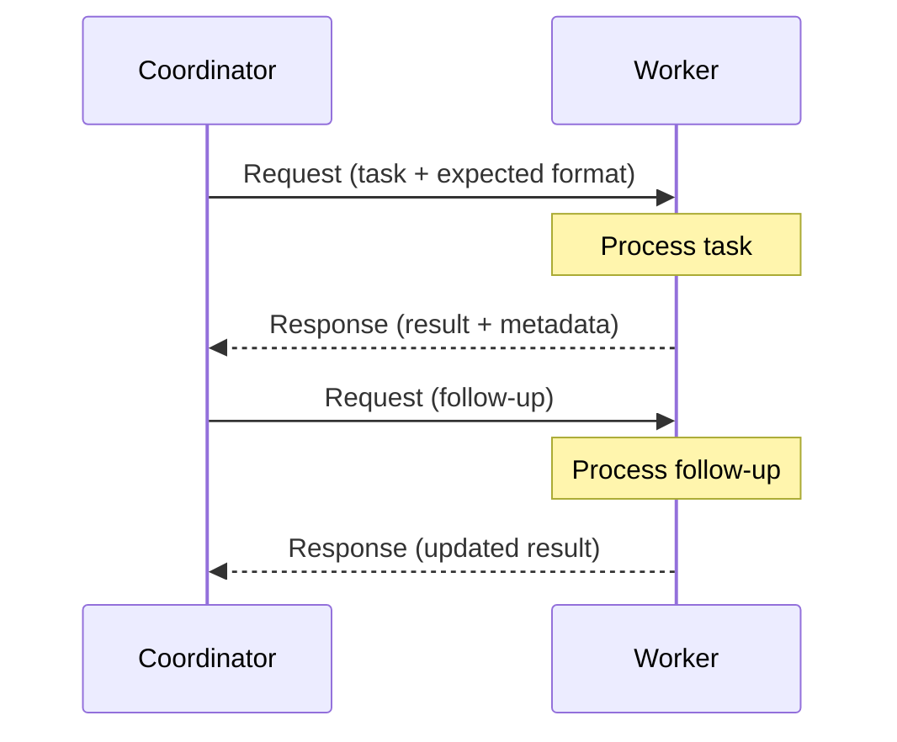
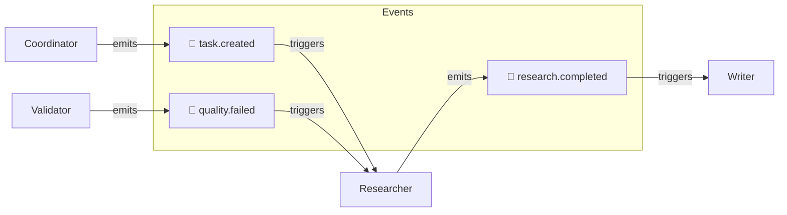
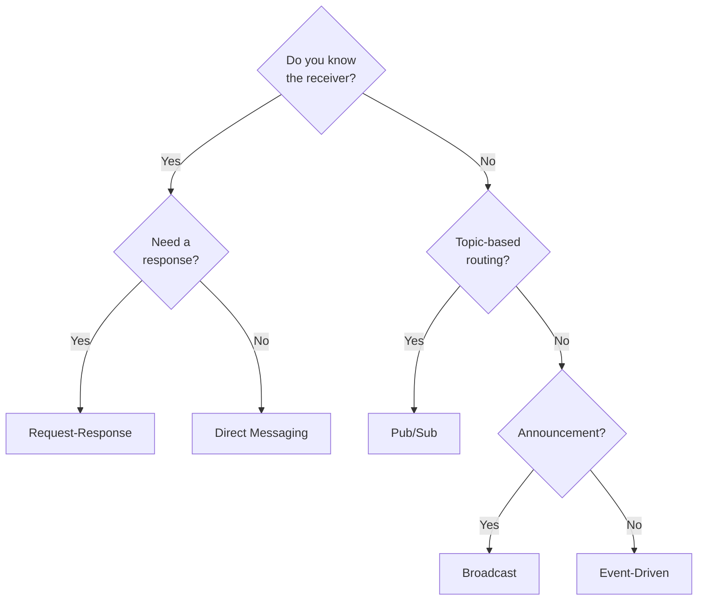

# Communication Patterns

## Introduction

How agents talk to each other is just as important as how they are organized. An architecture defines *who can* talk to whom. Communication patterns define *how* they exchange information — the protocols, message formats, and interaction styles that make collaboration possible.

Poor communication patterns lead to lost messages, wasted work, and agents talking past each other. Good patterns ensure every message reaches the right agent, carries the right information, and triggers the right response.

### What We'll Cover
- Direct messaging between agents
- Broadcast communication
- Publish-subscribe (pub/sub) patterns
- Request-response interactions
- Event-driven communication

### Prerequisites
- Multi-agent architectures (Lesson 02)
- Agent roles and responsibilities (Lesson 03)
- Basic understanding of messaging concepts

---

## Message Structure

Before examining patterns, we need a common message format. Every message in a multi-agent system should carry enough information to be routed, processed, and traced.

```python
from dataclasses import dataclass, field
from datetime import datetime
from enum import Enum
from typing import Any

class MessageType(Enum):
    TASK = "task"
    RESULT = "result"
    REQUEST = "request"
    RESPONSE = "response"
    EVENT = "event"
    BROADCAST = "broadcast"

@dataclass
class AgentMessage:
    """Standard message format for inter-agent communication."""
    sender: str
    receiver: str           # "*" for broadcast
    msg_type: MessageType
    content: Any
    correlation_id: str = ""  # Links request to response
    timestamp: str = field(
        default_factory=lambda: datetime.now().isoformat()
    )
    metadata: dict = field(default_factory=dict)
    
    def __repr__(self):
        return (
            f"Message({self.msg_type.value}: "
            f"{self.sender} → {self.receiver}, "
            f"content='{str(self.content)[:50]}...')"
        )

# Example message
msg = AgentMessage(
    sender="coordinator",
    receiver="researcher",
    msg_type=MessageType.TASK,
    content="Research AI market trends for 2025",
    correlation_id="task-001"
)
print(msg)
```

**Output:**
```
Message(task: coordinator → researcher, content='Research AI market trends for 2025...')
```

> **Note:** The `correlation_id` links related messages. When the researcher replies, it uses the same `correlation_id` so the coordinator can match the response to the original task.

---

## Direct Messaging

The simplest pattern. Agent A sends a message directly to Agent B. The sender must know the receiver's identity.



### Implementation

```python
class DirectMessageBus:
    """Simple message bus supporting direct agent-to-agent messaging."""
    
    def __init__(self):
        self.agents = {}  # name -> agent
        self.message_log = []
    
    def register(self, agent):
        """Register an agent on the bus."""
        self.agents[agent.name] = agent
    
    def send(self, message: AgentMessage) -> bool:
        """Deliver a message to its receiver."""
        if message.receiver not in self.agents:
            print(f"  ❌ Unknown receiver: {message.receiver}")
            return False
        
        self.message_log.append(message)
        receiver = self.agents[message.receiver]
        receiver.receive(message)
        return True

class DirectAgent:
    """Agent that communicates via direct messages."""
    
    def __init__(self, name: str, bus: DirectMessageBus):
        self.name = name
        self.bus = bus
        self.inbox = []
        bus.register(self)
    
    def send_to(self, receiver: str, content: str,
                msg_type: MessageType = MessageType.TASK):
        """Send a direct message to another agent."""
        msg = AgentMessage(
            sender=self.name,
            receiver=receiver,
            msg_type=msg_type,
            content=content,
            correlation_id=f"{self.name}-{len(self.inbox)}"
        )
        self.bus.send(msg)
    
    def receive(self, message: AgentMessage):
        """Receive and process a message."""
        self.inbox.append(message)
        print(f"  📨 {self.name} received from {message.sender}: "
              f"'{message.content}'")
    
    def reply(self, original: AgentMessage, content: str):
        """Reply to a received message."""
        msg = AgentMessage(
            sender=self.name,
            receiver=original.sender,
            msg_type=MessageType.RESPONSE,
            content=content,
            correlation_id=original.correlation_id
        )
        self.bus.send(msg)

# Usage
bus = DirectMessageBus()
coordinator = DirectAgent("coordinator", bus)
researcher = DirectAgent("researcher", bus)
writer = DirectAgent("writer", bus)

print("Direct messaging:\n")

# Coordinator sends tasks
coordinator.send_to("researcher", "Find data on AI adoption rates")
coordinator.send_to("writer", "Prepare article outline")

# Researcher replies
researcher.reply(
    researcher.inbox[0],
    "Found: 72% of enterprises adopted AI in 2024"
)

print(f"\nMessage log: {len(bus.message_log)} messages total")
```

**Output:**
```
Direct messaging:

  📨 researcher received from coordinator: 'Find data on AI adoption rates'
  📨 writer received from coordinator: 'Prepare article outline'
  📨 coordinator received from researcher: 'Found: 72% of enterprises adopted AI in 2024'

Message log: 3 messages total
```

### When to Use Direct Messaging

| Strength | Weakness |
|----------|----------|
| Simple to implement | Sender must know receiver's identity |
| Low overhead | Tight coupling between agents |
| Clear sender/receiver relationship | Adding agents requires updating senders |
| Easy to trace messages | Does not scale to many-to-many communication |

> **🤖 AI Context:** In AutoGen 0.4+, direct messaging uses `AgentId` to target specific agent instances. The runtime delivers the message directly.

---

## Broadcast Communication

One agent sends a message to all other agents in the system. Useful for announcements, status updates, or when any agent might be able to handle a task.



### Implementation

```python
class BroadcastBus:
    """Message bus supporting broadcast communication."""
    
    def __init__(self):
        self.agents = {}
        self.message_log = []
    
    def register(self, agent):
        self.agents[agent.name] = agent
    
    def broadcast(self, message: AgentMessage):
        """Send a message to all agents except the sender."""
        self.message_log.append(message)
        delivered = 0
        
        for name, agent in self.agents.items():
            if name != message.sender:
                agent.receive(message)
                delivered += 1
        
        return delivered

class BroadcastAgent:
    def __init__(self, name: str, interests: list, bus: BroadcastBus):
        self.name = name
        self.interests = interests  # Topics this agent cares about
        self.bus = bus
        self.inbox = []
        bus.register(self)
    
    def announce(self, content: str):
        """Broadcast a message to all agents."""
        msg = AgentMessage(
            sender=self.name,
            receiver="*",
            msg_type=MessageType.BROADCAST,
            content=content
        )
        count = self.bus.broadcast(msg)
        print(f"  📢 {self.name} broadcast to {count} agents: '{content}'")
    
    def receive(self, message: AgentMessage):
        """Receive a broadcast — only process if relevant."""
        content_lower = message.content.lower()
        relevant = any(
            interest in content_lower
            for interest in self.interests
        )
        
        if relevant:
            self.inbox.append(message)
            print(f"  ✅ {self.name}: Relevant! Processing.")
        else:
            print(f"  ⬜ {self.name}: Not relevant, ignoring.")

# Usage
bus = BroadcastBus()
data_agent = BroadcastAgent("data_agent", ["data", "dataset", "csv"], bus)
code_agent = BroadcastAgent("code_agent", ["code", "bug", "implementation"], bus)
doc_agent = BroadcastAgent("doc_agent", ["document", "write", "readme"], bus)

print("Broadcast communication:\n")

coordinator = BroadcastAgent("coordinator", [], bus)
coordinator.announce("New dataset available for analysis")
print()
coordinator.announce("Bug found in the implementation")
```

**Output:**
```
Broadcast communication:

  📢 coordinator broadcast to 3 agents: 'New dataset available for analysis'
  ✅ data_agent: Relevant! Processing.
  ⬜ code_agent: Not relevant, ignoring.
  ⬜ doc_agent: Not relevant, ignoring.

  📢 coordinator broadcast to 3 agents: 'Bug found in the implementation'
  ⬜ data_agent: Not relevant, ignoring.
  ✅ code_agent: Relevant! Processing.
  ⬜ doc_agent: Not relevant, ignoring.
```

### When to Use Broadcast

| Strength | Weakness |
|----------|----------|
| Sender does not need to know receivers | Every agent receives every message (wasteful) |
| Easy to add agents without changing sender | Agents must filter irrelevant messages |
| Good for announcements | Not suitable for targeted task assignment |
| Natural "who can handle this?" pattern | No guaranteed response |

---

## Publish-Subscribe (Pub/Sub)

Pub/sub decouples senders from receivers using **topics**. Agents subscribe to topics they care about. When an agent publishes to a topic, only subscribers receive the message.



### Implementation

```python
from collections import defaultdict

class PubSubBus:
    """Publish-subscribe message bus."""
    
    def __init__(self):
        self.subscriptions = defaultdict(list)  # topic -> [agents]
        self.message_log = []
    
    def subscribe(self, agent, topic: str):
        """Subscribe an agent to a topic."""
        if agent not in self.subscriptions[topic]:
            self.subscriptions[topic].append(agent)
    
    def unsubscribe(self, agent, topic: str):
        """Unsubscribe an agent from a topic."""
        if agent in self.subscriptions[topic]:
            self.subscriptions[topic].remove(agent)
    
    def publish(self, topic: str, message: AgentMessage):
        """Publish a message to all subscribers of a topic."""
        subscribers = self.subscriptions.get(topic, [])
        self.message_log.append({
            "topic": topic,
            "message": message,
            "subscribers": len(subscribers)
        })
        
        for agent in subscribers:
            if agent.name != message.sender:
                agent.receive(topic, message)
        
        return len(subscribers)
    
    def list_topics(self) -> dict:
        """List all topics and subscriber counts."""
        return {
            topic: len(subs) 
            for topic, subs in self.subscriptions.items()
        }

class PubSubAgent:
    def __init__(self, name: str, bus: PubSubBus):
        self.name = name
        self.bus = bus
        self.received = []
    
    def subscribe(self, *topics):
        """Subscribe to one or more topics."""
        for topic in topics:
            self.bus.subscribe(self, topic)
    
    def publish(self, topic: str, content: str):
        """Publish a message to a topic."""
        msg = AgentMessage(
            sender=self.name,
            receiver=f"topic:{topic}",
            msg_type=MessageType.EVENT,
            content=content
        )
        count = self.bus.publish(topic, msg)
        print(f"  📤 {self.name} → topic '{topic}' "
              f"({count} subscriber{'s' if count != 1 else ''})")
    
    def receive(self, topic: str, message: AgentMessage):
        """Receive a message from a subscribed topic."""
        self.received.append({"topic": topic, "message": message})
        print(f"  📥 {self.name} ← topic '{topic}': "
              f"'{message.content}'")

# Build pub/sub system
bus = PubSubBus()

coordinator = PubSubAgent("coordinator", bus)
researcher_a = PubSubAgent("researcher_a", bus)
researcher_b = PubSubAgent("researcher_b", bus)
backend = PubSubAgent("backend", bus)
frontend = PubSubAgent("frontend", bus)

# Subscribe to topics
researcher_a.subscribe("research", "data")
researcher_b.subscribe("research")
backend.subscribe("engineering", "deployment")
frontend.subscribe("engineering", "ui")
coordinator.subscribe("results")

print("Pub/Sub communication:\n")

# Publish to topics
coordinator.publish("research", "Investigate vector database options")
print()
coordinator.publish("engineering", "Implement search API endpoint")
print()
researcher_a.publish("results", "Found 3 viable vector DBs")
print()

# Show topic overview
print("Topic overview:")
for topic, count in bus.list_topics().items():
    print(f"  📋 '{topic}': {count} subscribers")
```

**Output:**
```
Pub/Sub communication:

  📤 coordinator → topic 'research' (2 subscribers)
  📥 researcher_a ← topic 'research': 'Investigate vector database options'
  📥 researcher_b ← topic 'research': 'Investigate vector database options'

  📤 coordinator → topic 'engineering' (2 subscribers)
  📥 backend ← topic 'engineering': 'Implement search API endpoint'
  📥 frontend ← topic 'engineering': 'Implement search API endpoint'

  📤 researcher_a → topic 'results' (1 subscriber)
  📥 coordinator ← topic 'results': 'Found 3 viable vector DBs'

Topic overview:
  📋 'research': 2 subscribers
  📋 'data': 1 subscribers
  📋 'engineering': 2 subscribers
  📋 'deployment': 1 subscribers
  📋 'ui': 1 subscribers
  📋 'results': 1 subscribers
```

### When to Use Pub/Sub

| Strength | Weakness |
|----------|----------|
| Fully decoupled — publishers don't know subscribers | Added complexity of topic management |
| Dynamic — agents join/leave topics at runtime | Topics can proliferate if not managed |
| Natural fit for event-driven systems | No guaranteed delivery order |
| Scales well to many agents | Debugging requires topic-level tracing |

> **🤖 AI Context:** AutoGen 0.4+ uses topic-based pub/sub extensively. Agents use `@default_subscription` or `@type_subscription` decorators to subscribe to message topics on the runtime.

---

## Request-Response

A structured pattern where one agent sends a request and waits for a response. Unlike direct messaging, request-response has formal contracts: the requester expects a response in a specific format.



### Implementation

```python
import uuid

class RequestResponseBus:
    """Message bus supporting request-response with correlation."""
    
    def __init__(self):
        self.agents = {}
        self.pending_requests = {}  # correlation_id -> callback
    
    def register(self, agent):
        self.agents[agent.name] = agent
    
    def send_request(self, from_agent: str, to_agent: str,
                     content: str) -> str:
        """Send a request and register for response."""
        correlation_id = str(uuid.uuid4())[:8]
        
        request = AgentMessage(
            sender=from_agent,
            receiver=to_agent,
            msg_type=MessageType.REQUEST,
            content=content,
            correlation_id=correlation_id
        )
        
        self.pending_requests[correlation_id] = from_agent
        self.agents[to_agent].handle_request(request)
        return correlation_id
    
    def send_response(self, response: AgentMessage):
        """Send a response back to the requester."""
        correlation_id = response.correlation_id
        
        if correlation_id in self.pending_requests:
            requester = self.pending_requests.pop(correlation_id)
            self.agents[requester].handle_response(response)

class RequestResponseAgent:
    def __init__(self, name: str, bus: RequestResponseBus,
                 handler=None):
        self.name = name
        self.bus = bus
        self.handler = handler  # Function to process requests
        self.responses = {}  # correlation_id -> response
        bus.register(self)
    
    def request(self, to: str, content: str) -> str:
        """Send a request to another agent."""
        cid = self.bus.send_request(self.name, to, content)
        print(f"  📤 {self.name} → {to}: '{content}' [id: {cid}]")
        return cid
    
    def handle_request(self, msg: AgentMessage):
        """Process an incoming request and send response."""
        print(f"  📥 {self.name} processing request from "
              f"{msg.sender} [id: {msg.correlation_id}]")
        
        # Generate response using handler
        if self.handler:
            result = self.handler(msg.content)
        else:
            result = f"Processed: {msg.content}"
        
        response = AgentMessage(
            sender=self.name,
            receiver=msg.sender,
            msg_type=MessageType.RESPONSE,
            content=result,
            correlation_id=msg.correlation_id
        )
        self.bus.send_response(response)
    
    def handle_response(self, msg: AgentMessage):
        """Receive a response to a previous request."""
        self.responses[msg.correlation_id] = msg.content
        print(f"  ✅ {self.name} got response [id: {msg.correlation_id}]: "
              f"'{msg.content}'")

# Define handlers
def research_handler(query):
    return f"Found 12 results for: {query}"

def analysis_handler(data):
    return f"Analysis complete: 3 trends identified in {data}"

# Build system
bus = RequestResponseBus()
coordinator = RequestResponseAgent("coordinator", bus)
researcher = RequestResponseAgent("researcher", bus, research_handler)
analyst = RequestResponseAgent("analyst", bus, analysis_handler)

print("Request-Response communication:\n")

# Sequential requests with correlation
cid1 = coordinator.request("researcher", "AI adoption statistics 2024")
print()
cid2 = coordinator.request("analyst", "Enterprise AI spending data")
print()

print(f"Coordinator has {len(coordinator.responses)} responses stored")
```

**Output:**
```
Request-Response communication:

  📤 coordinator → researcher: 'AI adoption statistics 2024' [id: a1b2c3d4]
  📥 researcher processing request from coordinator [id: a1b2c3d4]
  ✅ coordinator got response [id: a1b2c3d4]: 'Found 12 results for: AI adoption statistics 2024'

  📤 coordinator → analyst: 'Enterprise AI spending data' [id: e5f6g7h8]
  📥 analyst processing request from coordinator [id: e5f6g7h8]
  ✅ coordinator got response [id: e5f6g7h8]: 'Analysis complete: 3 trends identified in Enterprise AI spending data'

Coordinator has 2 responses stored
```

### When to Use Request-Response

| Strength | Weakness |
|----------|----------|
| Clear contract between agents | Synchronous — requester waits for response |
| Correlation IDs enable tracking | Blocking if response is slow |
| Natural for task delegation | Not ideal for fire-and-forget scenarios |
| Easy to implement retries | Requires timeout handling |

---

## Event-Driven Communication

In event-driven systems, agents emit events when something happens. Other agents react to events that interest them. No agent commands another — they respond to changes in the world.



### Implementation

```python
from collections import defaultdict

class EventBus:
    """Event-driven communication bus."""
    
    def __init__(self):
        self.handlers = defaultdict(list)  # event_type -> [handler_fns]
        self.event_log = []
    
    def on(self, event_type: str, handler):
        """Register a handler for an event type."""
        self.handlers[event_type].append(handler)
    
    def emit(self, event_type: str, data: dict, source: str):
        """Emit an event to all registered handlers."""
        event = {
            "type": event_type,
            "data": data,
            "source": source,
            "timestamp": datetime.now().isoformat()
        }
        self.event_log.append(event)
        
        handlers = self.handlers.get(event_type, [])
        print(f"  ⚡ Event '{event_type}' from {source} "
              f"→ {len(handlers)} handler(s)")
        
        for handler in handlers:
            handler(event)

class EventDrivenAgent:
    def __init__(self, name: str, role: str, bus: EventBus):
        self.name = name
        self.role = role
        self.bus = bus
        self.processed = []
    
    def listen(self, *event_types):
        """Register to listen for specific events."""
        for event_type in event_types:
            self.bus.on(event_type, self._handle_event)
    
    def _handle_event(self, event: dict):
        """Process an event."""
        self.processed.append(event)
        print(f"     → {self.name} handling '{event['type']}': "
              f"{event['data']}")
        
        # Agents can emit new events in response
        return event
    
    def trigger(self, event_type: str, data: dict):
        """Emit an event."""
        self.bus.emit(event_type, data, self.name)

# Build event-driven system
bus = EventBus()

coordinator = EventDrivenAgent("coordinator", "management", bus)
researcher = EventDrivenAgent("researcher", "research", bus)
writer = EventDrivenAgent("writer", "content", bus)
validator = EventDrivenAgent("validator", "quality", bus)

# Register event listeners
researcher.listen("task.created", "quality.failed")
writer.listen("research.completed")
validator.listen("draft.completed")
coordinator.listen("quality.passed", "quality.failed")

print("Event-driven communication:\n")

# Event chain: task → research → draft → validate
coordinator.trigger("task.created", {
    "task": "Write blog post about RAG",
    "priority": "high"
})
print()

researcher.trigger("research.completed", {
    "findings": "5 key RAG patterns identified",
    "sources": 12
})
print()

writer.trigger("draft.completed", {
    "word_count": 2500,
    "sections": 6
})
print()

validator.trigger("quality.passed", {
    "score": 0.95,
    "issues": 0
})
```

**Output:**
```
Event-driven communication:

  ⚡ Event 'task.created' from coordinator → 1 handler(s)
     → researcher handling 'task.created': {'task': 'Write blog post about RAG', 'priority': 'high'}

  ⚡ Event 'research.completed' from researcher → 1 handler(s)
     → writer handling 'research.completed': {'findings': '5 key RAG patterns identified', 'sources': 12}

  ⚡ Event 'draft.completed' from writer → 1 handler(s)
     → validator handling 'draft.completed': {'word_count': 2500, 'sections': 6}

  ⚡ Event 'quality.passed' from validator → 1 handler(s)
     → coordinator handling 'quality.passed': {'score': 0.95, 'issues': 0}
```

### When to Use Event-Driven

| Strength | Weakness |
|----------|----------|
| Fully decoupled — agents react, not command | Event chains can be hard to trace |
| Natural for reactive workflows | No guaranteed processing order |
| Easy to extend — add listeners without changing emitters | Event storms if not controlled |
| Enables complex multi-step workflows | Debugging requires centralized logging |

---

## Pattern Comparison

| Pattern | Coupling | Scalability | Traceability | Best For |
|---------|----------|-------------|-------------|----------|
| **Direct** | Tight | Low | Easy | 1-to-1 task delegation |
| **Broadcast** | Loose | Medium | Medium | Announcements, "who can help?" |
| **Pub/Sub** | Loose | High | Medium | Team-based, topic-oriented work |
| **Request-Response** | Medium | Medium | Easy | Tasks needing confirmed results |
| **Event-Driven** | None | High | Hard | Reactive, multi-step workflows |

### Choosing the Right Pattern



---

## Best Practices

| Practice | Why It Matters |
|----------|----------------|
| Always include correlation IDs | Links requests to responses across the system |
| Log every message at the bus level | Centralized logging enables debugging |
| Set message TTL (time-to-live) | Prevent stale messages from being processed |
| Validate message format on receive | Catch malformed messages early |
| Use typed messages, not raw strings | Type safety prevents misinterpretation |
| Start with direct messaging | Add pub/sub or events only when needed |

---

## Common Pitfalls

| ❌ Mistake | ✅ Solution |
|-----------|-------------|
| No correlation between request and response | Use `correlation_id` in every message |
| Broadcast for targeted tasks | Use direct messaging or pub/sub instead |
| Event chains with no termination | Add maximum chain depth or completion events |
| Mixing patterns without clear rules | Document which pattern is used where |
| No message validation | Validate schema on both send and receive |
| Ignoring failed deliveries | Implement dead letter queues for undelivered messages |

---

## Hands-on Exercise

### Your Task

Build a notification system that uses all five communication patterns in a single workflow.

### Requirements
1. **Direct**: Coordinator sends a task to a researcher
2. **Request-Response**: Researcher requests data from a data agent
3. **Event**: Researcher emits "research.completed" event
4. **Pub/Sub**: Writer subscribes to "research" topic and receives findings
5. **Broadcast**: Coordinator announces "project complete" to all agents

### Expected Result
Messages flow through all five patterns in sequence, demonstrating how they complement each other.

<details>
<summary>💡 Hints (click to expand)</summary>

- Create one unified message bus that supports all five patterns
- Use a `mode` parameter to select the pattern per message
- Track messages in a log with the pattern type labeled
- Print each step clearly to show the flow

</details>

<details>
<summary>✅ Solution (click to expand)</summary>

```python
class UnifiedBus:
    def __init__(self):
        self.agents = {}
        self.topics = defaultdict(list)
        self.event_handlers = defaultdict(list)
        self.pending = {}
        self.log = []
    
    def register(self, agent):
        self.agents[agent.name] = agent
    
    def direct(self, sender, receiver, content):
        self.log.append(("direct", sender, receiver, content))
        print(f"  [Direct] {sender} → {receiver}: {content}")
        self.agents[receiver].inbox.append(content)
    
    def request(self, sender, receiver, content):
        cid = f"req-{len(self.log)}"
        self.log.append(("request", sender, receiver, content))
        print(f"  [Request] {sender} → {receiver}: {content}")
        response = f"Response to: {content}"
        print(f"  [Response] {receiver} → {sender}: {response}")
        return response
    
    def publish(self, topic, sender, content):
        self.log.append(("pub/sub", sender, f"topic:{topic}", content))
        for agent in self.topics.get(topic, []):
            if agent.name != sender:
                print(f"  [Pub/Sub] {sender} → {agent.name} "
                      f"(topic: {topic}): {content}")
                agent.inbox.append(content)
    
    def subscribe(self, agent, topic):
        self.topics[topic].append(agent)
    
    def emit(self, event, sender, data):
        self.log.append(("event", sender, f"event:{event}", data))
        for handler in self.event_handlers.get(event, []):
            print(f"  [Event] '{event}' from {sender} → handler triggered")
            handler(data)
    
    def on_event(self, event, handler):
        self.event_handlers[event].append(handler)
    
    def broadcast(self, sender, content):
        self.log.append(("broadcast", sender, "*", content))
        for name, agent in self.agents.items():
            if name != sender:
                print(f"  [Broadcast] {sender} → {name}: {content}")
                agent.inbox.append(content)

class SimpleAgent:
    def __init__(self, name, bus):
        self.name = name
        self.inbox = []
        bus.register(self)

# Run workflow
bus = UnifiedBus()
coord = SimpleAgent("coordinator", bus)
researcher = SimpleAgent("researcher", bus)
writer = SimpleAgent("writer", bus)
data_agent = SimpleAgent("data_agent", bus)

# Subscribe writer to research topic
bus.subscribe(writer, "research")

# Register event handler
bus.on_event("research.completed", 
             lambda d: print(f"     Event data: {d}"))

print("Multi-pattern workflow:\n")

# 1. Direct: assign task
bus.direct("coordinator", "researcher", "Research AI trends")

# 2. Request-Response: get data
response = bus.request("researcher", "data_agent", "Get 2024 AI stats")

# 3. Event: signal completion  
bus.emit("research.completed", "researcher", {"findings": 5})

# 4. Pub/Sub: share with subscribers
bus.publish("research", "researcher", "AI adoption at 72%")

# 5. Broadcast: announce completion
bus.broadcast("coordinator", "Project complete!")

print(f"\nTotal messages logged: {len(bus.log)}")
for pattern, sender, receiver, content in bus.log:
    print(f"  [{pattern}] {sender} → {receiver}")
```

**Output:**
```
Multi-pattern workflow:

  [Direct] coordinator → researcher: Research AI trends
  [Request] researcher → data_agent: Get 2024 AI stats
  [Response] data_agent → researcher: Response to: Get 2024 AI stats
  [Event] 'research.completed' from researcher → handler triggered
     Event data: {'findings': 5}
  [Pub/Sub] researcher → writer (topic: research): AI adoption at 72%
  [Broadcast] coordinator → researcher: Project complete!
  [Broadcast] coordinator → writer: Project complete!
  [Broadcast] coordinator → data_agent: Project complete!

Total messages logged: 5
  [direct] coordinator → researcher
  [request] researcher → data_agent
  [event] researcher → event:research.completed
  [pub/sub] researcher → topic:research
  [broadcast] coordinator → *
```

</details>

### Bonus Challenges
- [ ] Add message filtering: agents only process messages matching specific keywords
- [ ] Implement a dead letter queue for undeliverable messages
- [ ] Add async support: use `asyncio` to handle concurrent message processing

---

## Summary

✅ **Direct messaging** is simplest — one sender, one receiver, tight coupling but easy to trace

✅ **Broadcast** sends to everyone — useful for announcements but wasteful for targeted communication

✅ **Pub/Sub** decouples through topics — agents subscribe to what they care about, publishers don't need to know subscribers

✅ **Request-Response** adds structure — correlation IDs link requests to responses for reliable task delegation

✅ **Event-driven** is most decoupled — agents react to events rather than receiving commands, enabling complex reactive workflows

**Next:** [State Management](./05-state-management.md)

**Previous:** [Agent Roles](./03-agent-roles.md)

---

## Further Reading

- [AutoGen Topic Subscriptions](https://microsoft.github.io/autogen/stable/user-guide/core-user-guide/design-patterns/topic-subscription-scenarios.html) - Topic-based pub/sub implementation
- [LangGraph Message Passing](https://langchain-ai.github.io/langgraph/concepts/multi_agent/) - Inter-agent communication in LangGraph
- [Enterprise Integration Patterns](https://www.enterpriseintegrationpatterns.com/) - Classic messaging pattern reference

<!-- 
Sources Consulted:
- AutoGen topic subscriptions: https://microsoft.github.io/autogen/stable/user-guide/core-user-guide/design-patterns/topic-subscription-scenarios.html
- AutoGen concurrent agents: https://microsoft.github.io/autogen/stable/user-guide/core-user-guide/design-patterns/concurrent-agents.html
- LangGraph multi-agent: https://langchain-ai.github.io/langgraph/tutorials/multi_agent/multi-agent-collaboration/
- OpenAI Agents SDK handoffs: https://openai.github.io/openai-agents-python/multi_agent/
-->
