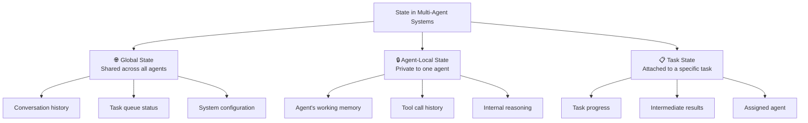

# State Management in Multi-Agent Systems

## Introduction

State is the memory of a multi-agent system — what has been done, what is happening now, and what needs to happen next. Without proper state management, agents lose track of progress, repeat work, or produce contradictory outputs.

Managing state in a single-agent system is straightforward: one agent, one memory. Multi-agent systems multiply the challenge because state is distributed across agents, shared between them, and modified concurrently. We need clear strategies for where state lives, how agents access it, and how conflicts are resolved.

### What We'll Cover
- Shared state vs agent-local state
- State synchronization strategies
- Conflict resolution mechanisms
- State persistence and recovery
- State design patterns for multi-agent workflows

### Prerequisites
- Multi-agent architectures (Lesson 02)
- Communication patterns (Lesson 04)
- Basic understanding of concurrency concepts

---

## Types of State

Multi-agent systems deal with three categories of state:



### Implementation

```python
from dataclasses import dataclass, field
from typing import Any
from datetime import datetime

@dataclass
class StateEntry:
    """A single state entry with metadata."""
    key: str
    value: Any
    updated_by: str
    timestamp: str = field(
        default_factory=lambda: datetime.now().isoformat()
    )
    version: int = 1

class GlobalState:
    """Shared state accessible by all agents."""
    
    def __init__(self):
        self._store = {}
        self._history = []  # Audit trail
    
    def get(self, key: str, default=None) -> Any:
        """Read a value from global state."""
        entry = self._store.get(key)
        return entry.value if entry else default
    
    def set(self, key: str, value: Any, agent_name: str):
        """Write a value to global state."""
        if key in self._store:
            existing = self._store[key]
            version = existing.version + 1
            self._history.append(existing)  # Archive old value
        else:
            version = 1
        
        self._store[key] = StateEntry(
            key=key,
            value=value,
            updated_by=agent_name,
            version=version
        )
    
    def snapshot(self) -> dict:
        """Get a snapshot of all current state."""
        return {
            key: {"value": entry.value, "by": entry.updated_by, "v": entry.version}
            for key, entry in self._store.items()
        }

class AgentLocalState:
    """Private state for a single agent."""
    
    def __init__(self, agent_name: str):
        self.agent_name = agent_name
        self._memory = {}
        self._tool_calls = []
    
    def remember(self, key: str, value: Any):
        """Store something in agent memory."""
        self._memory[key] = value
    
    def recall(self, key: str, default=None) -> Any:
        """Retrieve from agent memory."""
        return self._memory.get(key, default)
    
    def log_tool_call(self, tool: str, input_data: Any, output: Any):
        """Record a tool invocation."""
        self._tool_calls.append({
            "tool": tool,
            "input": input_data,
            "output": output,
            "time": datetime.now().isoformat()
        })

# Usage
global_state = GlobalState()

# Agent 1 writes to global state
global_state.set("task_status", "in_progress", "coordinator")
global_state.set("research_topics", ["AI", "ML", "NLP"], "coordinator")

# Agent 2 reads and writes
topics = global_state.get("research_topics")
print(f"Researcher reads topics: {topics}")

global_state.set("research_results", {
    "AI": "72% adoption",
    "ML": "Growing 30% YoY"
}, "researcher")

# Agent 2 also has local state
researcher_state = AgentLocalState("researcher")
researcher_state.remember("search_queries", ["AI trends 2025", "ML adoption"])
researcher_state.log_tool_call("web_search", "AI trends 2025", "12 results")

print(f"\nGlobal state snapshot:")
for key, info in global_state.snapshot().items():
    print(f"  {key}: {info['value']} (by {info['by']}, v{info['v']})")

print(f"\nResearcher local state:")
print(f"  Queries: {researcher_state.recall('search_queries')}")
print(f"  Tool calls: {len(researcher_state._tool_calls)}")
```

**Output:**
```
Researcher reads topics: ['AI', 'ML', 'NLP']

Global state snapshot:
  task_status: in_progress (by coordinator, v1)
  research_topics: ['AI', 'ML', 'NLP'] (by coordinator, v1)
  research_results: {'AI': '72% adoption', 'ML': 'Growing 30% YoY'} (by researcher, v1)

Researcher local state:
  Queries: ['AI trends 2025', 'ML adoption']
  Tool calls: 1
```

---

## Shared State Patterns

### Pattern 1: Centralized State Store

All agents read and write to a single shared store. The simplest approach.

```python
class CentralizedStateStore:
    """Single source of truth for all agent state."""
    
    def __init__(self):
        self._data = {}
        self._locks = {}  # Simple lock tracking
        self._access_log = []
    
    def read(self, key: str, agent: str) -> Any:
        """Read a value — any agent can read anytime."""
        self._access_log.append(("read", key, agent))
        return self._data.get(key)
    
    def write(self, key: str, value: Any, agent: str) -> bool:
        """Write a value — check for conflicts."""
        if key in self._locks and self._locks[key] != agent:
            print(f"  ⚠️ {agent}: Key '{key}' is locked by "
                  f"{self._locks[key]}")
            return False
        
        self._data[key] = value
        self._access_log.append(("write", key, agent))
        return True
    
    def lock(self, key: str, agent: str) -> bool:
        """Lock a key so only this agent can write."""
        if key in self._locks:
            print(f"  ⚠️ {agent}: Cannot lock '{key}', "
                  f"held by {self._locks[key]}")
            return False
        
        self._locks[key] = agent
        return True
    
    def unlock(self, key: str, agent: str) -> bool:
        """Unlock a key."""
        if self._locks.get(key) == agent:
            del self._locks[key]
            return True
        return False

# Usage
store = CentralizedStateStore()

# Coordinator locks the task plan
store.lock("task_plan", "coordinator")
store.write("task_plan", ["step1", "step2", "step3"], "coordinator")

# Researcher tries to modify task plan — blocked
store.write("task_plan", ["modified"], "researcher")

# Coordinator unlocks
store.unlock("task_plan", "coordinator")

# Researcher can write to its own keys freely
store.write("research_output", "findings here", "researcher")
print(f"  ✅ Research output: {store.read('research_output', 'coordinator')}")
```

**Output:**
```
  ⚠️ researcher: Key 'task_plan' is locked by coordinator
  ✅ Research output: findings here
```

### Pattern 2: Message-Passing State

State is never directly shared. Instead, agents send state updates as messages. Each agent maintains its own view.

```python
class MessagePassingState:
    """State communicated through messages, not shared memory."""
    
    def __init__(self):
        self.agents = {}
    
    def register(self, agent_name: str):
        """Register an agent with its own state view."""
        self.agents[agent_name] = {
            "local_state": {},
            "received_updates": []
        }
    
    def send_update(self, from_agent: str, to_agent: str,
                    key: str, value: Any):
        """Send a state update as a message."""
        update = {
            "from": from_agent,
            "key": key,
            "value": value,
            "timestamp": datetime.now().isoformat()
        }
        
        # Receiver applies the update to their local view
        self.agents[to_agent]["local_state"][key] = value
        self.agents[to_agent]["received_updates"].append(update)
        
        print(f"  📤 {from_agent} → {to_agent}: "
              f"state['{key}'] = {value}")
    
    def get_view(self, agent_name: str) -> dict:
        """Get an agent's local view of state."""
        return self.agents[agent_name]["local_state"]

# Usage
system = MessagePassingState()
system.register("coordinator")
system.register("researcher")
system.register("writer")

print("Message-passing state:\n")

# Coordinator shares task info
system.send_update("coordinator", "researcher", "task", "Research AI")
system.send_update("coordinator", "writer", "task", "Write report")

# Researcher shares findings
system.send_update("researcher", "writer", "findings", "5 key trends")
system.send_update("researcher", "coordinator", "status", "complete")

print("\nAgent views:")
for name in ["coordinator", "researcher", "writer"]:
    print(f"  {name}: {system.get_view(name)}")
```

**Output:**
```
Message-passing state:

  📤 coordinator → researcher: state['task'] = Research AI
  📤 coordinator → writer: state['task'] = Write report
  📤 researcher → writer: state['findings'] = 5 key trends
  📤 researcher → coordinator: state['status'] = complete

Agent views:
  coordinator: {'status': 'complete'}
  researcher: {'task': 'Research AI'}
  writer: {'task': 'Write report', 'findings': '5 key trends'}
```

> **Note:** Each agent has a different view of the world. The coordinator only knows the researcher's status. The writer knows its task and the research findings. This is intentional — agents only see what they need.

---

## State Synchronization

When multiple agents share state, they must stay synchronized. Three common strategies:

### Strategy 1: Last-Write-Wins

The simplest approach. The last agent to write a value wins. Previous values are overwritten.

```python
class LastWriteWins:
    """Simple conflict resolution: last write wins."""
    
    def __init__(self):
        self._store = {}
    
    def write(self, key: str, value: Any, agent: str):
        """Write a value — always succeeds, overwrites previous."""
        old = self._store.get(key)
        self._store[key] = {
            "value": value,
            "by": agent,
            "time": datetime.now().isoformat()
        }
        
        if old and old["by"] != agent:
            print(f"  ⚠️ {agent} overwrote {old['by']}'s value "
                  f"for '{key}': {old['value']} → {value}")
        else:
            print(f"  ✅ {agent} wrote '{key}': {value}")
    
    def read(self, key: str) -> Any:
        entry = self._store.get(key)
        return entry["value"] if entry else None

# Usage
store = LastWriteWins()
print("Last-Write-Wins:\n")

store.write("summary", "Initial draft", "writer")
store.write("summary", "Revised draft", "editor")
store.write("summary", "Final version", "reviewer")
```

**Output:**
```
Last-Write-Wins:

  ✅ writer wrote 'summary': Initial draft
  ⚠️ editor overwrote writer's value for 'summary': Initial draft → Revised draft
  ⚠️ reviewer overwrote editor's value for 'summary': Revised draft → Final version
```

### Strategy 2: Version-Based (Optimistic Locking)

Each write includes the expected version. If the version has changed since the read, the write fails.

```python
class VersionedState:
    """Optimistic locking with version numbers."""
    
    def __init__(self):
        self._store = {}  # key -> {value, version}
    
    def read(self, key: str) -> tuple:
        """Read value and its version."""
        entry = self._store.get(key, {"value": None, "version": 0})
        return entry["value"], entry["version"]
    
    def write(self, key: str, value: Any, expected_version: int,
              agent: str) -> bool:
        """Write only if version matches (optimistic lock)."""
        current = self._store.get(key, {"value": None, "version": 0})
        
        if current["version"] != expected_version:
            print(f"  ❌ {agent}: Version conflict on '{key}'! "
                  f"Expected v{expected_version}, "
                  f"current is v{current['version']}")
            return False
        
        self._store[key] = {
            "value": value,
            "version": expected_version + 1
        }
        print(f"  ✅ {agent}: Wrote '{key}' = {value} "
              f"(v{expected_version + 1})")
        return True

# Usage
store = VersionedState()
print("Version-based conflict resolution:\n")

# Agent A reads, gets version 0
val_a, ver_a = store.read("document")

# Agent B also reads, gets version 0
val_b, ver_b = store.read("document")

# Agent A writes with version 0 — succeeds
store.write("document", "Agent A's edit", ver_a, "agent_a")

# Agent B tries to write with version 0 — fails (version is now 1)
store.write("document", "Agent B's edit", ver_b, "agent_b")

# Agent B re-reads and retries
val_b, ver_b = store.read("document")
store.write("document", "Agent B's edit (retry)", ver_b, "agent_b")
```

**Output:**
```
Version-based conflict resolution:

  ✅ agent_a: Wrote 'document' = Agent A's edit (v1)
  ❌ agent_b: Version conflict on 'document'! Expected v0, current is v1
  ✅ agent_b: Wrote 'document' = Agent B's edit (retry) (v2)
```

### Strategy 3: Merge-Based

When conflicts occur, merge the changes instead of rejecting one.

```python
class MergeableState:
    """State that merges conflicting updates."""
    
    def __init__(self):
        self._store = {}
    
    def write(self, key: str, updates: dict, agent: str):
        """Merge updates into existing state."""
        if key not in self._store:
            self._store[key] = {}
        
        # Merge: new keys added, existing keys from updates override
        merged = {**self._store[key], **updates}
        self._store[key] = merged
        
        print(f"  🔀 {agent} merged into '{key}': "
              f"{list(updates.keys())}")
    
    def read(self, key: str) -> dict:
        return self._store.get(key, {})

# Usage
store = MergeableState()
print("Merge-based state:\n")

# Two agents update different fields of the same document
store.write("report", {
    "title": "AI Trends 2025",
    "research": "Complete"
}, "researcher")

store.write("report", {
    "draft": "Written",
    "word_count": 2500
}, "writer")

store.write("report", {
    "reviewed": True,
    "score": 0.92
}, "reviewer")

print(f"\nMerged report state:")
for key, value in store.read("report").items():
    print(f"  {key}: {value}")
```

**Output:**
```
Merge-based state:

  🔀 researcher merged into 'report': ['title', 'research']
  🔀 writer merged into 'report': ['draft', 'word_count']
  🔀 reviewer merged into 'report': ['reviewed', 'score']

Merged report state:
  title: AI Trends 2025
  research: Complete
  draft: Written
  word_count: 2500
  reviewed: True
  score: 0.92
```

---

## State Persistence

State needs to survive system restarts. Three persistence strategies:

```python
import json
import os

class PersistentState:
    """State that persists to disk."""
    
    def __init__(self, filepath: str = "agent_state.json"):
        self.filepath = filepath
        self._store = self._load()
    
    def _load(self) -> dict:
        """Load state from disk."""
        if os.path.exists(self.filepath):
            with open(self.filepath, "r") as f:
                data = json.load(f)
                print(f"  📂 Loaded {len(data)} keys from {self.filepath}")
                return data
        return {}
    
    def _save(self):
        """Save state to disk."""
        with open(self.filepath, "w") as f:
            json.dump(self._store, f, indent=2)
    
    def set(self, key: str, value: Any, agent: str):
        """Set a value and persist."""
        self._store[key] = {
            "value": value,
            "agent": agent,
            "timestamp": datetime.now().isoformat()
        }
        self._save()
        print(f"  💾 {agent} saved '{key}' to disk")
    
    def get(self, key: str) -> Any:
        """Get a value from persisted state."""
        entry = self._store.get(key)
        return entry["value"] if entry else None
    
    def checkpoint(self, label: str):
        """Create a named checkpoint."""
        checkpoint_file = f"checkpoint_{label}.json"
        with open(checkpoint_file, "w") as f:
            json.dump(self._store, f, indent=2)
        print(f"  📸 Checkpoint '{label}' saved "
              f"({len(self._store)} keys)")

# Usage (demonstration — file I/O simulated in print)
print("State persistence strategies:\n")

print("1. File-based (JSON):")
print("   💾 Write state to agent_state.json after each update")
print("   📂 Load state from file on system restart")
print()

print("2. Database-backed:")
print("   💾 Store state in SQLite/PostgreSQL for concurrent access")
print("   🔍 Query historical state by timestamp or agent")
print()

print("3. Checkpoint-based:")
print("   📸 Save full state snapshots at key milestones")
print("   ⏪ Roll back to any checkpoint on failure")
print()

# Show the pattern
print("Checkpoint pattern:")
state = {}
state["step_1"] = "Research complete"
print(f"  After step 1: {state}")
# checkpoint_1 saved

state["step_2"] = "Analysis complete"
print(f"  After step 2: {state}")
# checkpoint_2 saved

state["step_3"] = "ERROR: Write failed"
print(f"  After step 3 (failed): {state}")
print(f"  ⏪ Rollback to checkpoint_2...")

del state["step_3"]
print(f"  After rollback: {state}")
```

**Output:**
```
State persistence strategies:

1. File-based (JSON):
   💾 Write state to agent_state.json after each update
   📂 Load state from file on system restart

2. Database-backed:
   💾 Store state in SQLite/PostgreSQL for concurrent access
   🔍 Query historical state by timestamp or agent

3. Checkpoint-based:
   📸 Save full state snapshots at key milestones
   ⏪ Roll back to any checkpoint on failure

Checkpoint pattern:
  After step 1: {'step_1': 'Research complete'}
  After step 2: {'step_1': 'Research complete', 'step_2': 'Analysis complete'}
  After step 3 (failed): {'step_1': 'Research complete', 'step_2': 'Analysis complete', 'step_3': 'ERROR: Write failed'}
  ⏪ Rollback to checkpoint_2...
  After rollback: {'step_1': 'Research complete', 'step_2': 'Analysis complete'}
```

> **🤖 AI Context:** LangGraph uses `StateGraph` with `MessagesState` (a list of messages) as its primary state container. Each node receives the current state, processes it, and returns state updates. LangGraph also supports checkpointing via `MemorySaver` or database-backed checkpointers for persistence and recovery.

---

## State Design Patterns

### Pattern: Reducer-Based State Updates

Instead of letting agents overwrite state freely, use reducers — functions that define *how* state is updated.

```python
from typing import Callable

class ReducerState:
    """State with reducer functions for controlled updates."""
    
    def __init__(self):
        self._state = {}
        self._reducers = {}  # key -> reducer function
    
    def register_reducer(self, key: str, reducer: Callable,
                         initial_value: Any = None):
        """Register a reducer for a specific state key."""
        self._reducers[key] = reducer
        self._state[key] = initial_value
    
    def dispatch(self, key: str, action: dict, agent: str):
        """Dispatch an action to update state via reducer."""
        if key not in self._reducers:
            print(f"  ❌ No reducer for key '{key}'")
            return
        
        old_value = self._state[key]
        new_value = self._reducers[key](old_value, action)
        self._state[key] = new_value
        
        print(f"  📝 {agent} dispatched {action['type']} on '{key}'")
    
    def get(self, key: str) -> Any:
        return self._state.get(key)

# Define reducers
def messages_reducer(state: list, action: dict) -> list:
    """Reducer for a message list — append only."""
    if state is None:
        state = []
    
    if action["type"] == "ADD_MESSAGE":
        return state + [action["message"]]
    elif action["type"] == "CLEAR":
        return []
    return state

def task_reducer(state: dict, action: dict) -> dict:
    """Reducer for task tracking — controlled updates."""
    if state is None:
        state = {"total": 0, "completed": 0, "tasks": []}
    
    if action["type"] == "ADD_TASK":
        return {
            **state,
            "total": state["total"] + 1,
            "tasks": state["tasks"] + [action["task"]]
        }
    elif action["type"] == "COMPLETE_TASK":
        return {
            **state,
            "completed": state["completed"] + 1
        }
    return state

# Usage
store = ReducerState()
store.register_reducer("messages", messages_reducer, [])
store.register_reducer("tasks", task_reducer, None)

print("Reducer-based state updates:\n")

# Multiple agents dispatch actions
store.dispatch("messages", {
    "type": "ADD_MESSAGE",
    "message": {"role": "coordinator", "content": "Start research"}
}, "coordinator")

store.dispatch("messages", {
    "type": "ADD_MESSAGE",
    "message": {"role": "researcher", "content": "Found 5 papers"}
}, "researcher")

store.dispatch("tasks", {
    "type": "ADD_TASK",
    "task": "Research AI trends"
}, "coordinator")

store.dispatch("tasks", {
    "type": "COMPLETE_TASK"
}, "researcher")

print(f"\nMessages: {len(store.get('messages'))} total")
for msg in store.get("messages"):
    print(f"  {msg['role']}: {msg['content']}")

tasks = store.get("tasks")
print(f"\nTasks: {tasks['completed']}/{tasks['total']} completed")
```

**Output:**
```
Reducer-based state updates:

  📝 coordinator dispatched ADD_MESSAGE on 'messages'
  📝 researcher dispatched ADD_MESSAGE on 'messages'
  📝 coordinator dispatched ADD_TASK on 'tasks'
  📝 researcher dispatched COMPLETE_TASK on 'tasks'

Messages: 2 total
  coordinator: Start research
  researcher: Found 5 papers

Tasks: 1/1 completed
```

> **🤖 AI Context:** LangGraph uses exactly this pattern. Each state key can have an `Annotated` reducer (like `operator.add` for lists) that controls how parallel updates are merged. This prevents agents from accidentally overwriting each other's contributions.

---

## Best Practices

| Practice | Why It Matters |
|----------|----------------|
| Separate global state from agent-local state | Agents should not expose their internal reasoning |
| Use immutable state updates | Prevents accidental mutation, enables rollback |
| Log all state changes with agent name and timestamp | Full audit trail for debugging |
| Set clear ownership boundaries | One agent "owns" a state key — others request changes |
| Checkpoint before risky operations | Enables recovery from failed agent actions |
| Use reducers for shared state | Controlled updates prevent conflicts |

---

## Common Pitfalls

| ❌ Mistake | ✅ Solution |
|-----------|-------------|
| All state in one shared dict | Separate into global, local, and task-specific state |
| No versioning on state updates | Use version numbers or timestamps for conflict detection |
| Agent reads stale state after another agent writes | Use read-after-write consistency or event notifications |
| State grows unbounded | Implement state cleanup, TTL, or sliding windows |
| No persistence — system restart loses everything | Save checkpoints at milestone completions |
| Agents directly mutate shared state | Use reducers or message-passing for controlled updates |

---

## Hands-on Exercise

### Your Task

Build a `TaskTracker` that demonstrates three state management approaches for a multi-agent task processing system.

### Requirements
1. **Centralized store**: Multiple agents read/write to one store with locking
2. **Versioned state**: Implement optimistic locking with retry on conflict
3. **Reducer-based**: Use a task reducer with ADD, COMPLETE, and FAIL actions

### Expected Result
Each approach handles the same three tasks from three agents, showing how they handle concurrent access differently.

<details>
<summary>💡 Hints (click to expand)</summary>

- Centralized: use a dict with a `locks` dict to track which agent holds each key
- Versioned: store `(value, version)` tuples, reject writes when version is stale
- Reducer: define a pure function that takes `(state, action)` and returns new state
- Simulate "concurrent" access by having two agents read the same key before either writes

</details>

<details>
<summary>✅ Solution (click to expand)</summary>

```python
# Approach 1: Centralized with locking
class CentralStore:
    def __init__(self):
        self.data = {}
        self.locks = {}
    
    def lock_and_write(self, key, value, agent):
        if key in self.locks and self.locks[key] != agent:
            return f"❌ {agent}: blocked by {self.locks[key]}"
        self.locks[key] = agent
        self.data[key] = value
        del self.locks[key]
        return f"✅ {agent}: wrote {key}={value}"

# Approach 2: Versioned
class VersionedStore:
    def __init__(self):
        self.data = {}  # key -> (value, version)
    
    def read(self, key):
        return self.data.get(key, (None, 0))
    
    def write(self, key, value, expected_ver, agent):
        _, current_ver = self.read(key)
        if current_ver != expected_ver:
            return f"❌ {agent}: conflict (expected v{expected_ver}, got v{current_ver})"
        self.data[key] = (value, expected_ver + 1)
        return f"✅ {agent}: wrote {key}={value} (v{expected_ver + 1})"

# Approach 3: Reducer
class ReducerStore:
    def __init__(self):
        self.state = {"tasks": [], "completed": 0, "failed": 0}
    
    def dispatch(self, action):
        if action["type"] == "ADD":
            self.state["tasks"].append(action["task"])
        elif action["type"] == "COMPLETE":
            self.state["completed"] += 1
        elif action["type"] == "FAIL":
            self.state["failed"] += 1
        return f"✅ Dispatched {action['type']}"

# Test all three
print("=== Centralized ===")
cs = CentralStore()
print(cs.lock_and_write("task-1", "done", "agent_a"))
print(cs.lock_and_write("task-1", "revised", "agent_b"))

print("\n=== Versioned ===")
vs = VersionedStore()
_, v = vs.read("task-1")  # agent_a reads v0
print(vs.write("task-1", "draft", v, "agent_a"))  # succeeds
print(vs.write("task-1", "alt draft", v, "agent_b"))  # fails
_, v2 = vs.read("task-1")  # agent_b re-reads
print(vs.write("task-1", "alt draft", v2, "agent_b"))  # retry succeeds

print("\n=== Reducer ===")
rs = ReducerStore()
print(rs.dispatch({"type": "ADD", "task": "Research"}))
print(rs.dispatch({"type": "ADD", "task": "Write"}))
print(rs.dispatch({"type": "COMPLETE"}))
print(rs.dispatch({"type": "FAIL"}))
print(f"State: {rs.state}")
```

**Output:**
```
=== Centralized ===
✅ agent_a: wrote task-1=done
✅ agent_b: wrote task-1=revised

=== Versioned ===
✅ agent_a: wrote task-1=draft (v1)
❌ agent_b: conflict (expected v0, got v1)
✅ agent_b: wrote task-1=alt draft (v2)

=== Reducer ===
✅ Dispatched ADD
✅ Dispatched ADD
✅ Dispatched COMPLETE
✅ Dispatched FAIL
State: {'tasks': ['Research', 'Write'], 'completed': 1, 'failed': 1}
```

</details>

### Bonus Challenges
- [ ] Add a state history viewer that shows all changes with timestamps
- [ ] Implement checkpoint-based rollback for the versioned store
- [ ] Build a state diff tool that shows what changed between two versions

---

## Summary

✅ **Three types of state** — global (shared), agent-local (private), and task-specific (per-task) — serve different purposes and should never be mixed

✅ **Centralized stores** are simple but need locking to prevent concurrent overwrites

✅ **Version-based (optimistic) locking** rejects conflicting writes and forces retries — safe without explicit locks

✅ **Merge-based resolution** combines concurrent updates when state fields don't overlap — the most practical default for most systems

✅ **Reducers** provide controlled state updates through pure functions — the pattern used by LangGraph and production-grade systems

✅ **Persistence** through checkpoints and file/database storage ensures state survives system restarts

**Next:** [Design Considerations](./06-design-considerations.md)

**Previous:** [Communication Patterns](./04-communication-patterns.md)

---

## Further Reading

- [LangGraph State Management](https://langchain-ai.github.io/langgraph/concepts/low_level/#state) - StateGraph, reducers, and checkpointers
- [AutoGen Agent Runtime](https://microsoft.github.io/autogen/stable/user-guide/core-user-guide/framework/agent-and-agent-runtime.html) - Runtime state and message handling
- [CRDT Primer](https://crdt.tech/) - Conflict-free replicated data types for distributed state

<!-- 
Sources Consulted:
- LangGraph state management: https://langchain-ai.github.io/langgraph/concepts/low_level/#state
- AutoGen agent runtime: https://microsoft.github.io/autogen/stable/user-guide/core-user-guide/framework/agent-and-agent-runtime.html
- LangGraph checkpointing: https://langchain-ai.github.io/langgraph/concepts/persistence/
- OpenAI Agents SDK: https://openai.github.io/openai-agents-python/
-->
