# Design Considerations for Multi-Agent Systems

## Introduction

Building a multi-agent system that works in a demo is easy. Building one that works in production is hard. The difference lies in design decisions that are invisible at small scale but critical at large scale — how fine-grained your agents are, how tightly they are coupled, how errors propagate, and how you debug problems when they inevitably occur.

This lesson covers the design considerations that separate fragile prototypes from robust production systems. We focus on the decisions you make *before* writing agent code.

### What We'll Cover
- Agent granularity — how big or small should agents be
- Coupling and cohesion between agents
- Scalability patterns
- Error propagation and containment
- Debugging and observability strategies

### Prerequisites
- Multi-agent architectures (Lesson 02)
- Agent roles and responsibilities (Lesson 03)
- State management patterns (Lesson 05)

---

## Agent Granularity

Granularity is the most fundamental design decision: how much responsibility does each agent have?

### The Granularity Spectrum


### Measuring Granularity

```python
class GranularityAnalyzer:
    """Analyze agent granularity in a system."""
    
    def __init__(self):
        self.agents = []
    
    def add_agent(self, name: str, tools: list, 
                  prompt_words: int, responsibilities: list):
        """Register an agent for analysis."""
        self.agents.append({
            "name": name,
            "tools": len(tools),
            "prompt_words": prompt_words,
            "responsibilities": len(responsibilities),
            "tool_list": tools
        })
    
    def analyze(self) -> dict:
        """Analyze the system's granularity."""
        if not self.agents:
            return {}
        
        avg_tools = sum(a["tools"] for a in self.agents) / len(self.agents)
        avg_prompt = sum(a["prompt_words"] for a in self.agents) / len(self.agents)
        avg_resp = sum(a["responsibilities"] for a in self.agents) / len(self.agents)
        
        # Classify
        if avg_tools > 8:
            classification = "coarse"
            recommendation = "Split agents — too many tools per agent"
        elif avg_tools < 2:
            classification = "fine"
            recommendation = "Consider merging — overhead may exceed benefit"
        else:
            classification = "medium"
            recommendation = "Good balance of tools per agent"
        
        return {
            "agent_count": len(self.agents),
            "avg_tools": round(avg_tools, 1),
            "avg_prompt_words": round(avg_prompt),
            "avg_responsibilities": round(avg_resp, 1),
            "classification": classification,
            "recommendation": recommendation
        }

# Analyze a coarse-grained system
print("=== Coarse-Grained System ===\n")
coarse = GranularityAnalyzer()
coarse.add_agent("do_everything", 
    tools=["search", "code", "test", "deploy", "monitor",
           "analyze", "write", "review", "database", "email"],
    prompt_words=2000,
    responsibilities=["research", "development", "testing",
                      "deployment", "monitoring"])

result = coarse.analyze()
print(f"  Agents: {result['agent_count']}")
print(f"  Avg tools per agent: {result['avg_tools']}")
print(f"  Classification: {result['classification']}")
print(f"  💡 {result['recommendation']}")

# Analyze a well-balanced system
print("\n=== Medium-Grained System ===\n")
medium = GranularityAnalyzer()
medium.add_agent("researcher",
    tools=["web_search", "doc_reader", "summarizer"],
    prompt_words=300,
    responsibilities=["research"])
medium.add_agent("developer",
    tools=["code_writer", "code_reviewer", "test_runner"],
    prompt_words=400,
    responsibilities=["development"])
medium.add_agent("deployer",
    tools=["docker_build", "deploy", "health_check"],
    prompt_words=250,
    responsibilities=["deployment"])

result = medium.analyze()
print(f"  Agents: {result['agent_count']}")
print(f"  Avg tools per agent: {result['avg_tools']}")
print(f"  Classification: {result['classification']}")
print(f"  💡 {result['recommendation']}")
```

**Output:**
```
=== Coarse-Grained System ===

  Agents: 1
  Avg tools per agent: 10
  Classification: coarse
  💡 Split agents — too many tools per agent

=== Medium-Grained System ===

  Agents: 3
  Avg tools per agent: 3.0
  Classification: medium
  💡 Good balance of tools per agent
```

### Granularity Guidelines

| Factor | Coarse (fewer, larger agents) | Fine (many, smaller agents) |
|--------|-------------------------------|---------------------------|
| **Coordination overhead** | Low | High |
| **Context sharing** | Easy (single agent) | Requires explicit passing |
| **Debugging** | Hard (complex logs) | Easy (focused logs) |
| **Flexibility** | Low (tightly bundled) | High (swap individual agents) |
| **LLM token efficiency** | Poor (large prompts) | Good (small prompts) |

> **Tip:** Start medium-grained (3-5 tools per agent). Split when an agent consistently uses only a subset of its tools. Merge when two agents always run together.

---

## Coupling and Cohesion

**Cohesion** measures how related an agent's responsibilities are. High cohesion is good — an agent does one logical thing well.

**Coupling** measures how dependent agents are on each other. Low coupling is good — agents can change independently.


### Measuring Coupling

```python
class CouplingAnalyzer:
    """Analyze coupling between agents in a system."""
    
    def __init__(self):
        self.agents = {}
        self.dependencies = []  # (from, to, type)
    
    def add_agent(self, name: str):
        self.agents[name] = {"outgoing": 0, "incoming": 0}
    
    def add_dependency(self, from_agent: str, to_agent: str,
                       dep_type: str = "calls"):
        """Record a dependency between two agents."""
        self.dependencies.append((from_agent, to_agent, dep_type))
        self.agents[from_agent]["outgoing"] += 1
        self.agents[to_agent]["incoming"] += 1
    
    def analyze(self):
        """Analyze the coupling in the system."""
        n = len(self.agents)
        max_deps = n * (n - 1)  # Maximum possible dependencies
        actual = len(self.dependencies)
        coupling_ratio = actual / max_deps if max_deps > 0 else 0
        
        print(f"Coupling Analysis:")
        print(f"  Agents: {n}")
        print(f"  Dependencies: {actual}/{max_deps} "
              f"({coupling_ratio:.0%})")
        
        if coupling_ratio > 0.5:
            print(f"  ⚠️ High coupling — consider reducing dependencies")
        elif coupling_ratio > 0.25:
            print(f"  ⚡ Moderate coupling — monitor for growth")
        else:
            print(f"  ✅ Low coupling — agents are well-separated")
        
        print(f"\n  Agent Dependency Profile:")
        for name, info in self.agents.items():
            badge = "🔴" if info["incoming"] > 3 else "🟢"
            print(f"    {badge} {name}: "
                  f"{info['outgoing']} outgoing, "
                  f"{info['incoming']} incoming")

# Example: Well-designed system
print("=== Well-Designed System ===\n")
good = CouplingAnalyzer()
for name in ["coordinator", "researcher", "writer", "reviewer"]:
    good.add_agent(name)

good.add_dependency("coordinator", "researcher")
good.add_dependency("coordinator", "writer")
good.add_dependency("coordinator", "reviewer")
# 3 dependencies out of 12 possible = 25%

good.analyze()

# Example: Over-coupled system
print("\n=== Over-Coupled System ===\n")
bad = CouplingAnalyzer()
for name in ["agent_a", "agent_b", "agent_c", "agent_d"]:
    bad.add_agent(name)

# Everyone talks to everyone
for a in ["agent_a", "agent_b", "agent_c", "agent_d"]:
    for b in ["agent_a", "agent_b", "agent_c", "agent_d"]:
        if a != b:
            bad.add_dependency(a, b)

bad.analyze()
```

**Output:**
```
=== Well-Designed System ===

Coupling Analysis:
  Agents: 4
  Dependencies: 3/12 (25%)
  ⚡ Moderate coupling — monitor for growth

  Agent Dependency Profile:
    🟢 coordinator: 3 outgoing, 0 incoming
    🟢 researcher: 0 outgoing, 1 incoming
    🟢 writer: 0 outgoing, 1 incoming
    🟢 reviewer: 0 outgoing, 1 incoming

=== Over-Coupled System ===

Coupling Analysis:
  Agents: 4
  Dependencies: 12/12 (100%)
  ⚠️ High coupling — consider reducing dependencies

  Agent Dependency Profile:
    🟢 agent_a: 3 outgoing, 3 incoming
    🟢 agent_b: 3 outgoing, 3 incoming
    🟢 agent_c: 3 outgoing, 3 incoming
    🟢 agent_d: 3 outgoing, 3 incoming
```

### Reducing Coupling

| Technique | How It Works |
|-----------|-------------|
| **Message bus** | Agents communicate through a bus, not directly |
| **Interfaces** | Define what agents expect, not who provides it |
| **Event-driven** | Agents react to events, not to other agents |
| **State isolation** | Each agent owns its own state, shares via messages |

---

## Scalability Patterns

Multi-agent systems can scale in three dimensions:

### Horizontal Scaling: More Agents

```python
class AgentPool:
    """Pool of identical agents for horizontal scaling."""
    
    def __init__(self, agent_type: str, pool_size: int):
        self.agent_type = agent_type
        self.pool = [
            {"id": f"{agent_type}_{i}", "busy": False, "tasks": 0}
            for i in range(pool_size)
        ]
    
    def get_available(self) -> dict:
        """Get an available agent from the pool."""
        for agent in self.pool:
            if not agent["busy"]:
                return agent
        return None
    
    def execute(self, task: str) -> str:
        """Execute a task using any available agent."""
        agent = self.get_available()
        if not agent:
            return f"❌ No {self.agent_type} agents available"
        
        agent["busy"] = True
        agent["tasks"] += 1
        result = f"✅ {agent['id']} executed: {task}"
        agent["busy"] = False
        return result
    
    def stats(self):
        total_tasks = sum(a["tasks"] for a in self.pool)
        print(f"  Pool '{self.agent_type}': {len(self.pool)} agents, "
              f"{total_tasks} total tasks")
        for a in self.pool:
            print(f"    {a['id']}: {a['tasks']} tasks")

# Horizontal scaling
print("Horizontal Scaling:\n")
research_pool = AgentPool("researcher", pool_size=3)

tasks = [
    "Search for Python ML frameworks",
    "Find TensorFlow tutorials",
    "Research PyTorch benchmarks",
    "Compare ML frameworks",
    "Find scikit-learn examples",
]

for task in tasks:
    result = research_pool.execute(task)
    print(f"  {result}")

print()
research_pool.stats()
```

**Output:**
```
Horizontal Scaling:

  ✅ researcher_0 executed: Search for Python ML frameworks
  ✅ researcher_0 executed: Find TensorFlow tutorials
  ✅ researcher_0 executed: Research PyTorch benchmarks
  ✅ researcher_0 executed: Compare ML frameworks
  ✅ researcher_0 executed: Find scikit-learn examples

  Pool 'researcher': 3 agents, 5 total tasks
    researcher_0: 5 tasks
    researcher_1: 0 tasks
    researcher_2: 0 tasks
```

> **Note:** In this synchronous simulation, the first agent handles all tasks since it becomes free immediately. With real async execution, tasks distribute across agents.

### Vertical Scaling: Smarter Agents

```python
class ScalableAgent:
    """Agent with configurable capability levels."""
    
    def __init__(self, name: str, model: str, max_tokens: int,
                 tools: list):
        self.name = name
        self.model = model
        self.max_tokens = max_tokens
        self.tools = tools
    
    def capability_score(self) -> float:
        """Score this agent's capability (0-1)."""
        model_scores = {
            "gpt-4o-mini": 0.5,
            "gpt-4o": 0.8,
            "claude-sonnet": 0.85,
            "claude-opus": 1.0
        }
        model_score = model_scores.get(self.model, 0.5)
        tool_score = min(len(self.tools) / 10, 1.0)
        token_score = min(self.max_tokens / 128000, 1.0)
        
        return round((model_score + tool_score + token_score) / 3, 2)

# Compare vertical scaling options
print("Vertical Scaling Options:\n")

configs = [
    ScalableAgent("basic", "gpt-4o-mini", 4096, ["search"]),
    ScalableAgent("standard", "gpt-4o", 16384, 
                  ["search", "code", "analyze"]),
    ScalableAgent("advanced", "claude-opus", 128000,
                  ["search", "code", "analyze", "browse",
                   "database", "deploy"]),
]

for agent in configs:
    score = agent.capability_score()
    bar = "█" * int(score * 20) + "░" * (20 - int(score * 20))
    print(f"  {agent.name:10} [{bar}] {score:.0%}")
    print(f"             Model: {agent.model}, "
          f"Tokens: {agent.max_tokens:,}, "
          f"Tools: {len(agent.tools)}")
```

**Output:**
```
Vertical Scaling Options:

  basic      [███████░░░░░░░░░░░░░] 35%
             Model: gpt-4o-mini, Tokens: 4,096, Tools: 1
  standard   [████████████░░░░░░░░] 59%
             Model: gpt-4o, Tokens: 16,384, Tools: 3
  advanced   [██████████████████░░] 87%
             Model: claude-opus, Tokens: 128,000, Tools: 6
```

---

## Error Propagation and Containment

In a multi-agent system, one agent's failure can cascade through the entire system. Design for containment.

### The Blast Radius Concept

```mermaid
flowchart TD
    subgraph Uncontained["❌ Uncontained Error"]
        A1[Agent A<br/>fails] --> B1[Agent B<br/>receives bad data]
        B1 --> C1[Agent C<br/>produces wrong output]
        C1 --> D1[System<br/>delivers garbage]
    end
    
    subgraph Contained["✅ Contained Error"]
        A2[Agent A<br/>fails] --> E[Error Handler<br/>catches failure]
        E --> R[Retry/Fallback]
        R --> B2[Agent B<br/>receives clean data]
    end
```



### Implementation

```python
from enum import Enum

class ErrorStrategy(Enum):
    RETRY = "retry"
    FALLBACK = "fallback"
    SKIP = "skip"
    ESCALATE = "escalate"

class ErrorContainment:
    """Error containment system for multi-agent workflows."""
    
    def __init__(self):
        self.error_policies = {}  # agent_name -> strategy
        self.error_log = []
    
    def set_policy(self, agent_name: str, strategy: ErrorStrategy,
                   max_retries: int = 3, fallback_agent: str = None):
        """Set error handling policy for an agent."""
        self.error_policies[agent_name] = {
            "strategy": strategy,
            "max_retries": max_retries,
            "fallback": fallback_agent
        }
    
    def handle_error(self, agent_name: str, error: str,
                     attempt: int = 1) -> dict:
        """Handle an agent error based on its policy."""
        policy = self.error_policies.get(agent_name, {
            "strategy": ErrorStrategy.ESCALATE,
            "max_retries": 1,
            "fallback": None
        })
        
        strategy = policy["strategy"]
        
        self.error_log.append({
            "agent": agent_name,
            "error": error,
            "strategy": strategy.value,
            "attempt": attempt
        })
        
        if strategy == ErrorStrategy.RETRY:
            if attempt < policy["max_retries"]:
                return {
                    "action": "retry",
                    "message": f"Retry {attempt + 1}/{policy['max_retries']}"
                }
            else:
                return {
                    "action": "escalate",
                    "message": f"Max retries ({policy['max_retries']}) exceeded"
                }
        
        elif strategy == ErrorStrategy.FALLBACK:
            if policy["fallback"]:
                return {
                    "action": "fallback",
                    "message": f"Delegating to {policy['fallback']}"
                }
            return {"action": "escalate", "message": "No fallback configured"}
        
        elif strategy == ErrorStrategy.SKIP:
            return {
                "action": "skip",
                "message": "Task skipped, continuing workflow"
            }
        
        else:
            return {
                "action": "escalate",
                "message": "Escalated to coordinator/human"
            }

# Configure error handling
ec = ErrorContainment()
ec.set_policy("researcher", ErrorStrategy.RETRY, max_retries=3)
ec.set_policy("writer", ErrorStrategy.FALLBACK, fallback_agent="backup_writer")
ec.set_policy("formatter", ErrorStrategy.SKIP)
ec.set_policy("deployer", ErrorStrategy.ESCALATE)

# Simulate errors
print("Error containment:\n")

scenarios = [
    ("researcher", "API rate limit exceeded", 1),
    ("researcher", "API rate limit exceeded", 2),
    ("researcher", "API rate limit exceeded", 3),
    ("writer", "LLM returned empty response", 1),
    ("formatter", "Template not found", 1),
    ("deployer", "Permission denied", 1),
]

for agent, error, attempt in scenarios:
    result = ec.handle_error(agent, error, attempt)
    icon = {"retry": "🔄", "fallback": "🔀", "skip": "⏭️",
            "escalate": "🚨"}.get(result["action"], "❓")
    print(f"  {icon} {agent}: {error}")
    print(f"     → {result['action'].upper()}: {result['message']}")
    print()
```

**Output:**
```
Error containment:

  🔄 researcher: API rate limit exceeded
     → RETRY: Retry 2/3

  🔄 researcher: API rate limit exceeded
     → RETRY: Retry 3/3

  🚨 researcher: API rate limit exceeded
     → ESCALATE: Max retries (3) exceeded

  🔀 writer: LLM returned empty response
     → FALLBACK: Delegating to backup_writer

  ⏭️ formatter: Template not found
     → SKIP: Task skipped, continuing workflow

  🚨 deployer: Permission denied
     → ESCALATE: Escalated to coordinator/human
```

---

## Debugging and Observability

Debugging a multi-agent system is fundamentally different from debugging a single application. Problems emerge from interactions *between* agents, not within them.

### Tracing Agent Interactions

```python
from datetime import datetime

class AgentTracer:
    """Trace all agent interactions for debugging."""
    
    def __init__(self):
        self.traces = []
        self.span_id = 0
    
    def trace(self, agent: str, action: str, 
              details: dict = None) -> int:
        """Record a trace event."""
        self.span_id += 1
        entry = {
            "span_id": self.span_id,
            "timestamp": datetime.now().isoformat(),
            "agent": agent,
            "action": action,
            "details": details or {}
        }
        self.traces.append(entry)
        return self.span_id
    
    def print_timeline(self):
        """Print a visual timeline of all traces."""
        agents = list(set(t["agent"] for t in self.traces))
        agent_cols = {a: i for i, a in enumerate(agents)}
        
        print("Agent Timeline:")
        print(f"  {'':>4} ", end="")
        for agent in agents:
            print(f"{agent:^20}", end="")
        print()
        print(f"  {'':>4} " + "─" * (20 * len(agents)))
        
        for trace in self.traces:
            col = agent_cols[trace["agent"]]
            prefix = "  " * col
            marker = f"[{trace['action']}]"
            print(f"  {trace['span_id']:>3}  " + 
                  " " * (20 * col) + f"●─{marker}")
    
    def find_errors(self) -> list:
        """Find all error traces."""
        return [t for t in self.traces 
                if "error" in t.get("details", {})]
    
    def agent_summary(self):
        """Summarize activity by agent."""
        summary = {}
        for trace in self.traces:
            agent = trace["agent"]
            if agent not in summary:
                summary[agent] = {"actions": 0, "errors": 0}
            summary[agent]["actions"] += 1
            if "error" in trace.get("details", {}):
                summary[agent]["errors"] += 1
        
        print("\nAgent Activity Summary:")
        for agent, stats in summary.items():
            error_pct = (stats["errors"] / stats["actions"] * 100 
                        if stats["actions"] > 0 else 0)
            status = "🟢" if error_pct == 0 else "🔴"
            print(f"  {status} {agent}: {stats['actions']} actions, "
                  f"{stats['errors']} errors ({error_pct:.0f}%)")

# Trace a workflow
tracer = AgentTracer()

tracer.trace("coordinator", "plan", {"tasks": 3})
tracer.trace("coordinator", "delegate", {"to": "researcher"})
tracer.trace("researcher", "start", {"task": "web search"})
tracer.trace("researcher", "tool_call", {"tool": "search_api"})
tracer.trace("researcher", "complete", {"results": 5})
tracer.trace("coordinator", "delegate", {"to": "writer"})
tracer.trace("writer", "start", {"task": "draft article"})
tracer.trace("writer", "error", {
    "error": "Context length exceeded",
    "tokens": 135000
})
tracer.trace("coordinator", "handle_error", {
    "strategy": "retry",
    "agent": "writer"
})
tracer.trace("writer", "start", {"task": "draft article (retry)"})
tracer.trace("writer", "complete", {"word_count": 2000})

tracer.print_timeline()
tracer.agent_summary()
```

**Output:**
```
Agent Timeline:
       coordinator                 researcher                  writer              
       ──────────────────────────────────────────────────────────────────────────
    1  ●─[plan]
    2  ●─[delegate]
    3                      ●─[start]
    4                      ●─[tool_call]
    5                      ●─[complete]
    6  ●─[delegate]
    7                                          ●─[start]
    8                                          ●─[error]
    9  ●─[handle_error]
   10                                          ●─[start]
   11                                          ●─[complete]

Agent Activity Summary:
  🟢 coordinator: 4 actions, 0 errors (0%)
  🟢 researcher: 3 actions, 0 errors (0%)
  🔴 writer: 4 actions, 1 errors (25%)
```

### Cost Tracking

```python
class CostTracker:
    """Track LLM costs across agents."""
    
    PRICING = {
        "gpt-4o": {"input": 2.50, "output": 10.00},       # per 1M tokens
        "gpt-4o-mini": {"input": 0.15, "output": 0.60},
        "claude-sonnet": {"input": 3.00, "output": 15.00},
    }
    
    def __init__(self):
        self.usage = {}  # agent -> [{model, input_tokens, output_tokens}]
    
    def record(self, agent: str, model: str, 
               input_tokens: int, output_tokens: int):
        """Record token usage for an agent."""
        if agent not in self.usage:
            self.usage[agent] = []
        
        self.usage[agent].append({
            "model": model,
            "input_tokens": input_tokens,
            "output_tokens": output_tokens
        })
    
    def report(self):
        """Generate a cost report."""
        print("Cost Report:\n")
        total_cost = 0
        
        for agent, calls in self.usage.items():
            agent_cost = 0
            total_input = 0
            total_output = 0
            
            for call in calls:
                model = call["model"]
                pricing = self.PRICING.get(model, {"input": 0, "output": 0})
                
                input_cost = (call["input_tokens"] / 1_000_000 
                             * pricing["input"])
                output_cost = (call["output_tokens"] / 1_000_000 
                              * pricing["output"])
                
                agent_cost += input_cost + output_cost
                total_input += call["input_tokens"]
                total_output += call["output_tokens"]
            
            total_cost += agent_cost
            print(f"  {agent}:")
            print(f"    Calls: {len(calls)}")
            print(f"    Tokens: {total_input:,} in / {total_output:,} out")
            print(f"    Cost: ${agent_cost:.4f}")
            print()
        
        print(f"  Total: ${total_cost:.4f}")

# Track costs
tracker = CostTracker()

tracker.record("coordinator", "gpt-4o", 2000, 500)
tracker.record("researcher", "gpt-4o", 5000, 2000)
tracker.record("researcher", "gpt-4o", 4000, 1500)
tracker.record("writer", "claude-sonnet", 8000, 4000)
tracker.record("reviewer", "gpt-4o-mini", 3000, 500)

tracker.report()
```

**Output:**
```
Cost Report:

  coordinator:
    Calls: 1
    Tokens: 2,000 in / 500 out
    Cost: $0.0100

  researcher:
    Calls: 2
    Tokens: 9,000 in / 3,500 out
    Cost: $0.0575

  writer:
    Calls: 1
    Tokens: 8,000 in / 4,000 out
    Cost: $0.0840

  reviewer:
    Calls: 1
    Tokens: 3,000 in / 500 out
    Cost: $0.0008

  Total: $0.1523
```

---

## Design Decision Framework

When making design decisions, use this framework:

```python
class DesignDecision:
    """Framework for evaluating multi-agent design decisions."""
    
    def __init__(self, question: str):
        self.question = question
        self.options = []
    
    def add_option(self, name: str, pros: list, cons: list,
                   complexity: int):
        """Add a design option (complexity: 1-5)."""
        self.options.append({
            "name": name,
            "pros": pros,
            "cons": cons,
            "complexity": complexity,
            "score": len(pros) - len(cons) * 0.5
        })
    
    def recommend(self) -> str:
        """Recommend the best option based on score/complexity ratio."""
        print(f"Decision: {self.question}\n")
        
        best = None
        best_ratio = -1
        
        for opt in self.options:
            ratio = opt["score"] / opt["complexity"]
            stars = "★" * opt["complexity"] + "☆" * (5 - opt["complexity"])
            
            print(f"  Option: {opt['name']}")
            print(f"    Complexity: {stars}")
            print(f"    Pros: {', '.join(opt['pros'])}")
            print(f"    Cons: {', '.join(opt['cons'])}")
            print(f"    Value ratio: {ratio:.2f}")
            print()
            
            if ratio > best_ratio:
                best = opt["name"]
                best_ratio = ratio
        
        print(f"  💡 Recommendation: {best}")
        return best

# Example: choosing architecture
decision = DesignDecision("How should agents communicate?")

decision.add_option(
    "Direct messaging",
    pros=["Simple", "Easy to debug", "Low latency"],
    cons=["Tight coupling", "Hard to scale"],
    complexity=1
)

decision.add_option(
    "Pub/Sub",
    pros=["Decoupled", "Scalable", "Dynamic subscriptions"],
    cons=["Topic management overhead", "Debugging harder"],
    complexity=3
)

decision.add_option(
    "Event-driven + pub/sub + direct",
    pros=["Max flexibility", "Handles all patterns", "Future-proof"],
    cons=["Complex", "Over-engineered for small systems", "Hard to learn"],
    complexity=5
)

decision.recommend()
```

**Output:**
```
Decision: How should agents communicate?

  Option: Direct messaging
    Complexity: ★☆☆☆☆
    Pros: Simple, Easy to debug, Low latency
    Cons: Tight coupling, Hard to scale
    Value ratio: 2.00

  Option: Pub/Sub
    Complexity: ★★★☆☆
    Pros: Decoupled, Scalable, Dynamic subscriptions
    Cons: Topic management overhead, Debugging harder
    Value ratio: 0.67

  Option: Event-driven + pub/sub + direct
    Complexity: ★★★★★
    Pros: Max flexibility, Handles all patterns, Future-proof
    Cons: Complex, Over-engineered for small systems, Hard to learn
    Value ratio: 0.30

  💡 Recommendation: Direct messaging
```

---

## Best Practices

| Practice | Why It Matters |
|----------|----------------|
| Start with 3-5 agents, not 15 | Fewer agents = easier debugging, lower cost |
| Use medium granularity (3-5 tools per agent) | Balances specialization with coordination overhead |
| Minimize coupling through message buses | Agents should be swappable without breaking others |
| Set error policies per agent | Different agents need different error strategies |
| Trace every inter-agent interaction | Production debugging requires complete visibility |
| Track costs per agent | Identify expensive agents and optimize or replace |
| Document design decisions | Future maintainers need to understand "why" |
| Review designs with real workloads | Benchmark with production-like tasks, not toy examples |

---

## Common Pitfalls

| ❌ Mistake | ✅ Solution |
|-----------|-------------|
| Starting with too many agents | Begin with 3, add agents only when needed |
| No observability from the start | Add tracing before writing agent logic |
| Ignoring error propagation | Define blast radius and containment for each agent |
| Optimizing before measuring | Instrument costs and latency before refactoring |
| Tightly coupling agents via shared state | Use message passing or event-driven communication |
| No design documentation | Maintain architecture decision records (ADRs) |

---

## Hands-on Exercise

### Your Task

Build a `SystemDesignAnalyzer` that evaluates a multi-agent system across four dimensions: granularity, coupling, error handling, and observability.

### Requirements
1. Accept a system definition with agents, tools, dependencies, and error policies
2. Score each dimension from 0-100
3. Generate a report with specific improvement recommendations
4. Visualize the scores in a simple text-based radar chart

### Expected Result
A comprehensive analysis report that identifies the weakest design areas and suggests targeted improvements.

<details>
<summary>💡 Hints (click to expand)</summary>

- Granularity: penalize agents with >8 or <1 tools
- Coupling: measure dependencies / max possible dependencies
- Error handling: percentage of agents with explicit error policies
- Observability: check for tracing, logging, and cost tracking
- Display scores using simple bar charts with `█` and `░` characters

</details>

<details>
<summary>✅ Solution (click to expand)</summary>

```python
class SystemDesignAnalyzer:
    def __init__(self):
        self.agents = []
        self.dependencies = []
        self.error_policies = {}
        self.has_tracing = False
        self.has_cost_tracking = False
    
    def add_agent(self, name, tools_count):
        self.agents.append({"name": name, "tools": tools_count})
    
    def add_dependency(self, from_a, to_a):
        self.dependencies.append((from_a, to_a))
    
    def set_error_policy(self, agent, policy):
        self.error_policies[agent] = policy
    
    def enable_tracing(self):
        self.has_tracing = True
    
    def enable_cost_tracking(self):
        self.has_cost_tracking = True
    
    def analyze(self):
        n = len(self.agents)
        
        # Granularity score
        avg_tools = sum(a["tools"] for a in self.agents) / n
        if 2 <= avg_tools <= 6:
            granularity = 90
        elif avg_tools <= 1 or avg_tools > 10:
            granularity = 30
        else:
            granularity = 60
        
        # Coupling score (lower deps = higher score)
        max_deps = n * (n - 1)
        coupling_ratio = len(self.dependencies) / max_deps if max_deps else 0
        coupling = int((1 - coupling_ratio) * 100)
        
        # Error handling score
        covered = len(self.error_policies)
        error_score = int((covered / n) * 100)
        
        # Observability score
        obs = 0
        if self.has_tracing:
            obs += 50
        if self.has_cost_tracking:
            obs += 50
        
        scores = {
            "Granularity": granularity,
            "Coupling": coupling,
            "Error Handling": error_score,
            "Observability": obs
        }
        
        print("System Design Analysis:")
        print("=" * 50)
        for dim, score in scores.items():
            bar = "█" * (score // 5) + "░" * (20 - score // 5)
            status = "✅" if score >= 70 else "⚠️" if score >= 40 else "❌"
            print(f"  {status} {dim:20} [{bar}] {score}%")
        
        avg = sum(scores.values()) / len(scores)
        print(f"\n  Overall: {avg:.0f}%")
        
        if avg >= 80:
            print("  Rating: Production-ready")
        elif avg >= 50:
            print("  Rating: Needs improvement")
        else:
            print("  Rating: Major redesign needed")

# Analyze a system
analyzer = SystemDesignAnalyzer()
analyzer.add_agent("coordinator", 2)
analyzer.add_agent("researcher", 4)
analyzer.add_agent("writer", 3)
analyzer.add_agent("reviewer", 2)

analyzer.add_dependency("coordinator", "researcher")
analyzer.add_dependency("coordinator", "writer")
analyzer.add_dependency("coordinator", "reviewer")
analyzer.add_dependency("writer", "reviewer")

analyzer.set_error_policy("researcher", "retry")
analyzer.set_error_policy("writer", "fallback")
# reviewer has no policy

analyzer.enable_tracing()
# No cost tracking

analyzer.analyze()
```

**Output:**
```
System Design Analysis:
==================================================
  ✅ Granularity          [██████████████████░░] 90%
  ✅ Coupling             [██████████████████░░] 67%
  ⚠️ Error Handling       [██████████░░░░░░░░░░] 50%
  ⚠️ Observability        [██████████░░░░░░░░░░] 50%

  Overall: 64%
  Rating: Needs improvement
```

</details>

### Bonus Challenges
- [ ] Add a "complexity budget" — estimate total LLM calls and cost per workflow
- [ ] Generate a dependency graph in Mermaid format from the analysis
- [ ] Compare two system designs side-by-side

---

## Summary

✅ **Agent granularity** should be medium (3-5 tools per agent) — start there and split or merge based on real usage patterns

✅ **High cohesion, low coupling** is the goal — agents should be internally focused and externally independent

✅ **Scale horizontally** with agent pools for parallel processing, and **vertically** with better models for harder tasks

✅ **Contain errors** with per-agent policies: retry for transient failures, fallback for alternatives, skip for non-critical tasks, escalate for critical failures

✅ **Observability is not optional** — trace every inter-agent interaction, track costs per agent, and build timeline views for debugging

✅ **Use a decision framework** to evaluate design choices — optimize for value-to-complexity ratio, not maximum capability

**Next:** [Agent Communication](../02-agent-communication/00-agent-communication.md)

**Previous:** [State Management](./05-state-management.md)

---

## Further Reading

- [LangGraph Design Concepts](https://langchain-ai.github.io/langgraph/concepts/) - State, persistence, and agent architecture
- [AutoGen Design Patterns](https://microsoft.github.io/autogen/stable/user-guide/core-user-guide/design-patterns/) - Core multi-agent patterns
- [Building Effective Agents (Anthropic)](https://docs.anthropic.com/en/docs/build-with-claude/prompt-engineering/agent-design) - Agent design principles

<!-- 
Sources Consulted:
- LangGraph concepts: https://langchain-ai.github.io/langgraph/concepts/
- AutoGen design patterns: https://microsoft.github.io/autogen/stable/user-guide/core-user-guide/design-patterns/
- OpenAI Agents orchestration: https://openai.github.io/openai-agents-python/multi_agent/
- CrewAI crews: https://docs.crewai.com/concepts/crews
-->
