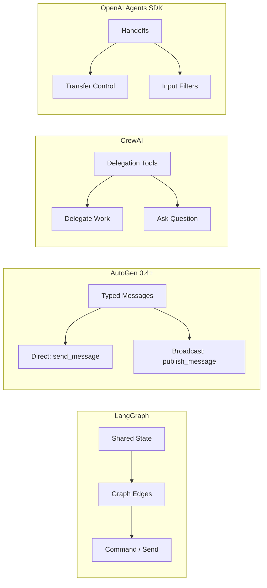
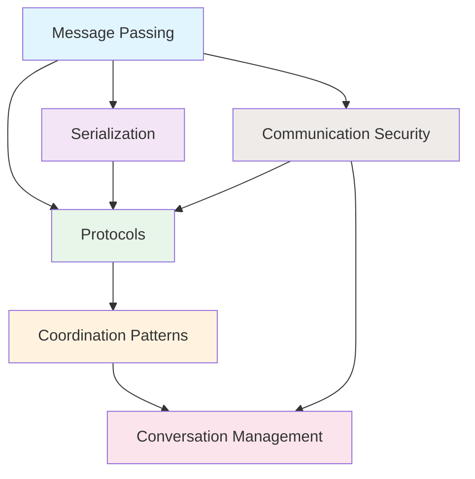

# Agent Communication

## Introduction

Communication is the backbone of every multi-agent system. Without reliable, well-structured communication, even the most capable agents become isolated workers — unable to coordinate, share results, or build on each other's work. This lesson explores the practical mechanics of how agents exchange information, from low-level message formats to high-level coordination protocols.

In the previous lesson, we covered *what* multi-agent systems are and *why* we use them. Now we shift to *how* agents actually talk to each other — the message formats, protocols, coordination mechanisms, and security considerations that make multi-agent collaboration work in practice.

### What We'll Cover

This lesson is organized into six sub-topics that progressively build your understanding of agent communication:

| # | Topic | Focus |
|---|-------|-------|
| 01 | [Message Passing](./01-message-passing.md) | Message structure, types, async messaging, queues, delivery guarantees |
| 02 | [Protocols](./02-protocols.md) | Request-response, handshake patterns, acknowledgments, timeouts, retries |
| 03 | [Coordination Patterns](./03-coordination-patterns.md) | Turn-taking, token passing, voting, consensus, deadlock avoidance |
| 04 | [Conversation Management](./04-conversation-management.md) | Conversation tracking, thread management, context sharing, multi-party |
| 05 | [Serialization](./05-serialization.md) | Message format design, JSON, Pydantic models, schema evolution, versioning |
| 06 | [Communication Security](./06-communication-security.md) | Authentication, message validation, trust, input sanitization, audit logging |

### Prerequisites

- Multi-agent concepts (Lesson 01) — architectures, roles, communication patterns overview
- Python async/await fundamentals (Unit 02)
- Basic understanding of APIs and message formats (Unit 01, Unit 04)

---

## Communication Across Frameworks

Each major multi-agent framework takes a different approach to agent communication. Understanding these differences helps you choose the right tool and adapt patterns between frameworks.

| Framework | Communication Model | Message Format | Key Mechanism |
|-----------|-------------------|----------------|---------------|
| **LangGraph** | State-based | `TypedDict` / Pydantic state | `Command`, `Send`, shared state via edges |
| **AutoGen 0.4+** | Message-based | `dataclass` / `BaseModel` | `send_message()`, `publish_message()` |
| **CrewAI** | Delegation-based | Natural language + context | `allow_delegation=True`, task `context` |
| **OpenAI Agents SDK** | Handoff-based | Conversation history | `handoff()`, `input_filter`, `input_type` |

---

## How These Topics Connect

Communication in multi-agent systems involves layers that build on each other:

1. **Message Passing** — the foundation: how individual messages are structured, typed, and delivered
2. **Protocols** — rules for structured exchanges: request-response, handshakes, retries
3. **Coordination Patterns** — higher-level collaboration: who speaks when, how groups decide
4. **Conversation Management** — tracking ongoing dialogues across multiple agents and threads
5. **Serialization** — making messages portable: format design, schema evolution, versioning
6. **Communication Security** — protecting the entire communication stack: auth, validation, audit

---

## Key Terminology

| Term | Definition |
|------|-----------|
| **Message** | A discrete unit of data exchanged between agents |
| **Protocol** | A set of rules governing how messages are exchanged |
| **Handoff** | Transferring control from one agent to another |
| **Broadcast** | Sending a message to all subscribed agents (one-way) |
| **Direct Message** | Sending a message to a specific agent (supports response) |
| **Serialization** | Converting messages to/from a transmittable format |
| **Correlation ID** | An identifier linking related messages (e.g., request to response) |
| **Dead Letter Queue** | Storage for messages that could not be delivered |
| **Backpressure** | Flow control when a receiver cannot keep up with incoming messages |

---

**Next:** [Message Passing](./01-message-passing.md)

**Previous:** [Design Considerations](../01-multi-agent-concepts/06-design-considerations.md)

---

## Further Reading

- [AutoGen Message and Communication](https://microsoft.github.io/autogen/stable/user-guide/core-user-guide/framework/message-and-communication.html) - Official AutoGen messaging docs
- [LangGraph Graph API](https://docs.langchain.com/oss/python/langgraph/graph-api) - State, nodes, edges, and Command
- [OpenAI Agents SDK Handoffs](https://openai.github.io/openai-agents-python/handoffs/) - Handoff patterns and input filters
- [CrewAI Collaboration](https://docs.crewai.com/concepts/collaboration) - Delegation and task context

<!-- 
Sources Consulted:
- AutoGen message-and-communication: https://microsoft.github.io/autogen/stable/user-guide/core-user-guide/framework/message-and-communication.html
- LangGraph graph API: https://docs.langchain.com/oss/python/langgraph/graph-api
- OpenAI Agents SDK handoffs: https://openai.github.io/openai-agents-python/handoffs/
- CrewAI collaboration: https://docs.crewai.com/concepts/collaboration
-->
