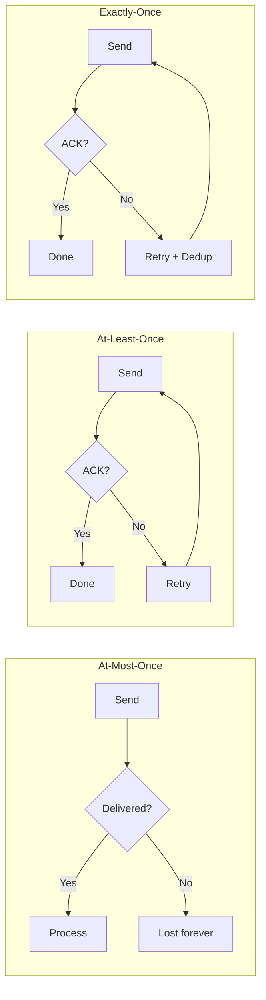

# Message Passing

## Introduction

Message passing is the fundamental mechanism through which agents communicate. Every coordination pattern, every protocol, and every conversation in a multi-agent system ultimately reduces to agents sending and receiving messages. Understanding how to design, structure, and deliver messages reliably is the foundation for everything else in agent communication.

We'll build practical message systems using real framework patterns — from AutoGen's typed messages to LangGraph's state-based communication — so you can implement reliable agent-to-agent messaging in production systems.

### What We'll Cover
- Designing message structures with required fields
- Categorizing message types for different purposes
- Implementing asynchronous messaging between agents
- Building message queues for reliable delivery
- Ensuring delivery guarantees in multi-agent systems

### Prerequisites
- Python dataclasses and Pydantic models (Unit 02)
- Async/await fundamentals (Unit 02, Lesson 09)
- Multi-agent concepts overview (Lesson 01)

---

## Message Structure

Every message in a multi-agent system needs to answer five questions: *who* sent it, *who* should receive it, *what* type of message is it, *what* does it contain, and *when* was it sent. A well-designed message structure makes routing, debugging, and auditing straightforward.

### Essential Message Fields

```python
from dataclasses import dataclass, field
from datetime import datetime
from typing import Any
import uuid

@dataclass
class AgentMessage:
    """Standard message format for inter-agent communication."""
    sender: str                    # Who sent it
    receiver: str                  # Who should get it ("*" for broadcast)
    msg_type: str                  # What kind of message
    content: Any                   # The actual payload
    message_id: str = field(       # Unique identifier
        default_factory=lambda: str(uuid.uuid4())
    )
    correlation_id: str = ""       # Links related messages (request → response)
    timestamp: str = field(        # When it was created
        default_factory=lambda: datetime.now().isoformat()
    )
    metadata: dict = field(        # Extensible context
        default_factory=dict
    )
```

**Output (creating a message):**
```python
msg = AgentMessage(
    sender="coordinator",
    receiver="researcher",
    msg_type="task",
    content="Analyze Q3 revenue trends"
)
print(f"ID: {msg.message_id[:8]}...")
print(f"From: {msg.sender} → To: {msg.receiver}")
print(f"Type: {msg.msg_type}")
print(f"Content: {msg.content}")
```

```
ID: a3f7c2e1...
From: coordinator → To: researcher
Type: task
Content: Analyze Q3 revenue trends
```

> **Note:** The `correlation_id` is critical for matching responses to requests. When an agent replies to a task, it copies the original `correlation_id` so the sender can match the response to the correct request.

### Why `message_id` Matters

Every message needs a unique identifier for three reasons:

1. **Deduplication** — if a message is retried, the receiver can detect and skip duplicates
2. **Audit trails** — you can trace exactly which messages were exchanged
3. **Debugging** — when something goes wrong, you can find the specific message that caused it

```python
from dataclasses import dataclass, field
import uuid

@dataclass
class AgentMessage:
    sender: str
    receiver: str
    msg_type: str
    content: str
    message_id: str = field(
        default_factory=lambda: str(uuid.uuid4())
    )
    correlation_id: str = ""

# Deduplication example
seen_ids: set[str] = set()

def process_message(msg: AgentMessage) -> bool:
    """Process a message, skipping duplicates."""
    if msg.message_id in seen_ids:
        print(f"Duplicate detected: {msg.message_id[:8]}... — skipping")
        return False
    
    seen_ids.add(msg.message_id)
    print(f"Processing: {msg.message_id[:8]}... from {msg.sender}")
    return True

# Simulate a retry scenario
original = AgentMessage(
    sender="coordinator",
    receiver="researcher",
    msg_type="task",
    content="Analyze trends"
)

process_message(original)   # First delivery
process_message(original)   # Retry — detected as duplicate
```

**Output:**
```
Processing: a3f7c2e1... from coordinator
Duplicate detected: a3f7c2e1... — skipping
```

---

## Message Types

Not all messages serve the same purpose. Categorizing messages by type allows agents to route them to the correct handler and respond appropriately.

### Common Message Categories

```python
from enum import Enum

class MessageType(Enum):
    # Work management
    TASK = "task"               # Assign work to an agent
    RESULT = "result"           # Return completed work
    
    # Information exchange
    REQUEST = "request"         # Ask for information
    RESPONSE = "response"       # Reply with information
    
    # Coordination
    EVENT = "event"             # Notify about something that happened
    BROADCAST = "broadcast"     # Announce to all agents
    STATUS = "status"           # Report current state
    
    # Control flow
    HANDOFF = "handoff"         # Transfer control to another agent
    ERROR = "error"             # Report a failure
    HEARTBEAT = "heartbeat"     # Periodic liveness check
```

### AutoGen's Type-Based Message Routing

AutoGen 0.4+ takes message typing to a structural level. Instead of using string types, each message type is a separate Python class. The framework routes messages to handlers based on the class type.

```python
from dataclasses import dataclass
from autogen_core import (
    AgentId, MessageContext, RoutedAgent,
    SingleThreadedAgentRuntime, message_handler
)

# Each message type is its own class
@dataclass
class TaskMessage:
    content: str
    priority: str = "normal"

@dataclass 
class StatusRequest:
    requester: str

@dataclass
class StatusResponse:
    agent_name: str
    status: str
    current_task: str


class WorkerAgent(RoutedAgent):
    """Agent that routes messages by type automatically."""
    
    def __init__(self, description: str):
        super().__init__(description)
        self._current_task = "idle"
    
    @message_handler
    async def handle_task(
        self, message: TaskMessage, ctx: MessageContext
    ) -> None:
        self._current_task = message.content
        print(f"[Worker] Received task: {message.content} "
              f"(priority: {message.priority})")
    
    @message_handler
    async def handle_status(
        self, message: StatusRequest, ctx: MessageContext
    ) -> StatusResponse:
        print(f"[Worker] Status requested by {message.requester}")
        return StatusResponse(
            agent_name="worker",
            status="active",
            current_task=self._current_task
        )
```

**Output (when messages are sent):**
```
[Worker] Received task: Analyze Q3 data (priority: high)
[Worker] Status requested by coordinator
```

> **🤖 AI Context:** AutoGen's type-based routing means you never need `if msg_type == "task"` chains. The framework matches message class to handler automatically — similar to how web frameworks route HTTP requests by path.

### LangGraph's State-Based Messages

LangGraph takes a fundamentally different approach. Instead of sending discrete messages, agents communicate by reading and writing to shared state.

```python
from typing import Annotated, TypedDict
from langgraph.graph import StateGraph, START, END
from langgraph.graph.message import add_messages
from langchain_core.messages import HumanMessage, AIMessage, AnyMessage


class AgentState(TypedDict):
    """Shared state acts as the 'message channel' in LangGraph."""
    messages: Annotated[list[AnyMessage], add_messages]
    current_agent: str
    task_status: str


def researcher_node(state: AgentState) -> dict:
    """Researcher reads messages from state and adds its response."""
    last_message = state["messages"][-1].content
    
    # The agent's "response" is a state update
    return {
        "messages": [AIMessage(
            content=f"Research complete: Found 3 key trends in '{last_message}'",
            name="researcher"
        )],
        "current_agent": "writer",
        "task_status": "research_complete"
    }


def writer_node(state: AgentState) -> dict:
    """Writer reads researcher's output from shared state."""
    research = state["messages"][-1].content
    
    return {
        "messages": [AIMessage(
            content=f"Draft written based on: {research}",
            name="writer"
        )],
        "task_status": "draft_complete"
    }


# Build the graph — edges define communication flow
builder = StateGraph(AgentState)
builder.add_node("researcher", researcher_node)
builder.add_node("writer", writer_node)
builder.add_edge(START, "researcher")
builder.add_edge("researcher", "writer")
builder.add_edge("writer", END)

graph = builder.compile()

# Invoke — messages flow through shared state
result = graph.invoke({
    "messages": [HumanMessage(content="AI market trends 2025")],
    "current_agent": "researcher",
    "task_status": "started"
})

for msg in result["messages"]:
    print(f"[{getattr(msg, 'name', 'user')}] {msg.content}")
```

**Output:**
```
[user] AI market trends 2025
[researcher] Research complete: Found 3 key trends in 'AI market trends 2025'
[writer] Draft written based on: Research complete: Found 3 key trends in 'AI market trends 2025'
```

> **Note:** In LangGraph, agents don't "send" messages directly. They write to shared state, and the graph's edges determine which agent processes the state next. The `add_messages` reducer ensures all messages accumulate rather than being overwritten.

---

## Asynchronous Messaging

In production multi-agent systems, agents rarely wait synchronously for each other. Asynchronous messaging allows agents to send messages without blocking, enabling parallel work and better resource utilization.

### Fire-and-Forget vs. Request-Response

```python
import asyncio
from dataclasses import dataclass, field
from datetime import datetime
from typing import Any
import uuid

@dataclass
class AgentMessage:
    sender: str
    receiver: str
    msg_type: str
    content: Any
    message_id: str = field(
        default_factory=lambda: str(uuid.uuid4())
    )
    correlation_id: str = ""
    timestamp: str = field(
        default_factory=lambda: datetime.now().isoformat()
    )


class AsyncMessageBus:
    """Async message bus supporting fire-and-forget and request-response."""
    
    def __init__(self):
        self._handlers: dict[str, Any] = {}
        self._pending: dict[str, asyncio.Future] = {}
    
    def register(self, agent_id: str, handler):
        """Register an agent's message handler."""
        self._handlers[agent_id] = handler
    
    async def send_fire_and_forget(self, message: AgentMessage) -> None:
        """Send without waiting for a response."""
        handler = self._handlers.get(message.receiver)
        if handler:
            # Schedule handling without blocking the sender
            asyncio.create_task(handler(message))
            print(f"[Bus] Dispatched {message.msg_type} "
                  f"to {message.receiver} (fire-and-forget)")
    
    async def send_request(
        self, message: AgentMessage, timeout: float = 5.0
    ) -> AgentMessage:
        """Send and wait for a response (with timeout)."""
        future: asyncio.Future = asyncio.get_event_loop().create_future()
        self._pending[message.message_id] = future
        
        handler = self._handlers.get(message.receiver)
        if handler:
            asyncio.create_task(handler(message))
        
        try:
            response = await asyncio.wait_for(future, timeout=timeout)
            print(f"[Bus] Got response for {message.message_id[:8]}...")
            return response
        except asyncio.TimeoutError:
            print(f"[Bus] Timeout waiting for response to "
                  f"{message.message_id[:8]}...")
            raise
        finally:
            self._pending.pop(message.message_id, None)
    
    async def send_response(self, response: AgentMessage) -> None:
        """Send a response to a pending request."""
        future = self._pending.get(response.correlation_id)
        if future and not future.done():
            future.set_result(response)


# Usage
bus = AsyncMessageBus()

async def researcher_handler(msg: AgentMessage):
    """Simulate async research work."""
    await asyncio.sleep(0.1)  # Simulate work
    response = AgentMessage(
        sender="researcher",
        receiver=msg.sender,
        msg_type="result",
        content=f"Found 5 results for: {msg.content}",
        correlation_id=msg.message_id  # Link to original request
    )
    await bus.send_response(response)

bus.register("researcher", researcher_handler)

async def main():
    request = AgentMessage(
        sender="coordinator",
        receiver="researcher",
        msg_type="request",
        content="AI trends 2025"
    )
    response = await bus.send_request(request, timeout=5.0)
    print(f"Response: {response.content}")

asyncio.run(main())
```

**Output:**
```
[Bus] Got response for a3f7c2e1...
Response: Found 5 results for: AI trends 2025
```

### AutoGen's Async Communication

AutoGen 0.4+ is async-first. Direct messaging returns a response (like a function call), while broadcast is fire-and-forget.

```python
from dataclasses import dataclass
from autogen_core import (
    AgentId, MessageContext, RoutedAgent,
    SingleThreadedAgentRuntime, message_handler
)

@dataclass
class Query:
    question: str

@dataclass
class Answer:
    response: str


class ExpertAgent(RoutedAgent):
    @message_handler
    async def handle_query(
        self, message: Query, ctx: MessageContext
    ) -> Answer:
        # Direct message: caller awaits this return value
        return Answer(
            response=f"Expert answer to: {message.question}"
        )


class CoordinatorAgent(RoutedAgent):
    def __init__(self, description: str, expert_type: str):
        super().__init__(description)
        self._expert_type = expert_type
    
    @message_handler
    async def handle_query(
        self, message: Query, ctx: MessageContext
    ) -> None:
        # Send direct message and await the response
        expert_id = AgentId(self._expert_type, self.id.key)
        response = await self.send_message(
            Query(question=message.question),
            expert_id
        )
        print(f"[Coordinator] Got: {response.response}")
```

**Output:**
```
[Coordinator] Got: Expert answer to: What are the key AI trends?
```

> **Important:** In AutoGen, `send_message()` is a direct call — the sender blocks (async await) until the receiver returns. If the receiver raises an exception, it propagates back to the sender. This is very different from broadcast, where exceptions are logged but never propagated.

---

## Message Queues

When agents produce messages faster than receivers can process them, you need a queue. Message queues decouple sender and receiver timing, prevent message loss, and enable buffering during load spikes.

### Priority Queue Implementation

```python
import asyncio
import heapq
from dataclasses import dataclass, field
from typing import Any
import uuid
from datetime import datetime

PRIORITY_MAP = {"critical": 0, "high": 1, "normal": 2, "low": 3}


@dataclass
class AgentMessage:
    sender: str
    receiver: str
    msg_type: str
    content: Any
    message_id: str = field(
        default_factory=lambda: str(uuid.uuid4())
    )
    priority: str = "normal"
    timestamp: str = field(
        default_factory=lambda: datetime.now().isoformat()
    )


@dataclass(order=True)
class PrioritizedMessage:
    """Wrapper for heap-based priority ordering."""
    priority_value: int
    sequence: int  # Tie-breaker for same priority (FIFO)
    message: AgentMessage = field(compare=False)


class PriorityMessageQueue:
    """Thread-safe async priority queue for agent messages."""
    
    def __init__(self, max_size: int = 1000):
        self._heap: list[PrioritizedMessage] = []
        self._sequence = 0
        self._max_size = max_size
        self._event = asyncio.Event()
    
    async def enqueue(self, message: AgentMessage) -> bool:
        """Add a message to the queue. Returns False if full."""
        if len(self._heap) >= self._max_size:
            print(f"[Queue] FULL — dropping message {message.message_id[:8]}...")
            return False
        
        priority_val = PRIORITY_MAP.get(message.priority, 2)
        entry = PrioritizedMessage(
            priority_value=priority_val,
            sequence=self._sequence,
            message=message
        )
        self._sequence += 1
        heapq.heappush(self._heap, entry)
        self._event.set()
        return True
    
    async def dequeue(self, timeout: float = 5.0) -> AgentMessage | None:
        """Get the highest-priority message."""
        try:
            await asyncio.wait_for(self._event.wait(), timeout=timeout)
        except asyncio.TimeoutError:
            return None
        
        if self._heap:
            entry = heapq.heappop(self._heap)
            if not self._heap:
                self._event.clear()
            return entry.message
        return None
    
    @property
    def size(self) -> int:
        return len(self._heap)


# Usage
async def demo_priority_queue():
    queue = PriorityMessageQueue(max_size=100)
    
    # Enqueue messages with different priorities
    messages = [
        AgentMessage("agent-a", "worker", "task", "Low priority task", priority="low"),
        AgentMessage("agent-b", "worker", "task", "Normal task", priority="normal"),
        AgentMessage("agent-c", "worker", "task", "CRITICAL alert", priority="critical"),
        AgentMessage("agent-d", "worker", "task", "High priority task", priority="high"),
    ]
    
    for msg in messages:
        await queue.enqueue(msg)
    
    print(f"Queue size: {queue.size}")
    print("Processing order (highest priority first):")
    
    while queue.size > 0:
        msg = await queue.dequeue()
        if msg:
            print(f"  [{msg.priority:>8}] {msg.content}")

asyncio.run(demo_priority_queue())
```

**Output:**
```
Queue size: 4
Processing order (highest priority first):
  [critical] CRITICAL alert
  [    high] High priority task
  [  normal] Normal task
  [     low] Low priority task
```

> **Tip:** In production systems, use established message queue libraries like `asyncio.Queue` for simple cases, or Redis/RabbitMQ for distributed multi-agent systems. The priority queue pattern above demonstrates the concept, but frameworks like AutoGen handle queuing internally through their runtime.

---

## Delivery Guarantees

In distributed systems, messages can be lost, duplicated, or delivered out of order. Delivery guarantees define the reliability level of your communication.

### Three Levels of Delivery Guarantees



| Guarantee | Description | Trade-off | Use Case |
|-----------|-------------|-----------|----------|
| **At-most-once** | Send once, no retry | Fast but may lose messages | Heartbeats, status updates |
| **At-least-once** | Retry until acknowledged | Reliable but may duplicate | Task assignments, results |
| **Exactly-once** | Retry + deduplication | Reliable, no duplicates, most complex | Financial operations, critical workflows |

### Implementing At-Least-Once Delivery

```python
import asyncio
from dataclasses import dataclass, field
from typing import Any
import uuid
from datetime import datetime


@dataclass
class AgentMessage:
    sender: str
    receiver: str
    msg_type: str
    content: Any
    message_id: str = field(
        default_factory=lambda: str(uuid.uuid4())
    )
    attempt: int = 0
    max_retries: int = 3


class ReliableMessageSender:
    """Sends messages with at-least-once delivery guarantee."""
    
    def __init__(self):
        self._acked: set[str] = set()
    
    def acknowledge(self, message_id: str) -> None:
        """Receiver calls this to acknowledge receipt."""
        self._acked.add(message_id)
        print(f"  [ACK] Message {message_id[:8]}... acknowledged")
    
    async def send_reliable(
        self,
        message: AgentMessage,
        deliver_fn,
        retry_delay: float = 1.0
    ) -> bool:
        """Send with retries until acknowledged."""
        for attempt in range(message.max_retries):
            message.attempt = attempt + 1
            print(f"  [Send] Attempt {message.attempt}/{message.max_retries} "
                  f"for {message.message_id[:8]}...")
            
            try:
                await deliver_fn(message)
            except Exception as e:
                print(f"  [Error] Delivery failed: {e}")
            
            # Wait briefly, then check for ACK
            await asyncio.sleep(retry_delay * 0.1)
            
            if message.message_id in self._acked:
                print(f"  [Done] Delivered after {message.attempt} attempt(s)")
                return True
            
            print(f"  [Retry] No ACK received, retrying...")
        
        print(f"  [Failed] Max retries exceeded for {message.message_id[:8]}...")
        return False


# Simulate unreliable delivery
sender = ReliableMessageSender()
delivery_count = 0

async def unreliable_delivery(msg: AgentMessage):
    """Simulates a network that fails on first attempt."""
    global delivery_count
    delivery_count += 1
    if delivery_count == 1:
        raise ConnectionError("Network timeout")
    # Second attempt succeeds — receiver sends ACK
    sender.acknowledge(msg.message_id)

async def main():
    msg = AgentMessage(
        sender="coordinator",
        receiver="researcher",
        msg_type="task",
        content="Analyze data",
        max_retries=3
    )
    
    success = await sender.send_reliable(msg, unreliable_delivery)
    print(f"Delivery successful: {success}")

asyncio.run(main())
```

**Output:**
```
  [Send] Attempt 1/3 for a3f7c2e1...
  [Error] Delivery failed: Network timeout
  [Retry] No ACK received, retrying...
  [Send] Attempt 2/3 for a3f7c2e1...
  [ACK] Message a3f7c2e1... acknowledged
  [Done] Delivered after 2 attempt(s)
Delivery successful: True
```

### Framework Delivery Guarantees

| Framework | Direct Message | Broadcast | Notes |
|-----------|---------------|-----------|-------|
| **AutoGen 0.4+** | At-least-once (exceptions propagate) | At-most-once (errors logged only) | Runtime handles delivery internally |
| **LangGraph** | Exactly-once (via checkpointing) | — | State updates are persisted via checkpointers |
| **CrewAI** | At-least-once (task retry) | — | Delegation tools retry on failure |
| **OpenAI Agents SDK** | At-most-once (handoff or fail) | — | Handoffs are one-shot transfers |

> **🤖 AI Context:** LangGraph's checkpointing system provides the strongest delivery guarantees. Because every state transition is persisted, you can resume from exactly where you left off — even after a crash. This is why LangGraph is often preferred for long-running, mission-critical agent workflows.

---

## Best Practices

| Practice | Why It Matters |
|----------|----------------|
| Always include `message_id` and `correlation_id` | Enables deduplication, request-response matching, and debugging |
| Use typed messages (classes, not dicts) | Catches errors at development time, enables automatic routing |
| Prefer async over sync messaging | Prevents agents from blocking each other |
| Set timeouts on all awaited responses | Prevents indefinite hangs when an agent fails |
| Log every message sent and received | Essential for debugging multi-agent flows |
| Design messages as pure data (no logic) | Keeps messages serializable and framework-agnostic |

---

## Common Pitfalls

| ❌ Mistake | ✅ Solution |
|-----------|-------------|
| Using plain dictionaries for messages | Define explicit message classes with typed fields |
| Missing correlation IDs on responses | Always copy `message_id` → `correlation_id` when replying |
| No timeout on request-response calls | Set explicit timeouts (e.g., `asyncio.wait_for(coro, timeout=30)`) |
| Ignoring message ordering | Use sequence numbers or timestamps when order matters |
| Unbounded message queues | Set `max_size` and handle backpressure (drop, reject, or buffer) |
| Sending large payloads inline | Send references (URLs, keys) instead of raw data for large content |

---

## Hands-on Exercise

### Your Task

Build a multi-agent message router that accepts messages, categorizes them by type, routes them to the appropriate handler, and tracks delivery statistics.

### Requirements

1. Define at least 3 message types as Python dataclasses (`TaskMessage`, `QueryMessage`, `StatusMessage`)
2. Implement a `MessageRouter` class with `register_handler()` and `route()` methods
3. Route messages to handlers based on their Python type (use `isinstance` or a type registry)
4. Track statistics: total messages routed, messages per type, failed deliveries
5. Handle the case where no handler is registered for a message type (log a warning, don't crash)

### Expected Result

```
Routing TaskMessage → task_handler: ✅
Routing QueryMessage → query_handler: ✅  
Routing StatusMessage → status_handler: ✅
Routing UnknownMessage → ???: ⚠️ No handler registered

Stats:
  Total routed: 4
  Successful: 3
  Failed: 1
  By type: TaskMessage=1, QueryMessage=1, StatusMessage=1
```

<details>
<summary>💡 Hints (click to expand)</summary>

- Use `type(message).__name__` to get the class name for type-based routing
- Store handlers in a `dict[type, Callable]` for O(1) lookup
- Wrap handler calls in try/except to track failures without crashing
- Use `collections.Counter` for per-type statistics

</details>

<details>
<summary>✅ Solution (click to expand)</summary>

```python
from dataclasses import dataclass
from collections import Counter
from typing import Any, Callable

@dataclass
class TaskMessage:
    task: str
    priority: str = "normal"

@dataclass
class QueryMessage:
    question: str

@dataclass
class StatusMessage:
    agent: str
    status: str

@dataclass
class UnknownMessage:
    data: str


class MessageRouter:
    def __init__(self):
        self._handlers: dict[type, Callable] = {}
        self._stats = Counter()
        self._total = 0
        self._failed = 0
    
    def register_handler(self, msg_type: type, handler: Callable):
        self._handlers[msg_type] = handler
    
    def route(self, message: Any) -> bool:
        self._total += 1
        msg_type = type(message)
        type_name = msg_type.__name__
        
        handler = self._handlers.get(msg_type)
        if handler is None:
            print(f"Routing {type_name} → ???: ⚠️ No handler registered")
            self._failed += 1
            return False
        
        try:
            handler(message)
            self._stats[type_name] += 1
            print(f"Routing {type_name} → {handler.__name__}: ✅")
            return True
        except Exception as e:
            print(f"Routing {type_name} → {handler.__name__}: ❌ {e}")
            self._failed += 1
            return False
    
    def print_stats(self):
        print(f"\nStats:")
        print(f"  Total routed: {self._total}")
        print(f"  Successful: {sum(self._stats.values())}")
        print(f"  Failed: {self._failed}")
        by_type = ", ".join(f"{k}={v}" for k, v in self._stats.items())
        print(f"  By type: {by_type}")


# Register handlers
def task_handler(msg: TaskMessage):
    pass  # Process task

def query_handler(msg: QueryMessage):
    pass  # Answer query

def status_handler(msg: StatusMessage):
    pass  # Record status

router = MessageRouter()
router.register_handler(TaskMessage, task_handler)
router.register_handler(QueryMessage, query_handler)
router.register_handler(StatusMessage, status_handler)

# Route messages
router.route(TaskMessage(task="Analyze data", priority="high"))
router.route(QueryMessage(question="What is the status?"))
router.route(StatusMessage(agent="researcher", status="active"))
router.route(UnknownMessage(data="???"))

router.print_stats()
```

</details>

### Bonus Challenges
- [ ] Add async support (make handlers and routing async)
- [ ] Implement a dead letter queue for unroutable messages
- [ ] Add retry logic with configurable max attempts

---

## Summary

✅ **Messages need structure** — `message_id`, `sender`, `receiver`, `msg_type`, `content`, `correlation_id`, and `timestamp` form the essential anatomy

✅ **Type-based routing** eliminates conditional logic — AutoGen routes by Python class, LangGraph routes by graph edges, both avoiding manual `if` chains

✅ **Async messaging** prevents blocking — fire-and-forget for notifications, request-response for queries, each with different trade-offs

✅ **Message queues** decouple timing — priority queues ensure critical messages are processed first, bounded queues prevent memory exhaustion

✅ **Delivery guarantees** range from at-most-once to exactly-once — choose based on how critical the message is, with LangGraph's checkpointing providing the strongest guarantees

**Next:** [Protocols](./02-protocols.md)

**Previous:** [Agent Communication Overview](./00-agent-communication.md)

---

## Further Reading

- [AutoGen Message and Communication](https://microsoft.github.io/autogen/stable/user-guide/core-user-guide/framework/message-and-communication.html) - Official messaging documentation
- [LangGraph Graph API](https://docs.langchain.com/oss/python/langgraph/graph-api) - State, reducers, and message handling
- [Python asyncio Queues](https://docs.python.org/3/library/asyncio-queue.html) - Built-in async queue support
- [Enterprise Integration Patterns](https://www.enterpriseintegrationpatterns.com/) - Classic messaging patterns

<!-- 
Sources Consulted:
- AutoGen message-and-communication: https://microsoft.github.io/autogen/stable/user-guide/core-user-guide/framework/message-and-communication.html
- LangGraph graph API: https://docs.langchain.com/oss/python/langgraph/graph-api
- Python asyncio: https://docs.python.org/3/library/asyncio.html
- OpenAI Agents SDK handoffs: https://openai.github.io/openai-agents-python/handoffs/
-->
