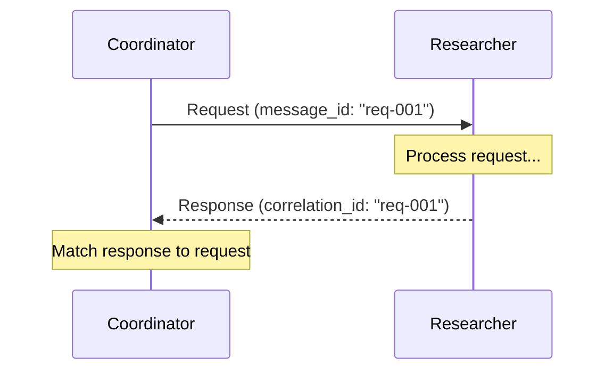
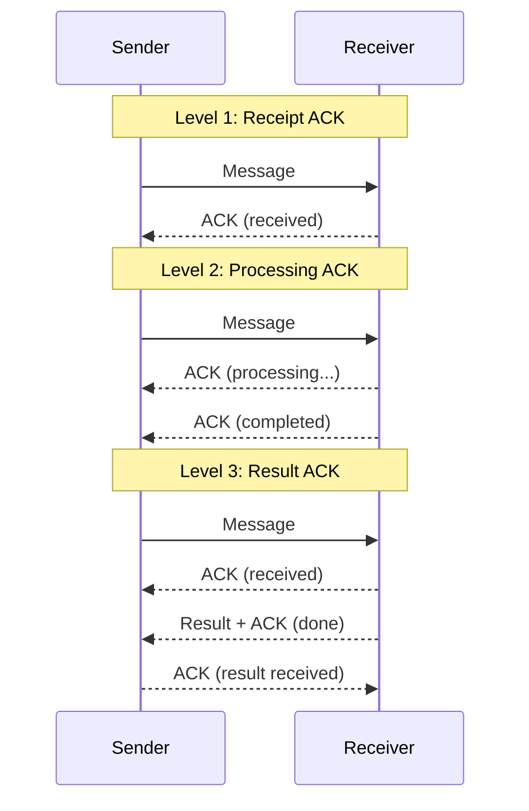

# Protocols

## Introduction

A protocol defines the rules of conversation between agents. Just as HTTP defines how clients and servers exchange web pages, agent communication protocols define how agents request work, confirm receipt, handle failures, and retry operations. Without protocols, messages are just data flung into the void — no guarantee of delivery, no way to handle errors, and no mechanism for recovery.

We'll explore the core protocols used in multi-agent systems, from simple request-response patterns to sophisticated retry strategies. Each protocol builds on the message passing foundations from the previous lesson, adding structure and reliability.

### What We'll Cover
- Request-response protocol with correlation tracking
- Handshake patterns for establishing agent connections
- Acknowledgment mechanisms for confirmed delivery
- Timeout handling to prevent indefinite waiting
- Retry strategies with exponential backoff

### Prerequisites
- Message passing fundamentals (Lesson 02, Topic 01)
- Python async/await (Unit 02, Lesson 09)
- Basic error handling concepts (Unit 02, Lesson 13)

---

## Request-Response Protocol

Request-response is the most fundamental communication protocol. One agent sends a request and waits for the other agent to return a response. This mirrors how function calls work — the caller blocks until the callee returns.

### Basic Request-Response Flow



### Implementation with Correlation Tracking

```python
import asyncio
from dataclasses import dataclass, field
from typing import Any
import uuid


@dataclass
class Request:
    """A request message that expects a response."""
    sender: str
    receiver: str
    action: str
    payload: Any
    message_id: str = field(
        default_factory=lambda: str(uuid.uuid4())
    )
    timeout: float = 30.0


@dataclass
class Response:
    """A response linked to the original request."""
    sender: str
    receiver: str
    result: Any
    success: bool
    correlation_id: str  # Must match the request's message_id
    error: str = ""


class RequestResponseProtocol:
    """Manages request-response exchanges with correlation tracking."""
    
    def __init__(self):
        self._pending: dict[str, asyncio.Future] = {}
        self._handlers: dict[str, Any] = {}
    
    def register_responder(self, agent_id: str, handler):
        """Register an agent that can handle requests."""
        self._handlers[agent_id] = handler
    
    async def send_request(self, request: Request) -> Response:
        """Send a request and wait for the correlated response."""
        future: asyncio.Future = asyncio.get_event_loop().create_future()
        self._pending[request.message_id] = future
        
        print(f"[Protocol] {request.sender} → {request.receiver}: "
              f"{request.action}")
        
        # Deliver to handler
        handler = self._handlers.get(request.receiver)
        if not handler:
            self._pending.pop(request.message_id)
            return Response(
                sender=request.receiver,
                receiver=request.sender,
                result=None,
                success=False,
                correlation_id=request.message_id,
                error=f"No handler for agent '{request.receiver}'"
            )
        
        # Process asynchronously
        asyncio.create_task(self._process_request(handler, request))
        
        try:
            response = await asyncio.wait_for(
                future, timeout=request.timeout
            )
            return response
        except asyncio.TimeoutError:
            self._pending.pop(request.message_id, None)
            return Response(
                sender=request.receiver,
                receiver=request.sender,
                result=None,
                success=False,
                correlation_id=request.message_id,
                error=f"Timeout after {request.timeout}s"
            )
    
    async def _process_request(self, handler, request: Request):
        """Execute the handler and deliver the response."""
        try:
            result = await handler(request)
            response = Response(
                sender=request.receiver,
                receiver=request.sender,
                result=result,
                success=True,
                correlation_id=request.message_id
            )
        except Exception as e:
            response = Response(
                sender=request.receiver,
                receiver=request.sender,
                result=None,
                success=False,
                correlation_id=request.message_id,
                error=str(e)
            )
        
        future = self._pending.pop(request.message_id, None)
        if future and not future.done():
            future.set_result(response)


# Usage
protocol = RequestResponseProtocol()

async def research_handler(request: Request) -> dict:
    """Simulate a research agent processing a request."""
    await asyncio.sleep(0.1)  # Simulate work
    return {"findings": f"3 trends found for '{request.payload}'"}

protocol.register_responder("researcher", research_handler)

async def main():
    request = Request(
        sender="coordinator",
        receiver="researcher",
        action="research",
        payload="AI market trends 2025",
        timeout=5.0
    )
    
    response = await protocol.send_request(request)
    print(f"[Result] Success: {response.success}")
    print(f"[Result] Data: {response.result}")
    print(f"[Result] Correlation: {response.correlation_id[:8]}... "
          f"== {request.message_id[:8]}...")

asyncio.run(main())
```

**Output:**
```
[Protocol] coordinator → researcher: research
[Result] Success: True
[Result] Data: {'findings': "3 trends found for 'AI market trends 2025'"}
[Result] Correlation: a3f7c2e1... == a3f7c2e1...
```

### AutoGen's Built-in Request-Response

AutoGen 0.4+ implements request-response natively through `send_message()`. The return value from a message handler becomes the response.

```python
from dataclasses import dataclass
from autogen_core import (
    AgentId, MessageContext, RoutedAgent,
    SingleThreadedAgentRuntime, message_handler
)

@dataclass
class ResearchQuery:
    topic: str

@dataclass
class ResearchResult:
    findings: list[str]
    source_count: int


class ResearchAgent(RoutedAgent):
    @message_handler
    async def handle_query(
        self, message: ResearchQuery, ctx: MessageContext
    ) -> ResearchResult:
        # The return value IS the response
        return ResearchResult(
            findings=[
                f"Trend 1 in {message.topic}",
                f"Trend 2 in {message.topic}"
            ],
            source_count=5
        )


class CoordinatorAgent(RoutedAgent):
    def __init__(self, description: str, researcher_type: str):
        super().__init__(description)
        self._researcher_type = researcher_type
    
    @message_handler
    async def coordinate(
        self, message: ResearchQuery, ctx: MessageContext
    ) -> None:
        # send_message returns the handler's return value
        result = await self.send_message(
            ResearchQuery(topic=message.topic),
            AgentId(self._researcher_type, self.id.key)
        )
        # result is a ResearchResult instance
        print(f"Got {result.source_count} sources: {result.findings}")
```

**Output:**
```
Got 5 sources: ['Trend 1 in AI agents', 'Trend 2 in AI agents']
```

> **Note:** If the `ResearchAgent` raises an exception, it propagates back to the coordinator through `send_message()`. This is AutoGen's equivalent of a failed response — no separate error response class needed.

---

## Handshake Patterns

Before agents can communicate effectively, they sometimes need to establish a connection. A handshake protocol ensures both parties are ready, agree on capabilities, and establish shared context.

### Capability-Based Handshake

```python
import asyncio
from dataclasses import dataclass, field
from typing import Any


@dataclass
class HandshakeRequest:
    """Initial connection request with capability declaration."""
    agent_id: str
    agent_type: str
    capabilities: list[str]
    protocol_version: str = "1.0"


@dataclass
class HandshakeResponse:
    """Response confirming or rejecting the connection."""
    agent_id: str
    accepted: bool
    shared_capabilities: list[str]
    session_id: str = ""
    rejection_reason: str = ""


class AgentConnection:
    """Manages handshake-based agent connections."""
    
    def __init__(self, agent_id: str, capabilities: list[str]):
        self.agent_id = agent_id
        self.capabilities = capabilities
        self._connections: dict[str, dict] = {}
    
    async def initiate_handshake(
        self, target: "AgentConnection"
    ) -> HandshakeResponse:
        """Start a handshake with another agent."""
        request = HandshakeRequest(
            agent_id=self.agent_id,
            agent_type="worker",
            capabilities=self.capabilities
        )
        
        print(f"[Handshake] {self.agent_id} → {target.agent_id}: "
              f"Requesting connection")
        print(f"  Capabilities offered: {request.capabilities}")
        
        response = await target.receive_handshake(request)
        
        if response.accepted:
            self._connections[target.agent_id] = {
                "session_id": response.session_id,
                "shared_capabilities": response.shared_capabilities
            }
            print(f"[Handshake] ✅ Connected! Shared: "
                  f"{response.shared_capabilities}")
        else:
            print(f"[Handshake] ❌ Rejected: {response.rejection_reason}")
        
        return response
    
    async def receive_handshake(
        self, request: HandshakeRequest
    ) -> HandshakeResponse:
        """Process an incoming handshake request."""
        # Find overlapping capabilities
        shared = list(
            set(request.capabilities) & set(self.capabilities)
        )
        
        if not shared:
            return HandshakeResponse(
                agent_id=self.agent_id,
                accepted=False,
                shared_capabilities=[],
                rejection_reason="No compatible capabilities"
            )
        
        import uuid
        session_id = str(uuid.uuid4())[:8]
        
        self._connections[request.agent_id] = {
            "session_id": session_id,
            "shared_capabilities": shared
        }
        
        return HandshakeResponse(
            agent_id=self.agent_id,
            accepted=True,
            shared_capabilities=shared,
            session_id=session_id
        )


# Demo
async def main():
    researcher = AgentConnection(
        "researcher",
        ["text_analysis", "web_search", "summarization"]
    )
    writer = AgentConnection(
        "writer",
        ["text_generation", "summarization", "formatting"]
    )
    coder = AgentConnection(
        "coder",
        ["code_generation", "debugging"]
    )
    
    # Researcher ↔ Writer: share "summarization"
    await researcher.initiate_handshake(writer)
    print()
    
    # Researcher ↔ Coder: no shared capabilities
    await researcher.initiate_handshake(coder)

asyncio.run(main())
```

**Output:**
```
[Handshake] researcher → writer: Requesting connection
  Capabilities offered: ['text_analysis', 'web_search', 'summarization']
[Handshake] ✅ Connected! Shared: ['summarization']

[Handshake] researcher → coder: Requesting connection
  Capabilities offered: ['text_analysis', 'web_search', 'summarization']
[Handshake] ❌ Rejected: No compatible capabilities
```

> **🤖 AI Context:** In practice, most agent frameworks handle capability matching implicitly. AutoGen routes by message type, CrewAI assigns roles, and OpenAI Agents SDK defines handoffs declaratively. Explicit handshake patterns become important when building custom frameworks or connecting agents across network boundaries.

---

## Acknowledgments

An acknowledgment (ACK) confirms that a message was received and processed. Without ACKs, the sender has no way to know if the message arrived. ACK patterns range from simple receipt confirmation to full processing confirmation.

### Three ACK Levels



### Implementation with Multi-Level ACKs

```python
import asyncio
from dataclasses import dataclass, field
from enum import Enum
from datetime import datetime
import uuid


class AckLevel(Enum):
    RECEIVED = "received"      # Message arrived
    PROCESSING = "processing"  # Work has started
    COMPLETED = "completed"    # Work is done
    FAILED = "failed"          # Work failed


@dataclass
class Acknowledgment:
    """Acknowledgment for a specific message."""
    message_id: str
    level: AckLevel
    agent_id: str
    details: str = ""
    timestamp: str = field(
        default_factory=lambda: datetime.now().isoformat()
    )


class AckTracker:
    """Tracks acknowledgment state for sent messages."""
    
    def __init__(self):
        self._states: dict[str, list[Acknowledgment]] = {}
    
    def record_ack(self, ack: Acknowledgment):
        """Record an acknowledgment."""
        if ack.message_id not in self._states:
            self._states[ack.message_id] = []
        self._states[ack.message_id].append(ack)
        print(f"  [ACK] {ack.agent_id}: {ack.level.value} "
              f"(msg: {ack.message_id[:8]}...)")
    
    def get_status(self, message_id: str) -> AckLevel | None:
        """Get the latest ACK level for a message."""
        acks = self._states.get(message_id, [])
        return acks[-1].level if acks else None
    
    async def wait_for_level(
        self,
        message_id: str,
        target_level: AckLevel,
        timeout: float = 10.0
    ) -> bool:
        """Wait until a specific ACK level is reached."""
        deadline = asyncio.get_event_loop().time() + timeout
        while asyncio.get_event_loop().time() < deadline:
            current = self.get_status(message_id)
            if current == target_level:
                return True
            if current == AckLevel.FAILED:
                return False
            await asyncio.sleep(0.05)
        return False


# Demo: multi-level acknowledgment
tracker = AckTracker()

async def worker_with_acks(message_id: str, tracker: AckTracker):
    """Simulate a worker that sends ACKs at each stage."""
    # Level 1: Received
    tracker.record_ack(Acknowledgment(
        message_id=message_id,
        level=AckLevel.RECEIVED,
        agent_id="worker"
    ))
    
    await asyncio.sleep(0.1)
    
    # Level 2: Processing
    tracker.record_ack(Acknowledgment(
        message_id=message_id,
        level=AckLevel.PROCESSING,
        agent_id="worker",
        details="Analyzing data..."
    ))
    
    await asyncio.sleep(0.2)
    
    # Level 3: Completed
    tracker.record_ack(Acknowledgment(
        message_id=message_id,
        level=AckLevel.COMPLETED,
        agent_id="worker",
        details="Found 5 results"
    ))


async def main():
    msg_id = str(uuid.uuid4())
    print(f"Sending message {msg_id[:8]}... and tracking ACKs:\n")
    
    # Start worker and wait for completion
    asyncio.create_task(worker_with_acks(msg_id, tracker))
    
    success = await tracker.wait_for_level(
        msg_id, AckLevel.COMPLETED, timeout=5.0
    )
    
    print(f"\nFinal status: {'✅ Completed' if success else '❌ Failed'}")

asyncio.run(main())
```

**Output:**
```
Sending message a3f7c2e1... and tracking ACKs:

  [ACK] worker: received (msg: a3f7c2e1...)
  [ACK] worker: processing (msg: a3f7c2e1...)
  [ACK] worker: completed (msg: a3f7c2e1...)

Final status: ✅ Completed
```

---

## Timeout Handling

Timeouts prevent agents from waiting indefinitely for responses that may never come. A good timeout strategy balances between giving agents enough time to complete work and detecting failures quickly.

### Adaptive Timeout Pattern

```python
import asyncio
import time
from dataclasses import dataclass


@dataclass
class TimeoutConfig:
    """Configurable timeout with adaptive adjustment."""
    base_timeout: float = 5.0
    max_timeout: float = 60.0
    min_timeout: float = 1.0
    adjustment_factor: float = 0.3  # How much to adjust toward actual
    
    _current: float = 0.0
    _response_times: list[float] = None
    
    def __post_init__(self):
        self._current = self.base_timeout
        self._response_times = []
    
    @property
    def timeout(self) -> float:
        """Get the current timeout value."""
        return self._current
    
    def record_response_time(self, duration: float):
        """Adjust timeout based on observed response times."""
        self._response_times.append(duration)
        
        # Keep last 10 observations
        if len(self._response_times) > 10:
            self._response_times = self._response_times[-10:]
        
        # Calculate adaptive timeout: 2x the average response time
        avg = sum(self._response_times) / len(self._response_times)
        target = avg * 2.0
        
        # Gradually adjust toward target
        self._current = (
            self._current * (1 - self.adjustment_factor) +
            target * self.adjustment_factor
        )
        
        # Clamp to bounds
        self._current = max(
            self.min_timeout,
            min(self.max_timeout, self._current)
        )
    
    def record_timeout(self):
        """Increase timeout after a timeout occurs."""
        self._current = min(self._current * 1.5, self.max_timeout)


# Demo
async def simulate_agent_call(
    delay: float, timeout_config: TimeoutConfig
) -> str | None:
    """Simulate calling an agent with adaptive timeout."""
    timeout = timeout_config.timeout
    start = time.monotonic()
    
    try:
        await asyncio.wait_for(asyncio.sleep(delay), timeout=timeout)
        duration = time.monotonic() - start
        timeout_config.record_response_time(duration)
        print(f"  ✅ Response in {duration:.2f}s "
              f"(timeout was {timeout:.2f}s)")
        return "success"
    except asyncio.TimeoutError:
        timeout_config.record_timeout()
        print(f"  ❌ Timeout after {timeout:.2f}s "
              f"(new timeout: {timeout_config.timeout:.2f}s)")
        return None


async def main():
    config = TimeoutConfig(base_timeout=2.0)
    print(f"Initial timeout: {config.timeout:.2f}s\n")
    
    # Simulate varying response times
    delays = [0.5, 0.8, 0.3, 1.2, 0.6]
    
    for i, delay in enumerate(delays, 1):
        print(f"Call {i} (actual delay: {delay}s):")
        await simulate_agent_call(delay, config)
        print(f"  Adapted timeout: {config.timeout:.2f}s\n")

asyncio.run(main())
```

**Output:**
```
Initial timeout: 2.00s

Call 1 (actual delay: 0.5s):
  ✅ Response in 0.50s (timeout was 2.00s)
  Adapted timeout: 1.70s

Call 2 (actual delay: 0.8s):
  ✅ Response in 0.80s (timeout was 1.70s)
  Adapted timeout: 1.58s

Call 3 (actual delay: 0.3s):
  ✅ Response in 0.30s (timeout was 1.58s)
  Adapted timeout: 1.43s

Call 4 (actual delay: 1.2s):
  ✅ Response in 1.20s (timeout was 1.43s)
  Adapted timeout: 1.43s

Call 5 (actual delay: 0.6s):
  ✅ Response in 0.60s (timeout was 1.43s)
  Adapted timeout: 1.33s
```

> **Tip:** Adaptive timeouts work well for stable systems where response times cluster around a mean. For highly variable workloads (e.g., one agent sometimes calls an LLM API that takes 30 seconds), consider per-task-type timeouts instead of a single adaptive value.

### Framework Timeout Approaches

| Framework | Timeout Mechanism | Default | Configuration |
|-----------|------------------|---------|---------------|
| **AutoGen 0.4+** | `asyncio.wait_for()` on `send_message()` | None (waits forever) | Wrap in `asyncio.wait_for()` manually |
| **LangGraph** | `recursion_limit` (step-based) | 1000 steps | `config={"recursion_limit": 25}` |
| **CrewAI** | Task-level `timeout` parameter | None | `Task(timeout=300)` (seconds) |
| **OpenAI Agents SDK** | `max_turns` on `Runner.run()` | 10 | `Runner.run(agent, max_turns=5)` |

---

## Retry Strategies

When a message fails to deliver or an agent returns an error, retry strategies determine how and when to try again. The three main strategies are immediate retry, fixed-delay retry, and exponential backoff.

### Exponential Backoff with Jitter

```python
import asyncio
import random
from dataclasses import dataclass


@dataclass
class RetryConfig:
    """Configuration for retry behavior."""
    max_retries: int = 5
    base_delay: float = 1.0       # Initial delay in seconds
    max_delay: float = 30.0       # Maximum delay cap
    exponential_base: float = 2.0  # Multiplier per retry
    jitter: bool = True            # Add randomness to prevent thundering herd
    retryable_errors: tuple = (
        ConnectionError, TimeoutError, OSError
    )


async def retry_with_backoff(
    operation,
    config: RetryConfig,
    operation_name: str = "operation"
) -> any:
    """Execute an operation with exponential backoff retry."""
    last_error = None
    
    for attempt in range(config.max_retries + 1):
        try:
            result = await operation()
            if attempt > 0:
                print(f"  ✅ {operation_name} succeeded on "
                      f"attempt {attempt + 1}")
            return result
        except config.retryable_errors as e:
            last_error = e
            
            if attempt == config.max_retries:
                print(f"  ❌ {operation_name} failed after "
                      f"{config.max_retries + 1} attempts: {e}")
                raise
            
            # Calculate delay with exponential backoff
            delay = min(
                config.base_delay * (config.exponential_base ** attempt),
                config.max_delay
            )
            
            # Add jitter to prevent thundering herd
            if config.jitter:
                delay = delay * (0.5 + random.random() * 0.5)
            
            print(f"  ⚠️ Attempt {attempt + 1} failed: {e}")
            print(f"     Retrying in {delay:.2f}s...")
            await asyncio.sleep(delay)
    
    raise last_error


# Demo: simulating transient failures
call_count = 0

async def flaky_agent_call():
    """Simulates an agent that fails twice then succeeds."""
    global call_count
    call_count += 1
    if call_count <= 2:
        raise ConnectionError(f"Agent unreachable (attempt {call_count})")
    return {"status": "success", "data": "Analysis complete"}


async def main():
    config = RetryConfig(
        max_retries=4,
        base_delay=0.1,  # Short delays for demo
        jitter=False
    )
    
    print("Calling flaky agent with exponential backoff:\n")
    result = await retry_with_backoff(
        flaky_agent_call, config, "research_task"
    )
    print(f"\nResult: {result}")

asyncio.run(main())
```

**Output:**
```
Calling flaky agent with exponential backoff:

  ⚠️ Attempt 1 failed: Agent unreachable (attempt 1)
     Retrying in 0.10s...
  ⚠️ Attempt 2 failed: Agent unreachable (attempt 2)
     Retrying in 0.20s...
  ✅ research_task succeeded on attempt 3

Result: {'status': 'success', 'data': 'Analysis complete'}
```

### Why Jitter Matters

Without jitter, when multiple agents retry at the same time (e.g., after a shared dependency recovers), they all retry at exactly the same intervals — creating repeated bursts of load. This is called the **thundering herd** problem.

```python
import random

def backoff_delays(base: float, retries: int, jitter: bool) -> list[float]:
    """Calculate retry delays with and without jitter."""
    delays = []
    for attempt in range(retries):
        delay = base * (2 ** attempt)
        if jitter:
            delay = delay * (0.5 + random.random() * 0.5)
        delays.append(round(delay, 2))
    return delays

# Compare 3 agents retrying
random.seed(42)
print("Without jitter (all agents retry at identical times):")
for agent in ["Agent A", "Agent B", "Agent C"]:
    delays = backoff_delays(1.0, 4, jitter=False)
    print(f"  {agent}: {delays}")

print("\nWith jitter (spread out to avoid thundering herd):")
for agent in ["Agent A", "Agent B", "Agent C"]:
    delays = backoff_delays(1.0, 4, jitter=True)
    print(f"  {agent}: {delays}")
```

**Output:**
```
Without jitter (all agents retry at identical times):
  Agent A: [1.0, 2.0, 4.0, 8.0]
  Agent B: [1.0, 2.0, 4.0, 8.0]
  Agent C: [1.0, 2.0, 4.0, 8.0]

With jitter (spread out to avoid thundering herd):
  Agent A: [0.82, 1.48, 3.21, 5.87]
  Agent B: [0.58, 1.95, 2.14, 7.43]
  Agent C: [0.91, 1.03, 3.78, 4.52]
```

### Retry Strategy Comparison

| Strategy | Delay Pattern | Best For | Risk |
|----------|--------------|----------|------|
| **Immediate** | 0, 0, 0, ... | Transient glitches | Overloads failing service |
| **Fixed delay** | 1s, 1s, 1s, ... | Known recovery time | Wastes time if recovery is fast |
| **Exponential** | 1s, 2s, 4s, 8s, ... | Unknown recovery time | Long waits on later retries |
| **Exponential + jitter** | ~1s, ~2s, ~4s, ~8s | Multiple concurrent agents | Slightly longer average wait |
| **Circuit breaker** | Stops retrying entirely | Persistent failures | May miss recovery window |

### Circuit Breaker Pattern

When an agent consistently fails, continued retries waste resources. A circuit breaker stops retrying after a threshold and periodically checks if the agent has recovered.

```python
import asyncio
import time
from enum import Enum


class CircuitState(Enum):
    CLOSED = "closed"       # Normal operation — requests pass through
    OPEN = "open"           # Failures exceeded threshold — requests blocked
    HALF_OPEN = "half_open" # Testing if service recovered


class CircuitBreaker:
    """Stops calling a failing agent after a threshold."""
    
    def __init__(
        self,
        failure_threshold: int = 3,
        recovery_timeout: float = 10.0,
        name: str = "circuit"
    ):
        self.failure_threshold = failure_threshold
        self.recovery_timeout = recovery_timeout
        self.name = name
        self._state = CircuitState.CLOSED
        self._failure_count = 0
        self._last_failure_time = 0.0
    
    @property
    def state(self) -> CircuitState:
        if self._state == CircuitState.OPEN:
            # Check if recovery timeout has elapsed
            if time.monotonic() - self._last_failure_time > self.recovery_timeout:
                self._state = CircuitState.HALF_OPEN
        return self._state
    
    async def call(self, operation) -> any:
        """Execute operation through the circuit breaker."""
        current_state = self.state
        
        if current_state == CircuitState.OPEN:
            remaining = self.recovery_timeout - (
                time.monotonic() - self._last_failure_time
            )
            raise RuntimeError(
                f"Circuit '{self.name}' is OPEN — "
                f"retries blocked for {remaining:.1f}s"
            )
        
        try:
            result = await operation()
            
            # Success: reset circuit
            if current_state == CircuitState.HALF_OPEN:
                print(f"  [Circuit] '{self.name}' recovered → CLOSED")
            self._state = CircuitState.CLOSED
            self._failure_count = 0
            return result
            
        except Exception as e:
            self._failure_count += 1
            self._last_failure_time = time.monotonic()
            
            if self._failure_count >= self.failure_threshold:
                self._state = CircuitState.OPEN
                print(f"  [Circuit] '{self.name}' tripped → OPEN "
                      f"({self._failure_count} failures)")
            
            raise


# Demo
breaker = CircuitBreaker(failure_threshold=3, recovery_timeout=1.0)
attempt = 0

async def failing_then_recovering():
    global attempt
    attempt += 1
    if attempt <= 4:
        raise ConnectionError(f"Agent down (attempt {attempt})")
    return "recovered!"

async def main():
    for i in range(7):
        try:
            result = await breaker.call(failing_then_recovering)
            print(f"  Call {i+1}: ✅ {result}")
        except RuntimeError as e:
            print(f"  Call {i+1}: 🔴 {e}")
        except ConnectionError as e:
            print(f"  Call {i+1}: ⚠️ {e}")
        
        await asyncio.sleep(0.4)

asyncio.run(main())
```

**Output:**
```
  Call 1: ⚠️ Agent down (attempt 1)
  Call 2: ⚠️ Agent down (attempt 2)
  Call 3: ⚠️ Agent down (attempt 3)
  [Circuit] 'circuit' tripped → OPEN (3 failures)
  Call 4: 🔴 Circuit 'circuit' is OPEN — retries blocked for 0.8s
  Call 5: 🔴 Circuit 'circuit' is OPEN — retries blocked for 0.4s
  Call 6: ⚠️ Agent down (attempt 4)
  Call 7: ✅ recovered!
  [Circuit] 'circuit' recovered → CLOSED
```

---

## Best Practices

| Practice | Why It Matters |
|----------|----------------|
| Always include a timeout on request-response | Prevents indefinite hangs when an agent crashes |
| Use correlation IDs to match responses to requests | Essential when multiple requests are in-flight simultaneously |
| Implement exponential backoff with jitter | Prevents thundering herd while giving failing services time to recover |
| Add circuit breakers for external dependencies | Stops wasting resources on persistently failing agents |
| Log every retry attempt with context | Critical for post-incident debugging |
| Make retries idempotent | Ensures safe retry — same request should produce same result |

---

## Common Pitfalls

| ❌ Mistake | ✅ Solution |
|-----------|-------------|
| No timeout on agent calls | Wrap all `await` calls with `asyncio.wait_for(coro, timeout=N)` |
| Retrying non-idempotent operations | Add idempotency keys or check for existing results before retrying |
| Same retry delay for all agents | Use per-agent or per-task-type retry configurations |
| Ignoring partial failures in fan-out | Use `asyncio.gather(return_exceptions=True)` and handle each result |
| Circuit breaker with no recovery test | Always implement the HALF_OPEN state to test recovery periodically |
| Infinite retry loops | Always set a `max_retries` limit and fail explicitly |

---

## Hands-on Exercise

### Your Task

Build a robust request-response client that sends requests to a simulated unreliable agent. The client should implement retry with exponential backoff, timeout handling, and a circuit breaker.

### Requirements

1. Create a `RobustClient` class that wraps agent calls with all three patterns
2. The simulated agent should fail randomly ~40% of the time
3. Configure: max 3 retries, 0.5s base delay, 2s timeout, circuit breaker after 5 failures
4. Run 15 sequential requests and report success rate and circuit breaker state changes

### Expected Result

```
Request 1: ✅ Success (attempt 1)
Request 2: ✅ Success (attempt 2, retried 1x)
Request 3: ❌ Failed after 3 retries
...
Request 10: 🔴 Circuit OPEN — skipped
...

Summary:
  Total requests: 15
  Successful: 9
  Failed: 4  
  Circuit-blocked: 2
```

<details>
<summary>💡 Hints (click to expand)</summary>

- Compose the patterns: circuit breaker wraps the retry logic, retry wraps the actual call
- Use `random.random() < 0.4` to simulate 40% failure rate
- Track statistics in a simple dict or Counter
- Reset the random seed for reproducible results in testing

</details>

<details>
<summary>✅ Solution (click to expand)</summary>

```python
import asyncio
import random
import time
from dataclasses import dataclass


@dataclass
class Stats:
    total: int = 0
    success: int = 0
    failed: int = 0
    circuit_blocked: int = 0


class RobustClient:
    def __init__(
        self,
        max_retries: int = 3,
        base_delay: float = 0.5,
        timeout: float = 2.0,
        circuit_threshold: int = 5,
        circuit_recovery: float = 3.0
    ):
        self.max_retries = max_retries
        self.base_delay = base_delay
        self.timeout = timeout
        self.circuit_threshold = circuit_threshold
        self.circuit_recovery = circuit_recovery
        self._failure_count = 0
        self._circuit_open_time = 0.0
        self._circuit_open = False
        self.stats = Stats()
    
    def _check_circuit(self) -> bool:
        """Returns True if circuit is open (should block)."""
        if not self._circuit_open:
            return False
        if time.monotonic() - self._circuit_open_time > self.circuit_recovery:
            self._circuit_open = False
            self._failure_count = 0
            return False
        return True
    
    def _record_failure(self):
        self._failure_count += 1
        if self._failure_count >= self.circuit_threshold:
            self._circuit_open = True
            self._circuit_open_time = time.monotonic()
            print("    [Circuit] OPENED")
    
    def _record_success(self):
        self._failure_count = 0
        if self._circuit_open:
            self._circuit_open = False
            print("    [Circuit] CLOSED (recovered)")
    
    async def call(self, operation, request_id: int) -> str | None:
        self.stats.total += 1
        
        if self._check_circuit():
            print(f"Request {request_id}: 🔴 Circuit OPEN — skipped")
            self.stats.circuit_blocked += 1
            return None
        
        for attempt in range(self.max_retries):
            try:
                result = await asyncio.wait_for(
                    operation(), timeout=self.timeout
                )
                self._record_success()
                suffix = f" (attempt {attempt + 1})" if attempt > 0 else ""
                print(f"Request {request_id}: ✅ Success{suffix}")
                self.stats.success += 1
                return result
            except (ConnectionError, asyncio.TimeoutError):
                self._record_failure()
                if attempt < self.max_retries - 1:
                    delay = self.base_delay * (2 ** attempt)
                    await asyncio.sleep(delay * 0.01)
        
        print(f"Request {request_id}: ❌ Failed after {self.max_retries} retries")
        self.stats.failed += 1
        return None


async def main():
    random.seed(42)
    client = RobustClient(
        max_retries=3, base_delay=0.1, timeout=2.0,
        circuit_threshold=5, circuit_recovery=0.5
    )
    
    async def unreliable_agent():
        if random.random() < 0.4:
            raise ConnectionError("Agent unavailable")
        return "result"
    
    for i in range(1, 16):
        await client.call(unreliable_agent, i)
        await asyncio.sleep(0.1)
    
    s = client.stats
    print(f"\nSummary:")
    print(f"  Total requests: {s.total}")
    print(f"  Successful: {s.success}")
    print(f"  Failed: {s.failed}")
    print(f"  Circuit-blocked: {s.circuit_blocked}")

asyncio.run(main())
```

</details>

### Bonus Challenges
- [ ] Add adaptive timeouts that adjust based on response times
- [ ] Implement different retry strategies per error type (e.g., don't retry 400 errors)
- [ ] Add a dead letter queue for permanently failed requests

---

## Summary

✅ **Request-response** is the core protocol — correlation IDs link replies to their original requests, enabling multiple in-flight conversations

✅ **Handshake patterns** establish connections and negotiate capabilities — critical when agents have different specializations

✅ **Acknowledgments** provide visibility into message processing — from receipt confirmation through completion tracking

✅ **Adaptive timeouts** prevent indefinite waiting while adjusting to actual response patterns — balancing false timeouts against slow detection

✅ **Exponential backoff with jitter** is the standard retry strategy — prevents thundering herd while giving failing services recovery time, and circuit breakers stop wasting resources on persistently failing agents

**Next:** [Coordination Patterns](./03-coordination-patterns.md)

**Previous:** [Message Passing](./01-message-passing.md)

---

## Further Reading

- [AutoGen Direct Messaging](https://microsoft.github.io/autogen/stable/user-guide/core-user-guide/framework/message-and-communication.html#direct-messaging) - Built-in request-response
- [Exponential Backoff (AWS)](https://docs.aws.amazon.com/general/latest/gr/api-retries.html) - AWS retry best practices
- [Circuit Breaker Pattern (Microsoft)](https://learn.microsoft.com/en-us/azure/architecture/patterns/circuit-breaker) - Detailed pattern description
- [LangGraph Persistence](https://docs.langchain.com/oss/python/langgraph/persistence) - Checkpointing for reliable state

<!-- 
Sources Consulted:
- AutoGen message-and-communication: https://microsoft.github.io/autogen/stable/user-guide/core-user-guide/framework/message-and-communication.html
- LangGraph graph API: https://docs.langchain.com/oss/python/langgraph/graph-api
- Circuit breaker pattern: https://learn.microsoft.com/en-us/azure/architecture/patterns/circuit-breaker
- AWS retry best practices: https://docs.aws.amazon.com/general/latest/gr/api-retries.html
-->
