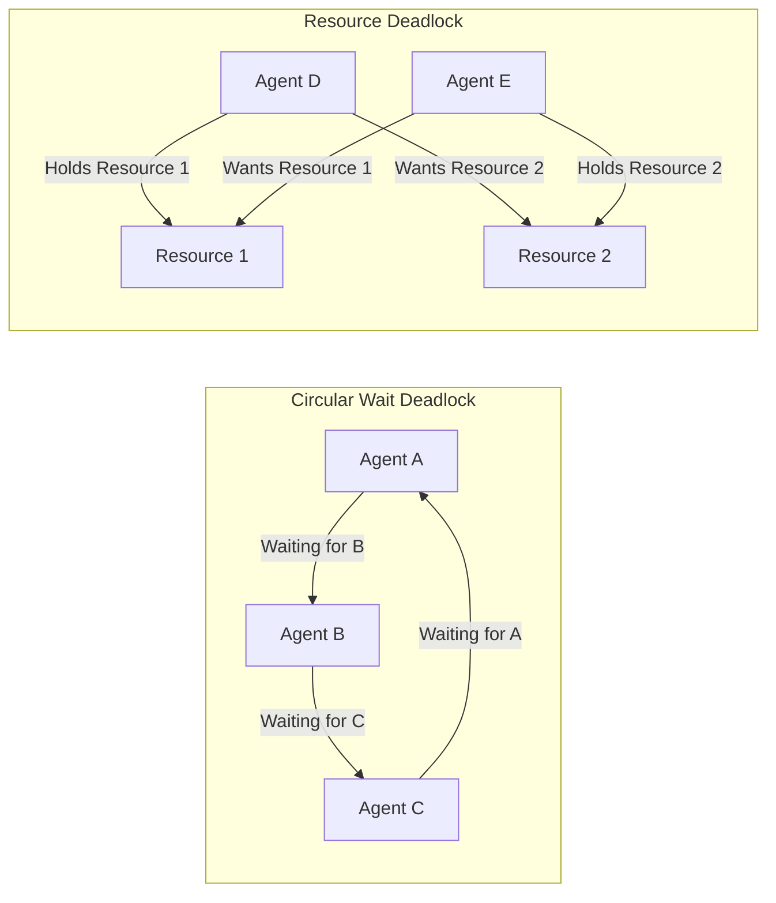

# Coordination Patterns

## Introduction

When multiple agents work together, someone — or something — needs to decide *who speaks when*. Without coordination, agents interrupt each other, duplicate work, or deadlock waiting for responses that never come. Coordination patterns provide the rules that govern turn-taking, decision-making, and resource access in multi-agent systems.

These patterns sit above protocols (which handle individual message exchanges) and below conversation management (which tracks ongoing dialogues). Coordination answers the question: *given multiple agents that could act right now, who acts next and why?*

### What We'll Cover
- Turn-taking patterns for sequential agent execution
- Token passing for controlled access to shared resources
- Voting mechanisms for group decisions
- Consensus building for collective agreement
- Deadlock detection and avoidance strategies

### Prerequisites
- Message passing and protocols (Lessons 02.01 and 02.02)
- Multi-agent architectures (Lesson 01.02) — especially hub-and-spoke vs. peer-to-peer
- Python async fundamentals (Unit 02)

---

## Turn-Taking

Turn-taking is the simplest coordination pattern: agents act in a defined order, one at a time. This prevents conflicts and makes the system predictable. Every major framework implements some form of turn-taking.

### Round-Robin Turns

```python
import asyncio
from dataclasses import dataclass, field
from typing import Any


@dataclass
class AgentTurn:
    """Record of an agent's turn."""
    agent_id: str
    action: str
    result: Any
    turn_number: int


class RoundRobinCoordinator:
    """Coordinates agents in strict round-robin order."""
    
    def __init__(self, agent_ids: list[str]):
        self._agents = agent_ids
        self._current_index = 0
        self._turn_count = 0
        self._history: list[AgentTurn] = []
    
    @property
    def current_agent(self) -> str:
        return self._agents[self._current_index]
    
    def advance(self) -> str:
        """Move to the next agent and return their ID."""
        self._current_index = (
            (self._current_index + 1) % len(self._agents)
        )
        return self.current_agent
    
    async def execute_round(
        self, handlers: dict[str, Any], task: str
    ) -> list[AgentTurn]:
        """Execute one full round where every agent takes a turn."""
        round_results = []
        
        for _ in range(len(self._agents)):
            agent_id = self.current_agent
            self._turn_count += 1
            
            handler = handlers.get(agent_id)
            if handler:
                result = await handler(task, self._history)
                turn = AgentTurn(
                    agent_id=agent_id,
                    action="process",
                    result=result,
                    turn_number=self._turn_count
                )
                self._history.append(turn)
                round_results.append(turn)
                print(f"  Turn {self._turn_count}: {agent_id} → {result}")
            
            self.advance()
        
        return round_results


# Demo
async def researcher(task: str, history: list) -> str:
    return f"Found 3 sources about '{task}'"

async def analyst(task: str, history: list) -> str:
    prior = history[-1].result if history else "nothing"
    return f"Analyzed: {prior}"

async def writer(task: str, history: list) -> str:
    prior = history[-1].result if history else "nothing"
    return f"Wrote summary of: {prior}"


async def main():
    coordinator = RoundRobinCoordinator(
        ["researcher", "analyst", "writer"]
    )
    
    handlers = {
        "researcher": researcher,
        "analyst": analyst,
        "writer": writer
    }
    
    print("Round 1:")
    await coordinator.execute_round(handlers, "AI trends 2025")
    print("\nRound 2:")
    await coordinator.execute_round(handlers, "AI trends 2025")

asyncio.run(main())
```

**Output:**
```
Round 1:
  Turn 1: researcher → Found 3 sources about 'AI trends 2025'
  Turn 2: analyst → Analyzed: Found 3 sources about 'AI trends 2025'
  Turn 3: writer → Wrote summary of: Analyzed: Found 3 sources about 'AI trends 2025'

Round 2:
  Turn 4: researcher → Found 3 sources about 'AI trends 2025'
  Turn 5: analyst → Analyzed: Found 3 sources about 'AI trends 2025'
  Turn 6: writer → Wrote summary of: Analyzed: Found 3 sources about 'AI trends 2025'
```

### AutoGen's RoundRobinGroupChat

AutoGen 0.4+ provides `RoundRobinGroupChat` as a built-in team type that implements this exact pattern:

```python
from autogen_agentchat.agents import AssistantAgent
from autogen_agentchat.teams import RoundRobinGroupChat
from autogen_agentchat.conditions import MaxMessageTermination

# Create agents
researcher = AssistantAgent(
    name="researcher",
    model_client=model_client,
    system_message="You research topics thoroughly."
)
writer = AssistantAgent(
    name="writer",
    model_client=model_client,
    system_message="You write clear summaries."
)

# Round-robin coordination is built-in
team = RoundRobinGroupChat(
    participants=[researcher, writer],
    termination_condition=MaxMessageTermination(max_messages=4)
)

result = await team.run(task="Analyze AI trends for 2025")
```

> **Note:** AutoGen also provides `SelectorGroupChat` where an LLM decides which agent speaks next (dynamic turn-taking), and `Swarm` where agents use handoffs to transfer control (agent-directed turn-taking).

### Dynamic Turn Selection

Sometimes strict round-robin is too rigid. A more flexible approach lets a coordinator choose the next agent based on the current state.

```python
import asyncio
from dataclasses import dataclass
from typing import Any


@dataclass
class AgentCapability:
    agent_id: str
    skills: list[str]
    current_load: int = 0  # Number of pending tasks


class DynamicCoordinator:
    """Selects the next agent based on task requirements and load."""
    
    def __init__(self):
        self._agents: dict[str, AgentCapability] = {}
    
    def register(self, agent_id: str, skills: list[str]):
        self._agents[agent_id] = AgentCapability(
            agent_id=agent_id, skills=skills
        )
    
    def select_next(self, required_skill: str) -> str | None:
        """Select the best agent for a skill, preferring lower load."""
        candidates = [
            agent for agent in self._agents.values()
            if required_skill in agent.skills
        ]
        
        if not candidates:
            return None
        
        # Pick the agent with the lowest current load
        best = min(candidates, key=lambda a: a.current_load)
        best.current_load += 1
        return best.agent_id
    
    def release(self, agent_id: str):
        """Mark an agent as available after completing work."""
        if agent_id in self._agents:
            self._agents[agent_id].current_load = max(
                0, self._agents[agent_id].current_load - 1
            )


# Demo
coordinator = DynamicCoordinator()
coordinator.register("researcher-1", ["research", "analysis"])
coordinator.register("researcher-2", ["research", "summarize"])
coordinator.register("writer-1", ["writing", "summarize"])

tasks = [
    ("research", "Find AI papers"),
    ("research", "Find market data"),
    ("writing", "Write report"),
    ("summarize", "Create executive summary"),
    ("research", "Find competitor info"),
]

print("Dynamic task assignment:\n")
for skill, task in tasks:
    agent = coordinator.select_next(skill)
    if agent:
        print(f"  {task:30s} → {agent} (skill: {skill})")
    else:
        print(f"  {task:30s} → No agent available for '{skill}'")
```

**Output:**
```
Dynamic task assignment:

  Find AI papers                 → researcher-1 (skill: research)
  Find market data               → researcher-2 (skill: research)
  Write report                   → writer-1 (skill: writing)
  Create executive summary       → researcher-2 (skill: summarize)
  Find competitor info           → researcher-1 (skill: research)
```

---

## Token Passing

Token passing is a coordination pattern where a "token" (permission to act) is passed between agents. Only the agent holding the token can perform certain actions, preventing concurrent access conflicts.

### Mutex Token for Shared Resources

```python
import asyncio
from dataclasses import dataclass, field
from datetime import datetime


@dataclass
class Token:
    """Permission token for accessing a shared resource."""
    resource_id: str
    holder: str | None = None
    acquired_at: str = ""
    max_hold_time: float = 10.0  # Force release after this many seconds


class TokenManager:
    """Manages tokens for shared resource access."""
    
    def __init__(self):
        self._tokens: dict[str, Token] = {}
        self._waiters: dict[str, asyncio.Queue] = {}
    
    def create_token(
        self, resource_id: str, max_hold_time: float = 10.0
    ):
        """Create a new token for a shared resource."""
        self._tokens[resource_id] = Token(
            resource_id=resource_id,
            max_hold_time=max_hold_time
        )
        self._waiters[resource_id] = asyncio.Queue()
    
    async def acquire(
        self, resource_id: str, agent_id: str, timeout: float = 5.0
    ) -> bool:
        """Try to acquire the token for a resource."""
        token = self._tokens.get(resource_id)
        if not token:
            return False
        
        if token.holder is None:
            token.holder = agent_id
            token.acquired_at = datetime.now().isoformat()
            print(f"  [Token] {agent_id} acquired '{resource_id}'")
            return True
        
        if token.holder == agent_id:
            return True  # Already owns it
        
        # Wait for token to become available
        print(f"  [Token] {agent_id} waiting for '{resource_id}' "
              f"(held by {token.holder})")
        
        waiter: asyncio.Future = asyncio.get_event_loop().create_future()
        await self._waiters[resource_id].put((agent_id, waiter))
        
        try:
            await asyncio.wait_for(waiter, timeout=timeout)
            return True
        except asyncio.TimeoutError:
            print(f"  [Token] {agent_id} timed out waiting for "
                  f"'{resource_id}'")
            return False
    
    async def release(self, resource_id: str, agent_id: str):
        """Release the token and pass to next waiter."""
        token = self._tokens.get(resource_id)
        if not token or token.holder != agent_id:
            return
        
        print(f"  [Token] {agent_id} released '{resource_id}'")
        
        # Pass token to next waiter
        queue = self._waiters.get(resource_id)
        if queue and not queue.empty():
            next_agent, future = await queue.get()
            token.holder = next_agent
            token.acquired_at = datetime.now().isoformat()
            print(f"  [Token] {next_agent} acquired '{resource_id}' "
                  f"(from queue)")
            if not future.done():
                future.set_result(True)
        else:
            token.holder = None


# Demo
async def agent_work(
    manager: TokenManager, agent_id: str, resource: str
):
    """Simulate an agent acquiring a token, working, then releasing."""
    acquired = await manager.acquire(resource, agent_id, timeout=5.0)
    if acquired:
        await asyncio.sleep(0.2)  # Simulate work
        print(f"  [{agent_id}] Working with '{resource}'...")
        await asyncio.sleep(0.1)
        await manager.release(resource, agent_id)


async def main():
    manager = TokenManager()
    manager.create_token("database", max_hold_time=5.0)
    
    print("Three agents competing for database access:\n")
    
    # All three try to acquire the same token concurrently
    await asyncio.gather(
        agent_work(manager, "agent-A", "database"),
        agent_work(manager, "agent-B", "database"),
        agent_work(manager, "agent-C", "database"),
    )

asyncio.run(main())
```

**Output:**
```
Three agents competing for database access:

  [Token] agent-A acquired 'database'
  [Token] agent-B waiting for 'database' (held by agent-A)
  [Token] agent-C waiting for 'database' (held by agent-A)
  [agent-A] Working with 'database'...
  [Token] agent-A released 'database'
  [Token] agent-B acquired 'database' (from queue)
  [agent-B] Working with 'database'...
  [Token] agent-B released 'database'
  [Token] agent-C acquired 'database' (from queue)
  [agent-C] Working with 'database'...
  [Token] agent-C released 'database'
```

> **🤖 AI Context:** Token passing is especially relevant when agents share external resources like API rate limits (only one agent can call the API at a time), databases (exclusive write access), or output channels (only one agent should write the final response).

---

## Voting Mechanisms

When a group of agents needs to make a collective decision, voting provides a structured way to aggregate individual opinions. This is common in review workflows, quality assessment, and selection tasks.

### Majority Vote Implementation

```python
import asyncio
from collections import Counter
from dataclasses import dataclass
from enum import Enum


class Vote(Enum):
    APPROVE = "approve"
    REJECT = "reject"
    ABSTAIN = "abstain"


@dataclass
class VoteResult:
    """Result of a voting round."""
    question: str
    votes: dict[str, Vote]
    decision: Vote
    margin: float  # Percentage of majority
    quorum_met: bool


class VotingCoordinator:
    """Coordinates voting among agents."""
    
    def __init__(
        self,
        agents: list[str],
        quorum: float = 0.5,       # Minimum participation
        threshold: float = 0.5     # Majority threshold
    ):
        self._agents = agents
        self._quorum = quorum
        self._threshold = threshold
    
    async def call_vote(
        self,
        question: str,
        voter_functions: dict[str, Any],
        timeout: float = 10.0
    ) -> VoteResult:
        """Run a vote across all agents."""
        print(f"\n📊 Vote: '{question}'")
        print(f"   Voters: {', '.join(self._agents)}")
        print(f"   Quorum: {self._quorum:.0%} | "
              f"Threshold: {self._threshold:.0%}\n")
        
        votes: dict[str, Vote] = {}
        
        # Collect votes
        for agent_id in self._agents:
            voter = voter_functions.get(agent_id)
            if voter:
                try:
                    vote = await asyncio.wait_for(
                        voter(question), timeout=timeout
                    )
                    votes[agent_id] = vote
                    emoji = {"approve": "✅", "reject": "❌", "abstain": "⬜"}
                    print(f"   {agent_id}: {emoji.get(vote.value, '?')} "
                          f"{vote.value}")
                except asyncio.TimeoutError:
                    votes[agent_id] = Vote.ABSTAIN
                    print(f"   {agent_id}: ⬜ abstain (timeout)")
        
        # Count votes (excluding abstentions)
        active_votes = {
            k: v for k, v in votes.items() if v != Vote.ABSTAIN
        }
        
        # Check quorum
        participation = len(active_votes) / len(self._agents)
        quorum_met = participation >= self._quorum
        
        if not quorum_met:
            print(f"\n   ⚠️ Quorum not met "
                  f"({participation:.0%} < {self._quorum:.0%})")
            return VoteResult(
                question=question,
                votes=votes,
                decision=Vote.ABSTAIN,
                margin=0.0,
                quorum_met=False
            )
        
        # Determine result
        counts = Counter(v for v in active_votes.values())
        approve_count = counts.get(Vote.APPROVE, 0)
        total_active = len(active_votes)
        approve_ratio = approve_count / total_active if total_active else 0
        
        decision = Vote.APPROVE if approve_ratio >= self._threshold else Vote.REJECT
        
        print(f"\n   Result: {decision.value.upper()} "
              f"({approve_ratio:.0%} approved, "
              f"threshold: {self._threshold:.0%})")
        
        return VoteResult(
            question=question,
            votes=votes,
            decision=decision,
            margin=approve_ratio,
            quorum_met=True
        )


# Demo: three reviewers vote on a document
async def optimistic_reviewer(question: str) -> Vote:
    await asyncio.sleep(0.05)
    return Vote.APPROVE

async def strict_reviewer(question: str) -> Vote:
    await asyncio.sleep(0.05)
    return Vote.REJECT

async def balanced_reviewer(question: str) -> Vote:
    await asyncio.sleep(0.05)
    return Vote.APPROVE


async def main():
    coordinator = VotingCoordinator(
        agents=["reviewer-1", "reviewer-2", "reviewer-3"],
        quorum=0.66,
        threshold=0.5
    )
    
    voters = {
        "reviewer-1": optimistic_reviewer,
        "reviewer-2": strict_reviewer,
        "reviewer-3": balanced_reviewer,
    }
    
    result = await coordinator.call_vote(
        "Should we publish the Q3 report draft?",
        voters
    )

asyncio.run(main())
```

**Output:**
```
📊 Vote: 'Should we publish the Q3 report draft?'
   Voters: reviewer-1, reviewer-2, reviewer-3
   Quorum: 66% | Threshold: 50%

   reviewer-1: ✅ approve
   reviewer-2: ❌ reject
   reviewer-3: ✅ approve

   Result: APPROVE (67% approved, threshold: 50%)
```

### Voting Strategies Comparison

| Strategy | Decision Rule | Best For | Risk |
|----------|--------------|----------|------|
| **Simple majority** | >50% approve | Fast decisions, non-critical | Slim margins on important decisions |
| **Supermajority** | ≥67% approve | Critical decisions | May fail to reach consensus |
| **Unanimous** | 100% approve | Safety-critical systems | Any single agent can block |
| **Weighted** | Votes scaled by expertise | Domain-specific decisions | Complex weight assignment |
| **Ranked choice** | Eliminate lowest, redistribute | Multiple options | More complex to implement |

---

## Consensus Building

Consensus goes beyond voting. Instead of a binary approve/reject, consensus-building agents iteratively refine their positions until they converge on a shared answer. This produces higher-quality outputs than a single agent or simple majority vote.

### Iterative Refinement Pattern

```python
import asyncio
from dataclasses import dataclass


@dataclass
class Position:
    """An agent's current position on a topic."""
    agent_id: str
    value: float       # Numeric position (e.g., estimated cost)
    confidence: float  # How confident (0.0 to 1.0)
    reasoning: str


class ConsensusBuilder:
    """Builds consensus through iterative refinement rounds."""
    
    def __init__(
        self,
        agents: list[str],
        convergence_threshold: float = 0.1,  # Max spread to declare consensus
        max_rounds: int = 10
    ):
        self._agents = agents
        self._convergence_threshold = convergence_threshold
        self._max_rounds = max_rounds
    
    def _check_convergence(self, positions: list[Position]) -> bool:
        """Check if positions have converged."""
        values = [p.value for p in positions]
        spread = max(values) - min(values)
        avg = sum(values) / len(values)
        relative_spread = spread / avg if avg != 0 else spread
        return relative_spread <= self._convergence_threshold
    
    async def build_consensus(
        self,
        question: str,
        update_functions: dict[str, Any]
    ) -> dict:
        """Run iterative rounds until consensus or max rounds."""
        positions: dict[str, Position] = {}
        
        print(f"Building consensus: '{question}'")
        print(f"Convergence threshold: "
              f"±{self._convergence_threshold:.0%}\n")
        
        for round_num in range(1, self._max_rounds + 1):
            print(f"--- Round {round_num} ---")
            
            # Each agent updates their position
            all_positions = list(positions.values())
            
            for agent_id in self._agents:
                updater = update_functions.get(agent_id)
                if updater:
                    new_position = await updater(
                        question, all_positions, round_num
                    )
                    positions[agent_id] = new_position
                    print(f"  {agent_id}: value={new_position.value:.1f} "
                          f"(confidence: {new_position.confidence:.0%})")
            
            # Check convergence
            current_positions = list(positions.values())
            values = [p.value for p in current_positions]
            spread = max(values) - min(values)
            
            if self._check_convergence(current_positions):
                avg = sum(values) / len(values)
                print(f"\n✅ Consensus reached in round {round_num}!")
                print(f"   Agreed value: {avg:.1f} "
                      f"(spread: {spread:.2f})")
                return {
                    "consensus": True,
                    "value": avg,
                    "rounds": round_num,
                    "positions": positions
                }
            else:
                print(f"  Spread: {spread:.2f} — not converged yet\n")
        
        avg = sum(p.value for p in positions.values()) / len(positions)
        print(f"\n⚠️ Max rounds reached without consensus")
        print(f"   Best estimate: {avg:.1f}")
        return {
            "consensus": False,
            "value": avg,
            "rounds": self._max_rounds,
            "positions": positions
        }


# Demo: three agents estimating project cost
async def conservative_estimator(
    question: str, others: list[Position], round_num: int
) -> Position:
    """Starts high, gradually adjusts toward group average."""
    if round_num == 1:
        value = 150.0
    else:
        avg = sum(p.value for p in others) / len(others) if others else 150
        value = 0.7 * 150.0 + 0.3 * avg  # Anchored to initial estimate
    return Position("conservative", value, min(0.3 + round_num * 0.15, 0.95),
                    f"Round {round_num} estimate")


async def optimistic_estimator(
    question: str, others: list[Position], round_num: int
) -> Position:
    """Starts low, gradually adjusts toward group average."""
    if round_num == 1:
        value = 80.0
    else:
        avg = sum(p.value for p in others) / len(others) if others else 80
        value = 0.6 * 80.0 + 0.4 * avg
    return Position("optimistic", value, min(0.4 + round_num * 0.12, 0.90),
                    f"Round {round_num} estimate")


async def pragmatic_estimator(
    question: str, others: list[Position], round_num: int
) -> Position:
    """Starts moderate, weighted average with others."""
    if round_num == 1:
        value = 110.0
    else:
        avg = sum(p.value for p in others) / len(others) if others else 110
        value = 0.5 * 110.0 + 0.5 * avg
    return Position("pragmatic", value, min(0.5 + round_num * 0.10, 0.95),
                    f"Round {round_num} estimate")


async def main():
    builder = ConsensusBuilder(
        agents=["conservative", "optimistic", "pragmatic"],
        convergence_threshold=0.1,
        max_rounds=10
    )
    
    result = await builder.build_consensus(
        "Estimate project cost (in thousands)",
        {
            "conservative": conservative_estimator,
            "optimistic": optimistic_estimator,
            "pragmatic": pragmatic_estimator
        }
    )

asyncio.run(main())
```

**Output:**
```
Building consensus: 'Estimate project cost (in thousands)'
Convergence threshold: ±10%

--- Round 1 ---
  conservative: value=150.0 (confidence: 45%)
  optimistic: value=80.0 (confidence: 52%)
  pragmatic: value=110.0 (confidence: 60%)
  Spread: 70.00 — not converged yet

--- Round 2 ---
  conservative: value=139.0 (confidence: 60%)
  optimistic: value=93.3 (confidence: 64%)
  pragmatic: value=111.7 (confidence: 70%)
  Spread: 45.67 — not converged yet

--- Round 3 ---
  conservative: value=132.4 (confidence: 75%)
  optimistic: value=100.9 (confidence: 76%)
  pragmatic: value=112.5 (confidence: 80%)
  Spread: 31.52 — not converged yet

--- Round 4 ---
  conservative: value=127.5 (confidence: 90%)
  optimistic: value=106.1 (confidence: 88%)
  pragmatic: value=112.5 (confidence: 90%)
  Spread: 21.35 — not converged yet

--- Round 5 ---
  conservative: value=124.6 (confidence: 95%)
  optimistic: value=108.2 (confidence: 90%)
  pragmatic: value=112.7 (confidence: 95%)
  Spread: 16.37 — not converged yet

--- Round 6 ---
  conservative: value=122.5 (confidence: 95%)
  optimistic: value=110.1 (confidence: 90%)
  pragmatic: value=112.7 (confidence: 95%)
  Spread: 12.37 — not converged yet

--- Round 7 ---
  conservative: value=120.9 (confidence: 95%)
  optimistic: value=111.1 (confidence: 90%)
  pragmatic: value=112.7 (confidence: 95%)

✅ Consensus reached in round 7!
   Agreed value: 114.9 (spread: 9.82)
```

> **🤖 AI Context:** In LLM-based multi-agent systems, consensus building often works by having agents share their reasoning (not just positions). The CrewAI `context` parameter lets downstream tasks see upstream reasoning. In AutoGen, agents in a `SelectorGroupChat` can see all previous messages, allowing them to converge naturally through conversation.

---

## Deadlock Avoidance

Deadlock occurs when two or more agents are each waiting for the other to act, creating a circular dependency that freezes the system. In multi-agent systems, deadlocks are surprisingly easy to create and difficult to debug.

### Common Deadlock Scenarios



### Deadlock Detection

```python
import asyncio
from dataclasses import dataclass, field


@dataclass
class WaitGraph:
    """Tracks who is waiting for whom to detect circular waits."""
    # Key: agent waiting, Value: set of agents they're waiting for
    edges: dict[str, set[str]] = field(default_factory=dict)
    
    def add_wait(self, waiter: str, waited_for: str):
        """Record that 'waiter' is waiting for 'waited_for'."""
        if waiter not in self.edges:
            self.edges[waiter] = set()
        self.edges[waiter].add(waited_for)
    
    def remove_wait(self, waiter: str, waited_for: str = ""):
        """Remove a wait dependency."""
        if waited_for:
            self.edges.get(waiter, set()).discard(waited_for)
        else:
            self.edges.pop(waiter, None)
    
    def detect_cycle(self) -> list[str] | None:
        """Find a circular wait (deadlock) using DFS."""
        visited: set[str] = set()
        path: list[str] = []
        in_path: set[str] = set()
        
        def dfs(node: str) -> list[str] | None:
            if node in in_path:
                # Found a cycle — extract it
                cycle_start = path.index(node)
                return path[cycle_start:] + [node]
            
            if node in visited:
                return None
            
            visited.add(node)
            in_path.add(node)
            path.append(node)
            
            for neighbor in self.edges.get(node, set()):
                cycle = dfs(neighbor)
                if cycle:
                    return cycle
            
            path.pop()
            in_path.remove(node)
            return None
        
        for node in self.edges:
            cycle = dfs(node)
            if cycle:
                return cycle
        
        return None


# Demo: detect deadlock
graph = WaitGraph()

# Scenario 1: No deadlock
print("Scenario 1: Linear dependencies")
graph.add_wait("agent-A", "agent-B")
graph.add_wait("agent-B", "agent-C")
cycle = graph.detect_cycle()
print(f"  A → B → C")
print(f"  Deadlock: {cycle}\n")

# Reset
graph.edges.clear()

# Scenario 2: Deadlock!
print("Scenario 2: Circular dependency")
graph.add_wait("agent-A", "agent-B")
graph.add_wait("agent-B", "agent-C")
graph.add_wait("agent-C", "agent-A")
cycle = graph.detect_cycle()
print(f"  A → B → C → A")
print(f"  Deadlock detected: {' → '.join(cycle)}")
```

**Output:**
```
Scenario 1: Linear dependencies
  A → B → C
  Deadlock: None

Scenario 2: Circular dependency
  A → B → C → A
  Deadlock detected: agent-A → agent-B → agent-C → agent-A
```

### Prevention Strategies

```python
import asyncio
from dataclasses import dataclass, field


class DeadlockPrevention:
    """Strategies to prevent deadlocks before they occur."""
    
    def __init__(self):
        self._resource_order: dict[str, int] = {}
        self._held_resources: dict[str, set[str]] = {}
        self._wait_graph = WaitGraph()
    
    def register_resource_order(self, resources: list[str]):
        """Define a global ordering for resource acquisition.
        
        Agents must acquire resources in this order,
        preventing circular wait.
        """
        for i, resource in enumerate(resources):
            self._resource_order[resource] = i
        print(f"Resource order: {' < '.join(resources)}")
    
    def can_acquire(
        self, agent_id: str, resource: str
    ) -> tuple[bool, str]:
        """Check if acquiring this resource would violate ordering."""
        held = self._held_resources.get(agent_id, set())
        
        if not held:
            return True, "No resources held — free to acquire"
        
        resource_rank = self._resource_order.get(resource, -1)
        max_held_rank = max(
            self._resource_order.get(r, -1) for r in held
        )
        
        if resource_rank <= max_held_rank:
            return False, (
                f"Cannot acquire '{resource}' (rank {resource_rank}) "
                f"while holding higher-ranked resources"
            )
        
        return True, "Order preserved"
    
    def acquire(self, agent_id: str, resource: str) -> bool:
        """Attempt to acquire a resource with ordering check."""
        allowed, reason = self.can_acquire(agent_id, resource)
        
        if not allowed:
            print(f"  ❌ {agent_id} blocked: {reason}")
            return False
        
        if agent_id not in self._held_resources:
            self._held_resources[agent_id] = set()
        self._held_resources[agent_id].add(resource)
        print(f"  ✅ {agent_id} acquired '{resource}'")
        return True
    
    def release(self, agent_id: str, resource: str):
        """Release a resource."""
        self._held_resources.get(agent_id, set()).discard(resource)
        print(f"  🔓 {agent_id} released '{resource}'")


# Demo: prevention via resource ordering
prevention = DeadlockPrevention()
prevention.register_resource_order(["database", "cache", "api"])

print("\n--- Agent A: acquires in correct order ---")
prevention.acquire("agent-A", "database")
prevention.acquire("agent-A", "cache")
prevention.acquire("agent-A", "api")

print("\n--- Agent B: tries to acquire in wrong order ---")
prevention.acquire("agent-B", "api")       # Gets api first
prevention.acquire("agent-B", "database")  # Tries database — BLOCKED!
```

**Output:**
```
Resource order: database < cache < api

--- Agent A: acquires in correct order ---
  ✅ agent-A acquired 'database'
  ✅ agent-A acquired 'cache'
  ✅ agent-A acquired 'api'

--- Agent B: tries to acquire in wrong order ---
  ✅ agent-B acquired 'api'
  ❌ agent-B blocked: Cannot acquire 'database' (rank 0) while holding higher-ranked resources
```

### Deadlock Prevention Summary

| Strategy | How It Works | Trade-off |
|----------|-------------|-----------|
| **Resource ordering** | All agents acquire resources in the same global order | Limits flexibility |
| **Timeout-based** | Automatically release after max hold time | May interrupt valid long work |
| **Wait-die / Wound-wait** | Older agents preempt or restart younger ones | Requires age tracking |
| **Detect and recover** | Periodically scan for cycles, break one dependency | Brief deadlock periods |
| **Avoid shared resources** | Design agents to not share mutable state | Not always possible |

---

## Best Practices

| Practice | Why It Matters |
|----------|----------------|
| Start with round-robin, upgrade only when needed | Simplest coordination pattern, easy to debug |
| Use timeouts on all token acquisitions | Prevents permanent blocks if a token holder crashes |
| Implement deadlock detection as a background check | Catches issues before agents are stuck for too long |
| Log coordination events with agent IDs and timestamps | Essential for post-mortem debugging of coordination failures |
| Prefer dynamic selection over rigid turn orders for heterogeneous agents | Ensures the best-suited agent handles each task |
| Keep voting thresholds configurable | Different decisions warrant different levels of agreement |

---

## Common Pitfalls

| ❌ Mistake | ✅ Solution |
|-----------|-------------|
| Expecting agents to self-coordinate without rules | Always define explicit coordination patterns |
| Using a single global lock for all resources | Use fine-grained tokens per resource to maximize parallelism |
| Holding tokens during LLM API calls | LLM calls are slow — release tokens before calling, reacquire after |
| No timeout on consensus building | Set `max_rounds` to prevent infinite refinement loops |
| Ignoring quorum in voting | A 2-agent vote with 1 abstention is a single agent deciding |
| Circular delegation chains | Use a wait graph or resource ordering to prevent cycles |

---

## Hands-on Exercise

### Your Task

Build a multi-agent review system where three reviewer agents vote on whether a document should be published. The system should support weighted voting (senior reviewers have more influence) and require quorum.

### Requirements

1. Create a `WeightedVotingSystem` with configurable weights per agent
2. Three reviewers with weights: senior (weight 3), mid (weight 2), junior (weight 1)
3. Quorum requires at least 2 active voters (non-abstaining)
4. Threshold for approval: weighted votes ≥ 60% of total weight cast
5. Run three scenarios: unanimous approval, split vote, quorum failure

### Expected Result

```
Scenario 1: Unanimous
  senior: approve (weight 3) | mid: approve (weight: 2) | junior: approve (weight 1)
  Result: APPROVED (100% weighted approval)

Scenario 2: Senior disagrees
  senior: reject (weight 3) | mid: approve (weight 2) | junior: approve (weight 1)
  Result: REJECTED (50% weighted approval, needs 60%)

Scenario 3: Quorum failure
  senior: abstain | mid: abstain | junior: approve (weight 1)
  Result: NO DECISION (quorum not met: 1/3 < 2 required)
```

<details>
<summary>💡 Hints (click to expand)</summary>

- Calculate weighted approval: `sum(weight for approve votes) / sum(weight for all non-abstain votes)`
- Check quorum by counting non-abstaining voters, not total weight
- Handle the edge case where all voters abstain (avoid division by zero)

</details>

<details>
<summary>✅ Solution (click to expand)</summary>

```python
from enum import Enum
from dataclasses import dataclass


class Vote(Enum):
    APPROVE = "approve"
    REJECT = "reject"
    ABSTAIN = "abstain"


@dataclass
class WeightedVote:
    agent_id: str
    vote: Vote
    weight: int


class WeightedVotingSystem:
    def __init__(self, min_quorum: int = 2, threshold: float = 0.6):
        self.min_quorum = min_quorum
        self.threshold = threshold
    
    def tally(self, votes: list[WeightedVote]) -> dict:
        active = [v for v in votes if v.vote != Vote.ABSTAIN]
        
        if len(active) < self.min_quorum:
            return {
                "result": "NO DECISION",
                "reason": f"quorum not met: {len(active)}/{len(votes)} "
                          f"< {self.min_quorum} required",
                "approval_pct": 0.0
            }
        
        total_weight = sum(v.weight for v in active)
        approve_weight = sum(
            v.weight for v in active if v.vote == Vote.APPROVE
        )
        
        pct = approve_weight / total_weight if total_weight else 0
        passed = pct >= self.threshold
        
        return {
            "result": "APPROVED" if passed else "REJECTED",
            "reason": f"{pct:.0%} weighted approval"
                      + (f", needs {self.threshold:.0%}" if not passed else ""),
            "approval_pct": pct
        }


system = WeightedVotingSystem(min_quorum=2, threshold=0.6)

scenarios = [
    ("Unanimous", [
        WeightedVote("senior", Vote.APPROVE, 3),
        WeightedVote("mid", Vote.APPROVE, 2),
        WeightedVote("junior", Vote.APPROVE, 1),
    ]),
    ("Senior disagrees", [
        WeightedVote("senior", Vote.REJECT, 3),
        WeightedVote("mid", Vote.APPROVE, 2),
        WeightedVote("junior", Vote.APPROVE, 1),
    ]),
    ("Quorum failure", [
        WeightedVote("senior", Vote.ABSTAIN, 3),
        WeightedVote("mid", Vote.ABSTAIN, 2),
        WeightedVote("junior", Vote.APPROVE, 1),
    ]),
]

for name, votes in scenarios:
    result = system.tally(votes)
    vote_str = " | ".join(
        f"{v.agent_id}: {v.vote.value} (weight {v.weight})"
        for v in votes
    )
    print(f"\nScenario: {name}")
    print(f"  {vote_str}")
    print(f"  Result: {result['result']} ({result['reason']})")
```

</details>

### Bonus Challenges
- [ ] Add ranked-choice voting where agents rank multiple options
- [ ] Implement a debate round before voting where agents share reasoning
- [ ] Add veto power — certain agents can block approval regardless of vote count

---

## Summary

✅ **Turn-taking** is the simplest coordination — round-robin provides predictability, while dynamic selection matches agents to tasks by capability and load

✅ **Token passing** prevents resource conflicts — only the token holder can access a shared resource, with queue-based handoff ensuring fairness

✅ **Voting mechanisms** enable group decisions — majority vote, weighted vote, and quorum requirements balance speed against decision quality

✅ **Consensus building** produces better results than voting — iterative refinement converges on shared positions, ideal for estimation and quality review

✅ **Deadlock avoidance** is critical in any multi-agent system — resource ordering prevents circular waits, detection algorithms catch them early, and timeouts provide a safety net

**Next:** [Conversation Management](./04-conversation-management.md)

**Previous:** [Protocols](./02-protocols.md)

---

## Further Reading

- [AutoGen Team Types](https://microsoft.github.io/autogen/stable/user-guide/agentchat-user-guide/tutorial/teams.html) - RoundRobinGroupChat, SelectorGroupChat, Swarm
- [CrewAI Process Types](https://docs.crewai.com/concepts/processes) - Sequential and hierarchical coordination
- [Deadlock (Operating Systems)](https://en.wikipedia.org/wiki/Deadlock) - Classic deadlock theory and prevention
- [Consensus Algorithms](https://en.wikipedia.org/wiki/Consensus_(computer_science)) - Distributed consensus background

<!-- 
Sources Consulted:
- AutoGen teams: https://microsoft.github.io/autogen/stable/user-guide/agentchat-user-guide/tutorial/teams.html
- CrewAI processes: https://docs.crewai.com/concepts/processes
- CrewAI collaboration: https://docs.crewai.com/concepts/collaboration
- LangGraph graph API: https://docs.langchain.com/oss/python/langgraph/graph-api
-->
