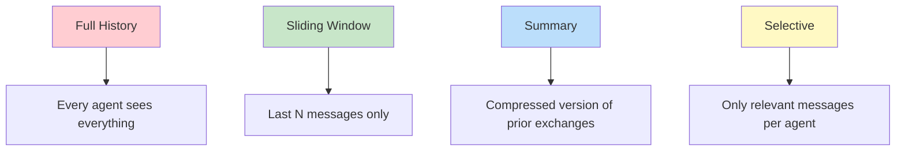
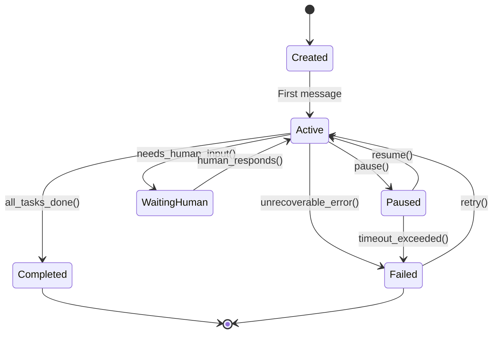

# Conversation Management

## Introduction

Individual messages are like single sentences. Conversations are the full dialogues. When multiple agents interact over time — discussing, delegating, reviewing, iterating — you need systems to track *which* conversation each message belongs to, *what* context each agent has, and *how* multi-party exchanges stay coherent.

Conversation management is what separates a collection of isolated agent calls from a genuine multi-agent collaboration. Without it, agents lose track of prior exchanges, repeat resolved discussions, and contradict decisions made earlier in the same workflow.

### What We'll Cover
- Tracking conversations across multiple message exchanges
- Managing threads for parallel workstreams
- Sharing context between agents effectively
- Maintaining conversation state through interruptions
- Handling multi-party conversations with three or more agents

### Prerequisites
- Message passing and message types (Lesson 02.01)
- Protocols and request-response (Lesson 02.02)
- LangGraph state concepts (understanding of `TypedDict` state)

---

## Conversation Tracking

A conversation is a sequence of related messages between agents. Tracking conversations means grouping messages by conversation, maintaining order, and enabling agents to reference earlier exchanges.

### Conversation Registry

```python
from dataclasses import dataclass, field
from datetime import datetime
from typing import Any
import uuid


@dataclass
class Message:
    sender: str
    content: str
    timestamp: str = field(
        default_factory=lambda: datetime.now().isoformat()
    )
    metadata: dict = field(default_factory=dict)


@dataclass
class Conversation:
    """A tracked conversation between agents."""
    conversation_id: str
    participants: list[str]
    messages: list[Message] = field(default_factory=list)
    created_at: str = field(
        default_factory=lambda: datetime.now().isoformat()
    )
    status: str = "active"  # active, paused, completed
    metadata: dict = field(default_factory=dict)
    
    @property
    def message_count(self) -> int:
        return len(self.messages)
    
    @property
    def last_message(self) -> Message | None:
        return self.messages[-1] if self.messages else None
    
    def add_message(self, sender: str, content: str, **metadata):
        """Add a message to the conversation."""
        msg = Message(sender=sender, content=content, metadata=metadata)
        self.messages.append(msg)
        return msg


class ConversationRegistry:
    """Central registry for tracking all active conversations."""
    
    def __init__(self):
        self._conversations: dict[str, Conversation] = {}
        self._agent_conversations: dict[str, set[str]] = {}
    
    def create(
        self, participants: list[str], **metadata
    ) -> Conversation:
        """Start a new conversation."""
        conv_id = str(uuid.uuid4())[:8]
        conv = Conversation(
            conversation_id=conv_id,
            participants=participants,
            metadata=metadata
        )
        self._conversations[conv_id] = conv
        
        for agent in participants:
            if agent not in self._agent_conversations:
                self._agent_conversations[agent] = set()
            self._agent_conversations[agent].add(conv_id)
        
        print(f"[Registry] Created conversation {conv_id} "
              f"with {participants}")
        return conv
    
    def get(self, conversation_id: str) -> Conversation | None:
        return self._conversations.get(conversation_id)
    
    def get_agent_conversations(
        self, agent_id: str, status: str = "active"
    ) -> list[Conversation]:
        """Get all conversations for a specific agent."""
        conv_ids = self._agent_conversations.get(agent_id, set())
        return [
            self._conversations[cid] for cid in conv_ids
            if self._conversations[cid].status == status
        ]
    
    def complete(self, conversation_id: str):
        """Mark a conversation as completed."""
        conv = self._conversations.get(conversation_id)
        if conv:
            conv.status = "completed"
            print(f"[Registry] Conversation {conversation_id} completed "
                  f"({conv.message_count} messages)")


# Demo
registry = ConversationRegistry()

# Start a research conversation
research_conv = registry.create(
    ["coordinator", "researcher"],
    topic="AI trends"
)
research_conv.add_message("coordinator", "Research AI market trends for 2025")
research_conv.add_message("researcher", "Found 5 key trends: agentic AI, ...")
research_conv.add_message("coordinator", "Focus on agentic AI specifically")
research_conv.add_message("researcher", "Deep analysis complete: ...")

# Start a separate writing conversation
write_conv = registry.create(
    ["coordinator", "writer"],
    topic="Report writing"
)
write_conv.add_message("coordinator", "Write a report on agentic AI trends")
write_conv.add_message("writer", "Draft complete — 2,500 words")

# Query conversations
print(f"\nCoordinator's active conversations: "
      f"{len(registry.get_agent_conversations('coordinator'))}")
print(f"Research conversation: {research_conv.message_count} messages")
print(f"Writing conversation: {write_conv.message_count} messages")

# Complete research
registry.complete(research_conv.conversation_id)
print(f"Coordinator's active conversations after completion: "
      f"{len(registry.get_agent_conversations('coordinator'))}")
```

**Output:**
```
[Registry] Created conversation a3f7c2e1 with ['coordinator', 'researcher']
[Registry] Created conversation b8d4e3f2 with ['coordinator', 'writer']

Coordinator's active conversations: 2
Research conversation: 4 messages
Writing conversation: 2 messages
[Registry] Conversation a3f7c2e1 completed (4 messages)
Coordinator's active conversations after completion: 1
```

---

## Thread Management

Threads allow parallel workstreams within a broader conversation. A coordinator might spawn multiple threads — one for research, one for analysis, one for writing — that run concurrently and merge their results.

### Thread Pool for Parallel Agent Work

```python
import asyncio
from dataclasses import dataclass, field
from typing import Any
import uuid


@dataclass
class Thread:
    """A parallel workstream within a conversation."""
    thread_id: str
    parent_conversation_id: str
    topic: str
    assigned_agent: str
    status: str = "pending"  # pending, running, completed, failed
    result: Any = None
    messages: list[dict] = field(default_factory=list)


class ThreadManager:
    """Manages parallel threads within a conversation."""
    
    def __init__(self, conversation_id: str):
        self.conversation_id = conversation_id
        self._threads: dict[str, Thread] = {}
    
    def spawn(self, topic: str, agent: str) -> Thread:
        """Create a new thread for parallel work."""
        thread_id = str(uuid.uuid4())[:8]
        thread = Thread(
            thread_id=thread_id,
            parent_conversation_id=self.conversation_id,
            topic=topic,
            assigned_agent=agent
        )
        self._threads[thread_id] = thread
        print(f"  [Thread {thread_id}] Spawned: '{topic}' → {agent}")
        return thread
    
    async def run_all(
        self, handlers: dict[str, Any]
    ) -> dict[str, Any]:
        """Run all pending threads concurrently."""
        tasks = []
        pending_threads = [
            t for t in self._threads.values()
            if t.status == "pending"
        ]
        
        for thread in pending_threads:
            thread.status = "running"
            handler = handlers.get(thread.assigned_agent)
            if handler:
                tasks.append(
                    self._run_thread(thread, handler)
                )
        
        if tasks:
            await asyncio.gather(*tasks)
        
        return {
            tid: t.result
            for tid, t in self._threads.items()
        }
    
    async def _run_thread(self, thread: Thread, handler):
        """Execute a single thread."""
        try:
            result = await handler(thread.topic)
            thread.result = result
            thread.status = "completed"
            print(f"  [Thread {thread.thread_id}] ✅ Completed: "
                  f"{str(result)[:60]}")
        except Exception as e:
            thread.status = "failed"
            thread.result = {"error": str(e)}
            print(f"  [Thread {thread.thread_id}] ❌ Failed: {e}")
    
    def merge_results(self) -> dict:
        """Combine results from all completed threads."""
        completed = {
            t.topic: t.result
            for t in self._threads.values()
            if t.status == "completed"
        }
        failed = [
            t.topic for t in self._threads.values()
            if t.status == "failed"
        ]
        return {"completed": completed, "failed": failed}


# Demo: parallel research threads
async def research_handler(topic: str) -> dict:
    await asyncio.sleep(0.1)
    return {"summary": f"Key findings on {topic}", "sources": 3}

async def analysis_handler(topic: str) -> dict:
    await asyncio.sleep(0.15)
    return {"insights": f"The {topic} shows growth", "confidence": 0.85}

async def data_handler(topic: str) -> dict:
    await asyncio.sleep(0.08)
    return {"datasets": [f"{topic}_2024.csv", f"{topic}_2025.csv"]}


async def main():
    print("Spawning parallel research threads:\n")
    
    manager = ThreadManager(conversation_id="conv-001")
    
    # Spawn three parallel threads
    manager.spawn("market trends", "researcher")
    manager.spawn("competitive analysis", "analyst")
    manager.spawn("historical data", "data_specialist")
    
    print("\nRunning all threads concurrently:\n")
    
    handlers = {
        "researcher": research_handler,
        "analyst": analysis_handler,
        "data_specialist": data_handler,
    }
    
    await manager.run_all(handlers)
    
    # Merge results
    merged = manager.merge_results()
    print(f"\nMerged results: {len(merged['completed'])} completed, "
          f"{len(merged['failed'])} failed")
    for topic, result in merged["completed"].items():
        print(f"  {topic}: {result}")

asyncio.run(main())
```

**Output:**
```
Spawning parallel research threads:

  [Thread a3f7c2e1] Spawned: 'market trends' → researcher
  [Thread b8d4e3f2] Spawned: 'competitive analysis' → analyst
  [Thread c9e5f4a3] Spawned: 'historical data' → data_specialist

Running all threads concurrently:

  [Thread c9e5f4a3] ✅ Completed: {'datasets': ['historical data_2024.csv', 'historical data_2
  [Thread a3f7c2e1] ✅ Completed: {'summary': 'Key findings on market trends', 'sources': 3}
  [Thread b8d4e3f2] ✅ Completed: {'insights': 'The competitive analysis shows growth', 'conf

Merged results: 3 completed, 0 failed
  market trends: {'summary': 'Key findings on market trends', 'sources': 3}
  competitive analysis: {'insights': 'The competitive analysis shows growth', 'confidence': 0.85}
  historical data: {'datasets': ['historical data_2024.csv', 'historical data_2025.csv']}
```

> **🤖 AI Context:** LangGraph implements threading through parallel edges — when a node has multiple outgoing edges, all targets run as part of the same "super-step." The `Send` command enables dynamic fan-out where the number of parallel branches isn't known until runtime.

---

## Context Sharing

Context sharing determines how much of the conversation history each agent sees. Sharing too much wastes tokens and confuses agents. Sharing too little causes agents to miss critical information and repeat work.

### Context Window Strategies



```python
from dataclasses import dataclass, field


@dataclass
class Message:
    sender: str
    content: str
    tags: list[str] = field(default_factory=list)


class ContextManager:
    """Controls what conversation context each agent receives."""
    
    def __init__(self, messages: list[Message]):
        self._messages = messages
    
    def full_history(self) -> list[Message]:
        """Return all messages — simple but expensive."""
        return list(self._messages)
    
    def sliding_window(self, window_size: int = 5) -> list[Message]:
        """Return only the last N messages."""
        return list(self._messages[-window_size:])
    
    def summarize(self, max_length: int = 200) -> str:
        """Create a compressed summary of the conversation."""
        if not self._messages:
            return "No conversation history."
        
        parts = []
        for msg in self._messages:
            snippet = msg.content[:50]
            parts.append(f"{msg.sender}: {snippet}")
        
        summary = " | ".join(parts)
        if len(summary) > max_length:
            summary = summary[:max_length] + "..."
        return summary
    
    def selective(
        self, agent_id: str, relevant_tags: list[str]
    ) -> list[Message]:
        """Return only messages relevant to this agent."""
        return [
            msg for msg in self._messages
            if msg.sender == agent_id 
            or any(tag in relevant_tags for tag in msg.tags)
        ]


# Demo
messages = [
    Message("coordinator", "Research AI trends", tags=["task", "research"]),
    Message("researcher", "Found 5 key trends", tags=["result", "research"]),
    Message("coordinator", "Analyze market size", tags=["task", "analysis"]),
    Message("analyst", "Market is $50B", tags=["result", "analysis"]),
    Message("coordinator", "Write final report", tags=["task", "writing"]),
    Message("researcher", "Additional source found", tags=["update", "research"]),
    Message("writer", "Draft complete", tags=["result", "writing"]),
    Message("coordinator", "Review needed", tags=["task", "review"]),
]

ctx = ContextManager(messages)

print("1. Full history:", len(ctx.full_history()), "messages")
print("2. Sliding window (3):", len(ctx.sliding_window(3)), "messages")
for msg in ctx.sliding_window(3):
    print(f"   {msg.sender}: {msg.content}")

print("\n3. Summary:")
print(f"   {ctx.summarize(150)}")

print("\n4. Selective (writer + writing/review tags):")
for msg in ctx.selective("writer", ["writing", "review"]):
    print(f"   {msg.sender}: {msg.content}")
```

**Output:**
```
1. Full history: 8 messages
2. Sliding window (3): 3 messages
   researcher: Additional source found
   writer: Draft complete
   coordinator: Review needed

3. Summary:
   coordinator: Research AI trends | researcher: Found 5 key trends | coordinator: Analyze market size | analyst: Market is $50B | coordinat...

4. Selective (writer + writing/review tags):
   coordinator: Write final report
   writer: Draft complete
   coordinator: Review needed
```

### Framework Context Sharing Approaches

| Framework | Context Mechanism | How It Works |
|-----------|------------------|--------------|
| **LangGraph** | Shared state + `add_messages` reducer | All messages accumulate in state; nodes read full state |
| **AutoGen 0.4+** | Team chat history | `RoundRobinGroupChat` shares all messages; direct messages are private |
| **CrewAI** | Task `context` parameter | `context=[research_task]` passes one task's output to another |
| **OpenAI Agents SDK** | `input_filter` on handoffs | Controls which messages transfer to the next agent |

### OpenAI Agents SDK Input Filters

The OpenAI Agents SDK provides the most explicit context control through `input_filter`:

```python
from agents import Agent, handoff
from agents.extensions.handoff_filters import remove_all_tools

# Filter: only pass the last message to the next agent
def last_message_only(messages):
    """Custom filter — only pass the most recent message."""
    return messages[-1:] if messages else []

# Filter: remove tool call messages (reduce noise)
billing_agent = Agent(
    name="billing_agent",
    instructions="You handle billing inquiries."
)

support_agent = Agent(
    name="support_agent",
    instructions="You handle general support.",
    handoffs=[
        handoff(
            agent=billing_agent,
            input_filter=remove_all_tools  # Clean history before handoff
        )
    ]
)
```

> **Note:** The `input_filter` receives the conversation history and returns a filtered version. Built-in filters like `remove_all_tools` strip tool call/result messages. You can write custom filters to pass summaries, recent messages only, or tagged messages.

### CrewAI Task Context Chaining

CrewAI shares context through task dependencies:

```python
from crewai import Agent, Task, Crew, Process

researcher = Agent(
    role="Researcher",
    goal="Find comprehensive data",
    backstory="Expert data researcher",
    allow_delegation=False
)

writer = Agent(
    role="Writer", 
    goal="Write clear reports",
    backstory="Technical writer",
    allow_delegation=False
)

# Task 1: Research
research_task = Task(
    description="Research AI market trends for 2025",
    agent=researcher,
    expected_output="Detailed market analysis"
)

# Task 2: Writing — receives research output as context
writing_task = Task(
    description="Write an executive summary",
    agent=writer,
    expected_output="One-page executive summary",
    context=[research_task]  # Writer sees researcher's output
)

crew = Crew(
    agents=[researcher, writer],
    tasks=[research_task, writing_task],
    process=Process.sequential
)
```

> **Important:** In CrewAI, the `context` parameter passes the *output* of completed tasks, not the full conversation. This is more efficient than sharing all messages but means the writer only sees the research result, not the researcher's intermediate reasoning.

---

## Conversation State

Conversations need to be paused, resumed, and recovered. Conversation state management handles persistence — snapshotting the current state so it survives crashes, restarts, and long waits (e.g., for human input).

### State Machine for Conversation Lifecycle



```python
from dataclasses import dataclass, field
from enum import Enum
from datetime import datetime
from typing import Any
import json


class ConversationState(Enum):
    CREATED = "created"
    ACTIVE = "active"
    PAUSED = "paused"
    WAITING_HUMAN = "waiting_human"
    COMPLETED = "completed"
    FAILED = "failed"


@dataclass
class StateSnapshot:
    """A serializable snapshot of conversation state."""
    conversation_id: str
    state: ConversationState
    messages: list[dict]
    agent_states: dict[str, Any]
    current_task: str
    timestamp: str = field(
        default_factory=lambda: datetime.now().isoformat()
    )
    
    def to_dict(self) -> dict:
        """Serialize for storage."""
        return {
            "conversation_id": self.conversation_id,
            "state": self.state.value,
            "messages": self.messages,
            "agent_states": self.agent_states,
            "current_task": self.current_task,
            "timestamp": self.timestamp
        }
    
    @classmethod
    def from_dict(cls, data: dict) -> "StateSnapshot":
        """Deserialize from storage."""
        return cls(
            conversation_id=data["conversation_id"],
            state=ConversationState(data["state"]),
            messages=data["messages"],
            agent_states=data["agent_states"],
            current_task=data["current_task"],
            timestamp=data["timestamp"]
        )


class StatefulConversation:
    """Conversation with full state management and persistence."""
    
    def __init__(self, conversation_id: str):
        self.conversation_id = conversation_id
        self._state = ConversationState.CREATED
        self._messages: list[dict] = []
        self._agent_states: dict[str, Any] = {}
        self._current_task = ""
        self._snapshots: list[StateSnapshot] = []
    
    @property
    def state(self) -> ConversationState:
        return self._state
    
    def _transition(self, new_state: ConversationState):
        """Transition to a new state with validation."""
        valid_transitions = {
            ConversationState.CREATED: {ConversationState.ACTIVE},
            ConversationState.ACTIVE: {
                ConversationState.PAUSED,
                ConversationState.WAITING_HUMAN,
                ConversationState.COMPLETED,
                ConversationState.FAILED
            },
            ConversationState.PAUSED: {
                ConversationState.ACTIVE,
                ConversationState.FAILED
            },
            ConversationState.WAITING_HUMAN: {
                ConversationState.ACTIVE
            },
            ConversationState.FAILED: {
                ConversationState.ACTIVE  # retry
            },
        }
        
        allowed = valid_transitions.get(self._state, set())
        if new_state not in allowed:
            raise ValueError(
                f"Cannot transition from {self._state.value} "
                f"to {new_state.value}"
            )
        
        old = self._state.value
        self._state = new_state
        print(f"  [{self.conversation_id}] {old} → {new_state.value}")
    
    def add_message(self, sender: str, content: str):
        """Add a message and auto-transition to active if needed."""
        if self._state == ConversationState.CREATED:
            self._transition(ConversationState.ACTIVE)
        
        self._messages.append({
            "sender": sender,
            "content": content,
            "timestamp": datetime.now().isoformat()
        })
    
    def save_snapshot(self) -> StateSnapshot:
        """Create a checkpoint of current state."""
        snapshot = StateSnapshot(
            conversation_id=self.conversation_id,
            state=self._state,
            messages=list(self._messages),
            agent_states=dict(self._agent_states),
            current_task=self._current_task
        )
        self._snapshots.append(snapshot)
        print(f"  [Snapshot] Saved at state '{self._state.value}' "
              f"({len(self._messages)} messages)")
        return snapshot
    
    def restore_snapshot(self, snapshot: StateSnapshot):
        """Restore from a checkpoint."""
        self._state = snapshot.state
        self._messages = list(snapshot.messages)
        self._agent_states = dict(snapshot.agent_states)
        self._current_task = snapshot.current_task
        print(f"  [Restore] Restored to state '{self._state.value}' "
              f"({len(self._messages)} messages)")
    
    def pause(self):
        self._transition(ConversationState.PAUSED)
    
    def resume(self):
        self._transition(ConversationState.ACTIVE)
    
    def complete(self):
        self._transition(ConversationState.COMPLETED)
    
    def fail(self):
        self._transition(ConversationState.FAILED)
    
    def request_human_input(self, prompt: str):
        self._current_task = f"Awaiting human: {prompt}"
        self._transition(ConversationState.WAITING_HUMAN)


# Demo: conversation lifecycle
conv = StatefulConversation("conv-001")
print("Conversation lifecycle demo:\n")

conv.add_message("coordinator", "Start research on AI trends")
conv.add_message("researcher", "Beginning research...")

# Save checkpoint before risky operation
snapshot = conv.save_snapshot()

conv.add_message("researcher", "Found preliminary results")
conv.request_human_input("Should we focus on agentic AI?")

print(f"\n  Current state: {conv.state.value}")

# Simulate human response
conv.resume()
conv.add_message("human", "Yes, focus on agentic AI")
conv.add_message("researcher", "Deep analysis complete")
conv.complete()
print(f"\n  Final state: {conv.state.value}")
```

**Output:**
```
Conversation lifecycle demo:

  [conv-001] created → active
  [Snapshot] Saved at state 'active' (2 messages)
  [conv-001] active → waiting_human

  Current state: waiting_human
  [conv-001] waiting_human → active
  [conv-001] active → completed

  Final state: completed
```

> **🤖 AI Context:** LangGraph provides built-in state persistence through checkpointers (`MemorySaver`, `SqliteSaver`, `PostgresSaver`). Every state transition is automatically saved, enabling exact replay and recovery. The `interrupt()` function provides native support for the WAITING_HUMAN state.

---

## Multi-Party Conversations

When three or more agents participate in a conversation, new challenges emerge: who should speak next, how to prevent crosstalk, and how to maintain coherent discussion despite multiple parallel perspectives.

### Multi-Party Coordinator

```python
import asyncio
from dataclasses import dataclass, field
from typing import Any
import uuid


@dataclass
class MultiPartyMessage:
    """Message in a multi-party conversation."""
    sender: str
    content: str
    addressed_to: list[str]  # Empty = addressed to all
    message_id: str = field(
        default_factory=lambda: str(uuid.uuid4())[:8]
    )


class MultiPartyConversation:
    """Manages conversations with 3+ participants."""
    
    def __init__(self, participants: list[str]):
        self._participants = participants
        self._messages: list[MultiPartyMessage] = []
        self._floor_holder: str | None = None  # Who currently has the floor
        self._floor_queue: list[str] = []
    
    def request_floor(self, agent_id: str):
        """Agent requests permission to speak."""
        if self._floor_holder is None:
            self._floor_holder = agent_id
            print(f"  [Floor] {agent_id} has the floor")
        else:
            self._floor_queue.append(agent_id)
            print(f"  [Floor] {agent_id} queued "
                  f"(waiting: {len(self._floor_queue)})")
    
    def release_floor(self, agent_id: str):
        """Agent releases the floor."""
        if self._floor_holder != agent_id:
            return
        
        if self._floor_queue:
            self._floor_holder = self._floor_queue.pop(0)
            print(f"  [Floor] Passed to {self._floor_holder}")
        else:
            self._floor_holder = None
    
    def speak(
        self,
        sender: str,
        content: str,
        addressed_to: list[str] | None = None
    ) -> MultiPartyMessage:
        """Add a message to the conversation."""
        if self._floor_holder and self._floor_holder != sender:
            print(f"  [Blocked] {sender} cannot speak — "
                  f"{self._floor_holder} has the floor")
            return None
        
        msg = MultiPartyMessage(
            sender=sender,
            content=content,
            addressed_to=addressed_to or []
        )
        self._messages.append(msg)
        
        target = (
            ", ".join(addressed_to) if addressed_to 
            else "everyone"
        )
        print(f"  [{sender} → {target}] {content}")
        return msg
    
    def get_messages_for(self, agent_id: str) -> list[MultiPartyMessage]:
        """Get messages visible to a specific agent."""
        return [
            msg for msg in self._messages
            if not msg.addressed_to  # Broadcast messages
            or agent_id in msg.addressed_to  # Addressed to this agent
            or msg.sender == agent_id  # Sent by this agent
        ]
    
    def get_unaddressed_agent(self) -> str | None:
        """Find an agent who hasn't spoken recently."""
        recent_speakers = set(
            msg.sender for msg in self._messages[-5:]
        )
        silent = [
            p for p in self._participants
            if p not in recent_speakers
        ]
        return silent[0] if silent else None


# Demo: three-agent review discussion
conv = MultiPartyConversation(
    ["architect", "developer", "reviewer"]
)

print("Multi-party code review discussion:\n")

# Architect presents
conv.request_floor("architect")
conv.speak("architect", "I propose using event sourcing for this feature")
conv.speak("architect", "Here's the design doc...", 
           addressed_to=["developer", "reviewer"])
conv.release_floor("architect")

print()

# Developer responds
conv.request_floor("developer")
conv.speak("developer", "Event sourcing adds complexity. "
           "Do we need full replay capability?",
           addressed_to=["architect"])
conv.release_floor("developer")

print()

# Reviewer adds perspective
conv.request_floor("reviewer")
conv.speak("reviewer", "I agree with developer. "
           "CQRS might be simpler here")
conv.release_floor("reviewer")

print()

# Check what each agent can see
dev_messages = conv.get_messages_for("developer")
print(f"Developer sees {len(dev_messages)} messages")

# Find silent participants
silent = conv.get_unaddressed_agent()
print(f"Least recent speaker: {silent}")
```

**Output:**
```
Multi-party code review discussion:

  [Floor] architect has the floor
  [architect → everyone] I propose using event sourcing for this feature
  [architect → developer, reviewer] Here's the design doc...
  [Floor] Passed to developer

  [developer → architect] Event sourcing adds complexity. Do we need full replay capability?

  [Floor] reviewer has the floor
  [reviewer → everyone] I agree with developer. CQRS might be simpler here

Developer sees 4 messages
Least recent speaker: architect
```

### Multi-Party Patterns in Frameworks

| Framework | Multi-Party Mechanism | Floor Control |
|-----------|----------------------|---------------|
| **AutoGen** | `RoundRobinGroupChat`, `SelectorGroupChat` | Round-robin or LLM-selected |
| **LangGraph** | Multiple nodes in a graph | Graph edges determine order |
| **CrewAI** | `Process.hierarchical` with manager | Manager agent coordinates |
| **OpenAI** | Chain of handoffs | Agents hand off sequentially |

---

## Best Practices

| Practice | Why It Matters |
|----------|----------------|
| Use conversation IDs to group related messages | Prevents cross-contamination between parallel workflows |
| Implement sliding window for long conversations | Keeps token costs manageable as conversations grow |
| Save snapshots before risky operations | Enables rollback if an agent produces poor results |
| Design explicit context-sharing rules per agent | Prevents information overload while ensuring necessary context |
| Use floor control in multi-party conversations | Prevents multiple agents from speaking simultaneously |
| Track conversation state as a state machine | Makes transitions explicit and prevents invalid states |

---

## Common Pitfalls

| ❌ Mistake | ✅ Solution |
|-----------|-------------|
| Passing full conversation history to every agent | Use selective context or summaries — full history wastes tokens |
| No conversation ID tracking | Every message should include a conversation ID for grouping |
| Allowing unlimited conversation length | Set max message counts or auto-summarize after N messages |
| Not persisting conversation state | Use checkpointing — conversations should survive crashes |
| Ignoring addressed-to in multi-party chats | Route messages only to intended recipients to reduce noise |
| No timeout on WAITING_HUMAN state | Set a maximum wait time before auto-escalating or timing out |

---

## Hands-on Exercise

### Your Task

Build a conversation manager that supports multiple concurrent conversations, context summarization, and thread spawning. Simulate a coordinator managing two parallel research threads that merge into a final report.

### Requirements

1. Create a `ConversationManager` that tracks multiple conversations by ID
2. Implement context summarization that compresses conversation history to under 100 characters
3. Spawn two parallel threads from a main conversation (research + analysis)
4. Merge thread results back into the main conversation
5. Show conversation stats: total messages, active conversations, completed threads

### Expected Result

```
Main conversation started (conv-001)
  Thread spawned: research (thread-001)
  Thread spawned: analysis (thread-002)
  Thread completed: research → "Found 5 trends..."
  Thread completed: analysis → "Market growing 15%..."
  Merged 2 thread results into main conversation

Stats:
  Total conversations: 1 (active: 1)
  Total threads: 2 (completed: 2)
  Total messages: 8
  Summary: "coordinator: Start project | researcher: Found 5 trends | analyst: Market..."
```

<details>
<summary>💡 Hints (click to expand)</summary>

- Use `asyncio.gather()` to run threads concurrently
- Store threads as sub-conversations linked by a parent ID
- For summarization, join `f"{msg.sender}: {msg.content[:20]}"` and truncate
- Track thread status (pending/running/completed) separately from conversation status

</details>

<details>
<summary>✅ Solution (click to expand)</summary>

```python
import asyncio
from dataclasses import dataclass, field
import uuid


@dataclass
class Message:
    sender: str
    content: str


@dataclass
class Thread:
    thread_id: str
    topic: str
    agent: str
    status: str = "pending"
    result: str = ""


class ConversationManager:
    def __init__(self):
        self._conversations: dict[str, list[Message]] = {}
        self._threads: dict[str, list[Thread]] = {}
        self._active: set[str] = set()
    
    def create(self, conv_id: str) -> str:
        self._conversations[conv_id] = []
        self._threads[conv_id] = []
        self._active.add(conv_id)
        print(f"Main conversation started ({conv_id})")
        return conv_id
    
    def add_message(self, conv_id: str, sender: str, content: str):
        self._conversations[conv_id].append(Message(sender, content))
    
    def spawn_thread(self, conv_id: str, topic: str, agent: str) -> Thread:
        tid = f"thread-{str(uuid.uuid4())[:4]}"
        thread = Thread(tid, topic, agent)
        self._threads[conv_id].append(thread)
        print(f"  Thread spawned: {topic} ({tid})")
        return thread
    
    async def run_threads(self, conv_id: str, handlers: dict):
        threads = self._threads.get(conv_id, [])
        tasks = []
        for t in threads:
            if t.status == "pending":
                t.status = "running"
                handler = handlers.get(t.agent)
                if handler:
                    tasks.append(self._run(t, handler))
        await asyncio.gather(*tasks)
    
    async def _run(self, thread: Thread, handler):
        result = await handler(thread.topic)
        thread.result = result
        thread.status = "completed"
        print(f"  Thread completed: {thread.topic} → \"{result[:30]}...\"")
    
    def merge_threads(self, conv_id: str):
        threads = self._threads.get(conv_id, [])
        completed = [t for t in threads if t.status == "completed"]
        for t in completed:
            self.add_message(conv_id, t.agent, t.result)
        print(f"  Merged {len(completed)} thread results into main conversation")
    
    def summarize(self, conv_id: str, max_len: int = 100) -> str:
        msgs = self._conversations.get(conv_id, [])
        parts = [f"{m.sender}: {m.content[:20]}" for m in msgs]
        summary = " | ".join(parts)
        return summary[:max_len] + "..." if len(summary) > max_len else summary
    
    def stats(self, conv_id: str):
        msgs = self._conversations.get(conv_id, [])
        threads = self._threads.get(conv_id, [])
        completed = sum(1 for t in threads if t.status == "completed")
        print(f"\nStats:")
        print(f"  Total conversations: {len(self._active)} "
              f"(active: {len(self._active)})")
        print(f"  Total threads: {len(threads)} (completed: {completed})")
        print(f"  Total messages: {len(msgs)}")
        print(f"  Summary: \"{self.summarize(conv_id)}\"")


async def main():
    mgr = ConversationManager()
    cid = mgr.create("conv-001")
    
    mgr.add_message(cid, "coordinator", "Start AI trends project")
    mgr.spawn_thread(cid, "research", "researcher")
    mgr.spawn_thread(cid, "analysis", "analyst")
    
    async def research(topic): 
        await asyncio.sleep(0.1)
        return "Found 5 key AI trends for 2025"
    
    async def analysis(topic):
        await asyncio.sleep(0.1)
        return "Market growing 15% YoY in agentic AI"
    
    await mgr.run_threads(cid, {"researcher": research, "analyst": analysis})
    mgr.merge_threads(cid)
    mgr.add_message(cid, "coordinator", "Writing final report")
    mgr.stats(cid)

asyncio.run(main())
```

</details>

### Bonus Challenges
- [ ] Add conversation persistence (save/load from JSON files)
- [ ] Implement a sliding window that auto-summarizes older messages
- [ ] Add support for sub-conversations (nested threads)

---

## Summary

✅ **Conversation tracking** groups related messages with IDs, participant lists, and lifecycle status — preventing cross-contamination between parallel workflows

✅ **Thread management** enables parallel workstreams within a conversation — spawn threads for concurrent research, merge results for unified outputs

✅ **Context sharing** must be deliberate — full history wastes tokens, while selective sharing (sliding windows, summaries, tag-based filtering) keeps agents focused

✅ **Conversation state** follows a state machine pattern — explicit transitions (active → paused → completed) with snapshot-based persistence for crash recovery

✅ **Multi-party conversations** need floor control — without it, agents talk over each other, duplicate responses, or miss addressed messages

**Next:** [Serialization](./05-serialization.md)

**Previous:** [Coordination Patterns](./03-coordination-patterns.md)

---

## Further Reading

- [LangGraph Persistence](https://docs.langchain.com/oss/python/langgraph/persistence) - Built-in conversation checkpointing
- [OpenAI Agents SDK Handoff Filters](https://openai.github.io/openai-agents-python/handoffs/) - Controlling context in handoffs
- [CrewAI Task Context](https://docs.crewai.com/concepts/tasks) - Task chaining with context parameter
- [AutoGen Group Chat](https://microsoft.github.io/autogen/stable/user-guide/agentchat-user-guide/tutorial/teams.html) - Multi-party conversation management

<!-- 
Sources Consulted:
- LangGraph graph API: https://docs.langchain.com/oss/python/langgraph/graph-api
- OpenAI Agents SDK handoffs: https://openai.github.io/openai-agents-python/handoffs/
- CrewAI collaboration: https://docs.crewai.com/concepts/collaboration
- AutoGen message-and-communication: https://microsoft.github.io/autogen/stable/user-guide/core-user-guide/framework/message-and-communication.html
-->
